# Introduction

For this machine learning project we were tasked to teach a binary classifier to identify if a given cancer cell could survive in a low oxygen environment (i.e. hypoxia) or if the cell needs oxygen to prosper (i.e. normoxia). We used data from an experiment which sequenced RNA from various breast cancer cells. Some cells came from a cell line that was in a low oxygen environment (~1%) and the other cells came from a cell line that was exposed to normal levels of oxygen. The aim for our binary classifier is to identify which genes (found in the RNA) can be attributed to the ability to survive in a low oxygen environment. Intuitively, if a gene were very present in cell from the hypoxia batch and not very present in the normal batch this could possibly mean that this gene helps cancer cells to survive even with very limited oxygen. From a medical point of view, this could help determine whether a certain cancer cell would need to be near arteries or if it could multiply even without a direct source of oxygen.

1. EDA and Comparison
2. Train and Test Split 
3. Dimensionality Reduction and Clustering 
4. SVMs
5. MLP
6. Logistic
7. Prediction

## Materials and Methods

We were given data derived utilizing Smart-Seq as a sequencing technique. The cell types included in the datasets were MCF7 and HCC1608. As features, we have various genes what were found when sequencing RNA from the various cells.


```python
#Importing libraries
import sys
import sklearn
import csv
import pandas as pd
import numpy as np
# import ipywidgets as widgets
import matplotlib.pyplot as plt
import matplotlib
import seaborn as sns
import warnings
warnings.simplefilter("ignore")
%matplotlib inline     
sns.set(color_codes=True)
```

# EDA

---
---
## Data Visualization

We start this project with exploration of the metadata, followed by analysing aspects of the unfiltered data from the experiment. The aim of this section is to get a feel for the datasets we are working with. We will start off with visualizing the data through various graphs and plots, and we will eventually start cleaning and filtering the data in order to have clean and standardized data for our models to train on. 

### Metadata

The metadeta datasets give us generic information about the cells, such as their names and experiment, under what conditions they were analysed under and for how many hours, as well as others. These statistics are some general observations to help us understand these datasets better.


```python
df_meta_HCC = pd.read_csv("raw_data/HCC1806_SmartS_MetaData.tsv",delimiter="\t",engine='python',index_col=0)
df_meta_MCF = pd.read_csv("raw_data/MCF7_SmartS_MetaData.tsv",delimiter="\t",engine='python',index_col=0)
print("Meta data dimensions for HCC1806:", df_meta_HCC.shape)
print("Meta data dimensions for MCF7:", df_meta_MCF.shape)
```

    Meta data dimensions for HCC1806: (243, 8)
    Meta data dimensions for MCF7: (383, 8)
    

Notice that most of the information provided by the metadata dataset is already contained in the name of the cell.


```python
df_meta_HCC.head(10)
```


<div>
<style scoped>
    .dataframe tbody tr th:only-of-type {
        vertical-align: middle;
    }

    .dataframe tbody tr th {
        vertical-align: top;
    }

    .dataframe thead th {
        text-align: right;
    }
</style>
<table border="1" class="dataframe">
  <thead>
    <tr style="text-align: right;">
      <th></th>
      <th>Cell Line</th>
      <th>PCR Plate</th>
      <th>Pos</th>
      <th>Condition</th>
      <th>Hours</th>
      <th>Cell name</th>
      <th>PreprocessingTag</th>
      <th>ProcessingComments</th>
    </tr>
    <tr>
      <th>Filename</th>
      <th></th>
      <th></th>
      <th></th>
      <th></th>
      <th></th>
      <th></th>
      <th></th>
      <th></th>
    </tr>
  </thead>
  <tbody>
    <tr>
      <th>output.STAR.PCRPlate1A10_Normoxia_S123_Aligned.sortedByCoord.out.bam</th>
      <td>HCC1806</td>
      <td>1</td>
      <td>A10</td>
      <td>Normo</td>
      <td>24</td>
      <td>S123</td>
      <td>Aligned.sortedByCoord.out.bam</td>
      <td>STAR,FeatureCounts</td>
    </tr>
    <tr>
      <th>output.STAR.PCRPlate1A12_Normoxia_S26_Aligned.sortedByCoord.out.bam</th>
      <td>HCC1806</td>
      <td>1</td>
      <td>A12</td>
      <td>Normo</td>
      <td>24</td>
      <td>S26</td>
      <td>Aligned.sortedByCoord.out.bam</td>
      <td>STAR,FeatureCounts</td>
    </tr>
    <tr>
      <th>output.STAR.PCRPlate1A1_Hypoxia_S97_Aligned.sortedByCoord.out.bam</th>
      <td>HCC1806</td>
      <td>1</td>
      <td>A1</td>
      <td>Hypo</td>
      <td>24</td>
      <td>S97</td>
      <td>Aligned.sortedByCoord.out.bam</td>
      <td>STAR,FeatureCounts</td>
    </tr>
    <tr>
      <th>output.STAR.PCRPlate1A2_Hypoxia_S104_Aligned.sortedByCoord.out.bam</th>
      <td>HCC1806</td>
      <td>1</td>
      <td>A2</td>
      <td>Hypo</td>
      <td>24</td>
      <td>S104</td>
      <td>Aligned.sortedByCoord.out.bam</td>
      <td>STAR,FeatureCounts</td>
    </tr>
    <tr>
      <th>output.STAR.PCRPlate1A3_Hypoxia_S4_Aligned.sortedByCoord.out.bam</th>
      <td>HCC1806</td>
      <td>1</td>
      <td>A3</td>
      <td>Hypo</td>
      <td>24</td>
      <td>S4</td>
      <td>Aligned.sortedByCoord.out.bam</td>
      <td>STAR,FeatureCounts</td>
    </tr>
    <tr>
      <th>output.STAR.PCRPlate1A4_Hypoxia_S8_Aligned.sortedByCoord.out.bam</th>
      <td>HCC1806</td>
      <td>1</td>
      <td>A4</td>
      <td>Hypo</td>
      <td>24</td>
      <td>S8</td>
      <td>Aligned.sortedByCoord.out.bam</td>
      <td>STAR,FeatureCounts</td>
    </tr>
    <tr>
      <th>output.STAR.PCRPlate1A5_Hypoxia_S108_Aligned.sortedByCoord.out.bam</th>
      <td>HCC1806</td>
      <td>1</td>
      <td>A5</td>
      <td>Hypo</td>
      <td>24</td>
      <td>S108</td>
      <td>Aligned.sortedByCoord.out.bam</td>
      <td>STAR,FeatureCounts</td>
    </tr>
    <tr>
      <th>output.STAR.PCRPlate1A6_Hypoxia_S11_Aligned.sortedByCoord.out.bam</th>
      <td>HCC1806</td>
      <td>1</td>
      <td>A6</td>
      <td>Hypo</td>
      <td>24</td>
      <td>S11</td>
      <td>Aligned.sortedByCoord.out.bam</td>
      <td>STAR,FeatureCounts</td>
    </tr>
    <tr>
      <th>output.STAR.PCRPlate1A7_Normoxia_S113_Aligned.sortedByCoord.out.bam</th>
      <td>HCC1806</td>
      <td>1</td>
      <td>A7</td>
      <td>Normo</td>
      <td>24</td>
      <td>S113</td>
      <td>Aligned.sortedByCoord.out.bam</td>
      <td>STAR,FeatureCounts</td>
    </tr>
    <tr>
      <th>output.STAR.PCRPlate1A8_Normoxia_S119_Aligned.sortedByCoord.out.bam</th>
      <td>HCC1806</td>
      <td>1</td>
      <td>A8</td>
      <td>Normo</td>
      <td>24</td>
      <td>S119</td>
      <td>Aligned.sortedByCoord.out.bam</td>
      <td>STAR,FeatureCounts</td>
    </tr>
  </tbody>
</table>
</div>


```python
df_meta_MCF.head(10)
```


<div>
<style scoped>
    .dataframe tbody tr th:only-of-type {
        vertical-align: middle;
    }

    .dataframe tbody tr th {
        vertical-align: top;
    }

    .dataframe thead th {
        text-align: right;
    }
</style>
<table border="1" class="dataframe">
  <thead>
    <tr style="text-align: right;">
      <th></th>
      <th>Cell Line</th>
      <th>Lane</th>
      <th>Pos</th>
      <th>Condition</th>
      <th>Hours</th>
      <th>Cell name</th>
      <th>PreprocessingTag</th>
      <th>ProcessingComments</th>
    </tr>
    <tr>
      <th>Filename</th>
      <th></th>
      <th></th>
      <th></th>
      <th></th>
      <th></th>
      <th></th>
      <th></th>
      <th></th>
    </tr>
  </thead>
  <tbody>
    <tr>
      <th>output.STAR.1_A10_Hypo_S28_Aligned.sortedByCoord.out.bam</th>
      <td>MCF7</td>
      <td>output.STAR.1</td>
      <td>A10</td>
      <td>Hypo</td>
      <td>72</td>
      <td>S28</td>
      <td>Aligned.sortedByCoord.out.bam</td>
      <td>STAR,FeatureCounts</td>
    </tr>
    <tr>
      <th>output.STAR.1_A11_Hypo_S29_Aligned.sortedByCoord.out.bam</th>
      <td>MCF7</td>
      <td>output.STAR.1</td>
      <td>A11</td>
      <td>Hypo</td>
      <td>72</td>
      <td>S29</td>
      <td>Aligned.sortedByCoord.out.bam</td>
      <td>STAR,FeatureCounts</td>
    </tr>
    <tr>
      <th>output.STAR.1_A12_Hypo_S30_Aligned.sortedByCoord.out.bam</th>
      <td>MCF7</td>
      <td>output.STAR.1</td>
      <td>A12</td>
      <td>Hypo</td>
      <td>72</td>
      <td>S30</td>
      <td>Aligned.sortedByCoord.out.bam</td>
      <td>STAR,FeatureCounts</td>
    </tr>
    <tr>
      <th>output.STAR.1_A1_Norm_S1_Aligned.sortedByCoord.out.bam</th>
      <td>MCF7</td>
      <td>output.STAR.1</td>
      <td>A1</td>
      <td>Norm</td>
      <td>72</td>
      <td>S1</td>
      <td>Aligned.sortedByCoord.out.bam</td>
      <td>STAR,FeatureCounts</td>
    </tr>
    <tr>
      <th>output.STAR.1_A2_Norm_S2_Aligned.sortedByCoord.out.bam</th>
      <td>MCF7</td>
      <td>output.STAR.1</td>
      <td>A2</td>
      <td>Norm</td>
      <td>72</td>
      <td>S2</td>
      <td>Aligned.sortedByCoord.out.bam</td>
      <td>STAR,FeatureCounts</td>
    </tr>
    <tr>
      <th>output.STAR.1_A3_Norm_S3_Aligned.sortedByCoord.out.bam</th>
      <td>MCF7</td>
      <td>output.STAR.1</td>
      <td>A3</td>
      <td>Norm</td>
      <td>72</td>
      <td>S3</td>
      <td>Aligned.sortedByCoord.out.bam</td>
      <td>STAR,FeatureCounts</td>
    </tr>
    <tr>
      <th>output.STAR.1_A4_Norm_S4_Aligned.sortedByCoord.out.bam</th>
      <td>MCF7</td>
      <td>output.STAR.1</td>
      <td>A4</td>
      <td>Norm</td>
      <td>72</td>
      <td>S4</td>
      <td>Aligned.sortedByCoord.out.bam</td>
      <td>STAR,FeatureCounts</td>
    </tr>
    <tr>
      <th>output.STAR.1_A5_Norm_S5_Aligned.sortedByCoord.out.bam</th>
      <td>MCF7</td>
      <td>output.STAR.1</td>
      <td>A5</td>
      <td>Norm</td>
      <td>72</td>
      <td>S5</td>
      <td>Aligned.sortedByCoord.out.bam</td>
      <td>STAR,FeatureCounts</td>
    </tr>
    <tr>
      <th>output.STAR.1_A6_Norm_S6_Aligned.sortedByCoord.out.bam</th>
      <td>MCF7</td>
      <td>output.STAR.1</td>
      <td>A6</td>
      <td>Norm</td>
      <td>72</td>
      <td>S6</td>
      <td>Aligned.sortedByCoord.out.bam</td>
      <td>STAR,FeatureCounts</td>
    </tr>
    <tr>
      <th>output.STAR.1_A7_Hypo_S25_Aligned.sortedByCoord.out.bam</th>
      <td>MCF7</td>
      <td>output.STAR.1</td>
      <td>A7</td>
      <td>Hypo</td>
      <td>72</td>
      <td>S25</td>
      <td>Aligned.sortedByCoord.out.bam</td>
      <td>STAR,FeatureCounts</td>
    </tr>
  </tbody>
</table>
</div>


---
### Exploring the unfiltered data

We can now move to the more interesting and useful datasets. These are the unfiltered datasets in which we are given the crude experimental data. We will explore them and clean them up a bit before using them to train the models.


```python
#HCC cell line
df_HCC_s_f = pd.read_csv("raw_data/HCC1806_SmartS_Filtered_Data.txt", delimiter="\ ",engine='python',index_col=0, quoting=csv.QUOTE_NONE)
df_HCC_s_f_n_test = pd.read_csv("raw_data/HCC1806_SmartS_Filtered_Normalised_3000_Data_test_anonim.txt", delimiter="\ ",engine='python',index_col=0, quoting=csv.QUOTE_NONE)
df_HCC_s_f_n_train = pd.read_csv("raw_data/HCC1806_SmartS_Filtered_Normalised_3000_Data_train.txt", delimiter="\ ",engine='python',index_col=0, quoting=csv.QUOTE_NONE)
df_HCC_s_uf = pd.read_csv("raw_data/HCC1806_SmartS_Unfiltered_Data.txt", delimiter="\ ",engine='python',index_col=0, quoting=csv.QUOTE_NONE)

#MCF cell line
df_MCF_s_f = pd.read_csv("raw_data/MCF7_SmartS_Filtered_Data.txt", delimiter="\ ",engine='python',index_col=0, quoting=csv.QUOTE_NONE)
df_MCF_s_f_n_test = pd.read_csv("raw_data/MCF7_SmartS_Filtered_Normalised_3000_Data_test_anonim.txt", delimiter="\ ",engine='python',index_col=0, quoting=csv.QUOTE_NONE)
df_MCF_s_f_n_train = pd.read_csv("raw_data/MCF7_SmartS_Filtered_Normalised_3000_Data_train.txt", delimiter="\ ",engine='python',index_col=0, quoting=csv.QUOTE_NONE)
df_MCF_s_uf = pd.read_csv("raw_data/MCF7_SmartS_Unfiltered_Data.txt", delimiter="\ ",engine='python',index_col=0, quoting=csv.QUOTE_NONE)


```


```python
#DropSeq imports
df_HCC_d_f_n_train = pd.read_csv("raw_data_DropSeq\HCC1806_Filtered_Normalised_3000_Data_train.txt", delimiter="\ ",engine='python',index_col=0) #changed "raw_data_DropSeq" --> "DropSeq_raw_ignore"
df_MCF_d_f_n_train = pd.read_csv("raw_data_DropSeq\MCF7_Filtered_Normalised_3000_Data_train.txt", delimiter="\ ",engine='python',index_col=0) #changed "raw_data_DropSeq" --> "DropSeq_raw_ignore"

```

In this part, we will first analyse the unfiltered data through plots and graphs. After having understood our datasets better, which will help us identify some potential problems of the dataset and give some motivational arguments for the next steps.


```python
print("Number of genes for unfiltered HCC1806 data: ", df_HCC_s_uf.shape[0])
print("Number of cells for unfiltered HCC1806 data: ", df_HCC_s_uf.shape[1])
df_HCC_s_uf.describe().T
```

    Number of genes for unfiltered HCC1806 data:  23396
    Number of cells for unfiltered HCC1806 data:  243
    


<div>
<style scoped>
    .dataframe tbody tr th:only-of-type {
        vertical-align: middle;
    }

    .dataframe tbody tr th {
        vertical-align: top;
    }

    .dataframe thead th {
        text-align: right;
    }
</style>
<table border="1" class="dataframe">
  <thead>
    <tr style="text-align: right;">
      <th></th>
      <th>count</th>
      <th>mean</th>
      <th>std</th>
      <th>min</th>
      <th>25%</th>
      <th>50%</th>
      <th>75%</th>
      <th>max</th>
    </tr>
  </thead>
  <tbody>
    <tr>
      <th>"output.STAR.PCRPlate1A10_Normoxia_S123_Aligned.sortedByCoord.out.bam"</th>
      <td>23396.0</td>
      <td>99.565695</td>
      <td>529.532443</td>
      <td>0.0</td>
      <td>0.0</td>
      <td>0.0</td>
      <td>51.0</td>
      <td>35477.0</td>
    </tr>
    <tr>
      <th>"output.STAR.PCRPlate1A12_Normoxia_S26_Aligned.sortedByCoord.out.bam"</th>
      <td>23396.0</td>
      <td>207.678278</td>
      <td>981.107905</td>
      <td>0.0</td>
      <td>0.0</td>
      <td>0.0</td>
      <td>125.0</td>
      <td>69068.0</td>
    </tr>
    <tr>
      <th>"output.STAR.PCRPlate1A1_Hypoxia_S97_Aligned.sortedByCoord.out.bam"</th>
      <td>23396.0</td>
      <td>9.694734</td>
      <td>65.546050</td>
      <td>0.0</td>
      <td>0.0</td>
      <td>0.0</td>
      <td>5.0</td>
      <td>6351.0</td>
    </tr>
    <tr>
      <th>"output.STAR.PCRPlate1A2_Hypoxia_S104_Aligned.sortedByCoord.out.bam"</th>
      <td>23396.0</td>
      <td>150.689007</td>
      <td>976.936548</td>
      <td>0.0</td>
      <td>0.0</td>
      <td>0.0</td>
      <td>40.0</td>
      <td>70206.0</td>
    </tr>
    <tr>
      <th>"output.STAR.PCRPlate1A3_Hypoxia_S4_Aligned.sortedByCoord.out.bam"</th>
      <td>23396.0</td>
      <td>35.700504</td>
      <td>205.885369</td>
      <td>0.0</td>
      <td>0.0</td>
      <td>0.0</td>
      <td>22.0</td>
      <td>17326.0</td>
    </tr>
    <tr>
      <th>...</th>
      <td>...</td>
      <td>...</td>
      <td>...</td>
      <td>...</td>
      <td>...</td>
      <td>...</td>
      <td>...</td>
      <td>...</td>
    </tr>
    <tr>
      <th>"output.STAR.PCRPlate4H10_Normoxia_S210_Aligned.sortedByCoord.out.bam"</th>
      <td>23396.0</td>
      <td>104.740725</td>
      <td>444.773045</td>
      <td>0.0</td>
      <td>0.0</td>
      <td>2.0</td>
      <td>76.0</td>
      <td>33462.0</td>
    </tr>
    <tr>
      <th>"output.STAR.PCRPlate4H11_Normoxia_S214_Aligned.sortedByCoord.out.bam"</th>
      <td>23396.0</td>
      <td>35.181569</td>
      <td>170.872090</td>
      <td>0.0</td>
      <td>0.0</td>
      <td>0.0</td>
      <td>24.0</td>
      <td>15403.0</td>
    </tr>
    <tr>
      <th>"output.STAR.PCRPlate4H2_Hypoxia_S199_Aligned.sortedByCoord.out.bam"</th>
      <td>23396.0</td>
      <td>108.197940</td>
      <td>589.082268</td>
      <td>0.0</td>
      <td>0.0</td>
      <td>0.0</td>
      <td>68.0</td>
      <td>34478.0</td>
    </tr>
    <tr>
      <th>"output.STAR.PCRPlate4H7_Normoxia_S205_Aligned.sortedByCoord.out.bam"</th>
      <td>23396.0</td>
      <td>37.279962</td>
      <td>181.398951</td>
      <td>0.0</td>
      <td>0.0</td>
      <td>0.0</td>
      <td>22.0</td>
      <td>10921.0</td>
    </tr>
    <tr>
      <th>"output.STAR.PCRPlate4H9_Normoxia_S236_Aligned.sortedByCoord.out.bam"</th>
      <td>23396.0</td>
      <td>76.303855</td>
      <td>369.090274</td>
      <td>0.0</td>
      <td>0.0</td>
      <td>1.0</td>
      <td>44.0</td>
      <td>28532.0</td>
    </tr>
  </tbody>
</table>
<p>243 rows × 8 columns</p>
</div>


We can also look at the genes instead of the cells and we notice that the genes have very different distribiutions amoung each other. Their means and standard deviation vary a lot in both datasets!


```python
df_HCC_s_uf.T.describe().T
```


<div>
<style scoped>
    .dataframe tbody tr th:only-of-type {
        vertical-align: middle;
    }

    .dataframe tbody tr th {
        vertical-align: top;
    }

    .dataframe thead th {
        text-align: right;
    }
</style>
<table border="1" class="dataframe">
  <thead>
    <tr style="text-align: right;">
      <th></th>
      <th>count</th>
      <th>mean</th>
      <th>std</th>
      <th>min</th>
      <th>25%</th>
      <th>50%</th>
      <th>75%</th>
      <th>max</th>
    </tr>
  </thead>
  <tbody>
    <tr>
      <th>"WASH7P"</th>
      <td>243.0</td>
      <td>0.045267</td>
      <td>0.318195</td>
      <td>0.0</td>
      <td>0.0</td>
      <td>0.0</td>
      <td>0.0</td>
      <td>3.0</td>
    </tr>
    <tr>
      <th>"CICP27"</th>
      <td>243.0</td>
      <td>0.119342</td>
      <td>0.594531</td>
      <td>0.0</td>
      <td>0.0</td>
      <td>0.0</td>
      <td>0.0</td>
      <td>5.0</td>
    </tr>
    <tr>
      <th>"DDX11L17"</th>
      <td>243.0</td>
      <td>0.469136</td>
      <td>1.455282</td>
      <td>0.0</td>
      <td>0.0</td>
      <td>0.0</td>
      <td>0.0</td>
      <td>12.0</td>
    </tr>
    <tr>
      <th>"WASH9P"</th>
      <td>243.0</td>
      <td>0.255144</td>
      <td>0.818639</td>
      <td>0.0</td>
      <td>0.0</td>
      <td>0.0</td>
      <td>0.0</td>
      <td>6.0</td>
    </tr>
    <tr>
      <th>"OR4F29"</th>
      <td>243.0</td>
      <td>0.127572</td>
      <td>0.440910</td>
      <td>0.0</td>
      <td>0.0</td>
      <td>0.0</td>
      <td>0.0</td>
      <td>4.0</td>
    </tr>
    <tr>
      <th>...</th>
      <td>...</td>
      <td>...</td>
      <td>...</td>
      <td>...</td>
      <td>...</td>
      <td>...</td>
      <td>...</td>
      <td>...</td>
    </tr>
    <tr>
      <th>"MT-TE"</th>
      <td>243.0</td>
      <td>18.246914</td>
      <td>54.076514</td>
      <td>0.0</td>
      <td>4.0</td>
      <td>11.0</td>
      <td>20.0</td>
      <td>804.0</td>
    </tr>
    <tr>
      <th>"MT-CYB"</th>
      <td>243.0</td>
      <td>2163.588477</td>
      <td>1730.393947</td>
      <td>0.0</td>
      <td>947.5</td>
      <td>1774.0</td>
      <td>2927.0</td>
      <td>11383.0</td>
    </tr>
    <tr>
      <th>"MT-TT"</th>
      <td>243.0</td>
      <td>20.613169</td>
      <td>22.224590</td>
      <td>0.0</td>
      <td>5.0</td>
      <td>14.0</td>
      <td>30.5</td>
      <td>154.0</td>
    </tr>
    <tr>
      <th>"MT-TP"</th>
      <td>243.0</td>
      <td>46.444444</td>
      <td>47.684223</td>
      <td>0.0</td>
      <td>14.0</td>
      <td>38.0</td>
      <td>64.5</td>
      <td>409.0</td>
    </tr>
    <tr>
      <th>"MAFIP"</th>
      <td>243.0</td>
      <td>3.897119</td>
      <td>4.736193</td>
      <td>0.0</td>
      <td>0.0</td>
      <td>2.0</td>
      <td>6.0</td>
      <td>24.0</td>
    </tr>
  </tbody>
</table>
<p>23396 rows × 8 columns</p>
</div>


```python
print("Number of genes for unfiltered MCF7 data: ", df_MCF_s_uf.shape[0])
print("Number of cells for unfiltered MCF7 data: ", df_MCF_s_uf.shape[1])
df_MCF_s_uf.describe().T
```

    Number of genes for unfiltered MCF7 data:  22934
    Number of cells for unfiltered MCF7 data:  383
    


<div>
<style scoped>
    .dataframe tbody tr th:only-of-type {
        vertical-align: middle;
    }

    .dataframe tbody tr th {
        vertical-align: top;
    }

    .dataframe thead th {
        text-align: right;
    }
</style>
<table border="1" class="dataframe">
  <thead>
    <tr style="text-align: right;">
      <th></th>
      <th>count</th>
      <th>mean</th>
      <th>std</th>
      <th>min</th>
      <th>25%</th>
      <th>50%</th>
      <th>75%</th>
      <th>max</th>
    </tr>
  </thead>
  <tbody>
    <tr>
      <th>"output.STAR.1_A10_Hypo_S28_Aligned.sortedByCoord.out.bam"</th>
      <td>22934.0</td>
      <td>40.817651</td>
      <td>465.709940</td>
      <td>0.0</td>
      <td>0.0</td>
      <td>0.0</td>
      <td>17.0</td>
      <td>46744.0</td>
    </tr>
    <tr>
      <th>"output.STAR.1_A11_Hypo_S29_Aligned.sortedByCoord.out.bam"</th>
      <td>22934.0</td>
      <td>0.012253</td>
      <td>0.207726</td>
      <td>0.0</td>
      <td>0.0</td>
      <td>0.0</td>
      <td>0.0</td>
      <td>14.0</td>
    </tr>
    <tr>
      <th>"output.STAR.1_A12_Hypo_S30_Aligned.sortedByCoord.out.bam"</th>
      <td>22934.0</td>
      <td>86.442400</td>
      <td>1036.572689</td>
      <td>0.0</td>
      <td>0.0</td>
      <td>0.0</td>
      <td>5.0</td>
      <td>82047.0</td>
    </tr>
    <tr>
      <th>"output.STAR.1_A1_Norm_S1_Aligned.sortedByCoord.out.bam"</th>
      <td>22934.0</td>
      <td>1.024636</td>
      <td>6.097362</td>
      <td>0.0</td>
      <td>0.0</td>
      <td>0.0</td>
      <td>0.0</td>
      <td>289.0</td>
    </tr>
    <tr>
      <th>"output.STAR.1_A2_Norm_S2_Aligned.sortedByCoord.out.bam"</th>
      <td>22934.0</td>
      <td>14.531351</td>
      <td>123.800530</td>
      <td>0.0</td>
      <td>0.0</td>
      <td>0.0</td>
      <td>7.0</td>
      <td>10582.0</td>
    </tr>
    <tr>
      <th>...</th>
      <td>...</td>
      <td>...</td>
      <td>...</td>
      <td>...</td>
      <td>...</td>
      <td>...</td>
      <td>...</td>
      <td>...</td>
    </tr>
    <tr>
      <th>"output.STAR.4_H5_Norm_S359_Aligned.sortedByCoord.out.bam"</th>
      <td>22934.0</td>
      <td>17.439391</td>
      <td>198.179666</td>
      <td>0.0</td>
      <td>0.0</td>
      <td>0.0</td>
      <td>9.0</td>
      <td>19285.0</td>
    </tr>
    <tr>
      <th>"output.STAR.4_H6_Norm_S360_Aligned.sortedByCoord.out.bam"</th>
      <td>22934.0</td>
      <td>49.242784</td>
      <td>359.337479</td>
      <td>0.0</td>
      <td>0.0</td>
      <td>0.0</td>
      <td>27.0</td>
      <td>28021.0</td>
    </tr>
    <tr>
      <th>"output.STAR.4_H7_Hypo_S379_Aligned.sortedByCoord.out.bam"</th>
      <td>22934.0</td>
      <td>61.545609</td>
      <td>540.847355</td>
      <td>0.0</td>
      <td>0.0</td>
      <td>0.0</td>
      <td>30.0</td>
      <td>40708.0</td>
    </tr>
    <tr>
      <th>"output.STAR.4_H8_Hypo_S380_Aligned.sortedByCoord.out.bam"</th>
      <td>22934.0</td>
      <td>68.289352</td>
      <td>636.892085</td>
      <td>0.0</td>
      <td>0.0</td>
      <td>0.0</td>
      <td>38.0</td>
      <td>46261.0</td>
    </tr>
    <tr>
      <th>"output.STAR.4_H9_Hypo_S381_Aligned.sortedByCoord.out.bam"</th>
      <td>22934.0</td>
      <td>62.851400</td>
      <td>785.670341</td>
      <td>0.0</td>
      <td>0.0</td>
      <td>0.0</td>
      <td>33.0</td>
      <td>68790.0</td>
    </tr>
  </tbody>
</table>
<p>383 rows × 8 columns</p>
</div>


```python
df_MCF_s_uf.T.describe().T
```


<div>
<style scoped>
    .dataframe tbody tr th:only-of-type {
        vertical-align: middle;
    }

    .dataframe tbody tr th {
        vertical-align: top;
    }

    .dataframe thead th {
        text-align: right;
    }
</style>
<table border="1" class="dataframe">
  <thead>
    <tr style="text-align: right;">
      <th></th>
      <th>count</th>
      <th>mean</th>
      <th>std</th>
      <th>min</th>
      <th>25%</th>
      <th>50%</th>
      <th>75%</th>
      <th>max</th>
    </tr>
  </thead>
  <tbody>
    <tr>
      <th>"WASH7P"</th>
      <td>383.0</td>
      <td>0.133159</td>
      <td>0.618664</td>
      <td>0.0</td>
      <td>0.0</td>
      <td>0.0</td>
      <td>0.0</td>
      <td>9.0</td>
    </tr>
    <tr>
      <th>"MIR6859-1"</th>
      <td>383.0</td>
      <td>0.026110</td>
      <td>0.249286</td>
      <td>0.0</td>
      <td>0.0</td>
      <td>0.0</td>
      <td>0.0</td>
      <td>4.0</td>
    </tr>
    <tr>
      <th>"WASH9P"</th>
      <td>383.0</td>
      <td>1.344648</td>
      <td>2.244543</td>
      <td>0.0</td>
      <td>0.0</td>
      <td>0.0</td>
      <td>2.0</td>
      <td>20.0</td>
    </tr>
    <tr>
      <th>"OR4F29"</th>
      <td>383.0</td>
      <td>0.054830</td>
      <td>0.314770</td>
      <td>0.0</td>
      <td>0.0</td>
      <td>0.0</td>
      <td>0.0</td>
      <td>3.0</td>
    </tr>
    <tr>
      <th>"MTND1P23"</th>
      <td>383.0</td>
      <td>0.049608</td>
      <td>0.229143</td>
      <td>0.0</td>
      <td>0.0</td>
      <td>0.0</td>
      <td>0.0</td>
      <td>2.0</td>
    </tr>
    <tr>
      <th>...</th>
      <td>...</td>
      <td>...</td>
      <td>...</td>
      <td>...</td>
      <td>...</td>
      <td>...</td>
      <td>...</td>
      <td>...</td>
    </tr>
    <tr>
      <th>"MT-TE"</th>
      <td>383.0</td>
      <td>5.049608</td>
      <td>6.644302</td>
      <td>0.0</td>
      <td>0.0</td>
      <td>3.0</td>
      <td>7.0</td>
      <td>46.0</td>
    </tr>
    <tr>
      <th>"MT-CYB"</th>
      <td>383.0</td>
      <td>2374.973890</td>
      <td>2920.390000</td>
      <td>0.0</td>
      <td>216.5</td>
      <td>785.0</td>
      <td>4059.0</td>
      <td>16026.0</td>
    </tr>
    <tr>
      <th>"MT-TT"</th>
      <td>383.0</td>
      <td>2.083551</td>
      <td>3.372714</td>
      <td>0.0</td>
      <td>0.0</td>
      <td>0.0</td>
      <td>3.0</td>
      <td>22.0</td>
    </tr>
    <tr>
      <th>"MT-TP"</th>
      <td>383.0</td>
      <td>5.626632</td>
      <td>7.511180</td>
      <td>0.0</td>
      <td>0.0</td>
      <td>3.0</td>
      <td>8.0</td>
      <td>56.0</td>
    </tr>
    <tr>
      <th>"MAFIP"</th>
      <td>383.0</td>
      <td>1.749347</td>
      <td>3.895204</td>
      <td>0.0</td>
      <td>0.0</td>
      <td>0.0</td>
      <td>2.0</td>
      <td>32.0</td>
    </tr>
  </tbody>
</table>
<p>22934 rows × 8 columns</p>
</div>


For our datasets the features are the genes and each genes is identified with some gene codes. Here are some examples:


```python
print("First 5 gene codes of HCC1806 data: \n", np.array(df_HCC_s_uf.index.values)[:5], "\n")
print("First 5 gene codes of MCF7 data:\n ", np.array(df_MCF_s_uf.index.values)[:5])
```

    First 5 gene codes of HCC1806 data: 
     ['"WASH7P"' '"CICP27"' '"DDX11L17"' '"WASH9P"' '"OR4F29"'] 
    
    First 5 gene codes of MCF7 data:
      ['"WASH7P"' '"MIR6859-1"' '"WASH9P"' '"OR4F29"' '"MTND1P23"']
    

As our examples we have the cells that have been sequenced. Here are some examples:


```python
print("First 5 cells of HCC1806 data: \n", np.array(df_HCC_s_uf.columns)[:5], "\n")
print("First 5 cells of MCF7 data:\n ", np.array(df_MCF_s_uf.columns)[:5])
```

    First 5 cells of HCC1806 data: 
     ['"output.STAR.PCRPlate1A10_Normoxia_S123_Aligned.sortedByCoord.out.bam"'
     '"output.STAR.PCRPlate1A12_Normoxia_S26_Aligned.sortedByCoord.out.bam"'
     '"output.STAR.PCRPlate1A1_Hypoxia_S97_Aligned.sortedByCoord.out.bam"'
     '"output.STAR.PCRPlate1A2_Hypoxia_S104_Aligned.sortedByCoord.out.bam"'
     '"output.STAR.PCRPlate1A3_Hypoxia_S4_Aligned.sortedByCoord.out.bam"'] 
    
    First 5 cells of MCF7 data:
      ['"output.STAR.1_A10_Hypo_S28_Aligned.sortedByCoord.out.bam"'
     '"output.STAR.1_A11_Hypo_S29_Aligned.sortedByCoord.out.bam"'
     '"output.STAR.1_A12_Hypo_S30_Aligned.sortedByCoord.out.bam"'
     '"output.STAR.1_A1_Norm_S1_Aligned.sortedByCoord.out.bam"'
     '"output.STAR.1_A2_Norm_S2_Aligned.sortedByCoord.out.bam"']
    

---
### Investigating the genes

Let's now focus on the genes. We are going to present some graphs for us to understand how the genes are distribiuted. As a  first step we plot some violin graphs. They are statistical graphs that take a cell as input and visualize how many genes take a specific value in that cell's column.

However, there is somewhat of a drawback to this method: the number of genes sequenced for each cell can be any positive integer between 0 and over 50 000. Therefore, it is very rare that many genes occur exactly the same amount of times. The result is that there are a lot of genes that occur 0 times, and all the other genes are spread out between 0 and the maximum. One observation we can make is that the number of gene occurences tend to accumulate around lower values and only a few genes have very large number of occurences.


```python
#Function to crate the violin plots
cnames_MCF = list(df_MCF_s_uf.columns)
cnames_HCC = list(df_HCC_s_uf.columns)
def violin(df, n=5):
    cnames = list(df.columns)
    for i in range(n):
        #We show the violin graphs of the first n cells
        sns.boxplot(x=df[cnames[i]])
        sns.violinplot(x=df[cnames[i]])
        plt.show()

#Violin plots for the HCC1806 dataset  
violin(df_HCC_s_uf)
```


    

    


    
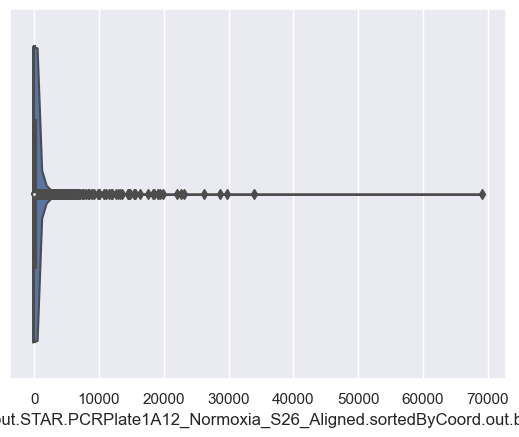
    


    
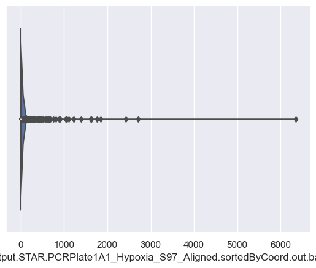
    


    
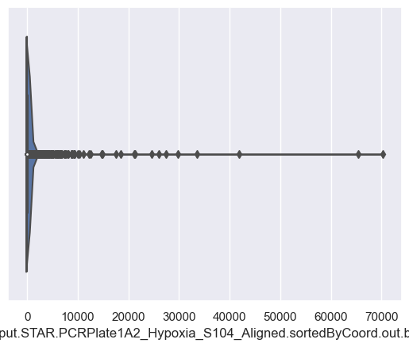
    


    
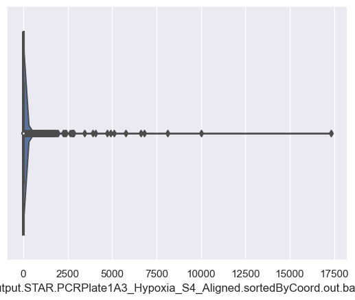
    


```python
#Violin plots for the MCF7 data set
violin(df_MCF_s_uf)
```


    
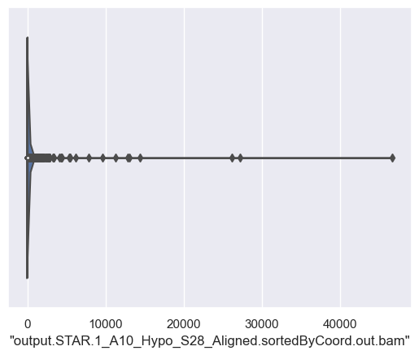
    


    
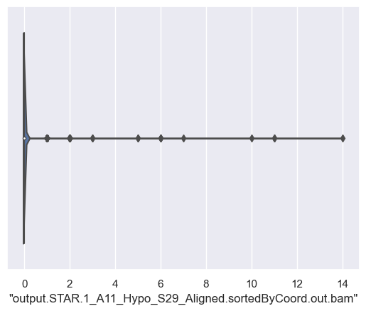
    


    
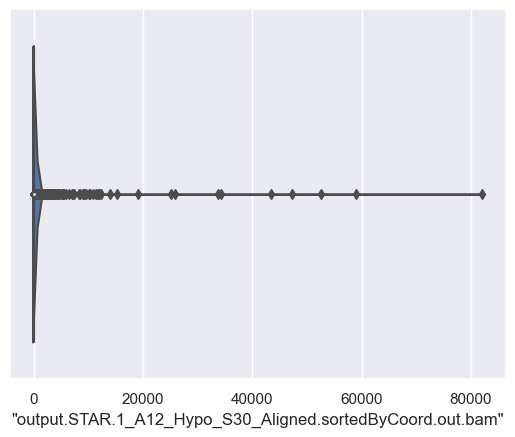
    


    
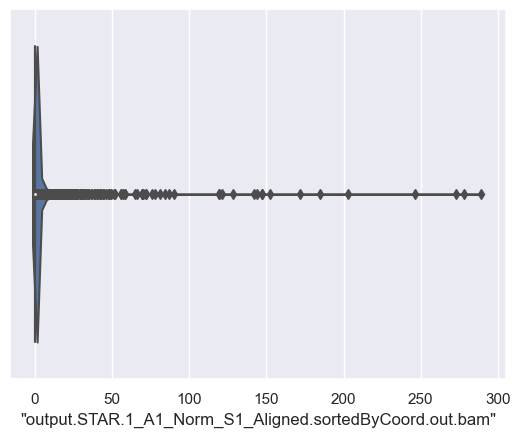
    


    
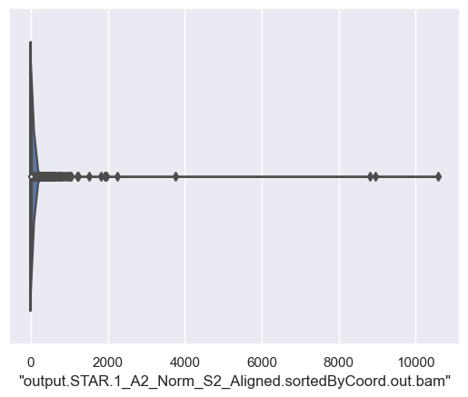
    


We can also compare the violin plots for 50 cells directly. For the reasons mentioned above, these plots show us the range of gene occurences for some columns of our dataset. However, as we have seen, the points on the violin graphs have a tendency to be more present around lower values.
We also (temporarily) randomly mix around the columns so that we are not allways graphing the same 50 or so cells.


```python
#Comparing violin plots for the HCC1806 dataset
plt.figure(figsize=(16,4))
plot=sns.violinplot(data=df_HCC_s_uf.sample(frac=1, axis = 'columns').iloc[:,:50],palette="Set3",cut=0)
plt.setp(plot.get_xticklabels(), rotation=90)
plt.title("Multiple violin plots for HCC1806 dataset")
plt.show()
```


    
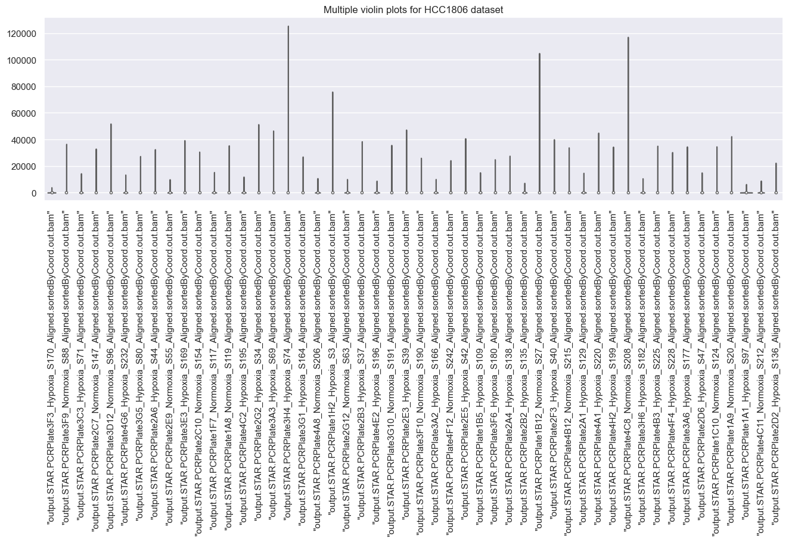
    


```python
#Comparing violin plots for the MCF7 dataset
plt.figure(figsize=(16,4))
plot=sns.violinplot(data=df_MCF_s_uf.sample(frac=1, axis = 'columns').iloc[:,:50],palette="Set3",cut=0)
plt.setp(plot.get_xticklabels(), rotation=90)
plt.title("Multiple violin plots for MCF7 dataset")
plt.show()
```


    
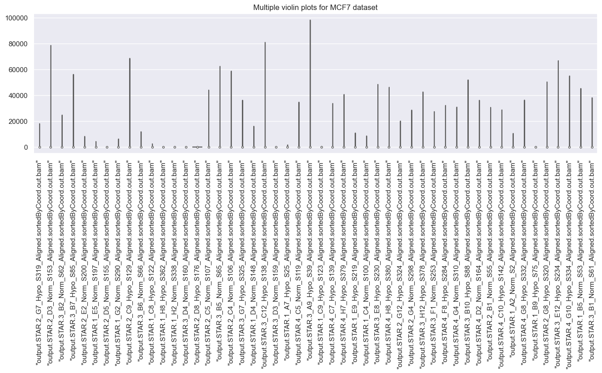
    


We would like to show the distribution of some genes. To avoid choosing genes a large amount of zeros we create a simple function which returns the genes with the highest number of non zero entries.


```python
#Function which returns the n genes with the largest number of non-zero entries 
def best_genes(df, n):
    return ((df != 0).sum(axis=1).nlargest(n)).index.values

```

We can next plot some graphs which illustrate the distribution of our 20 chosen genes. With these we can see how he chosen genes are distributed. As expected a lot of the genes have a spike close to 0 and then falls as we get further from 0.

Please be warned that the size of the x-axis of the histogram does vary across genes!


```python
#Histograms for HCC1806
small_MCF = df_HCC_s_uf.loc[best_genes(df_HCC_s_uf, 20)].T
small_MCF.hist(
    bins=30, 
    figsize=(12,9), 
    color="royalblue",
    ec="black", 
    lw=0.1, 
    grid=False,
    sharey = 'col'
)
plt.tight_layout()
plt.show()
```


    
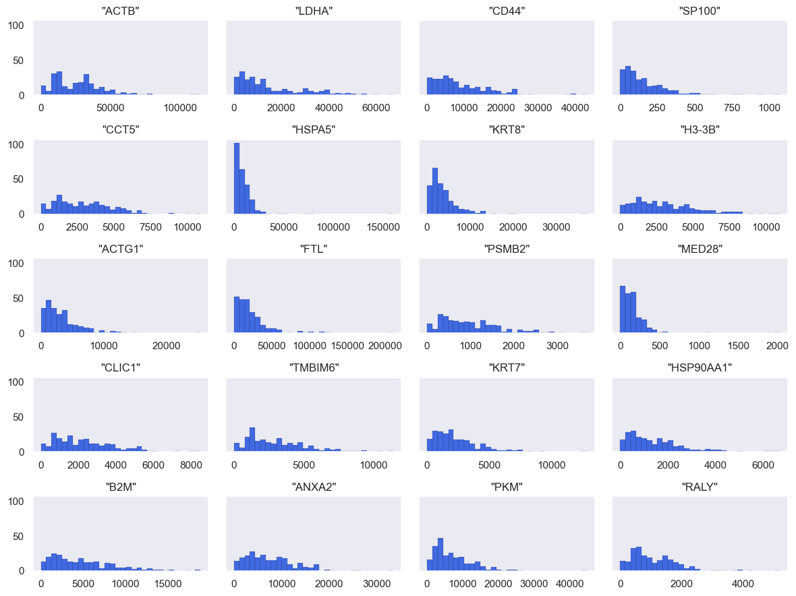
    


```python
#Histograms for MCF7
small_MCF = df_MCF_s_uf.loc[best_genes(df_MCF_s_uf, 20)].T
small_MCF.hist(
    bins=30, 
    figsize=(12,9), 
    color="royalblue",
    ec="black", 
    lw=0.1, 
    grid=False,
    sharey = 'col'
)
plt.tight_layout()
plt.show()
```


    
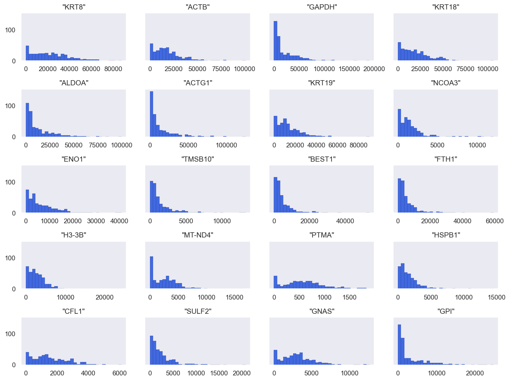
    


Another way of illustrating the distribution of the genes is to show some box plots.


```python
#Box plots for HCC1806
fig, (ax1, ax2) = plt.subplots(2, figsize=(12,9))
ax1.boxplot(small_MCF[small_MCF.columns[:10]], labels=small_MCF.columns[:10])
ax2.boxplot(small_MCF[small_MCF.columns[10:]], labels=small_MCF.columns[10:])
ax1.set_title("Box Plot of the chosen genes of HCC1806")
plt.show()
```


    
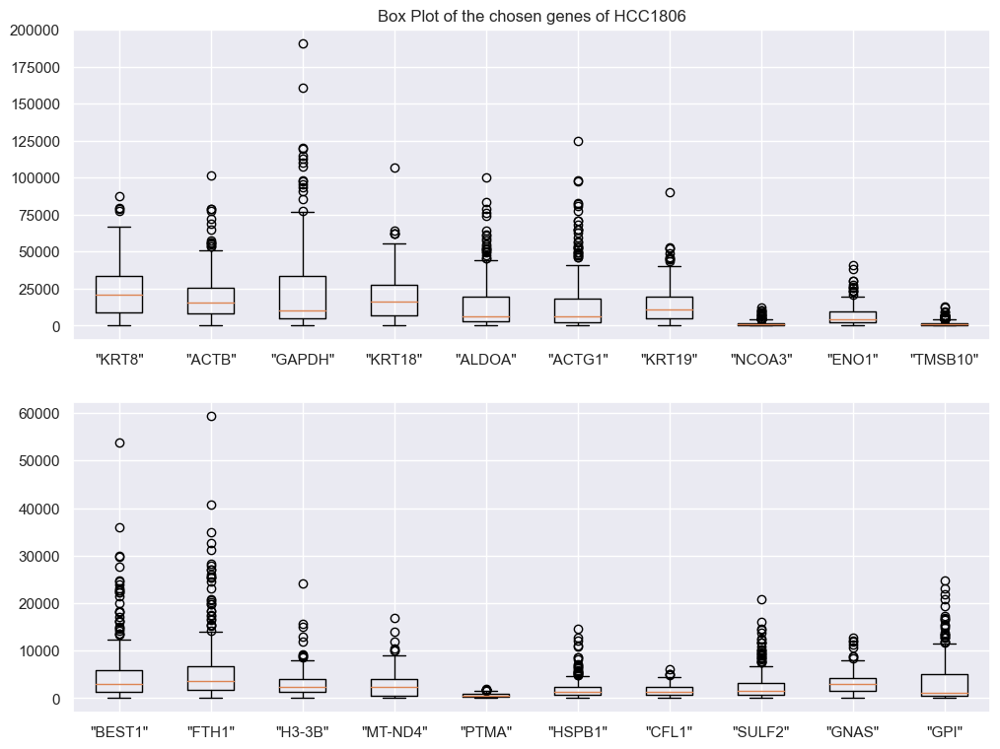
    


```python
#Box plots for MCF7
fig, (ax1, ax2) = plt.subplots(2, figsize=(12,9))
ax1.boxplot(small_MCF[small_MCF.columns[:10]], labels=small_MCF.columns[:10])
ax2.boxplot(small_MCF[small_MCF.columns[10:]], labels=small_MCF.columns[10:])
ax1.set_title("Box Plot of the chosen genes of MCF7")
plt.show()
```


    
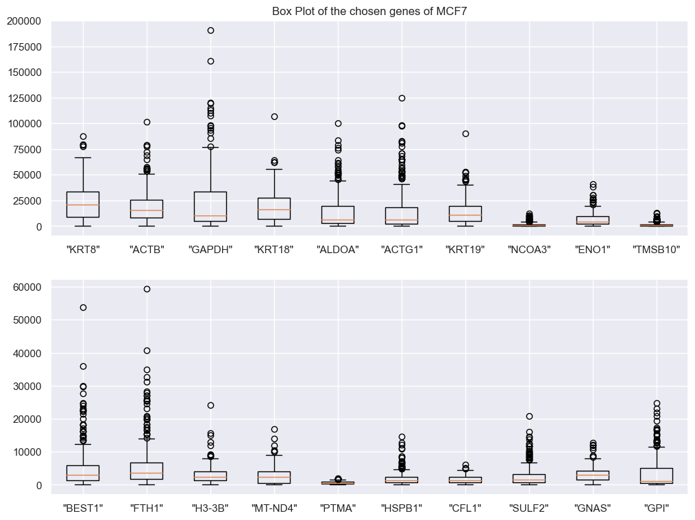
    


Notice that we have a lot of points are very far from the median and in some cases even very far the the wiskers of the boxplots! It might be tempting to call these outliers however in many case these points are instances in which a gene has been found many times and if we were to eliminate these points we will lose a lot of information! This is exactly the delemma we face in the outlier section.

We next decided to plot the 50 genes with the largest number of occurences over all cells. In doing so, we get to see if the dataset contains some genes that appear a lot and some that never appear or if the apperences are more evenly spred.
For both datasets we see that after the initail spike with very common genes the bar graph smooths out. We also calculated how many total gene occurences we are neglecting by plotting only the 50 most common genes, and we realize that the remaining genes still represent a very large amount of gene detections(which we expect because of the large amount of genes in the datasets).


```python
#Representing how often a specific gene is found in a cell (I picked the 50 largest ones)
largest_HCC = df_HCC_s_uf.sum(axis='columns').nlargest(50)

#Calculating the remaining number of occurences
remaining_HCC = df_HCC_s_uf.sum(axis='columns').sum() - df_HCC_s_uf.sum(axis='columns')[largest_HCC.index.values].sum()

#We print the percentage of occurences not represented in the graph
print("Percentage of occurences not present in the graph:", 
      f"{round(remaining_HCC/df_HCC_s_uf.sum(axis='columns').sum() * 100, 2)}%")
plt.figure(figsize=(12,6))
ax = largest_HCC.plot.bar(stacked = True, fontsize = 7)
plt.xlabel('Genes')
plt.ylabel('Number of occurences')
plt.title("Most common genes in the HCC1806 dataset")
plt.show()
```

    Percentage of occurences not present in the graph: 83.75%
    


    
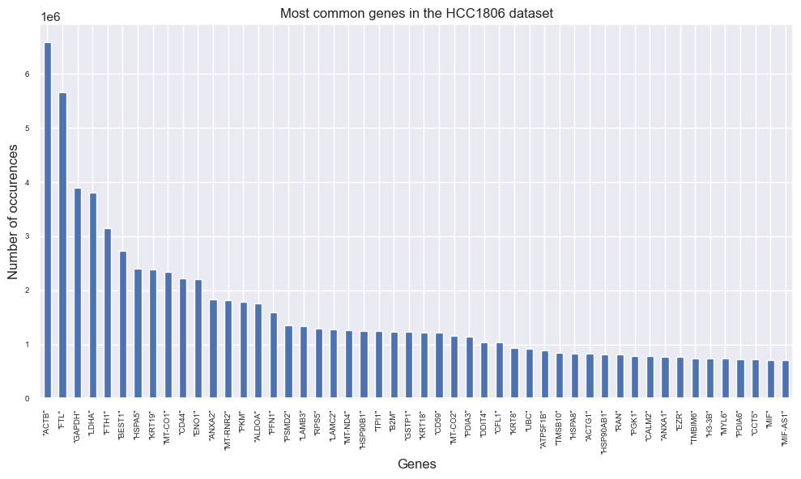
    


```python
#Representing how often a specific gene is found in a cell (I picked the 50 largest ones)
largest_MCF = df_MCF_s_uf.sum(axis='columns').nlargest(50)

#Calculating the remaining number of occurences
remaining_MCF = df_MCF_s_uf.sum(axis='columns').sum() - df_MCF_s_uf.sum(axis='columns')[largest_MCF.index.values].sum()

#We print the percentage of occurences not represented in the graph
print("Percentage of occurences not present in the graph:", 
      f"{round(remaining_MCF/df_MCF_s_uf.sum(axis='columns').sum() * 100, 2)}%")
plt.figure(figsize=(12,6))
ax = largest_MCF.plot.bar(stacked = True, fontsize = 7)
plt.xlabel('Genes')
plt.ylabel('Number of occurences')
plt.title("Most common genes in the MCF7 dataset")
plt.show()
```

    Percentage of occurences not present in the graph: 76.14%
    


    
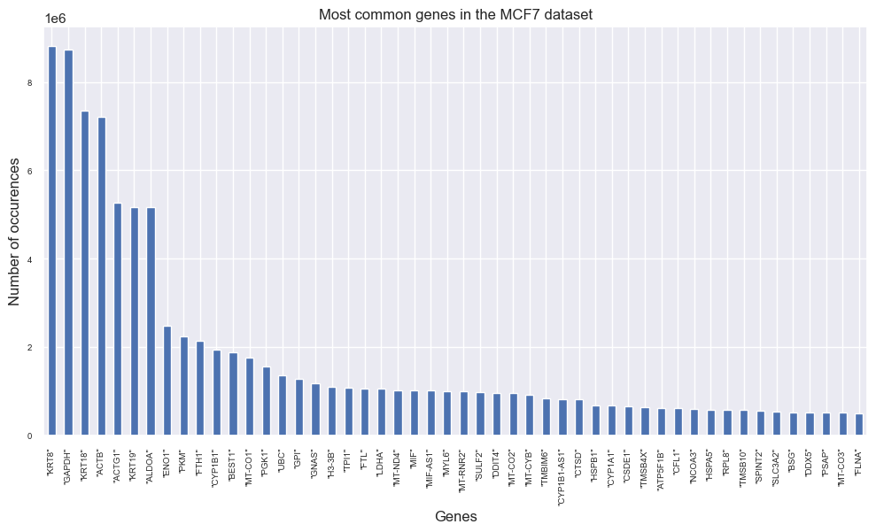
    


In both cases the bar graph drops down quite quickly which leads us to believe that many genes occure very rearly and most of the information is given by a small fraction of genes. In fact when we train our model we will only use the information given by the 3000 most informative genes.

For each data set we differenciate between cells from the hypoxia experiment and cells from the normoxia experiment. We then create two sub datasets one of which contains all the columns corresponding to hypoxia cells and the other containing only columns of normoxia cells.


```python
#Function that retruns lists of all cells that were part of the hypoxia and normoxia groups
def hypo_and_norm(df):
    hypo = []
    norm = []
    for cell in df.columns:
        if "Hypo" in cell.split("_") or "Hypoxia" in cell.split("_"):
            hypo.append(cell)
        elif "Norm" in cell.split("_") or "Normoxia" in cell.split("_"):
            norm.append(cell)
        else:
            print("Unkown:", cell)
    return (hypo, norm)

#Data sets that contain only hypoxia cells
df_MCF_hypo = df_MCF_s_uf[hypo_and_norm(df_MCF_s_uf)[0]]
df_HCC_hypo = df_HCC_s_uf[hypo_and_norm(df_HCC_s_uf)[0]]

#Data sets that contain only normoxia cells
df_MCF_norm = df_MCF_s_uf[hypo_and_norm(df_MCF_s_uf)[1]]
df_HCC_norm = df_HCC_s_uf[hypo_and_norm(df_HCC_s_uf)[1]]

#How many hypoxia and how many normoxia are in each dataset
print("Number of cells exposed to hypoxia for HCC1806 data: ", len(hypo_and_norm(df_HCC_s_uf)[0])) 
print("Number of cells exposed to normoxia for HCC1806 data: ", len(hypo_and_norm(df_HCC_s_uf)[1]))

print("Number of cells exposed to hypoxia for MCF7 data: ", len(hypo_and_norm(df_MCF_s_uf)[0])) 
print("Number of cells exposed to normoxia for MCF7 data: ", len(hypo_and_norm(df_MCF_s_uf)[1]))

```

    Number of cells exposed to hypoxia for HCC1806 data:  126
    Number of cells exposed to normoxia for HCC1806 data:  117
    Number of cells exposed to hypoxia for MCF7 data:  191
    Number of cells exposed to normoxia for MCF7 data:  192
    

Luckily for both datasets the amount of examples from the hypoxia enviorment and the normoxia enviorment are more or less balanced. This helps us as the models will have an even exposure to both types of enviorments reducing the likelihood of any bias towards one of the labels.

In view of our final goal of this report we thought that it could be insightful to represent genes whose total occurences vary the most between the two types of enviorment.
To illustrate this did the following for both datasets:
First we took only the colums with hypoxia cells and summed them so we could see how often each gene was found in the cells that had little oxygen.
We did the same for the Normoxia cells and we took the differences (in abs) between the gene occurences in normoxia cells and hypoxia cells. We presented the 20 genes that had the largest differences.
The idea of this represention is to see if some genes are obviously more present in hypoxia cells. If this was the case, we would be lead to believe that this gene may play a role in the survival of a cell with no oxygen. Similarly if a gene was very present only in normoxia cells then this gene might not be useful in a hypoxia enviorment(or it might even be degenerous).
Please note that we cannot strongly conclude anything from the following graphs, differences might also be due to some sampling bias.


```python
def hypo_vs_norm(df_hypo, df_norm,n=20, width = 0.25, title="Hypoxia vs Normoxia", type = 'l'):
    #Get a list of the total occurences of each gene
    genes_norm = df_norm.sum(axis='columns')
    genes_hypo = df_hypo.sum(axis='columns')

    #Find the genes with the largest (type == 'l') or smallest (type == 's') difference of occurences 
    # between hypo cells and norm cells
    if type == 'l':
        diffs = (genes_hypo.sub(genes_norm)).apply(abs).nlargest(n)
    elif type == 's':
        diffs = (genes_hypo.sub(genes_norm)).apply(abs).nsmallest(n)
    else:
        raise ValueError("Wrong type")
    
    diffs_genes = diffs.index.values

    #Bar graph with gene occurences in hypo vs norm
    plt.bar(np.arange(len(genes_hypo[diffs_genes])), 
            genes_hypo[diffs_genes].tolist(), 
            color ='r', 
            width = width,
            edgecolor ='grey', 
            label ='Hypoxia')

    plt.bar([x + width for x in np.arange(len(genes_hypo[diffs_genes]))],
            genes_norm[diffs_genes].tolist(), 
            color ='g', 
            width = width,
            edgecolor ='grey', 
            label ='Normoxia')

    plt.xticks([r + width for r in range(len(diffs_genes))],
            diffs_genes,
            rotation=90,
            fontsize=10)
    plt.title(title, weight='bold')
    plt.yticks(fontsize = 15)
    plt.ylabel("Number of gene occurences")
    plt.legend()
    plt.show()
    return diffs_genes


hypo_vs_norm(df_HCC_hypo, df_HCC_norm, title = "Genes with the largest difference of occurences for HCC1806")
hypo_vs_norm(df_MCF_hypo, df_MCF_norm, title = "Genes with the largest difference of occurences for MCF7")

```


    
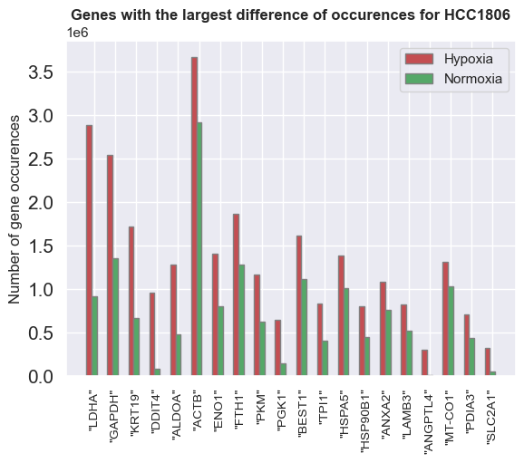
    


    
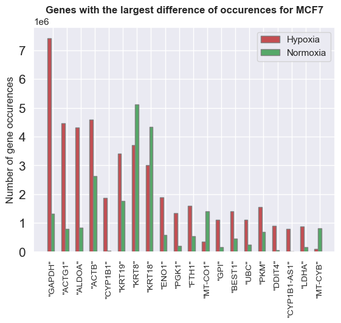
    


    array(['"GAPDH"', '"ACTG1"', '"ALDOA"', '"ACTB"', '"CYP1B1"', '"KRT19"',
           '"KRT8"', '"KRT18"', '"ENO1"', '"PGK1"', '"FTH1"', '"MT-CO1"',
           '"GPI"', '"BEST1"', '"UBC"', '"PKM"', '"DDIT4"', '"CYP1B1-AS1"',
           '"LDHA"', '"MT-CYB"'], dtype=object)


A similar reasoning as above is to see which genes have the smallest difference in occurences between normoxia cells and hypoxia cells. This might give us an idea of which are the so called housekeeping genes. These genes are need for the basic function of the cells and so shouldn't really change between normoxia and hypoxia cells.


```python
hypo_vs_norm(df_HCC_hypo, df_HCC_norm, title = "Genes with the smallest difference of occurences for HCC1806", type = 's')
hypo_vs_norm(df_MCF_hypo, df_MCF_norm, title = "Genes with the smallest difference of occurences for MCF7", type = 's')

```


    
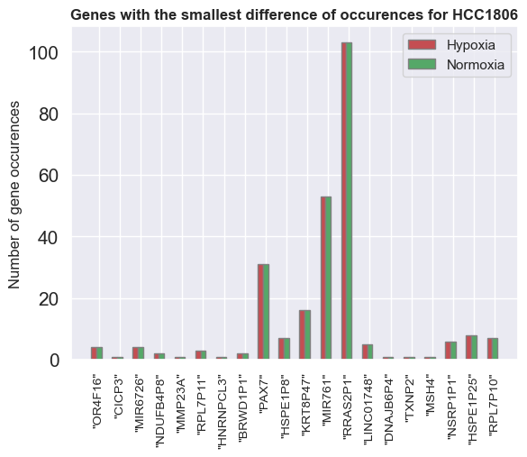
    


    
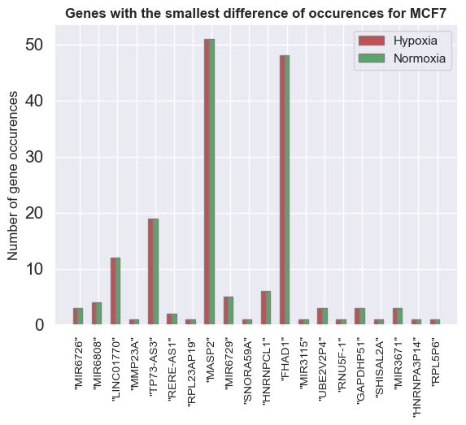
    


    array(['"MIR6726"', '"MIR6808"', '"LINC01770"', '"MMP23A"', '"TP73-AS3"',
           '"RERE-AS1"', '"RPL23AP19"', '"MASP2"', '"MIR6729"', '"SNORA59A"',
           '"HNRNPCL1"', '"FHAD1"', '"MIR3115"', '"UBE2V2P4"', '"RNU5F-1"',
           '"GAPDHP51"', '"SHISAL2A"', '"MIR3671"', '"HNRNPA3P14"',
           '"RPL5P6"'], dtype=object)


---
---
## Data Cleaning

Now that we have a better understanding of the datasets, we can move on to data cleaning. 

Data cleaning involves a thorough examination of the datasets to detect and address various types of problems. These issues can range from missing values, outliers, and duplicate entries. We can identify and correct any potential issues that hamper the performance of our models.

### Missing values
One of the first things to check is whether there are missing values. In these datasets, there are none: this absence is due to the fact that if a gene was not found in a specific cell, the value was set to 0, eliminating the possibility of NA. 

We do notice, however, that many rows contain a large amount of zeros (aka "zero inflation").


```python
#Creating a function which returns the number of missing values given a data set
def missing(df):
    miss = False
    if df.isna().stack().sum() != 0:
        miss = True
        return str(df.isnull().stack().sum())
    if not miss:
        return "No missing values"

print("Number of missing values for the HCC1806 data: ", missing(df_HCC_s_uf))
print("Number of missing values for the MCF7 data: ", missing(df_MCF_s_uf))
```

    Number of missing values for the HCC1806 data:  No missing values
    Number of missing values for the MCF7 data:  No missing values
    

As mentioned previously, there are many zero values, hence some genes occur rarely. This means that we are dealing with a sparse dataset, and it has to be taken into account throughout this analysis.


```python
#Function that returns percentage of entries which are zero given a data frame
def frac_zeros(df, n=20):
    return round((((df == 0).stack().sum())/(df.shape[0] * df.shape[1])) * 100, 2)


print("Percentage of entries which are zero in the HCC1806 dataset: ", f"{frac_zeros(df_HCC_s_uf)}%")
print("Percentage of entries which are zero in the MCF7 dataset: ", f"{frac_zeros(df_MCF_s_uf)}%")
```

    Percentage of entries which are zero in the HCC1806 dataset:  55.85%
    Percentage of entries which are zero in the MCF7 dataset:  60.22%
    

---
### Duplicate rows

Identifying and removing duplicate rows is another important aspect of data cleaning. 

Duplicate rows can inflate the size of the dataset without providing any extra information.


```python
def duplicate_rows(df, all_cells = False, shape = False):
    if shape:
        print("Number of duplicate rows: ", df[df.duplicated(keep=False)].shape[0])
    if all_cells:
        print("Duplicate rows: ", df[df.duplicated(keep=False)].index.values)
    return df[df.duplicated(keep=False)]

duplicate_rows(df_MCF_s_uf).head()
```


<div>
<style scoped>
    .dataframe tbody tr th:only-of-type {
        vertical-align: middle;
    }

    .dataframe tbody tr th {
        vertical-align: top;
    }

    .dataframe thead th {
        text-align: right;
    }
</style>
<table border="1" class="dataframe">
  <thead>
    <tr style="text-align: right;">
      <th></th>
      <th>"output.STAR.1_A10_Hypo_S28_Aligned.sortedByCoord.out.bam"</th>
      <th>"output.STAR.1_A11_Hypo_S29_Aligned.sortedByCoord.out.bam"</th>
      <th>"output.STAR.1_A12_Hypo_S30_Aligned.sortedByCoord.out.bam"</th>
      <th>"output.STAR.1_A1_Norm_S1_Aligned.sortedByCoord.out.bam"</th>
      <th>"output.STAR.1_A2_Norm_S2_Aligned.sortedByCoord.out.bam"</th>
      <th>"output.STAR.1_A3_Norm_S3_Aligned.sortedByCoord.out.bam"</th>
      <th>"output.STAR.1_A4_Norm_S4_Aligned.sortedByCoord.out.bam"</th>
      <th>"output.STAR.1_A5_Norm_S5_Aligned.sortedByCoord.out.bam"</th>
      <th>"output.STAR.1_A6_Norm_S6_Aligned.sortedByCoord.out.bam"</th>
      <th>"output.STAR.1_A7_Hypo_S25_Aligned.sortedByCoord.out.bam"</th>
      <th>...</th>
      <th>"output.STAR.4_H14_Hypo_S383_Aligned.sortedByCoord.out.bam"</th>
      <th>"output.STAR.4_H1_Norm_S355_Aligned.sortedByCoord.out.bam"</th>
      <th>"output.STAR.4_H2_Norm_S356_Aligned.sortedByCoord.out.bam"</th>
      <th>"output.STAR.4_H3_Norm_S357_Aligned.sortedByCoord.out.bam"</th>
      <th>"output.STAR.4_H4_Norm_S358_Aligned.sortedByCoord.out.bam"</th>
      <th>"output.STAR.4_H5_Norm_S359_Aligned.sortedByCoord.out.bam"</th>
      <th>"output.STAR.4_H6_Norm_S360_Aligned.sortedByCoord.out.bam"</th>
      <th>"output.STAR.4_H7_Hypo_S379_Aligned.sortedByCoord.out.bam"</th>
      <th>"output.STAR.4_H8_Hypo_S380_Aligned.sortedByCoord.out.bam"</th>
      <th>"output.STAR.4_H9_Hypo_S381_Aligned.sortedByCoord.out.bam"</th>
    </tr>
  </thead>
  <tbody>
    <tr>
      <th>"SHISAL2A"</th>
      <td>0</td>
      <td>0</td>
      <td>0</td>
      <td>0</td>
      <td>0</td>
      <td>0</td>
      <td>0</td>
      <td>0</td>
      <td>0</td>
      <td>0</td>
      <td>...</td>
      <td>0</td>
      <td>0</td>
      <td>0</td>
      <td>0</td>
      <td>0</td>
      <td>0</td>
      <td>0</td>
      <td>0</td>
      <td>0</td>
      <td>0</td>
    </tr>
    <tr>
      <th>"IL12RB2"</th>
      <td>0</td>
      <td>0</td>
      <td>0</td>
      <td>0</td>
      <td>0</td>
      <td>0</td>
      <td>0</td>
      <td>0</td>
      <td>0</td>
      <td>0</td>
      <td>...</td>
      <td>0</td>
      <td>0</td>
      <td>0</td>
      <td>0</td>
      <td>0</td>
      <td>0</td>
      <td>0</td>
      <td>0</td>
      <td>0</td>
      <td>0</td>
    </tr>
    <tr>
      <th>"S1PR1"</th>
      <td>0</td>
      <td>0</td>
      <td>0</td>
      <td>0</td>
      <td>0</td>
      <td>0</td>
      <td>0</td>
      <td>0</td>
      <td>0</td>
      <td>0</td>
      <td>...</td>
      <td>0</td>
      <td>0</td>
      <td>0</td>
      <td>0</td>
      <td>0</td>
      <td>0</td>
      <td>0</td>
      <td>0</td>
      <td>0</td>
      <td>0</td>
    </tr>
    <tr>
      <th>"CD84"</th>
      <td>0</td>
      <td>0</td>
      <td>0</td>
      <td>0</td>
      <td>0</td>
      <td>0</td>
      <td>0</td>
      <td>0</td>
      <td>0</td>
      <td>0</td>
      <td>...</td>
      <td>0</td>
      <td>0</td>
      <td>0</td>
      <td>0</td>
      <td>0</td>
      <td>0</td>
      <td>0</td>
      <td>0</td>
      <td>0</td>
      <td>0</td>
    </tr>
    <tr>
      <th>"GNLY"</th>
      <td>0</td>
      <td>0</td>
      <td>0</td>
      <td>0</td>
      <td>0</td>
      <td>0</td>
      <td>0</td>
      <td>0</td>
      <td>0</td>
      <td>0</td>
      <td>...</td>
      <td>0</td>
      <td>0</td>
      <td>0</td>
      <td>0</td>
      <td>0</td>
      <td>1</td>
      <td>0</td>
      <td>0</td>
      <td>0</td>
      <td>0</td>
    </tr>
  </tbody>
</table>
<p>5 rows × 383 columns</p>
</div>


Luckily for us there are no duplicate cells in both datasets! 


```python
duplicate_rows(df_HCC_s_uf.T, True, True)
duplicate_rows(df_MCF_s_uf.T, True, True)
```

    Number of duplicate rows:  0
    Duplicate rows:  []
    Number of duplicate rows:  0
    Duplicate rows:  []
    


<div>
<style scoped>
    .dataframe tbody tr th:only-of-type {
        vertical-align: middle;
    }

    .dataframe tbody tr th {
        vertical-align: top;
    }

    .dataframe thead th {
        text-align: right;
    }
</style>
<table border="1" class="dataframe">
  <thead>
    <tr style="text-align: right;">
      <th></th>
      <th>"WASH7P"</th>
      <th>"MIR6859-1"</th>
      <th>"WASH9P"</th>
      <th>"OR4F29"</th>
      <th>"MTND1P23"</th>
      <th>"MTND2P28"</th>
      <th>"MTCO1P12"</th>
      <th>"MTCO2P12"</th>
      <th>"MTATP8P1"</th>
      <th>"MTATP6P1"</th>
      <th>...</th>
      <th>"MT-TH"</th>
      <th>"MT-TS2"</th>
      <th>"MT-TL2"</th>
      <th>"MT-ND5"</th>
      <th>"MT-ND6"</th>
      <th>"MT-TE"</th>
      <th>"MT-CYB"</th>
      <th>"MT-TT"</th>
      <th>"MT-TP"</th>
      <th>"MAFIP"</th>
    </tr>
  </thead>
  <tbody>
  </tbody>
</table>
<p>0 rows × 22934 columns</p>
</div>


```python
duplicate_rows(df_MCF_s_uf, True, True).head()
```

    Number of duplicate rows:  56
    Duplicate rows:  ['"SHISAL2A"' '"IL12RB2"' '"S1PR1"' '"CD84"' '"GNLY"' '"FAR2P3"'
     '"KLF2P3"' '"PABPC1P2"' '"UGT1A8"' '"UGT1A9"' '"SLC22A14"' '"COQ10BP2"'
     '"PANDAR"' '"LAP3P2"' '"RPL22P16"' '"GALNT17"' '"PON1"' '"HTR5A"'
     '"SNORA36A"' '"MIR664B"' '"CSMD1"' '"KCNS2"' '"MIR548AA1"' '"MIR548D1"'
     '"MTCO2P11"' '"CLCN3P1"' '"SUGT1P4-STRA6LP"' '"STRA6LP"' '"MUC6"'
     '"VSTM4"' '"LINC00856"' '"LINC00595"' '"CACYBPP1"' '"LINC00477"'
     '"KNOP1P1"' '"WDR95P"' '"MIR20A"' '"MIR19B1"' '"RPL21P5"' '"RNU6-539P"'
     '"SNRPN"' '"SNURF"' '"RBFOX1"' '"LINC02183"' '"MT1M"' '"ASPA"' '"BCL6B"'
     '"CCL3L3"' '"CCL3L1"' '"OTOP3"' '"RNA5SP450"' '"PSG1"' '"MIR3190"'
     '"MIR3191"' '"SEZ6L"' '"ADAMTS5"']
    


<div>
<style scoped>
    .dataframe tbody tr th:only-of-type {
        vertical-align: middle;
    }

    .dataframe tbody tr th {
        vertical-align: top;
    }

    .dataframe thead th {
        text-align: right;
    }
</style>
<table border="1" class="dataframe">
  <thead>
    <tr style="text-align: right;">
      <th></th>
      <th>"output.STAR.1_A10_Hypo_S28_Aligned.sortedByCoord.out.bam"</th>
      <th>"output.STAR.1_A11_Hypo_S29_Aligned.sortedByCoord.out.bam"</th>
      <th>"output.STAR.1_A12_Hypo_S30_Aligned.sortedByCoord.out.bam"</th>
      <th>"output.STAR.1_A1_Norm_S1_Aligned.sortedByCoord.out.bam"</th>
      <th>"output.STAR.1_A2_Norm_S2_Aligned.sortedByCoord.out.bam"</th>
      <th>"output.STAR.1_A3_Norm_S3_Aligned.sortedByCoord.out.bam"</th>
      <th>"output.STAR.1_A4_Norm_S4_Aligned.sortedByCoord.out.bam"</th>
      <th>"output.STAR.1_A5_Norm_S5_Aligned.sortedByCoord.out.bam"</th>
      <th>"output.STAR.1_A6_Norm_S6_Aligned.sortedByCoord.out.bam"</th>
      <th>"output.STAR.1_A7_Hypo_S25_Aligned.sortedByCoord.out.bam"</th>
      <th>...</th>
      <th>"output.STAR.4_H14_Hypo_S383_Aligned.sortedByCoord.out.bam"</th>
      <th>"output.STAR.4_H1_Norm_S355_Aligned.sortedByCoord.out.bam"</th>
      <th>"output.STAR.4_H2_Norm_S356_Aligned.sortedByCoord.out.bam"</th>
      <th>"output.STAR.4_H3_Norm_S357_Aligned.sortedByCoord.out.bam"</th>
      <th>"output.STAR.4_H4_Norm_S358_Aligned.sortedByCoord.out.bam"</th>
      <th>"output.STAR.4_H5_Norm_S359_Aligned.sortedByCoord.out.bam"</th>
      <th>"output.STAR.4_H6_Norm_S360_Aligned.sortedByCoord.out.bam"</th>
      <th>"output.STAR.4_H7_Hypo_S379_Aligned.sortedByCoord.out.bam"</th>
      <th>"output.STAR.4_H8_Hypo_S380_Aligned.sortedByCoord.out.bam"</th>
      <th>"output.STAR.4_H9_Hypo_S381_Aligned.sortedByCoord.out.bam"</th>
    </tr>
  </thead>
  <tbody>
    <tr>
      <th>"SHISAL2A"</th>
      <td>0</td>
      <td>0</td>
      <td>0</td>
      <td>0</td>
      <td>0</td>
      <td>0</td>
      <td>0</td>
      <td>0</td>
      <td>0</td>
      <td>0</td>
      <td>...</td>
      <td>0</td>
      <td>0</td>
      <td>0</td>
      <td>0</td>
      <td>0</td>
      <td>0</td>
      <td>0</td>
      <td>0</td>
      <td>0</td>
      <td>0</td>
    </tr>
    <tr>
      <th>"IL12RB2"</th>
      <td>0</td>
      <td>0</td>
      <td>0</td>
      <td>0</td>
      <td>0</td>
      <td>0</td>
      <td>0</td>
      <td>0</td>
      <td>0</td>
      <td>0</td>
      <td>...</td>
      <td>0</td>
      <td>0</td>
      <td>0</td>
      <td>0</td>
      <td>0</td>
      <td>0</td>
      <td>0</td>
      <td>0</td>
      <td>0</td>
      <td>0</td>
    </tr>
    <tr>
      <th>"S1PR1"</th>
      <td>0</td>
      <td>0</td>
      <td>0</td>
      <td>0</td>
      <td>0</td>
      <td>0</td>
      <td>0</td>
      <td>0</td>
      <td>0</td>
      <td>0</td>
      <td>...</td>
      <td>0</td>
      <td>0</td>
      <td>0</td>
      <td>0</td>
      <td>0</td>
      <td>0</td>
      <td>0</td>
      <td>0</td>
      <td>0</td>
      <td>0</td>
    </tr>
    <tr>
      <th>"CD84"</th>
      <td>0</td>
      <td>0</td>
      <td>0</td>
      <td>0</td>
      <td>0</td>
      <td>0</td>
      <td>0</td>
      <td>0</td>
      <td>0</td>
      <td>0</td>
      <td>...</td>
      <td>0</td>
      <td>0</td>
      <td>0</td>
      <td>0</td>
      <td>0</td>
      <td>0</td>
      <td>0</td>
      <td>0</td>
      <td>0</td>
      <td>0</td>
    </tr>
    <tr>
      <th>"GNLY"</th>
      <td>0</td>
      <td>0</td>
      <td>0</td>
      <td>0</td>
      <td>0</td>
      <td>0</td>
      <td>0</td>
      <td>0</td>
      <td>0</td>
      <td>0</td>
      <td>...</td>
      <td>0</td>
      <td>0</td>
      <td>0</td>
      <td>0</td>
      <td>0</td>
      <td>1</td>
      <td>0</td>
      <td>0</td>
      <td>0</td>
      <td>0</td>
    </tr>
  </tbody>
</table>
<p>5 rows × 383 columns</p>
</div>


```python
duplicate_rows(df_HCC_s_uf, True, True).head()
```

    Number of duplicate rows:  89
    Duplicate rows:  ['"MMP23A"' '"LINC01647"' '"LINC01361"' '"ITGA10"' '"RORC"' '"GPA33"'
     '"OR2M4"' '"LINC01247"' '"SNORD92"' '"LINC01106"' '"ZBTB45P2"' '"AOX3P"'
     '"CPS1"' '"RPS3AP53"' '"CCR4"' '"RNY1P12"' '"C4orf50"' '"C4orf45"'
     '"PCDHA2"' '"PCDHA8"' '"PCDHGA2"' '"PCDHGA3"' '"PCDHGB3"' '"PCDHGA7"'
     '"PCDHGA9"' '"PCDHGB7"' '"PCDHGA12"' '"PCDHGB9P"' '"PCDHGC4"' '"SMIM23"'
     '"PANDAR"' '"LAP3P2"' '"RBBP4P3"' '"RPL21P66"' '"VNN3"' '"TRPV6"'
     '"CNPY1"' '"ASS1P4"' '"SLC7A3"' '"MIR374B"' '"MIR374C"' '"NAB1P1"'
     '"RPL10AP3"' '"MIR548AA1"' '"MIR548D1"' '"SCARNA8"' '"MIR3074"'
     '"MIR24-1"' '"SUGT1P4-STRA6LP"' '"STRA6LP"' '"KCNA4"' '"FBLIM1P2"'
     '"APLNR"' '"CYCSP26"' '"OPCML"' '"B3GAT1-DT"' '"RPL21P88"' '"LINC02625"'
     '"RPL22P18"' '"PAX2"' '"SOX5"' '"COL2A1"' '"LINC02395"' '"LDHAL6CP"'
     '"CUX2"' '"LINC00621"' '"NUS1P2"' '"UBBP5"' '"OR5AU1"' '"LINC02833"'
     '"RASL12"' '"CILP"' '"MIR6864"' '"MIR4520-1"' '"MIR4520-2"' '"CCL3L3"'
     '"CCL3L1"' '"RNU6-826P"' '"OR4D1"' '"MSX2P1"' '"MIR548D2"' '"MIR548AA2"'
     '"KCNJ16"' '"CD300A"' '"ENPP7"' '"DTNA"' '"ALPK2"' '"OR7G2"' '"PLVAP"']
    


<div>
<style scoped>
    .dataframe tbody tr th:only-of-type {
        vertical-align: middle;
    }

    .dataframe tbody tr th {
        vertical-align: top;
    }

    .dataframe thead th {
        text-align: right;
    }
</style>
<table border="1" class="dataframe">
  <thead>
    <tr style="text-align: right;">
      <th></th>
      <th>"output.STAR.PCRPlate1A10_Normoxia_S123_Aligned.sortedByCoord.out.bam"</th>
      <th>"output.STAR.PCRPlate1A12_Normoxia_S26_Aligned.sortedByCoord.out.bam"</th>
      <th>"output.STAR.PCRPlate1A1_Hypoxia_S97_Aligned.sortedByCoord.out.bam"</th>
      <th>"output.STAR.PCRPlate1A2_Hypoxia_S104_Aligned.sortedByCoord.out.bam"</th>
      <th>"output.STAR.PCRPlate1A3_Hypoxia_S4_Aligned.sortedByCoord.out.bam"</th>
      <th>"output.STAR.PCRPlate1A4_Hypoxia_S8_Aligned.sortedByCoord.out.bam"</th>
      <th>"output.STAR.PCRPlate1A5_Hypoxia_S108_Aligned.sortedByCoord.out.bam"</th>
      <th>"output.STAR.PCRPlate1A6_Hypoxia_S11_Aligned.sortedByCoord.out.bam"</th>
      <th>"output.STAR.PCRPlate1A7_Normoxia_S113_Aligned.sortedByCoord.out.bam"</th>
      <th>"output.STAR.PCRPlate1A8_Normoxia_S119_Aligned.sortedByCoord.out.bam"</th>
      <th>...</th>
      <th>"output.STAR.PCRPlate4G12_Normoxia_S243_Aligned.sortedByCoord.out.bam"</th>
      <th>"output.STAR.PCRPlate4G1_Hypoxia_S193_Aligned.sortedByCoord.out.bam"</th>
      <th>"output.STAR.PCRPlate4G2_Hypoxia_S198_Aligned.sortedByCoord.out.bam"</th>
      <th>"output.STAR.PCRPlate4G6_Hypoxia_S232_Aligned.sortedByCoord.out.bam"</th>
      <th>"output.STAR.PCRPlate4G7_Normoxia_S204_Aligned.sortedByCoord.out.bam"</th>
      <th>"output.STAR.PCRPlate4H10_Normoxia_S210_Aligned.sortedByCoord.out.bam"</th>
      <th>"output.STAR.PCRPlate4H11_Normoxia_S214_Aligned.sortedByCoord.out.bam"</th>
      <th>"output.STAR.PCRPlate4H2_Hypoxia_S199_Aligned.sortedByCoord.out.bam"</th>
      <th>"output.STAR.PCRPlate4H7_Normoxia_S205_Aligned.sortedByCoord.out.bam"</th>
      <th>"output.STAR.PCRPlate4H9_Normoxia_S236_Aligned.sortedByCoord.out.bam"</th>
    </tr>
  </thead>
  <tbody>
    <tr>
      <th>"MMP23A"</th>
      <td>0</td>
      <td>0</td>
      <td>0</td>
      <td>0</td>
      <td>0</td>
      <td>0</td>
      <td>0</td>
      <td>0</td>
      <td>0</td>
      <td>0</td>
      <td>...</td>
      <td>0</td>
      <td>0</td>
      <td>0</td>
      <td>0</td>
      <td>0</td>
      <td>0</td>
      <td>0</td>
      <td>0</td>
      <td>0</td>
      <td>0</td>
    </tr>
    <tr>
      <th>"LINC01647"</th>
      <td>0</td>
      <td>0</td>
      <td>0</td>
      <td>0</td>
      <td>0</td>
      <td>0</td>
      <td>0</td>
      <td>0</td>
      <td>0</td>
      <td>0</td>
      <td>...</td>
      <td>0</td>
      <td>0</td>
      <td>0</td>
      <td>0</td>
      <td>0</td>
      <td>0</td>
      <td>0</td>
      <td>0</td>
      <td>0</td>
      <td>0</td>
    </tr>
    <tr>
      <th>"LINC01361"</th>
      <td>0</td>
      <td>0</td>
      <td>0</td>
      <td>0</td>
      <td>0</td>
      <td>0</td>
      <td>0</td>
      <td>0</td>
      <td>0</td>
      <td>0</td>
      <td>...</td>
      <td>0</td>
      <td>0</td>
      <td>0</td>
      <td>0</td>
      <td>0</td>
      <td>0</td>
      <td>0</td>
      <td>0</td>
      <td>0</td>
      <td>0</td>
    </tr>
    <tr>
      <th>"ITGA10"</th>
      <td>0</td>
      <td>0</td>
      <td>0</td>
      <td>0</td>
      <td>0</td>
      <td>0</td>
      <td>0</td>
      <td>0</td>
      <td>0</td>
      <td>0</td>
      <td>...</td>
      <td>0</td>
      <td>0</td>
      <td>0</td>
      <td>0</td>
      <td>0</td>
      <td>0</td>
      <td>0</td>
      <td>0</td>
      <td>0</td>
      <td>0</td>
    </tr>
    <tr>
      <th>"RORC"</th>
      <td>0</td>
      <td>0</td>
      <td>0</td>
      <td>0</td>
      <td>0</td>
      <td>0</td>
      <td>0</td>
      <td>0</td>
      <td>0</td>
      <td>0</td>
      <td>...</td>
      <td>0</td>
      <td>0</td>
      <td>0</td>
      <td>0</td>
      <td>0</td>
      <td>0</td>
      <td>0</td>
      <td>0</td>
      <td>0</td>
      <td>0</td>
    </tr>
  </tbody>
</table>
<p>5 rows × 243 columns</p>
</div>


```python
duplicate_rows_df_MCF_t = duplicate_rows(df_MCF_s_uf).T
c_dupl_MCF = duplicate_rows_df_MCF_t.corr()
c_dupl_MCF
```


<div>
<style scoped>
    .dataframe tbody tr th:only-of-type {
        vertical-align: middle;
    }

    .dataframe tbody tr th {
        vertical-align: top;
    }

    .dataframe thead th {
        text-align: right;
    }
</style>
<table border="1" class="dataframe">
  <thead>
    <tr style="text-align: right;">
      <th></th>
      <th>"SHISAL2A"</th>
      <th>"IL12RB2"</th>
      <th>"S1PR1"</th>
      <th>"CD84"</th>
      <th>"GNLY"</th>
      <th>"FAR2P3"</th>
      <th>"KLF2P3"</th>
      <th>"PABPC1P2"</th>
      <th>"UGT1A8"</th>
      <th>"UGT1A9"</th>
      <th>...</th>
      <th>"BCL6B"</th>
      <th>"CCL3L3"</th>
      <th>"CCL3L1"</th>
      <th>"OTOP3"</th>
      <th>"RNA5SP450"</th>
      <th>"PSG1"</th>
      <th>"MIR3190"</th>
      <th>"MIR3191"</th>
      <th>"SEZ6L"</th>
      <th>"ADAMTS5"</th>
    </tr>
  </thead>
  <tbody>
    <tr>
      <th>"SHISAL2A"</th>
      <td>1.000000</td>
      <td>0.630630</td>
      <td>0.654887</td>
      <td>0.312826</td>
      <td>0.497375</td>
      <td>-0.008333</td>
      <td>-0.008333</td>
      <td>0.497375</td>
      <td>-0.009322</td>
      <td>-0.009322</td>
      <td>...</td>
      <td>0.497375</td>
      <td>-0.007615</td>
      <td>-0.007615</td>
      <td>0.134926</td>
      <td>-0.005249</td>
      <td>0.497375</td>
      <td>-0.005249</td>
      <td>-0.005249</td>
      <td>0.112487</td>
      <td>0.630630</td>
    </tr>
    <tr>
      <th>"IL12RB2"</th>
      <td>0.630630</td>
      <td>1.000000</td>
      <td>0.829681</td>
      <td>0.799056</td>
      <td>0.630630</td>
      <td>-0.007903</td>
      <td>-0.007903</td>
      <td>0.948434</td>
      <td>-0.008841</td>
      <td>-0.008841</td>
      <td>...</td>
      <td>0.630630</td>
      <td>-0.007222</td>
      <td>-0.007222</td>
      <td>0.612365</td>
      <td>-0.004979</td>
      <td>0.630630</td>
      <td>-0.004979</td>
      <td>-0.004979</td>
      <td>0.586533</td>
      <td>0.799056</td>
    </tr>
    <tr>
      <th>"S1PR1"</th>
      <td>0.654887</td>
      <td>0.829681</td>
      <td>1.000000</td>
      <td>0.412553</td>
      <td>0.654887</td>
      <td>-0.007656</td>
      <td>-0.007656</td>
      <td>0.654887</td>
      <td>-0.008565</td>
      <td>-0.008565</td>
      <td>...</td>
      <td>0.654887</td>
      <td>-0.006996</td>
      <td>-0.006996</td>
      <td>0.178813</td>
      <td>-0.004823</td>
      <td>0.654887</td>
      <td>-0.004823</td>
      <td>-0.004823</td>
      <td>0.149322</td>
      <td>0.829681</td>
    </tr>
    <tr>
      <th>"CD84"</th>
      <td>0.312826</td>
      <td>0.799056</td>
      <td>0.412553</td>
      <td>1.000000</td>
      <td>0.312826</td>
      <td>-0.007903</td>
      <td>-0.007903</td>
      <td>0.948434</td>
      <td>-0.008841</td>
      <td>-0.008841</td>
      <td>...</td>
      <td>0.312826</td>
      <td>-0.007222</td>
      <td>-0.007222</td>
      <td>0.964653</td>
      <td>-0.004979</td>
      <td>0.312826</td>
      <td>-0.004979</td>
      <td>-0.004979</td>
      <td>0.955646</td>
      <td>0.397167</td>
    </tr>
    <tr>
      <th>"GNLY"</th>
      <td>0.497375</td>
      <td>0.630630</td>
      <td>0.654887</td>
      <td>0.312826</td>
      <td>1.000000</td>
      <td>-0.008333</td>
      <td>-0.008333</td>
      <td>0.497375</td>
      <td>-0.009322</td>
      <td>-0.009322</td>
      <td>...</td>
      <td>1.000000</td>
      <td>0.021357</td>
      <td>0.021357</td>
      <td>0.134926</td>
      <td>-0.005249</td>
      <td>0.497375</td>
      <td>-0.005249</td>
      <td>-0.005249</td>
      <td>0.112487</td>
      <td>0.948434</td>
    </tr>
    <tr>
      <th>"FAR2P3"</th>
      <td>-0.008333</td>
      <td>-0.007903</td>
      <td>-0.007656</td>
      <td>-0.007903</td>
      <td>-0.008333</td>
      <td>1.000000</td>
      <td>1.000000</td>
      <td>-0.008333</td>
      <td>-0.014798</td>
      <td>-0.014798</td>
      <td>...</td>
      <td>-0.008333</td>
      <td>-0.012088</td>
      <td>-0.012088</td>
      <td>-0.006928</td>
      <td>-0.008333</td>
      <td>-0.008333</td>
      <td>-0.008333</td>
      <td>-0.008333</td>
      <td>-0.006775</td>
      <td>-0.007903</td>
    </tr>
    <tr>
      <th>"KLF2P3"</th>
      <td>-0.008333</td>
      <td>-0.007903</td>
      <td>-0.007656</td>
      <td>-0.007903</td>
      <td>-0.008333</td>
      <td>1.000000</td>
      <td>1.000000</td>
      <td>-0.008333</td>
      <td>-0.014798</td>
      <td>-0.014798</td>
      <td>...</td>
      <td>-0.008333</td>
      <td>-0.012088</td>
      <td>-0.012088</td>
      <td>-0.006928</td>
      <td>-0.008333</td>
      <td>-0.008333</td>
      <td>-0.008333</td>
      <td>-0.008333</td>
      <td>-0.006775</td>
      <td>-0.007903</td>
    </tr>
    <tr>
      <th>"PABPC1P2"</th>
      <td>0.497375</td>
      <td>0.948434</td>
      <td>0.654887</td>
      <td>0.948434</td>
      <td>0.497375</td>
      <td>-0.008333</td>
      <td>-0.008333</td>
      <td>1.000000</td>
      <td>-0.009322</td>
      <td>-0.009322</td>
      <td>...</td>
      <td>0.497375</td>
      <td>-0.007615</td>
      <td>-0.007615</td>
      <td>0.831379</td>
      <td>-0.005249</td>
      <td>0.497375</td>
      <td>-0.005249</td>
      <td>-0.005249</td>
      <td>0.813013</td>
      <td>0.630630</td>
    </tr>
    <tr>
      <th>"UGT1A8"</th>
      <td>-0.009322</td>
      <td>-0.008841</td>
      <td>-0.008565</td>
      <td>-0.008841</td>
      <td>-0.009322</td>
      <td>-0.014798</td>
      <td>-0.014798</td>
      <td>-0.009322</td>
      <td>1.000000</td>
      <td>1.000000</td>
      <td>...</td>
      <td>-0.009322</td>
      <td>-0.013523</td>
      <td>-0.013523</td>
      <td>-0.007750</td>
      <td>-0.009322</td>
      <td>-0.009322</td>
      <td>-0.009322</td>
      <td>-0.009322</td>
      <td>-0.007579</td>
      <td>-0.008841</td>
    </tr>
    <tr>
      <th>"UGT1A9"</th>
      <td>-0.009322</td>
      <td>-0.008841</td>
      <td>-0.008565</td>
      <td>-0.008841</td>
      <td>-0.009322</td>
      <td>-0.014798</td>
      <td>-0.014798</td>
      <td>-0.009322</td>
      <td>1.000000</td>
      <td>1.000000</td>
      <td>...</td>
      <td>-0.009322</td>
      <td>-0.013523</td>
      <td>-0.013523</td>
      <td>-0.007750</td>
      <td>-0.009322</td>
      <td>-0.009322</td>
      <td>-0.009322</td>
      <td>-0.009322</td>
      <td>-0.007579</td>
      <td>-0.008841</td>
    </tr>
    <tr>
      <th>"SLC22A14"</th>
      <td>0.497375</td>
      <td>0.948434</td>
      <td>0.654887</td>
      <td>0.948434</td>
      <td>0.497375</td>
      <td>-0.008333</td>
      <td>-0.008333</td>
      <td>1.000000</td>
      <td>-0.009322</td>
      <td>-0.009322</td>
      <td>...</td>
      <td>0.497375</td>
      <td>-0.007615</td>
      <td>-0.007615</td>
      <td>0.831379</td>
      <td>-0.005249</td>
      <td>0.497375</td>
      <td>-0.005249</td>
      <td>-0.005249</td>
      <td>0.813013</td>
      <td>0.630630</td>
    </tr>
    <tr>
      <th>"COQ10BP2"</th>
      <td>1.000000</td>
      <td>0.630630</td>
      <td>0.654887</td>
      <td>0.312826</td>
      <td>0.497375</td>
      <td>-0.008333</td>
      <td>-0.008333</td>
      <td>0.497375</td>
      <td>-0.009322</td>
      <td>-0.009322</td>
      <td>...</td>
      <td>0.497375</td>
      <td>-0.007615</td>
      <td>-0.007615</td>
      <td>0.134926</td>
      <td>-0.005249</td>
      <td>0.497375</td>
      <td>-0.005249</td>
      <td>-0.005249</td>
      <td>0.112487</td>
      <td>0.630630</td>
    </tr>
    <tr>
      <th>"PANDAR"</th>
      <td>-0.020348</td>
      <td>-0.019299</td>
      <td>-0.018695</td>
      <td>-0.019299</td>
      <td>-0.020348</td>
      <td>-0.032300</td>
      <td>-0.032300</td>
      <td>-0.020348</td>
      <td>-0.008675</td>
      <td>-0.008675</td>
      <td>...</td>
      <td>-0.020348</td>
      <td>-0.013474</td>
      <td>-0.013474</td>
      <td>-0.016917</td>
      <td>-0.020348</td>
      <td>-0.020348</td>
      <td>0.118817</td>
      <td>0.118817</td>
      <td>-0.016543</td>
      <td>-0.019299</td>
    </tr>
    <tr>
      <th>"LAP3P2"</th>
      <td>-0.020348</td>
      <td>-0.019299</td>
      <td>-0.018695</td>
      <td>-0.019299</td>
      <td>-0.020348</td>
      <td>-0.032300</td>
      <td>-0.032300</td>
      <td>-0.020348</td>
      <td>-0.008675</td>
      <td>-0.008675</td>
      <td>...</td>
      <td>-0.020348</td>
      <td>-0.013474</td>
      <td>-0.013474</td>
      <td>-0.016917</td>
      <td>-0.020348</td>
      <td>-0.020348</td>
      <td>0.118817</td>
      <td>0.118817</td>
      <td>-0.016543</td>
      <td>-0.019299</td>
    </tr>
    <tr>
      <th>"RPL22P16"</th>
      <td>-0.005249</td>
      <td>-0.004979</td>
      <td>-0.004823</td>
      <td>-0.004979</td>
      <td>-0.005249</td>
      <td>-0.008333</td>
      <td>-0.008333</td>
      <td>-0.005249</td>
      <td>-0.009322</td>
      <td>-0.009322</td>
      <td>...</td>
      <td>-0.005249</td>
      <td>-0.007615</td>
      <td>-0.007615</td>
      <td>-0.004364</td>
      <td>1.000000</td>
      <td>-0.005249</td>
      <td>-0.005249</td>
      <td>-0.005249</td>
      <td>-0.004268</td>
      <td>-0.004979</td>
    </tr>
    <tr>
      <th>"GALNT17"</th>
      <td>0.630630</td>
      <td>1.000000</td>
      <td>0.829681</td>
      <td>0.799056</td>
      <td>0.630630</td>
      <td>-0.007903</td>
      <td>-0.007903</td>
      <td>0.948434</td>
      <td>-0.008841</td>
      <td>-0.008841</td>
      <td>...</td>
      <td>0.630630</td>
      <td>-0.007222</td>
      <td>-0.007222</td>
      <td>0.612365</td>
      <td>-0.004979</td>
      <td>0.630630</td>
      <td>-0.004979</td>
      <td>-0.004979</td>
      <td>0.586533</td>
      <td>0.799056</td>
    </tr>
    <tr>
      <th>"PON1"</th>
      <td>0.630630</td>
      <td>1.000000</td>
      <td>0.829681</td>
      <td>0.799056</td>
      <td>0.630630</td>
      <td>-0.007903</td>
      <td>-0.007903</td>
      <td>0.948434</td>
      <td>-0.008841</td>
      <td>-0.008841</td>
      <td>...</td>
      <td>0.630630</td>
      <td>-0.007222</td>
      <td>-0.007222</td>
      <td>0.612365</td>
      <td>-0.004979</td>
      <td>0.630630</td>
      <td>-0.004979</td>
      <td>-0.004979</td>
      <td>0.586533</td>
      <td>0.799056</td>
    </tr>
    <tr>
      <th>"HTR5A"</th>
      <td>-0.005249</td>
      <td>-0.004979</td>
      <td>-0.004823</td>
      <td>-0.004979</td>
      <td>-0.005249</td>
      <td>-0.008333</td>
      <td>-0.008333</td>
      <td>-0.005249</td>
      <td>-0.009322</td>
      <td>-0.009322</td>
      <td>...</td>
      <td>-0.005249</td>
      <td>-0.007615</td>
      <td>-0.007615</td>
      <td>-0.004364</td>
      <td>-0.005249</td>
      <td>-0.005249</td>
      <td>-0.005249</td>
      <td>-0.005249</td>
      <td>-0.004268</td>
      <td>-0.004979</td>
    </tr>
    <tr>
      <th>"SNORA36A"</th>
      <td>-0.004499</td>
      <td>-0.004267</td>
      <td>-0.004134</td>
      <td>-0.004267</td>
      <td>-0.004499</td>
      <td>-0.007142</td>
      <td>-0.007142</td>
      <td>-0.004499</td>
      <td>-0.007990</td>
      <td>-0.007990</td>
      <td>...</td>
      <td>-0.004499</td>
      <td>0.007958</td>
      <td>0.007958</td>
      <td>-0.003741</td>
      <td>-0.004499</td>
      <td>-0.004499</td>
      <td>-0.004499</td>
      <td>-0.004499</td>
      <td>-0.003658</td>
      <td>-0.004267</td>
    </tr>
    <tr>
      <th>"MIR664B"</th>
      <td>-0.004499</td>
      <td>-0.004267</td>
      <td>-0.004134</td>
      <td>-0.004267</td>
      <td>-0.004499</td>
      <td>-0.007142</td>
      <td>-0.007142</td>
      <td>-0.004499</td>
      <td>-0.007990</td>
      <td>-0.007990</td>
      <td>...</td>
      <td>-0.004499</td>
      <td>0.007958</td>
      <td>0.007958</td>
      <td>-0.003741</td>
      <td>-0.004499</td>
      <td>-0.004499</td>
      <td>-0.004499</td>
      <td>-0.004499</td>
      <td>-0.003658</td>
      <td>-0.004267</td>
    </tr>
    <tr>
      <th>"CSMD1"</th>
      <td>0.112487</td>
      <td>0.586533</td>
      <td>0.149322</td>
      <td>0.955646</td>
      <td>0.112487</td>
      <td>-0.006775</td>
      <td>-0.006775</td>
      <td>0.813013</td>
      <td>-0.007579</td>
      <td>-0.007579</td>
      <td>...</td>
      <td>0.112487</td>
      <td>-0.006191</td>
      <td>-0.006191</td>
      <td>0.999479</td>
      <td>-0.004268</td>
      <td>0.112487</td>
      <td>-0.004268</td>
      <td>-0.004268</td>
      <td>1.000000</td>
      <td>0.143597</td>
    </tr>
    <tr>
      <th>"KCNS2"</th>
      <td>0.497375</td>
      <td>0.630630</td>
      <td>0.654887</td>
      <td>0.312826</td>
      <td>1.000000</td>
      <td>-0.008333</td>
      <td>-0.008333</td>
      <td>0.497375</td>
      <td>-0.009322</td>
      <td>-0.009322</td>
      <td>...</td>
      <td>1.000000</td>
      <td>0.021357</td>
      <td>0.021357</td>
      <td>0.134926</td>
      <td>-0.005249</td>
      <td>0.497375</td>
      <td>-0.005249</td>
      <td>-0.005249</td>
      <td>0.112487</td>
      <td>0.948434</td>
    </tr>
    <tr>
      <th>"MIR548AA1"</th>
      <td>-0.004979</td>
      <td>-0.004722</td>
      <td>-0.004574</td>
      <td>-0.004722</td>
      <td>-0.004979</td>
      <td>-0.007903</td>
      <td>-0.007903</td>
      <td>-0.004979</td>
      <td>-0.008841</td>
      <td>-0.008841</td>
      <td>...</td>
      <td>-0.004979</td>
      <td>-0.007222</td>
      <td>-0.007222</td>
      <td>-0.004139</td>
      <td>-0.004979</td>
      <td>-0.004979</td>
      <td>-0.004979</td>
      <td>-0.004979</td>
      <td>-0.004048</td>
      <td>-0.004722</td>
    </tr>
    <tr>
      <th>"MIR548D1"</th>
      <td>-0.004979</td>
      <td>-0.004722</td>
      <td>-0.004574</td>
      <td>-0.004722</td>
      <td>-0.004979</td>
      <td>-0.007903</td>
      <td>-0.007903</td>
      <td>-0.004979</td>
      <td>-0.008841</td>
      <td>-0.008841</td>
      <td>...</td>
      <td>-0.004979</td>
      <td>-0.007222</td>
      <td>-0.007222</td>
      <td>-0.004139</td>
      <td>-0.004979</td>
      <td>-0.004979</td>
      <td>-0.004979</td>
      <td>-0.004979</td>
      <td>-0.004048</td>
      <td>-0.004722</td>
    </tr>
    <tr>
      <th>"MTCO2P11"</th>
      <td>-0.005249</td>
      <td>-0.004979</td>
      <td>-0.004823</td>
      <td>-0.004979</td>
      <td>-0.005249</td>
      <td>-0.008333</td>
      <td>-0.008333</td>
      <td>-0.005249</td>
      <td>-0.009322</td>
      <td>-0.009322</td>
      <td>...</td>
      <td>-0.005249</td>
      <td>-0.007615</td>
      <td>-0.007615</td>
      <td>-0.004364</td>
      <td>-0.005249</td>
      <td>-0.005249</td>
      <td>-0.005249</td>
      <td>-0.005249</td>
      <td>-0.004268</td>
      <td>-0.004979</td>
    </tr>
    <tr>
      <th>"CLCN3P1"</th>
      <td>0.134926</td>
      <td>0.612365</td>
      <td>0.178813</td>
      <td>0.964653</td>
      <td>0.134926</td>
      <td>-0.006928</td>
      <td>-0.006928</td>
      <td>0.831379</td>
      <td>-0.007750</td>
      <td>-0.007750</td>
      <td>...</td>
      <td>0.134926</td>
      <td>-0.006331</td>
      <td>-0.006331</td>
      <td>1.000000</td>
      <td>-0.004364</td>
      <td>0.134926</td>
      <td>-0.004364</td>
      <td>-0.004364</td>
      <td>0.999479</td>
      <td>0.172005</td>
    </tr>
    <tr>
      <th>"SUGT1P4-STRA6LP"</th>
      <td>0.001061</td>
      <td>-0.021672</td>
      <td>-0.020994</td>
      <td>-0.021672</td>
      <td>-0.022850</td>
      <td>0.173251</td>
      <td>0.173251</td>
      <td>-0.022850</td>
      <td>0.031704</td>
      <td>0.031704</td>
      <td>...</td>
      <td>-0.022850</td>
      <td>0.034205</td>
      <td>0.034205</td>
      <td>-0.018997</td>
      <td>-0.022850</td>
      <td>-0.022850</td>
      <td>0.096707</td>
      <td>0.096707</td>
      <td>-0.018577</td>
      <td>-0.021672</td>
    </tr>
    <tr>
      <th>"STRA6LP"</th>
      <td>0.001061</td>
      <td>-0.021672</td>
      <td>-0.020994</td>
      <td>-0.021672</td>
      <td>-0.022850</td>
      <td>0.173251</td>
      <td>0.173251</td>
      <td>-0.022850</td>
      <td>0.031704</td>
      <td>0.031704</td>
      <td>...</td>
      <td>-0.022850</td>
      <td>0.034205</td>
      <td>0.034205</td>
      <td>-0.018997</td>
      <td>-0.022850</td>
      <td>-0.022850</td>
      <td>0.096707</td>
      <td>0.096707</td>
      <td>-0.018577</td>
      <td>-0.021672</td>
    </tr>
    <tr>
      <th>"MUC6"</th>
      <td>0.654887</td>
      <td>0.829681</td>
      <td>1.000000</td>
      <td>0.412553</td>
      <td>0.654887</td>
      <td>-0.007656</td>
      <td>-0.007656</td>
      <td>0.654887</td>
      <td>-0.008565</td>
      <td>-0.008565</td>
      <td>...</td>
      <td>0.654887</td>
      <td>-0.006996</td>
      <td>-0.006996</td>
      <td>0.178813</td>
      <td>-0.004823</td>
      <td>0.654887</td>
      <td>-0.004823</td>
      <td>-0.004823</td>
      <td>0.149322</td>
      <td>0.829681</td>
    </tr>
    <tr>
      <th>"VSTM4"</th>
      <td>0.497375</td>
      <td>0.630630</td>
      <td>0.654887</td>
      <td>0.312826</td>
      <td>0.497375</td>
      <td>-0.008333</td>
      <td>-0.008333</td>
      <td>0.497375</td>
      <td>-0.009322</td>
      <td>-0.009322</td>
      <td>...</td>
      <td>0.497375</td>
      <td>-0.007615</td>
      <td>-0.007615</td>
      <td>0.134926</td>
      <td>-0.005249</td>
      <td>1.000000</td>
      <td>-0.005249</td>
      <td>-0.005249</td>
      <td>0.112487</td>
      <td>0.630630</td>
    </tr>
    <tr>
      <th>"LINC00856"</th>
      <td>-0.007671</td>
      <td>-0.007275</td>
      <td>0.028008</td>
      <td>-0.007275</td>
      <td>-0.007671</td>
      <td>-0.012177</td>
      <td>-0.012177</td>
      <td>-0.007671</td>
      <td>-0.013622</td>
      <td>-0.013622</td>
      <td>...</td>
      <td>-0.007671</td>
      <td>-0.011127</td>
      <td>-0.011127</td>
      <td>-0.006377</td>
      <td>-0.007671</td>
      <td>-0.007671</td>
      <td>-0.007671</td>
      <td>-0.007671</td>
      <td>-0.006237</td>
      <td>-0.007275</td>
    </tr>
    <tr>
      <th>"LINC00595"</th>
      <td>-0.007671</td>
      <td>-0.007275</td>
      <td>0.028008</td>
      <td>-0.007275</td>
      <td>-0.007671</td>
      <td>-0.012177</td>
      <td>-0.012177</td>
      <td>-0.007671</td>
      <td>-0.013622</td>
      <td>-0.013622</td>
      <td>...</td>
      <td>-0.007671</td>
      <td>-0.011127</td>
      <td>-0.011127</td>
      <td>-0.006377</td>
      <td>-0.007671</td>
      <td>-0.007671</td>
      <td>-0.007671</td>
      <td>-0.007671</td>
      <td>-0.006237</td>
      <td>-0.007275</td>
    </tr>
    <tr>
      <th>"CACYBPP1"</th>
      <td>-0.005249</td>
      <td>-0.004979</td>
      <td>-0.004823</td>
      <td>-0.004979</td>
      <td>-0.005249</td>
      <td>-0.008333</td>
      <td>-0.008333</td>
      <td>-0.005249</td>
      <td>-0.009322</td>
      <td>-0.009322</td>
      <td>...</td>
      <td>-0.005249</td>
      <td>-0.007615</td>
      <td>-0.007615</td>
      <td>-0.004364</td>
      <td>-0.005249</td>
      <td>-0.005249</td>
      <td>-0.005249</td>
      <td>-0.005249</td>
      <td>-0.004268</td>
      <td>-0.004979</td>
    </tr>
    <tr>
      <th>"LINC00477"</th>
      <td>-0.007029</td>
      <td>-0.006667</td>
      <td>-0.006458</td>
      <td>-0.006667</td>
      <td>-0.007029</td>
      <td>-0.011158</td>
      <td>-0.011158</td>
      <td>-0.007029</td>
      <td>-0.012483</td>
      <td>-0.012483</td>
      <td>...</td>
      <td>-0.007029</td>
      <td>0.031184</td>
      <td>0.031184</td>
      <td>-0.005844</td>
      <td>-0.007029</td>
      <td>-0.007029</td>
      <td>-0.007029</td>
      <td>-0.007029</td>
      <td>-0.005715</td>
      <td>-0.006667</td>
    </tr>
    <tr>
      <th>"KNOP1P1"</th>
      <td>-0.007029</td>
      <td>-0.006667</td>
      <td>-0.006458</td>
      <td>-0.006667</td>
      <td>-0.007029</td>
      <td>-0.011158</td>
      <td>-0.011158</td>
      <td>-0.007029</td>
      <td>-0.012483</td>
      <td>-0.012483</td>
      <td>...</td>
      <td>-0.007029</td>
      <td>0.031184</td>
      <td>0.031184</td>
      <td>-0.005844</td>
      <td>-0.007029</td>
      <td>-0.007029</td>
      <td>-0.007029</td>
      <td>-0.007029</td>
      <td>-0.005715</td>
      <td>-0.006667</td>
    </tr>
    <tr>
      <th>"WDR95P"</th>
      <td>0.312826</td>
      <td>0.799056</td>
      <td>0.412553</td>
      <td>1.000000</td>
      <td>0.312826</td>
      <td>-0.007903</td>
      <td>-0.007903</td>
      <td>0.948434</td>
      <td>-0.008841</td>
      <td>-0.008841</td>
      <td>...</td>
      <td>0.312826</td>
      <td>-0.007222</td>
      <td>-0.007222</td>
      <td>0.964653</td>
      <td>-0.004979</td>
      <td>0.312826</td>
      <td>-0.004979</td>
      <td>-0.004979</td>
      <td>0.955646</td>
      <td>0.397167</td>
    </tr>
    <tr>
      <th>"MIR20A"</th>
      <td>-0.004979</td>
      <td>-0.004722</td>
      <td>-0.004574</td>
      <td>-0.004722</td>
      <td>-0.004979</td>
      <td>-0.007903</td>
      <td>-0.007903</td>
      <td>-0.004979</td>
      <td>-0.008841</td>
      <td>-0.008841</td>
      <td>...</td>
      <td>-0.004979</td>
      <td>-0.007222</td>
      <td>-0.007222</td>
      <td>-0.004139</td>
      <td>-0.004979</td>
      <td>-0.004979</td>
      <td>-0.004979</td>
      <td>-0.004979</td>
      <td>-0.004048</td>
      <td>-0.004722</td>
    </tr>
    <tr>
      <th>"MIR19B1"</th>
      <td>-0.004979</td>
      <td>-0.004722</td>
      <td>-0.004574</td>
      <td>-0.004722</td>
      <td>-0.004979</td>
      <td>-0.007903</td>
      <td>-0.007903</td>
      <td>-0.004979</td>
      <td>-0.008841</td>
      <td>-0.008841</td>
      <td>...</td>
      <td>-0.004979</td>
      <td>-0.007222</td>
      <td>-0.007222</td>
      <td>-0.004139</td>
      <td>-0.004979</td>
      <td>-0.004979</td>
      <td>-0.004979</td>
      <td>-0.004979</td>
      <td>-0.004048</td>
      <td>-0.004722</td>
    </tr>
    <tr>
      <th>"RPL21P5"</th>
      <td>0.497375</td>
      <td>0.630630</td>
      <td>0.654887</td>
      <td>0.312826</td>
      <td>0.497375</td>
      <td>-0.008333</td>
      <td>-0.008333</td>
      <td>0.497375</td>
      <td>-0.009322</td>
      <td>-0.009322</td>
      <td>...</td>
      <td>0.497375</td>
      <td>-0.007615</td>
      <td>-0.007615</td>
      <td>0.134926</td>
      <td>-0.005249</td>
      <td>0.497375</td>
      <td>-0.005249</td>
      <td>-0.005249</td>
      <td>0.112487</td>
      <td>0.630630</td>
    </tr>
    <tr>
      <th>"RNU6-539P"</th>
      <td>-0.005249</td>
      <td>-0.004979</td>
      <td>-0.004823</td>
      <td>-0.004979</td>
      <td>-0.005249</td>
      <td>-0.008333</td>
      <td>-0.008333</td>
      <td>-0.005249</td>
      <td>-0.009322</td>
      <td>-0.009322</td>
      <td>...</td>
      <td>-0.005249</td>
      <td>-0.007615</td>
      <td>-0.007615</td>
      <td>-0.004364</td>
      <td>-0.005249</td>
      <td>-0.005249</td>
      <td>-0.005249</td>
      <td>-0.005249</td>
      <td>-0.004268</td>
      <td>-0.004979</td>
    </tr>
    <tr>
      <th>"SNRPN"</th>
      <td>-0.005249</td>
      <td>-0.004979</td>
      <td>-0.004823</td>
      <td>-0.004979</td>
      <td>-0.005249</td>
      <td>-0.008333</td>
      <td>-0.008333</td>
      <td>-0.005249</td>
      <td>-0.009322</td>
      <td>-0.009322</td>
      <td>...</td>
      <td>-0.005249</td>
      <td>-0.007615</td>
      <td>-0.007615</td>
      <td>-0.004364</td>
      <td>-0.005249</td>
      <td>-0.005249</td>
      <td>-0.005249</td>
      <td>-0.005249</td>
      <td>-0.004268</td>
      <td>-0.004979</td>
    </tr>
    <tr>
      <th>"SNURF"</th>
      <td>-0.005249</td>
      <td>-0.004979</td>
      <td>-0.004823</td>
      <td>-0.004979</td>
      <td>-0.005249</td>
      <td>-0.008333</td>
      <td>-0.008333</td>
      <td>-0.005249</td>
      <td>-0.009322</td>
      <td>-0.009322</td>
      <td>...</td>
      <td>-0.005249</td>
      <td>-0.007615</td>
      <td>-0.007615</td>
      <td>-0.004364</td>
      <td>-0.005249</td>
      <td>-0.005249</td>
      <td>-0.005249</td>
      <td>-0.005249</td>
      <td>-0.004268</td>
      <td>-0.004979</td>
    </tr>
    <tr>
      <th>"RBFOX1"</th>
      <td>0.497375</td>
      <td>0.630630</td>
      <td>0.654887</td>
      <td>0.312826</td>
      <td>0.497375</td>
      <td>-0.008333</td>
      <td>-0.008333</td>
      <td>0.497375</td>
      <td>-0.009322</td>
      <td>-0.009322</td>
      <td>...</td>
      <td>0.497375</td>
      <td>-0.007615</td>
      <td>-0.007615</td>
      <td>0.134926</td>
      <td>-0.005249</td>
      <td>0.497375</td>
      <td>-0.005249</td>
      <td>-0.005249</td>
      <td>0.112487</td>
      <td>0.630630</td>
    </tr>
    <tr>
      <th>"LINC02183"</th>
      <td>0.630630</td>
      <td>0.799056</td>
      <td>0.829681</td>
      <td>0.397167</td>
      <td>0.948434</td>
      <td>-0.007903</td>
      <td>-0.007903</td>
      <td>0.630630</td>
      <td>-0.008841</td>
      <td>-0.008841</td>
      <td>...</td>
      <td>0.948434</td>
      <td>0.011096</td>
      <td>0.011096</td>
      <td>0.172005</td>
      <td>-0.004979</td>
      <td>0.630630</td>
      <td>-0.004979</td>
      <td>-0.004979</td>
      <td>0.143597</td>
      <td>1.000000</td>
    </tr>
    <tr>
      <th>"MT1M"</th>
      <td>0.630630</td>
      <td>0.799056</td>
      <td>0.829681</td>
      <td>0.397167</td>
      <td>0.630630</td>
      <td>-0.007903</td>
      <td>-0.007903</td>
      <td>0.630630</td>
      <td>-0.008841</td>
      <td>-0.008841</td>
      <td>...</td>
      <td>0.630630</td>
      <td>-0.007222</td>
      <td>-0.007222</td>
      <td>0.172005</td>
      <td>-0.004979</td>
      <td>0.630630</td>
      <td>-0.004979</td>
      <td>-0.004979</td>
      <td>0.143597</td>
      <td>0.799056</td>
    </tr>
    <tr>
      <th>"ASPA"</th>
      <td>0.630630</td>
      <td>0.799056</td>
      <td>0.829681</td>
      <td>0.397167</td>
      <td>0.630630</td>
      <td>-0.007903</td>
      <td>-0.007903</td>
      <td>0.630630</td>
      <td>-0.008841</td>
      <td>-0.008841</td>
      <td>...</td>
      <td>0.630630</td>
      <td>-0.007222</td>
      <td>-0.007222</td>
      <td>0.172005</td>
      <td>-0.004979</td>
      <td>0.630630</td>
      <td>-0.004979</td>
      <td>-0.004979</td>
      <td>0.143597</td>
      <td>0.799056</td>
    </tr>
    <tr>
      <th>"BCL6B"</th>
      <td>0.497375</td>
      <td>0.630630</td>
      <td>0.654887</td>
      <td>0.312826</td>
      <td>1.000000</td>
      <td>-0.008333</td>
      <td>-0.008333</td>
      <td>0.497375</td>
      <td>-0.009322</td>
      <td>-0.009322</td>
      <td>...</td>
      <td>1.000000</td>
      <td>0.021357</td>
      <td>0.021357</td>
      <td>0.134926</td>
      <td>-0.005249</td>
      <td>0.497375</td>
      <td>-0.005249</td>
      <td>-0.005249</td>
      <td>0.112487</td>
      <td>0.948434</td>
    </tr>
    <tr>
      <th>"CCL3L3"</th>
      <td>-0.007615</td>
      <td>-0.007222</td>
      <td>-0.006996</td>
      <td>-0.007222</td>
      <td>0.021357</td>
      <td>-0.012088</td>
      <td>-0.012088</td>
      <td>-0.007615</td>
      <td>-0.013523</td>
      <td>-0.013523</td>
      <td>...</td>
      <td>0.021357</td>
      <td>1.000000</td>
      <td>1.000000</td>
      <td>-0.006331</td>
      <td>-0.007615</td>
      <td>-0.007615</td>
      <td>-0.007615</td>
      <td>-0.007615</td>
      <td>-0.006191</td>
      <td>0.011096</td>
    </tr>
    <tr>
      <th>"CCL3L1"</th>
      <td>-0.007615</td>
      <td>-0.007222</td>
      <td>-0.006996</td>
      <td>-0.007222</td>
      <td>0.021357</td>
      <td>-0.012088</td>
      <td>-0.012088</td>
      <td>-0.007615</td>
      <td>-0.013523</td>
      <td>-0.013523</td>
      <td>...</td>
      <td>0.021357</td>
      <td>1.000000</td>
      <td>1.000000</td>
      <td>-0.006331</td>
      <td>-0.007615</td>
      <td>-0.007615</td>
      <td>-0.007615</td>
      <td>-0.007615</td>
      <td>-0.006191</td>
      <td>0.011096</td>
    </tr>
    <tr>
      <th>"OTOP3"</th>
      <td>0.134926</td>
      <td>0.612365</td>
      <td>0.178813</td>
      <td>0.964653</td>
      <td>0.134926</td>
      <td>-0.006928</td>
      <td>-0.006928</td>
      <td>0.831379</td>
      <td>-0.007750</td>
      <td>-0.007750</td>
      <td>...</td>
      <td>0.134926</td>
      <td>-0.006331</td>
      <td>-0.006331</td>
      <td>1.000000</td>
      <td>-0.004364</td>
      <td>0.134926</td>
      <td>-0.004364</td>
      <td>-0.004364</td>
      <td>0.999479</td>
      <td>0.172005</td>
    </tr>
    <tr>
      <th>"RNA5SP450"</th>
      <td>-0.005249</td>
      <td>-0.004979</td>
      <td>-0.004823</td>
      <td>-0.004979</td>
      <td>-0.005249</td>
      <td>-0.008333</td>
      <td>-0.008333</td>
      <td>-0.005249</td>
      <td>-0.009322</td>
      <td>-0.009322</td>
      <td>...</td>
      <td>-0.005249</td>
      <td>-0.007615</td>
      <td>-0.007615</td>
      <td>-0.004364</td>
      <td>1.000000</td>
      <td>-0.005249</td>
      <td>-0.005249</td>
      <td>-0.005249</td>
      <td>-0.004268</td>
      <td>-0.004979</td>
    </tr>
    <tr>
      <th>"PSG1"</th>
      <td>0.497375</td>
      <td>0.630630</td>
      <td>0.654887</td>
      <td>0.312826</td>
      <td>0.497375</td>
      <td>-0.008333</td>
      <td>-0.008333</td>
      <td>0.497375</td>
      <td>-0.009322</td>
      <td>-0.009322</td>
      <td>...</td>
      <td>0.497375</td>
      <td>-0.007615</td>
      <td>-0.007615</td>
      <td>0.134926</td>
      <td>-0.005249</td>
      <td>1.000000</td>
      <td>-0.005249</td>
      <td>-0.005249</td>
      <td>0.112487</td>
      <td>0.630630</td>
    </tr>
    <tr>
      <th>"MIR3190"</th>
      <td>-0.005249</td>
      <td>-0.004979</td>
      <td>-0.004823</td>
      <td>-0.004979</td>
      <td>-0.005249</td>
      <td>-0.008333</td>
      <td>-0.008333</td>
      <td>-0.005249</td>
      <td>-0.009322</td>
      <td>-0.009322</td>
      <td>...</td>
      <td>-0.005249</td>
      <td>-0.007615</td>
      <td>-0.007615</td>
      <td>-0.004364</td>
      <td>-0.005249</td>
      <td>-0.005249</td>
      <td>1.000000</td>
      <td>1.000000</td>
      <td>-0.004268</td>
      <td>-0.004979</td>
    </tr>
    <tr>
      <th>"MIR3191"</th>
      <td>-0.005249</td>
      <td>-0.004979</td>
      <td>-0.004823</td>
      <td>-0.004979</td>
      <td>-0.005249</td>
      <td>-0.008333</td>
      <td>-0.008333</td>
      <td>-0.005249</td>
      <td>-0.009322</td>
      <td>-0.009322</td>
      <td>...</td>
      <td>-0.005249</td>
      <td>-0.007615</td>
      <td>-0.007615</td>
      <td>-0.004364</td>
      <td>-0.005249</td>
      <td>-0.005249</td>
      <td>1.000000</td>
      <td>1.000000</td>
      <td>-0.004268</td>
      <td>-0.004979</td>
    </tr>
    <tr>
      <th>"SEZ6L"</th>
      <td>0.112487</td>
      <td>0.586533</td>
      <td>0.149322</td>
      <td>0.955646</td>
      <td>0.112487</td>
      <td>-0.006775</td>
      <td>-0.006775</td>
      <td>0.813013</td>
      <td>-0.007579</td>
      <td>-0.007579</td>
      <td>...</td>
      <td>0.112487</td>
      <td>-0.006191</td>
      <td>-0.006191</td>
      <td>0.999479</td>
      <td>-0.004268</td>
      <td>0.112487</td>
      <td>-0.004268</td>
      <td>-0.004268</td>
      <td>1.000000</td>
      <td>0.143597</td>
    </tr>
    <tr>
      <th>"ADAMTS5"</th>
      <td>0.630630</td>
      <td>0.799056</td>
      <td>0.829681</td>
      <td>0.397167</td>
      <td>0.948434</td>
      <td>-0.007903</td>
      <td>-0.007903</td>
      <td>0.630630</td>
      <td>-0.008841</td>
      <td>-0.008841</td>
      <td>...</td>
      <td>0.948434</td>
      <td>0.011096</td>
      <td>0.011096</td>
      <td>0.172005</td>
      <td>-0.004979</td>
      <td>0.630630</td>
      <td>-0.004979</td>
      <td>-0.004979</td>
      <td>0.143597</td>
      <td>1.000000</td>
    </tr>
  </tbody>
</table>
<p>56 rows × 56 columns</p>
</div>


```python
duplicate_rows_df_HCC_t = duplicate_rows(df_HCC_s_uf).T
c_dupl_HCC = duplicate_rows_df_HCC_t.corr()
c_dupl_HCC
```


<div>
<style scoped>
    .dataframe tbody tr th:only-of-type {
        vertical-align: middle;
    }

    .dataframe tbody tr th {
        vertical-align: top;
    }

    .dataframe thead th {
        text-align: right;
    }
</style>
<table border="1" class="dataframe">
  <thead>
    <tr style="text-align: right;">
      <th></th>
      <th>"MMP23A"</th>
      <th>"LINC01647"</th>
      <th>"LINC01361"</th>
      <th>"ITGA10"</th>
      <th>"RORC"</th>
      <th>"GPA33"</th>
      <th>"OR2M4"</th>
      <th>"LINC01247"</th>
      <th>"SNORD92"</th>
      <th>"LINC01106"</th>
      <th>...</th>
      <th>"MSX2P1"</th>
      <th>"MIR548D2"</th>
      <th>"MIR548AA2"</th>
      <th>"KCNJ16"</th>
      <th>"CD300A"</th>
      <th>"ENPP7"</th>
      <th>"DTNA"</th>
      <th>"ALPK2"</th>
      <th>"OR7G2"</th>
      <th>"PLVAP"</th>
    </tr>
  </thead>
  <tbody>
    <tr>
      <th>"MMP23A"</th>
      <td>1.000000</td>
      <td>-0.008299</td>
      <td>-0.008299</td>
      <td>-0.008299</td>
      <td>-0.008299</td>
      <td>-0.008299</td>
      <td>-0.008299</td>
      <td>-0.008299</td>
      <td>-0.008299</td>
      <td>-0.010083</td>
      <td>...</td>
      <td>-0.008299</td>
      <td>-0.009421</td>
      <td>-0.009421</td>
      <td>-0.008299</td>
      <td>-0.008299</td>
      <td>-0.008299</td>
      <td>-0.008299</td>
      <td>-0.006540</td>
      <td>-0.008299</td>
      <td>-0.008299</td>
    </tr>
    <tr>
      <th>"LINC01647"</th>
      <td>-0.008299</td>
      <td>1.000000</td>
      <td>0.495851</td>
      <td>0.495851</td>
      <td>-0.008299</td>
      <td>0.495851</td>
      <td>-0.008299</td>
      <td>0.495851</td>
      <td>-0.008299</td>
      <td>0.234944</td>
      <td>...</td>
      <td>-0.008299</td>
      <td>-0.009421</td>
      <td>-0.009421</td>
      <td>0.495851</td>
      <td>0.495851</td>
      <td>0.495851</td>
      <td>0.495851</td>
      <td>0.788121</td>
      <td>0.495851</td>
      <td>0.495851</td>
    </tr>
    <tr>
      <th>"LINC01361"</th>
      <td>-0.008299</td>
      <td>0.495851</td>
      <td>1.000000</td>
      <td>1.000000</td>
      <td>0.495851</td>
      <td>1.000000</td>
      <td>0.495851</td>
      <td>0.495851</td>
      <td>-0.008299</td>
      <td>-0.010083</td>
      <td>...</td>
      <td>-0.008299</td>
      <td>-0.009421</td>
      <td>-0.009421</td>
      <td>0.495851</td>
      <td>1.000000</td>
      <td>0.495851</td>
      <td>1.000000</td>
      <td>0.081755</td>
      <td>0.495851</td>
      <td>1.000000</td>
    </tr>
    <tr>
      <th>"ITGA10"</th>
      <td>-0.008299</td>
      <td>0.495851</td>
      <td>1.000000</td>
      <td>1.000000</td>
      <td>0.495851</td>
      <td>1.000000</td>
      <td>0.495851</td>
      <td>0.495851</td>
      <td>-0.008299</td>
      <td>-0.010083</td>
      <td>...</td>
      <td>-0.008299</td>
      <td>-0.009421</td>
      <td>-0.009421</td>
      <td>0.495851</td>
      <td>1.000000</td>
      <td>0.495851</td>
      <td>1.000000</td>
      <td>0.081755</td>
      <td>0.495851</td>
      <td>1.000000</td>
    </tr>
    <tr>
      <th>"RORC"</th>
      <td>-0.008299</td>
      <td>-0.008299</td>
      <td>0.495851</td>
      <td>0.495851</td>
      <td>1.000000</td>
      <td>0.495851</td>
      <td>1.000000</td>
      <td>-0.008299</td>
      <td>-0.008299</td>
      <td>-0.010083</td>
      <td>...</td>
      <td>-0.008299</td>
      <td>-0.009421</td>
      <td>-0.009421</td>
      <td>-0.008299</td>
      <td>0.495851</td>
      <td>-0.008299</td>
      <td>0.495851</td>
      <td>-0.006540</td>
      <td>-0.008299</td>
      <td>0.495851</td>
    </tr>
    <tr>
      <th>...</th>
      <td>...</td>
      <td>...</td>
      <td>...</td>
      <td>...</td>
      <td>...</td>
      <td>...</td>
      <td>...</td>
      <td>...</td>
      <td>...</td>
      <td>...</td>
      <td>...</td>
      <td>...</td>
      <td>...</td>
      <td>...</td>
      <td>...</td>
      <td>...</td>
      <td>...</td>
      <td>...</td>
      <td>...</td>
      <td>...</td>
      <td>...</td>
    </tr>
    <tr>
      <th>"ENPP7"</th>
      <td>-0.008299</td>
      <td>0.495851</td>
      <td>0.495851</td>
      <td>0.495851</td>
      <td>-0.008299</td>
      <td>0.495851</td>
      <td>-0.008299</td>
      <td>0.495851</td>
      <td>-0.008299</td>
      <td>-0.010083</td>
      <td>...</td>
      <td>-0.008299</td>
      <td>-0.009421</td>
      <td>-0.009421</td>
      <td>0.495851</td>
      <td>0.495851</td>
      <td>1.000000</td>
      <td>0.495851</td>
      <td>0.081755</td>
      <td>0.495851</td>
      <td>0.495851</td>
    </tr>
    <tr>
      <th>"DTNA"</th>
      <td>-0.008299</td>
      <td>0.495851</td>
      <td>1.000000</td>
      <td>1.000000</td>
      <td>0.495851</td>
      <td>1.000000</td>
      <td>0.495851</td>
      <td>0.495851</td>
      <td>-0.008299</td>
      <td>-0.010083</td>
      <td>...</td>
      <td>-0.008299</td>
      <td>-0.009421</td>
      <td>-0.009421</td>
      <td>0.495851</td>
      <td>1.000000</td>
      <td>0.495851</td>
      <td>1.000000</td>
      <td>0.081755</td>
      <td>0.495851</td>
      <td>1.000000</td>
    </tr>
    <tr>
      <th>"ALPK2"</th>
      <td>-0.006540</td>
      <td>0.788121</td>
      <td>0.081755</td>
      <td>0.081755</td>
      <td>-0.006540</td>
      <td>0.081755</td>
      <td>-0.006540</td>
      <td>0.081755</td>
      <td>-0.006540</td>
      <td>0.335362</td>
      <td>...</td>
      <td>-0.006540</td>
      <td>-0.007425</td>
      <td>-0.007425</td>
      <td>0.081755</td>
      <td>0.081755</td>
      <td>0.081755</td>
      <td>0.081755</td>
      <td>1.000000</td>
      <td>0.081755</td>
      <td>0.081755</td>
    </tr>
    <tr>
      <th>"OR7G2"</th>
      <td>-0.008299</td>
      <td>0.495851</td>
      <td>0.495851</td>
      <td>0.495851</td>
      <td>-0.008299</td>
      <td>0.495851</td>
      <td>-0.008299</td>
      <td>0.495851</td>
      <td>-0.008299</td>
      <td>-0.010083</td>
      <td>...</td>
      <td>-0.008299</td>
      <td>-0.009421</td>
      <td>-0.009421</td>
      <td>0.495851</td>
      <td>0.495851</td>
      <td>0.495851</td>
      <td>0.495851</td>
      <td>0.081755</td>
      <td>1.000000</td>
      <td>0.495851</td>
    </tr>
    <tr>
      <th>"PLVAP"</th>
      <td>-0.008299</td>
      <td>0.495851</td>
      <td>1.000000</td>
      <td>1.000000</td>
      <td>0.495851</td>
      <td>1.000000</td>
      <td>0.495851</td>
      <td>0.495851</td>
      <td>-0.008299</td>
      <td>-0.010083</td>
      <td>...</td>
      <td>-0.008299</td>
      <td>-0.009421</td>
      <td>-0.009421</td>
      <td>0.495851</td>
      <td>1.000000</td>
      <td>0.495851</td>
      <td>1.000000</td>
      <td>0.081755</td>
      <td>0.495851</td>
      <td>1.000000</td>
    </tr>
  </tbody>
</table>
<p>89 rows × 89 columns</p>
</div>


```python
duplicate_rows_df_MCF_t.describe()
```


<div>
<style scoped>
    .dataframe tbody tr th:only-of-type {
        vertical-align: middle;
    }

    .dataframe tbody tr th {
        vertical-align: top;
    }

    .dataframe thead th {
        text-align: right;
    }
</style>
<table border="1" class="dataframe">
  <thead>
    <tr style="text-align: right;">
      <th></th>
      <th>"SHISAL2A"</th>
      <th>"IL12RB2"</th>
      <th>"S1PR1"</th>
      <th>"CD84"</th>
      <th>"GNLY"</th>
      <th>"FAR2P3"</th>
      <th>"KLF2P3"</th>
      <th>"PABPC1P2"</th>
      <th>"UGT1A8"</th>
      <th>"UGT1A9"</th>
      <th>...</th>
      <th>"BCL6B"</th>
      <th>"CCL3L3"</th>
      <th>"CCL3L1"</th>
      <th>"OTOP3"</th>
      <th>"RNA5SP450"</th>
      <th>"PSG1"</th>
      <th>"MIR3190"</th>
      <th>"MIR3191"</th>
      <th>"SEZ6L"</th>
      <th>"ADAMTS5"</th>
    </tr>
  </thead>
  <tbody>
    <tr>
      <th>count</th>
      <td>383.000000</td>
      <td>383.000000</td>
      <td>383.000000</td>
      <td>383.000000</td>
      <td>383.000000</td>
      <td>383.000000</td>
      <td>383.000000</td>
      <td>383.000000</td>
      <td>383.000000</td>
      <td>383.000000</td>
      <td>...</td>
      <td>383.000000</td>
      <td>383.000000</td>
      <td>383.000000</td>
      <td>383.000000</td>
      <td>383.000000</td>
      <td>383.000000</td>
      <td>383.000000</td>
      <td>383.000000</td>
      <td>383.000000</td>
      <td>383.000000</td>
    </tr>
    <tr>
      <th>mean</th>
      <td>0.005222</td>
      <td>0.007833</td>
      <td>0.018277</td>
      <td>0.007833</td>
      <td>0.005222</td>
      <td>0.013055</td>
      <td>0.013055</td>
      <td>0.005222</td>
      <td>0.704961</td>
      <td>0.704961</td>
      <td>...</td>
      <td>0.005222</td>
      <td>0.394256</td>
      <td>0.394256</td>
      <td>0.015666</td>
      <td>0.005222</td>
      <td>0.005222</td>
      <td>0.005222</td>
      <td>0.005222</td>
      <td>0.018277</td>
      <td>0.007833</td>
    </tr>
    <tr>
      <th>std</th>
      <td>0.072168</td>
      <td>0.114138</td>
      <td>0.274921</td>
      <td>0.114138</td>
      <td>0.072168</td>
      <td>0.113658</td>
      <td>0.113658</td>
      <td>0.072168</td>
      <td>5.486218</td>
      <td>5.486218</td>
      <td>...</td>
      <td>0.072168</td>
      <td>3.756135</td>
      <td>3.756135</td>
      <td>0.260417</td>
      <td>0.072168</td>
      <td>0.072168</td>
      <td>0.072168</td>
      <td>0.072168</td>
      <td>0.310683</td>
      <td>0.114138</td>
    </tr>
    <tr>
      <th>min</th>
      <td>0.000000</td>
      <td>0.000000</td>
      <td>0.000000</td>
      <td>0.000000</td>
      <td>0.000000</td>
      <td>0.000000</td>
      <td>0.000000</td>
      <td>0.000000</td>
      <td>0.000000</td>
      <td>0.000000</td>
      <td>...</td>
      <td>0.000000</td>
      <td>0.000000</td>
      <td>0.000000</td>
      <td>0.000000</td>
      <td>0.000000</td>
      <td>0.000000</td>
      <td>0.000000</td>
      <td>0.000000</td>
      <td>0.000000</td>
      <td>0.000000</td>
    </tr>
    <tr>
      <th>25%</th>
      <td>0.000000</td>
      <td>0.000000</td>
      <td>0.000000</td>
      <td>0.000000</td>
      <td>0.000000</td>
      <td>0.000000</td>
      <td>0.000000</td>
      <td>0.000000</td>
      <td>0.000000</td>
      <td>0.000000</td>
      <td>...</td>
      <td>0.000000</td>
      <td>0.000000</td>
      <td>0.000000</td>
      <td>0.000000</td>
      <td>0.000000</td>
      <td>0.000000</td>
      <td>0.000000</td>
      <td>0.000000</td>
      <td>0.000000</td>
      <td>0.000000</td>
    </tr>
    <tr>
      <th>50%</th>
      <td>0.000000</td>
      <td>0.000000</td>
      <td>0.000000</td>
      <td>0.000000</td>
      <td>0.000000</td>
      <td>0.000000</td>
      <td>0.000000</td>
      <td>0.000000</td>
      <td>0.000000</td>
      <td>0.000000</td>
      <td>...</td>
      <td>0.000000</td>
      <td>0.000000</td>
      <td>0.000000</td>
      <td>0.000000</td>
      <td>0.000000</td>
      <td>0.000000</td>
      <td>0.000000</td>
      <td>0.000000</td>
      <td>0.000000</td>
      <td>0.000000</td>
    </tr>
    <tr>
      <th>75%</th>
      <td>0.000000</td>
      <td>0.000000</td>
      <td>0.000000</td>
      <td>0.000000</td>
      <td>0.000000</td>
      <td>0.000000</td>
      <td>0.000000</td>
      <td>0.000000</td>
      <td>0.000000</td>
      <td>0.000000</td>
      <td>...</td>
      <td>0.000000</td>
      <td>0.000000</td>
      <td>0.000000</td>
      <td>0.000000</td>
      <td>0.000000</td>
      <td>0.000000</td>
      <td>0.000000</td>
      <td>0.000000</td>
      <td>0.000000</td>
      <td>0.000000</td>
    </tr>
    <tr>
      <th>max</th>
      <td>1.000000</td>
      <td>2.000000</td>
      <td>5.000000</td>
      <td>2.000000</td>
      <td>1.000000</td>
      <td>1.000000</td>
      <td>1.000000</td>
      <td>1.000000</td>
      <td>78.000000</td>
      <td>78.000000</td>
      <td>...</td>
      <td>1.000000</td>
      <td>66.000000</td>
      <td>66.000000</td>
      <td>5.000000</td>
      <td>1.000000</td>
      <td>1.000000</td>
      <td>1.000000</td>
      <td>1.000000</td>
      <td>6.000000</td>
      <td>2.000000</td>
    </tr>
  </tbody>
</table>
<p>8 rows × 56 columns</p>
</div>


```python
duplicate_rows_df_HCC_t.describe()
```


<div>
<style scoped>
    .dataframe tbody tr th:only-of-type {
        vertical-align: middle;
    }

    .dataframe tbody tr th {
        vertical-align: top;
    }

    .dataframe thead th {
        text-align: right;
    }
</style>
<table border="1" class="dataframe">
  <thead>
    <tr style="text-align: right;">
      <th></th>
      <th>"MMP23A"</th>
      <th>"LINC01647"</th>
      <th>"LINC01361"</th>
      <th>"ITGA10"</th>
      <th>"RORC"</th>
      <th>"GPA33"</th>
      <th>"OR2M4"</th>
      <th>"LINC01247"</th>
      <th>"SNORD92"</th>
      <th>"LINC01106"</th>
      <th>...</th>
      <th>"MSX2P1"</th>
      <th>"MIR548D2"</th>
      <th>"MIR548AA2"</th>
      <th>"KCNJ16"</th>
      <th>"CD300A"</th>
      <th>"ENPP7"</th>
      <th>"DTNA"</th>
      <th>"ALPK2"</th>
      <th>"OR7G2"</th>
      <th>"PLVAP"</th>
    </tr>
  </thead>
  <tbody>
    <tr>
      <th>count</th>
      <td>243.000000</td>
      <td>243.000000</td>
      <td>243.000000</td>
      <td>243.000000</td>
      <td>243.000000</td>
      <td>243.000000</td>
      <td>243.000000</td>
      <td>243.000000</td>
      <td>243.000000</td>
      <td>243.000000</td>
      <td>...</td>
      <td>243.000000</td>
      <td>243.000000</td>
      <td>243.000000</td>
      <td>243.000000</td>
      <td>243.000000</td>
      <td>243.000000</td>
      <td>243.000000</td>
      <td>243.000000</td>
      <td>243.000000</td>
      <td>243.000000</td>
    </tr>
    <tr>
      <th>mean</th>
      <td>0.008230</td>
      <td>0.008230</td>
      <td>0.008230</td>
      <td>0.008230</td>
      <td>0.008230</td>
      <td>0.008230</td>
      <td>0.008230</td>
      <td>0.008230</td>
      <td>0.008230</td>
      <td>0.041152</td>
      <td>...</td>
      <td>0.008230</td>
      <td>0.024691</td>
      <td>0.024691</td>
      <td>0.008230</td>
      <td>0.008230</td>
      <td>0.008230</td>
      <td>0.008230</td>
      <td>0.037037</td>
      <td>0.008230</td>
      <td>0.008230</td>
    </tr>
    <tr>
      <th>std</th>
      <td>0.090534</td>
      <td>0.090534</td>
      <td>0.090534</td>
      <td>0.090534</td>
      <td>0.090534</td>
      <td>0.090534</td>
      <td>0.090534</td>
      <td>0.090534</td>
      <td>0.090534</td>
      <td>0.372552</td>
      <td>...</td>
      <td>0.090534</td>
      <td>0.239247</td>
      <td>0.239247</td>
      <td>0.090534</td>
      <td>0.090534</td>
      <td>0.090534</td>
      <td>0.090534</td>
      <td>0.516931</td>
      <td>0.090534</td>
      <td>0.090534</td>
    </tr>
    <tr>
      <th>min</th>
      <td>0.000000</td>
      <td>0.000000</td>
      <td>0.000000</td>
      <td>0.000000</td>
      <td>0.000000</td>
      <td>0.000000</td>
      <td>0.000000</td>
      <td>0.000000</td>
      <td>0.000000</td>
      <td>0.000000</td>
      <td>...</td>
      <td>0.000000</td>
      <td>0.000000</td>
      <td>0.000000</td>
      <td>0.000000</td>
      <td>0.000000</td>
      <td>0.000000</td>
      <td>0.000000</td>
      <td>0.000000</td>
      <td>0.000000</td>
      <td>0.000000</td>
    </tr>
    <tr>
      <th>25%</th>
      <td>0.000000</td>
      <td>0.000000</td>
      <td>0.000000</td>
      <td>0.000000</td>
      <td>0.000000</td>
      <td>0.000000</td>
      <td>0.000000</td>
      <td>0.000000</td>
      <td>0.000000</td>
      <td>0.000000</td>
      <td>...</td>
      <td>0.000000</td>
      <td>0.000000</td>
      <td>0.000000</td>
      <td>0.000000</td>
      <td>0.000000</td>
      <td>0.000000</td>
      <td>0.000000</td>
      <td>0.000000</td>
      <td>0.000000</td>
      <td>0.000000</td>
    </tr>
    <tr>
      <th>50%</th>
      <td>0.000000</td>
      <td>0.000000</td>
      <td>0.000000</td>
      <td>0.000000</td>
      <td>0.000000</td>
      <td>0.000000</td>
      <td>0.000000</td>
      <td>0.000000</td>
      <td>0.000000</td>
      <td>0.000000</td>
      <td>...</td>
      <td>0.000000</td>
      <td>0.000000</td>
      <td>0.000000</td>
      <td>0.000000</td>
      <td>0.000000</td>
      <td>0.000000</td>
      <td>0.000000</td>
      <td>0.000000</td>
      <td>0.000000</td>
      <td>0.000000</td>
    </tr>
    <tr>
      <th>75%</th>
      <td>0.000000</td>
      <td>0.000000</td>
      <td>0.000000</td>
      <td>0.000000</td>
      <td>0.000000</td>
      <td>0.000000</td>
      <td>0.000000</td>
      <td>0.000000</td>
      <td>0.000000</td>
      <td>0.000000</td>
      <td>...</td>
      <td>0.000000</td>
      <td>0.000000</td>
      <td>0.000000</td>
      <td>0.000000</td>
      <td>0.000000</td>
      <td>0.000000</td>
      <td>0.000000</td>
      <td>0.000000</td>
      <td>0.000000</td>
      <td>0.000000</td>
    </tr>
    <tr>
      <th>max</th>
      <td>1.000000</td>
      <td>1.000000</td>
      <td>1.000000</td>
      <td>1.000000</td>
      <td>1.000000</td>
      <td>1.000000</td>
      <td>1.000000</td>
      <td>1.000000</td>
      <td>1.000000</td>
      <td>5.000000</td>
      <td>...</td>
      <td>1.000000</td>
      <td>3.000000</td>
      <td>3.000000</td>
      <td>1.000000</td>
      <td>1.000000</td>
      <td>1.000000</td>
      <td>1.000000</td>
      <td>8.000000</td>
      <td>1.000000</td>
      <td>1.000000</td>
    </tr>
  </tbody>
</table>
<p>8 rows × 89 columns</p>
</div>


#### Dropping duplicate rows


```python
df_MCF_noDup = df_MCF_s_uf.drop_duplicates()
df_HCC_noDup = df_HCC_s_uf.drop_duplicates()

print("Shape of dataset HCC1806 before dropping duplicates: ", df_HCC_s_uf.shape)
print("Shape of dataset HCC1806 after dropping duplcates: ", df_HCC_noDup.shape)
print("Number of genes removed: ", df_HCC_s_uf.shape[0] - df_HCC_noDup.shape[0], '\n')
print("Shape of dataset MCF7 before dropping duplicates: ", df_MCF_s_uf.shape)
print("Shape of dataset MCF7 after dropping duplcates: ", df_MCF_noDup.shape)
print("Number of genes removed: ", df_MCF_s_uf.shape[0] - df_MCF_noDup.shape[0])

#We are happy to remove the duplicates and so we start creating our cleaned data set
df_HCC_s_cl = df_HCC_noDup
df_MCF_s_cl = df_MCF_noDup
```

    Shape of dataset HCC1806 before dropping duplicates:  (23396, 243)
    Shape of dataset HCC1806 after dropping duplcates:  (23342, 243)
    Number of genes removed:  54 
    
    Shape of dataset MCF7 before dropping duplicates:  (22934, 383)
    Shape of dataset MCF7 after dropping duplcates:  (22905, 383)
    Number of genes removed:  29
    

For the HCC dataset, 54 duplicate rows were identified and removed. 

For the MCF dataset, 29 duplicate rows were identified and removed.

The elimination of the genes is a careful process that needs to be held into account, because it can potentially lead to a loss of information and change of the datasets' shape if genes are removed incorrectly.

---
### Outliers

The next step is to find any possible outliers and remove them. Outliers will definitely degrade the performace of our models, and so we ought to avoid this. We must tread carefully though, if we remove a point we must be very confident that it is indeed an outlier and it does not contain any useful infomation otherwise it could compromise the data and therefore our results.

The first thing we do is to calculate the sparsity. A sparse dataset can compromise the integrity of the datasets, especially in outlier detection, because when there are many zero values it can wrongly assign outliers. If this is the case, the non-zero cells are the ones that give the most information.


```python
def calculate_sparsity(data):
    total_elements = np.prod(data.shape) 
    num_zeros = np.count_nonzero(data == 0)  
    sparsity = num_zeros / total_elements
    sparsity_percentage = sparsity * 100  
    
    return sparsity_percentage

print(calculate_sparsity(df_HCC_s_uf))
print(calculate_sparsity(df_MCF_s_uf))
```

    55.8456230779135
    60.215316468349066
    

With this function we have given a rough estimate of how sparse the datasets are, and as predicted they have a higher than average zero-value rate. This is something to consider as we continue with outlier detection.


```python
Q1_HCC = df_HCC_s_cl.T.quantile(0.25)
Q3_HCC = df_HCC_s_cl.T.quantile(0.75)
Q1_MCF = df_MCF_s_cl.T.quantile(0.25)
Q3_MCF = df_MCF_s_cl.T.quantile(0.75)
IQR_HCC = Q3_HCC - Q1_HCC
IQR_MCF = Q3_MCF - Q1_MCF
print("HCC:\n", IQR_HCC)
print("MCF:\n", IQR_MCF)
```

    HCC:
     "WASH7P"         0.0
    "CICP27"         0.0
    "DDX11L17"       0.0
    "WASH9P"         0.0
    "OR4F29"         0.0
                   ...  
    "MT-TE"         16.0
    "MT-CYB"      1979.5
    "MT-TT"         25.5
    "MT-TP"         50.5
    "MAFIP"          6.0
    Length: 23342, dtype: float64
    MCF:
     "WASH7P"          0.0
    "MIR6859-1"       0.0
    "WASH9P"          2.0
    "OR4F29"          0.0
    "MTND1P23"        0.0
                    ...  
    "MT-TE"           7.0
    "MT-CYB"       3842.5
    "MT-TT"           3.0
    "MT-TP"           8.0
    "MAFIP"           2.0
    Length: 22905, dtype: float64
    

A first and rather crude way of removing outliers is to only look at the quantiles. This is a very easy way of removing outliers however we risk eliminating a lot of useful data points. We see in fact that in both cases we have removed way to many performing this operation. This is beacuase amoung the cells we are checking if one of its coordinates it outside the IQR of the corresponding feature. With the wide range of values the genes can take we see that most cells are labeled outiers. It is impossible, that so mnay of our data points are outliers. We need to look for other methods of detecting outliers.


```python
df_HCC_noOut = df_HCC_s_cl.T[~((df_HCC_s_cl.T < (Q1_HCC - 1.5 * IQR_HCC)) |(df_HCC_s_cl.T > (Q3_HCC + 1.5 * IQR_HCC))).any(axis=1)]
print("Shape with outliers: ", df_HCC_s_cl.T.shape)
print("Shape without outliers: ", df_HCC_noOut.shape)
print("Number of removed data points: ", df_HCC_s_cl.T.shape[0] - df_HCC_noOut.shape[0])
df_HCC_noOut.head()
```

    Shape with outliers:  (243, 23342)
    Shape without outliers:  (0, 23342)
    Number of removed data points:  243
    


<div>
<style scoped>
    .dataframe tbody tr th:only-of-type {
        vertical-align: middle;
    }

    .dataframe tbody tr th {
        vertical-align: top;
    }

    .dataframe thead th {
        text-align: right;
    }
</style>
<table border="1" class="dataframe">
  <thead>
    <tr style="text-align: right;">
      <th></th>
      <th>"WASH7P"</th>
      <th>"CICP27"</th>
      <th>"DDX11L17"</th>
      <th>"WASH9P"</th>
      <th>"OR4F29"</th>
      <th>"MTND1P23"</th>
      <th>"MTND2P28"</th>
      <th>"MTCO1P12"</th>
      <th>"MTCO2P12"</th>
      <th>"MTATP8P1"</th>
      <th>...</th>
      <th>"MT-TH"</th>
      <th>"MT-TS2"</th>
      <th>"MT-TL2"</th>
      <th>"MT-ND5"</th>
      <th>"MT-ND6"</th>
      <th>"MT-TE"</th>
      <th>"MT-CYB"</th>
      <th>"MT-TT"</th>
      <th>"MT-TP"</th>
      <th>"MAFIP"</th>
    </tr>
  </thead>
  <tbody>
  </tbody>
</table>
<p>0 rows × 23342 columns</p>
</div>


```python
df_MCF_noOut = df_MCF_s_cl.T[~((df_MCF_s_cl.T < (Q1_MCF - 1.5 * IQR_MCF)) |(df_MCF_s_cl.T > (Q3_MCF + 1.5 * IQR_MCF))).any(axis=1)]
print("Shape with outliers: ", df_MCF_s_cl.T.shape)
print("Shape without outliers: ", df_MCF_noOut.shape)
print("Number of removed data points: ", df_MCF_s_cl.T.shape[0] - df_MCF_noOut.shape[0])
df_MCF_noOut.head()

```

    Shape with outliers:  (383, 22905)
    Shape without outliers:  (4, 22905)
    Number of removed data points:  379
    


<div>
<style scoped>
    .dataframe tbody tr th:only-of-type {
        vertical-align: middle;
    }

    .dataframe tbody tr th {
        vertical-align: top;
    }

    .dataframe thead th {
        text-align: right;
    }
</style>
<table border="1" class="dataframe">
  <thead>
    <tr style="text-align: right;">
      <th></th>
      <th>"WASH7P"</th>
      <th>"MIR6859-1"</th>
      <th>"WASH9P"</th>
      <th>"OR4F29"</th>
      <th>"MTND1P23"</th>
      <th>"MTND2P28"</th>
      <th>"MTCO1P12"</th>
      <th>"MTCO2P12"</th>
      <th>"MTATP8P1"</th>
      <th>"MTATP6P1"</th>
      <th>...</th>
      <th>"MT-TH"</th>
      <th>"MT-TS2"</th>
      <th>"MT-TL2"</th>
      <th>"MT-ND5"</th>
      <th>"MT-ND6"</th>
      <th>"MT-TE"</th>
      <th>"MT-CYB"</th>
      <th>"MT-TT"</th>
      <th>"MT-TP"</th>
      <th>"MAFIP"</th>
    </tr>
  </thead>
  <tbody>
    <tr>
      <th>"output.STAR.1_E1_Norm_S193_Aligned.sortedByCoord.out.bam"</th>
      <td>0</td>
      <td>0</td>
      <td>0</td>
      <td>0</td>
      <td>0</td>
      <td>0</td>
      <td>0</td>
      <td>0</td>
      <td>0</td>
      <td>0</td>
      <td>...</td>
      <td>0</td>
      <td>0</td>
      <td>0</td>
      <td>0</td>
      <td>0</td>
      <td>0</td>
      <td>1</td>
      <td>0</td>
      <td>0</td>
      <td>0</td>
    </tr>
    <tr>
      <th>"output.STAR.1_G12_Hypo_S318_Aligned.sortedByCoord.out.bam"</th>
      <td>0</td>
      <td>0</td>
      <td>0</td>
      <td>0</td>
      <td>0</td>
      <td>0</td>
      <td>0</td>
      <td>0</td>
      <td>0</td>
      <td>0</td>
      <td>...</td>
      <td>0</td>
      <td>0</td>
      <td>0</td>
      <td>0</td>
      <td>0</td>
      <td>0</td>
      <td>0</td>
      <td>0</td>
      <td>0</td>
      <td>0</td>
    </tr>
    <tr>
      <th>"output.STAR.1_H1_Norm_S337_Aligned.sortedByCoord.out.bam"</th>
      <td>0</td>
      <td>0</td>
      <td>0</td>
      <td>0</td>
      <td>0</td>
      <td>0</td>
      <td>0</td>
      <td>0</td>
      <td>0</td>
      <td>0</td>
      <td>...</td>
      <td>0</td>
      <td>0</td>
      <td>0</td>
      <td>0</td>
      <td>0</td>
      <td>0</td>
      <td>0</td>
      <td>0</td>
      <td>0</td>
      <td>0</td>
    </tr>
    <tr>
      <th>"output.STAR.2_D8_Hypo_S176_Aligned.sortedByCoord.out.bam"</th>
      <td>0</td>
      <td>0</td>
      <td>0</td>
      <td>0</td>
      <td>0</td>
      <td>0</td>
      <td>0</td>
      <td>0</td>
      <td>0</td>
      <td>0</td>
      <td>...</td>
      <td>0</td>
      <td>0</td>
      <td>0</td>
      <td>0</td>
      <td>0</td>
      <td>0</td>
      <td>0</td>
      <td>0</td>
      <td>0</td>
      <td>0</td>
    </tr>
  </tbody>
</table>
<p>4 rows × 22905 columns</p>
</div>


---
#### Outlier detection with Isolation forests


```python
from sklearn.ensemble import IsolationForest

def out_iso_forest(df):
    #We fit the isolated forest model to our data
    forest_model=IsolationForest(random_state=0)
    forest_model.fit(df)

    #Creating a data set to keep track of the anomlies
    a = pd.DataFrame(index=df.index)

    #Value of scores given by the isolated forest 
    a["score"] = forest_model.decision_function(df)

    #Anomaly columns as predicted from the model (-1 = anomaly, 1 = normal)
    a["anomaly"] = forest_model.predict(df)

    #Populating the anomalies list
    anomalies = []
    for i in range(len(a.index)):
        if a.iloc[i][1] == -1:
            anomalies.append(a.index[i])
    return anomalies

print("Number of outlier cells isolated forest for HCC1806: ", len(out_iso_forest(df_HCC_s_cl.T)))
print("Number of outlier cells isolated forest for MCF7: ", len(out_iso_forest(df_MCF_s_cl.T)))
```

    Number of outlier cells isolated forest for HCC1806:  2
    Number of outlier cells isolated forest for MCF7:  0
    


```python
temp_gene = df_HCC_s_cl.sum(axis=1).nlargest(3000)
temp_cell = df_HCC_s_cl.sum(axis=0).nlargest(20)

out_HCC_iso_gene = out_iso_forest(df_HCC_s_cl)
out_HCC_iso_cell = out_iso_forest(df_HCC_s_cl.T)

HCC_iso_outlier_genesums = [g for g in temp_gene.index if g in out_HCC_iso_gene]
HCC_iso_outlier_cellsums = [g for g in temp_cell.index if g in out_HCC_iso_cell]

print("HCC1806 Gene:")
print(HCC_iso_outlier_genesums)
print(len(HCC_iso_outlier_genesums), "out of", len(out_HCC_iso_gene), "genes")
print(temp_gene.head(),'\n')

print("HCC1806 Cell:")
print(HCC_iso_outlier_cellsums)
print(len(HCC_iso_outlier_cellsums), "out of", len(out_HCC_iso_cell), "cells")
print(temp_cell.head(),'\n')
```

    HCC1806 Gene:
    ['"ACTB"', '"FTL"', '"GAPDH"', '"LDHA"', '"FTH1"', '"BEST1"', '"HSPA5"', '"KRT19"', '"MT-CO1"', '"CD44"', '"ENO1"', '"ANXA2"', '"MT-RNR2"', '"PKM"', '"ALDOA"', '"PFN1"', '"PSMD2"', '"LAMB3"', '"RPS5"', '"LAMC2"', '"MT-ND4"', '"HSP90B1"', '"TPI1"', '"B2M"', '"GSTP1"', '"KRT18"', '"CD59"', '"MT-CO2"', '"PDIA3"', '"DDIT4"', '"CFL1"', '"KRT8"', '"UBC"', '"ATP5F1B"', '"TMSB10"', '"HSPA8"', '"ACTG1"', '"HSP90AB1"', '"RAN"', '"PGK1"', '"CALM2"', '"ANXA1"', '"EZR"', '"TMBIM6"', '"H3-3B"', '"MYL6"', '"PDIA6"', '"CCT5"', '"MIF"', '"MIF-AS1"', '"TMSB4X"', '"PRDX1"', '"SDHA"', '"RPL8"', '"CAV1"', '"TUBB"', '"EIF4A1"', '"EIF3B"', '"SENP3-EIF4A1"', '"BSG"', '"TUBA1B"', '"KRT7"', '"LMNA"', '"ARPC2"', '"SERF2"', '"RPS2"', '"CLIC1"', '"MT-ND5"', '"UBB"', '"PSMA7"', '"PSMB6"', '"P4HB"', '"MT-CYB"', '"PPIB"', '"S100A2"', '"LDHB"', '"TXN"', '"MT-CO3"', '"HMGA1"', '"PSAP"', '"CTSB"', '"TK1"', '"TMED2"', '"LGALS3BP"', '"S100A11"', '"DDX5"', '"AP2M1"', '"GHITM"', '"VCP"', '"UCHL1"', '"YWHAZ"', '"ENO3"', '"SCD"', '"MYL12B"', '"EIF4G2"', '"SLC3A2"', '"GPI"', '"CANX"', '"MT-ND4L"', '"C1QBP"', '"ATP5F1C"', '"TRIM28"', '"APLP2"', '"PSMA1"', '"GPX3"', '"ARF1"', '"COTL1"', '"H2AZ1"', '"TPM3"', '"STT3A"', '"RPLP0"', '"PPP2R1A"', '"CALR"', '"YWHAQ"', '"NRBP1"', '"RPN2"', '"F3"', '"KDELR2"', '"CHMP2A"', '"RPS3"', '"PSMB1"', '"HNRNPA2B1"', '"CAP1"', '"RACK1"', '"SYNGR2"', '"SLC2A1"', '"XRCC6"', '"PUF60"', '"GPRC5A"', '"SNX22"', '"CORO1C"', '"POMP"', '"NDUFA4"', '"NME1-NME2"', '"PPT1"', '"GNAS"', '"PPIA"', '"KRT6A"', '"CNBP"', '"MALAT1"', '"RPN1"', '"FDFT1"', '"DDOST"', '"TALDO1"', '"ANXA5"', '"CCT7"', '"HSP90AA1"', '"PPP1CA"', '"STMN1"', '"HMGB1"', '"PSMB3"', '"S100A10"', '"SLC25A5"', '"AKR1C2"', '"PSMB5"', '"CYC1"', '"PARK7"', '"ADIRF-AS1"', '"MT-ATP6"', '"OAZ1"', '"PHLDA1"', '"DHCR24"', '"PRDX3"', '"ADIRF"', '"S100A16"', '"IGFBP3"', '"FOSL1"', '"FLII"', '"SH3BGRL3"', '"RPL5"', '"ITGA6"', '"SQSTM1"', '"UCA1"', '"PSMB7"', '"ACTN1"', '"CAPN1"', '"EIF5A"', '"BUB3"', '"OST4"', '"PSMC3"', '"COPB1"', '"ANGPTL4"', '"LCP1"', '"TUBB4B"', '"TACSTD2"', '"NQO1"', '"TFRC"', '"HSPD1"', '"ARHGDIB"', '"PLIN2"', '"RPS18"', '"HMGN2"', '"NCL"', '"KPNA2"', '"SFN"', '"PDCD6"', '"SRSF9"', '"GUK1"', '"DHCR7"', '"ACADVL"', '"EIF1"', '"PSMD11"', '"TXNDC5"', '"EEF1A1"', '"FXYD5"', '"RAC1"', '"SRP14"', '"BLOC1S5-TXNDC5"', '"SKP1"', '"EIF3I"', '"CDC20"', '"KRT17"', '"LSR"', '"HNRNPU"', '"PRMT1"', '"GAS6"', '"YWHAB"', '"SNRPB"', '"RPS14"', '"HNRNPK"', '"RALY"', '"TAF10"', '"CAPRIN1"', '"NDUFB8"', '"EWSR1"', '"CCT3"', '"PSMC5"', '"TCP1"', '"CSTB"', '"BLCAP"', '"FAU"', '"JUP"', '"SNRPD2"', '"SERINC2"', '"CD63"', '"ADRM1"', '"TAGLN2"', '"TINAGL1"', '"PEBP1"', '"SERPINB5"', '"ARPC1B"', '"CAT"', '"PLAU"', '"PDIA4"', '"ARCN1"', '"HNRNPM"', '"PXN"', '"EIF6"', '"ATRAID"', '"MAL2"', '"NME2"', '"ILK"', '"LAMA3"', '"FAM83A"', '"MLEC"', '"S100A6"', '"SEC61A1"', '"DNAJA1"', '"PSMB2"', '"RAB10"', '"SPINT2"', '"MGST1"', '"NDUFB9"', '"COPE"', '"MMACHC"', '"MT2A"', '"PTMA"', '"PDLIM1"', '"COPS6"', '"SLC25A39"', '"CAV2"', '"DSTN"', '"AHCY"', '"NACA"', '"CCT4"', '"BCAP31"', '"XRCC5"', '"GLUL"', '"APMAP"', '"ASPH"', '"SLC1A5"', '"SUN1"', '"YBX3"', '"MYO1B"', '"NME1"', '"RPLP1"', '"COMT"', '"CAPZA1"', '"UQCRC1"', '"PERP"', '"SF3B1"', '"HNRNPC"', '"SNX32"', '"STIP1"', '"CALM3"', '"NPM1"', '"CALU"', '"COX6A1"', '"DAZAP2"', '"SET"', '"ERVK3-1"', '"MTCO1P12"', '"EIF4G1"', '"KRT5"', '"RPL19"', '"G3BP1"', '"MDH1"', '"ATP5MG"', '"ATP1A1"', '"ECHS1"', '"HM13"', '"RPL3"', '"EIF2AK1"', '"ILF2"', '"PGD"', '"ATP5F1A"', '"TMBIM1"', '"PRNP"', '"MRPL13"', '"RRM2"', '"RPS27A"', '"RPL35A"', '"PRKAR1A"', '"PA2G4"', '"DYNLL1"', '"RPL18"', '"AKR1C3"', '"RPL4"', '"HADHA"', '"COX4I1"', '"PRDX2"', '"H4C3"', '"TPX2"', '"EPCAM"', '"HSPA9"', '"SSR1"', '"TNFRSF12A"', '"ITGB1"', '"CTNNB1"', '"PSMA4"', '"ACAT2"', '"NDUFC2"', '"ANXA7"', '"PARP1"', '"FOS"', '"RPS13"', '"PSMD14"', '"PSMA2"', '"RUVBL2"', '"RPL31"', '"PSMC2"', '"PLS3"', '"COL17A1"', '"CALM1"', '"IARS1"', '"MLF2"', '"CAPN2"', '"CTNND1"', '"CHID1"', '"SQLE"', '"SNX17"', '"ATP1B3"', '"MYH9"', '"GPS2"', '"CCT6A"', '"TARS1"', '"KRT14"', '"TXNRD1"', '"CLPTM1L"', '"FLNB"', '"SAE1"', '"GRN"', '"RPL37"', '"PPP1CB"', '"MYL6B"', '"RAB1A"', '"PLK2"', '"FSCN1"', '"RPS15"', '"CCNB1"', '"EIF5"', '"UPK1B"', '"SURF4"', '"CSDE1"', '"ATP6V1C2"', '"ST14"', '"SLC38A1"', '"TMED10"', '"EIF4A3"', '"GNB1"', '"SRSF7"', '"KDM1A"', '"ACTL6A"', '"PSMA6"', '"RPL13"', '"ERO1A"', '"HDLBP"', '"PRDX5"', '"ADIPOR1"', '"TFG"', '"CCDC47"', '"OAT"', '"MARS1"', '"COPB2"', '"SLC38A2"', '"RPL21"', '"JUNB"', '"EI24"', '"CSE1L"', '"RPL15"', '"MTCH1"', '"COPA"', '"MYL12A"', '"UBE2M"', '"RPS6"', '"GDI2"', '"CRELD2"', '"SPP1"', '"WDR43"', '"CLTC"', '"NFKBIA"', '"DBI"', '"PTHLH"', '"LMAN2"', '"NDUFC2-KCTD14"', '"CDC123"', '"TUBB6"', '"TFDP1"', '"DAP"', '"IDI1"', '"TUFM"', '"PPM1G"', '"FXYD3"', '"HSPH1"', '"NCOA4"', '"YWHAE"', '"BZW1"', '"CYFIP1"', '"CAVIN3"', '"HSPE1"', '"DDX3X"', '"TSPAN1"', '"PSMD1"', '"MCM3"', '"CCT2"', '"PHLDA1-AS1"', '"EBNA1BP2"', '"VDAC3"', '"CTSD"', '"POLR2L"', '"FLNA"', '"CTTN"', '"RAB5IF"', '"AGBL5"', '"RAB7A"', '"DKK1"', '"CACYBP"', '"YWHAH"', '"HNRNPR"', '"HLA-A"', '"SDHB"', '"TSPO"', '"GLO1"', '"UQCRQ"', '"RPL35"', '"TMX2"', '"SNRPC"', '"SRSF3"', '"SLC25A1"', '"MDH2"', '"CDK2AP1"', '"STUB1"', '"CDH3"', '"MSN"', '"NFE2L2"', '"POLD2"', '"SEPTIN2"', '"VPS29"', '"RPLP2"', '"NAA50"', '"MT-RNR1"', '"RPL7"', '"SNU13"', '"EMC4"', '"IRF6"', '"WARS1"', '"RER1"', '"SDCBP"', '"MT-ND2"', '"RPL27A"', '"LAMC1"', '"PREB"', '"ACTR3"', '"GOT2"', '"AKR1B1"', '"LSM4"', '"CBR1"', '"TM9SF3"', '"STRAP"', '"CTNNA1"', '"MTCH2"', '"PABPC1"', '"LIPA"', '"RANBP1"', '"G0S2"', '"DNAJB1"', '"FGFBP1"', '"MT-ND1"', '"BNIP3"', '"THBS1"', '"HNRNPF"', '"BIRC5"', '"PYGB"', '"ELOB"', '"ATP5MC3"', '"ATP5PB"', '"ITGB4"', '"NUDC"', '"HINT1"', '"ACOT7"', '"POLR2E"', '"CDK2AP2"', '"ARL6IP1"', '"PEDS1-UBE2V1"', '"SDF2L1"', '"VAPA"', '"CST3"', '"PSME3"', '"CPNE1"', '"HSBP1"', '"NDUFB10"', '"C19orf48"', '"UQCRFS1"', '"ACSL3"', '"RRP7A"', '"EEF1G"', '"SRXN1"', '"DNAJB11"', '"RPL36"', '"PTGES3"', '"ATP6V0E1"', '"ANAPC5"', '"PHB"', '"MOB1A"', '"C11orf58"', '"PFKP"', '"ERGIC3"', '"SLC25A3"', '"GPX2"', '"UFD1"', '"PPP2CA"', '"HMGB2"', '"MYDGF"', '"RPS11"', '"DYNLT1"', '"MAPRE1"', '"PDXK"', '"TRIM44"', '"ZFP36L1"', '"GPN1"', '"RPL27"', '"HERPUD1"', '"SAR1A"', '"MORF4L2"', '"AMIGO2"', '"PSME1"', '"SLCO4A1"', '"CCT8"', '"HNRNPD"', '"SOD1"', '"CCND1"', '"KARS1"', '"PTDSS1"', '"BOP1"', '"COPG1"', '"GSPT1"', '"CD44-AS1"', '"CD46"', '"SARS1"', '"PTTG1IP"', '"TPM4"', '"EIF2S1"', '"FUCA2"', '"ROMO1"', '"PSMD12"', '"PPP4C"', '"TAPBP"', '"BANF1"', '"FDPS"', '"HADHB"', '"ADK"', '"RPL38"', '"POP4"', '"CPA4"', '"UBE2V1"', '"DDX39A"', '"CDKN1A"', '"NAPRT"', '"SRM"', '"PCDH1"', '"NDUFS8"', '"SEC31A"', '"CUL4A"', '"GPX4"', '"ARPC3"', '"FLOT1"', '"PSMD4"', '"ATP6V0B"', '"CYB5B"', '"EFHD2"', '"TSR1"', '"GTSF1"', '"NGRN"', '"NOP10"', '"BCCIP"', '"KCMF1"', '"GLRX3"', '"NUSAP1"', '"ARPC5"', '"MCM7"', '"SLC7A5"', '"NEDD8"', '"C7orf50"', '"PPME1"', '"SERP1"', '"DYNC2I2"', '"PRELID1"', '"MRNIP"', '"GTF3A"', '"BTF3"', '"TRMT112"', '"GSTO1"', '"ADAM9"', '"FJX1"', '"SELENOT"', '"ITM2B"', '"COX6C"', '"TPD52L2"', '"CD9"', '"EPRS1"', '"TGOLN2"', '"UTP4"', '"NUDT5"', '"NET1"', '"HDGF"', '"PDHX"', '"CHCHD2"', '"MACROH2A1"', '"NOC2L"', '"RAD21"', '"HK1"', '"TGIF2-RAB5IF"', '"UBE2D3"', '"MRPL28"', '"RNPS1"', '"PCMT1"', '"PRMT5"', '"TIMP3"', '"CYRIB"', '"JPT1"', '"TM7SF3"', '"HSPE1-MOB4"', '"SEMA4B"', '"PGAM1"', '"RPS10-NUDT3"', '"EIF3E"', '"VPS35"', '"EHF"', '"LAD1"', '"HLA-C"', '"RPS19"', '"COX7A2"', '"CAST"', '"MRPL14"', '"SSU72"', '"GTF3C2"', '"CLDN4"', '"EBP"', '"IGFBP7"', '"AURKB"', '"JMJD8"', '"DHX15"', '"ATP5PO"', '"CD164"', '"SNX3"', '"FARSA"', '"PSMA5"', '"PRKRA"', '"PSMA3"', '"SLC52A2"', '"CSNK1A1"', '"CDK4"', '"DAD1"', '"SNRPG"', '"RPS8"', '"SPINT1"', '"PCBP1"', '"SMS"', '"GATC"', '"FKBP1A"', '"PFN2"', '"RPL11"', '"EXOSC8"', '"ELAC2"', '"PRSS23"', '"MRPL37"', '"NSUN2"', '"REEP5"', '"P4HA1"', '"GLG1"', '"NIPA2"', '"GART"', '"AURKAIP1"', '"ARNTL2"', '"TRAP1"', '"NDUFS5"', '"DDX39B"', '"LAPTM4B"', '"SUMO3"', '"EIF2S2"', '"LAMP2"', '"MTATP6P1"', '"PIGT"', '"PRDX6"', '"IER2"', '"DSP"', '"XBP1"', '"OTUB1"', '"P2RX5-TAX1BP3"', '"EIF3D"', '"PPA1"', '"IQGAP1"', '"SF3A3"', '"PSMD7"', '"TMEM214"', '"CD47"', '"TMEM59"', '"MEST"', '"TUBA1C"', '"COMMD9"', '"DEK"', '"MRPL3"', '"RPL10"', '"NDUFS3"', '"TXNDC17"', '"GFUS"', '"EIF2B4"', '"RPL30"', '"TUBA4A"', '"KIF5B"', '"DENR"', '"ATP6V1G2-DDX39B"', '"MRPS34"', '"MPZL1"', '"TPT1"', '"SLC5A6"', '"RTN4"', '"FBXO3"', '"MARCHF6"', '"RPS24"', '"NDUFS6"', '"RPL13A"', '"ATP5IF1"', '"DKC1"', '"MLLT11"', '"SEPTIN7"', '"NME4"', '"ATP5F1E"', '"THRAP3"', '"NDUFS2"', '"SYNCRIP"', '"GET4"', '"TPBG"', '"RBM14-RBM4"', '"AUP1"', '"TMEM106C"', '"SLC20A1"', '"SF3B2"', '"ZNF544"', '"AHNAK"', '"IPO9"', '"DNAJC10"', '"CDCP1"', '"MPRIP"', '"MEA1"', '"DDB1"', '"SEC23B"', '"VDAC1"', '"RBM4"', '"UQCR10"', '"TMEM54"', '"MCFD2"', '"NUTF2"', '"ESYT1"', '"BCAT1"', '"HDAC3"', '"RPL36AL"', '"GPAA1"', '"TOMM5"', '"ATAD2"', '"PPP1R14B"', '"AIMP2"', '"MRPL49"', '"PAPOLA"', '"HNRNPH3"', '"UBQLN1"', '"CDC6"', '"SEC13"', '"POLR2A"', '"UGT1A10"', '"C6orf62"', '"STARD7"', '"NDUFA9"', '"MYOF"', '"SEC24C"', '"MCMBP"', '"MIR1282"', '"UGT1A6"', '"GADD45GIP1"', '"HIF1AN"', '"RBBP7"', '"EIF4H"', '"DCAF13"', '"EEF1D"', '"DPAGT1"', '"PYCR1"', '"ZWINT"', '"RNF10"', '"GALNT2"', '"NOLC1"', '"M6PR"', '"MAF1"', '"HDAC1"', '"SEM1"', '"MAPK13"', '"NCKAP1"', '"SLIRP"', '"SLC39A1"', '"COPS3"', '"MCM4"', '"PPP1R15A"', '"CDH1"', '"NAA20"', '"CLTB"', '"MMP1"', '"UBE2C"', '"PLEKHB2"', '"MT-ATP8"', '"USP10"', '"CKAP5"', '"UQCR11"', '"IGFBP6"', '"GLUD1"', '"ANXA11"', '"CNN2"', '"RPL32"', '"TRIP13"', '"ALG3"', '"TMED9"', '"RPS23"', '"PFKL"', '"HLA-E"', '"AK2"', '"RPL23A"', '"TRIM16"', '"AAMP"', '"RSL1D1"', '"PSME2"', '"SYVN1"', '"BRK1"', '"EFTUD2"', '"GFPT1"', '"RTCB"', '"BHLHE40"', '"PSAT1"', '"RUVBL1"', '"TRIB3"', '"ERAL1"', '"PITRM1"', '"CDC37"', '"TMEM11"', '"GABARAP"', '"CYB5R3"', '"PTK2"', '"RNPEP"', '"ZFR"', '"SRSF10"', '"RNF149"', '"ATP6AP1"', '"LDLR"', '"UBE2N"', '"GNAI3"', '"NONO"', '"PTP4A1"', '"UBE2I"', '"ALCAM"', '"EIF3H"', '"ATP5PF"', '"CLNS1A"', '"SIGMAR1"', '"DNAJC8"', '"CLDND1"', '"GPS1"', '"MET"', '"RHOA"', '"PTPMT1"', '"MATR3"', '"SNRPD1"', '"CTNNAL1"', '"SF3B3"', '"RBFOX2"', '"FTSJ3"', '"GANAB"', '"GRWD1"', '"DRAP1"', '"IDH1"', '"TARDBP"', '"SHMT2"', '"MBOAT7"', '"NOP56"', '"VTA1"', '"RPS25"', '"SUB1"', '"VDAC2"', '"PLIN3"', '"SDHD"', '"YARS1"', '"ADI1"', '"MCM2"', '"GET3"', '"RTN3"', '"GTPBP4"', '"DCTN1"', '"UBXN11"', '"TBL3"', '"NUP88"', '"DPY30"', '"PAIP2"', '"SOX15"', '"SNRPD3"', '"PRC1"', '"TRIM29"', '"YIF1A"', '"UAP1"', '"RPL6"', '"CS"', '"MRPL51"', '"MSMO1"', '"MPZL2"', '"AHSA1"', '"KRT7-AS"', '"MYBL2"', '"PDHA1"', '"CBX3"', '"NDRG1"', '"ZC3H15"', '"GJB3"', '"SERINC3"', '"TECR"', '"ECI2"', '"DUSP6"', '"UFM1"', '"AARS1"', '"ERCC1"', '"CENPX"', '"SELENOH"', '"TIMM23"', '"AKT1"', '"ZDHHC5"', '"BRIX1"', '"NUCB2"', '"SNRNP40"', '"SGPL1"', '"UGDH"', '"ALKBH5"', '"SRSF2"', '"MRM2"', '"IMP4"', '"HMGN1"', '"COX8A"', '"SRP68"', '"SND1"', '"SUCLA2"', '"CACUL1"', '"ACAT1"', '"CNIH4"', '"SIVA1"', '"ZNF207"', '"NDUFA13"', '"TMEM14C"', '"POLDIP2"', '"EIF3L"', '"UGT1A1"', '"FEN1"', '"DUSP1"', '"CIB1"', '"CSNK2B"', '"MKI67"', '"SMYD2"', '"APOLD1"', '"RBMX"', '"PHB2"', '"HIF1A"', '"MAGEA4"', '"TMEM9"', '"NELFCD"', '"EHD2"', '"CYCS"', '"RBX1"', '"UGT1A7"', '"HMCES"', '"NANS"', '"BZW2"', '"CALB1"', '"PPP2R1B"', '"ALDH18A1"', '"NHP2"', '"DDX47"', '"PSMC4"', '"IVNS1ABP"', '"UBE2S"', '"SLC44A2"', '"MIR205HG"', '"LAMA5"', '"ANLN"', '"ACLY"', '"SPART"', '"PRPF40A"', '"GARS1"', '"COX5B"', '"SSR2"', '"NAT10"', '"PAICS"', '"ID1"', '"HMOX2"', '"ETFA"', '"PHGDH"', '"ARPC1A"', '"CLDN7"', '"PFKFB3"', '"ELOVL1"', '"EIF3A"', '"INSIG1"', '"BRD2"', '"TOMM40"', '"SRP72"', '"ALDOC"', '"CAPZA2"', '"DGUOK"', '"FARSB"', '"PDLIM7"', '"DYNC1H1"', '"UBAP2L"', '"RPL26"', '"QSOX1"', '"RHOC"', '"ID3"', '"COX6B1"', '"MT-ND6"', '"AKR1C1"', '"COX7C"', '"DLD"', '"BAG3"', '"TAF9"', '"SEPHS1"', '"NDUFV1"', '"SLC16A1"', '"PWP1"', '"RNF26"', '"PLOD1"', '"UGT1A4"', '"NDUFB2"', '"DDX6"', '"RPS10"', '"PCNA"', '"EIF2B1"', '"FBXW5"', '"ARL6IP4"', '"HTATIP2"', '"TSG101"', '"ATP6V1F"', '"EIF4EBP1"', '"AGPAT2"', '"PSMD9"', '"UQCRC2"', '"ATIC"', '"CTSC"', '"CERS2"', '"RAB34"', '"HLA-B"', '"DARS1"', '"ARHGDIA"', '"MMADHC"', '"LYPLA2"', '"PLPP2"', '"NUP188"', '"CAVIN1"', '"CYBA"', '"WDR83OS"', '"PITPNB"', '"PTTG1"', '"METTL26"', '"KPNA1"', '"CCNB2"', '"RNASEK-C17orf49"', '"SLC6A8"', '"CTSA"', '"DERL2"', '"MXD3"', '"PTP4A2"', '"RAB6A"', '"NOP58"', '"MRPS18B"', '"SNHG29"', '"TMEM14B"', '"IMP3"', '"UBE2L3"', '"CHP1"', '"NPLOC4"', '"MORF4L1"', '"ELAVL1"', '"TOMM34"', '"CDK1"', '"COPZ1"', '"H2AZ2"', '"TXLNA"', '"UGT1A8"', '"UGT1A9"', '"ANKLE2"', '"DNM1L"', '"SLC25A11"', '"EIF2AK2"', '"LGALS8"', '"SYPL1"', '"IFITM3"', '"RPS21"', '"TMEM147"', '"RBM8A"', '"ITGA5"', '"HARS1"', '"OSTC"', '"SUPT16H"', '"EXOSC10"', '"HSF1"', '"NELFE"', '"EFEMP1"', '"NEK7"', '"MSH6"', '"DPF2"', '"FAR1"', '"EIF4A2"', '"LY6E"', '"PMPCA"', '"CNOT1"', '"TMEM248"', '"IRAK1"', '"STT3B"', '"SNRNP200"', '"CEBPZ"', '"USP14"', '"CATSPER2P1"', '"FAM162A"', '"JTB"', '"DHX9"', '"GNA12"', '"BID"', '"ISG15"', '"TRA2B"', '"PYURF"', '"NOL7"', '"ELOA"', '"SON"', '"RPS4X"', '"TIMM17A"', '"NUP93"', '"EDF1"', '"FIBP"', '"TOP2A"', '"BRAT1"', '"USP47"', '"SCPEP1"', '"MRPL33"', '"RPSA"', '"CAND1"', '"MYO10"', '"AP2B1"', '"NPTN"', '"AP2S1"', '"ZNF584"', '"HSPB1"', '"GORASP2"', '"F11R"', '"NENF"', '"CNN3"', '"PRSS3"', '"SERPINE1"', '"RPS17"', '"DCBLD2"', '"PSMB4"', '"TRAPPC1"', '"CALML5"', '"RANGAP1"', '"NCOR1"', '"SERPINH1"', '"EEF1E1"', '"CAPZB"', '"MCM5"', '"ACP1"', '"IK"', '"PRPF6"', '"SSBP1"', '"GNAI2"', '"UBA52"', '"TUBGCP2"', '"TIMM13"', '"RAB1B"', '"UBA1"', '"MTHFD1"', '"TMEM87A"', '"DAP3"', '"STOML2"', '"PSMD8"', '"ACTR1A"', '"RPL18A"', '"PSMD13"', '"ANAPC11"', '"DBNL"', '"WDR1"', '"IARS2"', '"KIF20A"', '"PRKDC"', '"SNRPN"', '"TSEN34"', '"GLTP"', '"DNM2"', '"SLK"', '"RNH1"', '"APEX1"', '"NCAPD2"', '"RPL24"', '"COX7B"', '"RAB8A"', '"ARF4"', '"NOP16"', '"RTF2"', '"NDUFV2"', '"COX5A"', '"NR1H2"', '"ATP6V0D1"', '"TES"', '"NDUFA11"', '"GPX1"', '"APRT"', '"PCBP1-AS1"', '"RNF114"', '"BMS1"', '"FBXO7"', '"AGPS"', '"WBP11"', '"NSFL1C"', '"NUBP2"', '"TUBG1"', '"RBM17"', '"MAPK1"', '"UQCRH"', '"ACO2"', '"RUSC1-AS1"', '"PRMT2"', '"ERLIN1"', '"ITPRID2"', '"TIMM8B"', '"COMMD7"', '"ICMT"', '"SDC1"', '"RBBP4"', '"SLC25A6"', '"BCKDK"', '"PSMD3"', '"LAMTOR5"', '"RBM14"', '"ERGIC2"', '"SBNO1"', '"AVPI1"', '"TOLLIP"', '"ME1"', '"SHC1"', '"RPL7A"', '"ATP5MF"', '"ERP29"', '"ARRDC3"', '"PPP5C"', '"ZNF622"', '"NAXE"', '"ARF6"', '"RBM39"', '"TSC22D1"', '"RNASEH2C"', '"MGST3"', '"LRRC8A"', '"CD109"', '"SNRPA1"', '"TIMM10"', '"TAF2"', '"SEH1L"', '"SRP9"', '"PPP1R11"', '"GMPS"', '"CLTA"', '"ADD3"', '"UGP2"', '"SOAT1"', '"ATP5MK"', '"AMZ2"', '"WDR45B"', '"SUMO1"', '"XPOT"', '"NDUFA1"', '"BUD23"', '"FLOT2"', '"RFC2"', '"TAX1BP1"', '"DNAAF5"', '"NDUFA10"', '"PFDN5"', '"UNG"', '"HMGCR"', '"SSR3"', '"TAX1BP3"', '"HNRNPA1"', '"PHLDA3"', '"MRPS7"', '"ALG8"', '"SF3B4"', '"ABLIM1"', '"ANXA3"', '"SSRP1"', '"VMP1"', '"EXT2"', '"CORO1B"', '"SNX1"', '"TXN2"', '"FAM91A1"', '"UBL5"', '"SMC3"', '"ERP44"', '"ABT1"', '"API5"', '"TRAPPC4"', '"ARFIP2"', '"ZDHHC16"', '"CSRP2"', '"AMOTL1"', '"HSPA4"', '"HGS"', '"GNA13"', '"ETFB"', '"PRMT5-AS1"', '"KIF22"', '"RPL12"', '"HSPBP1"', '"CDK5RAP1"', '"PLBD1"', '"KLK10"', '"UBE2T"', '"GMNN"', '"PKP2"', '"LRRC59"', '"DDX56"', '"RBM23"', '"BUD31"', '"PRDX4"', '"DLAT"', '"POLE3"', '"JKAMP"', '"RMND5B"', '"WDR18"', '"ABHD12"', '"HIPK3"', '"RPL9"', '"CKAP4"', '"MAT2A"', '"WDR77"', '"PTBP1"', '"EPHA2"', '"EMG1"', '"STAT3"', '"PPARG"', '"NRDC"', '"RAB11A"', '"DAXX"', '"NMT1"', '"MICOS10"', '"DTL"', '"SQOR"', '"COX7A2L"', '"PPP4R1"', '"BCAR1"', '"VARS1"', '"TAF7"', '"ATP5MC1"', '"TMCO1"', '"NPC2"', '"SDF4"', '"ZNF106"', '"PKP3"', '"ABCE1"', '"ARF5"', '"ADH5"', '"C1orf43"', '"NOSIP"', '"PRXL2A"', '"HOOK2"', '"LSM7"', '"KLF6"', '"CWC22"', '"MRPL17"', '"MICOS10-NBL1"', '"RPS7"', '"CTBP2"', '"JSRP1"', '"SRPK1"', '"PARL"', '"IMPDH1"', '"PDAP1"', '"RPL37A"', '"LRRFIP1"', '"KTN1"', '"NCLN"', '"MRPS16"', '"DCTPP1"', '"MRPL27"', '"PSMC6"', '"AP1B1"', '"LMNB2"', '"MAP1LC3B"', '"BRMS1"', '"VPS26A"', '"PPIF"', '"DNAJC9"', '"ADAM15"', '"LAMTOR1"', '"SBDS"', '"CD151"', '"SCRN1"', '"PLEK2"', '"TNFRSF21"', '"SEL1L"', '"NDUFS1"', '"TSPAN14"', '"SELENOF"', '"ZNRD2"', '"TOR1AIP2"', '"MRPL42"', '"C14orf119"', '"FAM136A"', '"FAM32A"', '"PRPF31"', '"PGAM5"', '"DPCD"', '"MAP4K4"', '"YTHDF2"', '"PLEC"', '"TMEM43"', '"SNW1"', '"ERG28"', '"AIFM2"', '"DLG1"', '"APIP"', '"SNAP47"', '"PTGES2"', '"RPUSD3"', '"CASP4"', '"SRI"', '"SFPQ"', '"AP3D1"', '"GLB1"', '"PTPN11"', '"EEF1B2"', '"CYP51A1"', '"EGFR"', '"FANCI"', '"VTI1B"', '"TTC37"', '"TSR3"', '"TSN"', '"TLE5"', '"DDX1"', '"CNPY2"', '"NAPA"', '"TPM2"', '"ATP5MJ"', '"STK17A"', '"CDK16"', '"GJB5"', '"DERL1"', '"RND3"', '"DSG2"', '"SKP2"', '"TOB1"', '"TMEM30A"', '"C4orf3"', '"NDUFS7"', '"UBE2E3"', '"THOC6"', '"SERPINE2"', '"ELOVL5"', '"RPS16"', '"NDUFB4"', '"NUP160"', '"IST1"', '"NCBP2"', '"CHPF"', '"EXOSC4"', '"MRPL21"', '"EEF1E1-BLOC1S5"', '"NUP62"', '"RALB"', '"ODC1"', '"DIAPH1"', '"PTCD1"', '"PINK1"', '"EIF3G"', '"LRPPRC"', '"RPL10A"', '"ATXN10"', '"TOMM6"', '"HNRNPH1"', '"WDR54"', '"U2SURP"', '"FPGS"', '"CRKL"', '"NAMPT"', '"MIR3652"', '"LBR"', '"PXN-AS1"', '"ACTR2"', '"NAA38"', '"CTSL"', '"SNURF"', '"MRPS18A"', '"RFC5"', '"BTBD10"', '"CLPP"', '"MED10"', '"UBE2L6"', '"TKT"', '"WAPL"', '"CSNK1D"', '"ANXA8"', '"GIPC1"', '"SPTBN1"', '"MYC"', '"DRG1"', '"SRPRB"', '"APOBEC3C"', '"EIF2S3"', '"RHOT2"', '"ZNF511"', '"SERINC1"', '"CXCL16"', '"COPS8"', '"MRPL55"', '"USP5"', '"SERBP1"', '"MRPL36"', '"DUSP14"', '"LIMA1"', '"NOL11"', '"KLC1"', '"CDCA7L"', '"TPR"', '"SPATS2L"', '"UBXN4"', '"ARPC5L"', '"NIPA1"', '"PLP2"', '"CUTA"', '"DIABLO"', '"OAS3"', '"MTMR2"', '"GALE"', '"RRAS2"', '"KIF23"', '"WDR75"', '"DEGS1"', '"SEC61B"', '"KIAA0040"', '"KNSTRN"', '"KDM5B"', '"RNF6"', '"ETF1"', '"TRAM1"', '"GYS1"', '"IFRD2"', '"GOT1"', '"EPS8L2"', '"ABCF1"', '"EMC1"', '"MAPK1IP1L"', '"TTLL12"', '"CBX5"', '"KEAP1"', '"AATF"', '"IFI30"', '"GCN1"', '"RPL34"', '"PAK1IP1"', '"REXO2"', '"SPAG5"', '"CCAR1"', '"DPP3"', '"TMEM50A"', '"CTNNBL1"', '"POLD1"', '"NCAPD3"', '"LITAF"', '"SRRM1"', '"SLC9A3R1"', '"PSMG3"', '"ATP6V1G1"', '"TUBGCP3"', '"MRPL18"', '"ADAM10"', '"MRPL47"', '"ITGA3"', '"PTOV1"', '"P4HA2"', '"SAT1"', '"NXT1"', '"SNX8"', '"HMBS"', '"FTSJ1"', '"GRSF1"', '"SERPINB6"', '"HAT1"', '"MPV17"', '"UCHL5"', '"CMTM6"', '"EFCAB14"', '"CARS2"', '"SRSF1"', '"TSPAN3"', '"MRPS35"', '"COLGALT1"', '"HACD3"', '"UCHL3"', '"PGM1"', '"WSB2"', '"MRPL22"', '"ENTPD6"', '"DHRS7"', '"PTS"', '"SLC7A11"', '"VAT1"', '"RDH11"', '"RARS1"', '"MSLN"', '"NDUFA6"', '"STAU1"', '"RRAS"', '"HYPK"', '"OSBPL9"', '"UBA6"', '"ALDH3A1"', '"MRPL40"', '"SEPTIN11"', '"GOLPH3"', '"BNIP3L"', '"TAP1"', '"APEH"', '"MFN2"', '"GSS"', '"CIAO1"', '"LINC01764"', '"SLC48A1"', '"RPL17-C18orf32"', '"CCNE1"', '"BCL2L1"', '"ANKRD10"', '"PGRMC1"', '"RAD23A"', '"PHPT1"', '"POLR3H"', '"ERRFI1"', '"MKRN1"', '"EMP1"', '"BROX"', '"PEF1"', '"PAFAH1B2"', '"EXOC2"', '"DNTTIP2"', '"ATP5PD"', '"SELENOW"', '"SCAMP3"', '"NUDT21"', '"SEPHS2"', '"TMED2-DT"', '"IDH3B"', '"NIT2"', '"TATDN1"', '"RNF187"', '"TM9SF1"', '"UBE3A"', '"ZNF274"', '"MCM10"', '"RPL17"', '"POLR1C"', '"PSMF1"', '"RNASEK"', '"FADS1"', '"ATP6AP2"', '"PRPF8"', '"HES1"', '"ORMDL1"', '"PCYOX1"', '"FKBP3"', '"GNL2"', '"COA3"', '"INTS13"', '"CLIP4"', '"ANP32A"', '"TMEM230"', '"LRRC41"', '"ATPAF1"', '"G3BP2"', '"HIGD1A"', '"SNRNP25"', '"VEGFA"', '"ALDH3A2"', '"XRN2"', '"AAR2"', '"PAFAH1B1"', '"GAS6-AS1"', '"CD276"', '"CCND3"', '"NDFIP2"', '"TGFA"', '"PNP"', '"AURKA"', '"CMAS"', '"CNOT9"', '"MT-TY"', '"SFXN1"', '"HP1BP3"', '"DST"', '"ARFGAP2"', '"UQCC2"', '"CAD"', '"IVD"', '"TMEM256-PLSCR3"', '"CDA"', '"TGFBI"', '"NABP1"', '"PSMB8"', '"EIF4E2"', '"BABAM1"', '"YBX1"', '"MVK"', '"RAE1"', '"EDEM1"', '"RPL23"', '"PCCB"', '"COL4A2"', '"SH3GL1"', '"AMOTL2"', '"MTDH"', '"POLR2H"', '"INTS11"', '"RPS27"', '"HNRNPDL"', '"ADM"', '"MAGEA6"', '"OPA1"', '"GRK2"', '"POLR2G"', '"CIAPIN1"', '"PDCD5"', '"TRIM27"', '"PFDN1"', '"MRPS26"', '"MRPL4"', '"GPC1"', '"MED16"', '"ADAR"', '"RPS6KA1"', '"RNF7"', '"TIMM10B"', '"SAFB"', '"ADSL"', '"EXOSC3"', '"DDX24"', '"SLC4A1AP"', '"FH"', '"HEXA"', '"PTGR1"', '"NCBP2AS2"', '"HNRNPH2"', '"PLEKHF1"', '"KIFBP"', '"PGM3"', '"EPAS1"', '"ALDH1A3"', '"WRNIP1"', '"TBRG4"', '"GRB2"', '"EGFL7"', '"PINK1-AS"', '"SMARCD2"', '"SMG7"', '"NDEL1"', '"DDX18"', '"PPFIBP1"', '"TTC1"', '"TRIOBP"', '"UBE2G1"', '"DDR1"', '"CRTAP"', '"CKS2"', '"HNRNPL"', '"TMEM123"', '"PNPT1"', '"NDUFA8"', '"GNG12"', '"PCID2"', '"TYMS"', '"PSENEN"', '"AP3S1"', '"CTPS1"', '"PDCD10"', '"UROD"', '"PGP"', '"TOR3A"', '"RPL41"', '"IDH3A"', '"MTRR"', '"TRPC4AP"', '"DPH1"', '"DNTTIP1"', '"FBH1"', '"GSDMD"', '"DTD1"', '"LARP4B"', '"ZC3H14"', '"NEDD8-MDP1"', '"PES1"', '"GGCX"', '"RAB5C"', '"ASCC2"', '"CREB3"', '"TM9SF2"', '"PUM1"', '"ADORA2B"', '"NUP107"', '"FYTTD1"', '"SCARB1"', '"STC2"', '"CSTF3"', '"ABCF3"', '"INTS7"', '"RPS15A"', '"SNRNP70"', '"SLC35B1"', '"BCAR3"', '"ALG5"', '"FUS"', '"FKBP8"', '"PIH1D1"', '"MAGEA12"', '"DHX16"', '"DNPEP"', '"DERA"', '"TCOF1"', '"ITGB5"', '"TBL1XR1"', '"NARS1"', '"ATP2A2"', '"RAF1"', '"TNFAIP2"', '"MAT2B"', '"KLF5"', '"GOLGA3"', '"NLRP2"', '"ESD"', '"RRM1"', '"DNMT1"', '"NF2"', '"SHARPIN"', '"DUSP10"', '"BLVRB"', '"KYNU"', '"DNAJA2"', '"DNASE1"', '"CELF1"', '"GTF2H1"', '"TPP1"', '"FOSL2"', '"CDK9"', '"BRI3BP"', '"LSS"', '"CLINT1"', '"KHDRBS1"', '"POLR1D"', '"CCDC85B"', '"PLRG1"', '"CMTM7"', '"MAD1L1"', '"CYB561"', '"PLOD2"', '"DCAF7"', '"RPS20"', '"RAB22A"', '"SGTA"', '"BUB1B"', '"ECI1"', '"KPNB1"', '"KIF2C"', '"MSH2"', '"USP11"', '"LIN7C"', '"RNF216"', '"SEC61G"', '"SSR4"', '"MAP2K3"', '"ATP6V0C"', '"UBE4A"', '"FKBP4"', '"PGAP6"', '"CCNA2"', '"DUSP11"', '"RPS26"', '"SLBP"', '"DPM2"', '"ILF3"', '"RPS6KB2"', '"UMPS"', '"COASY"', '"PI4K2A"', '"ZNF410"', '"TXNDC12"', '"PSMC1"', '"ENY2"', '"SLC35F2"', '"MFSD11"', '"SNHG17"', '"VCL"', '"ZDHHC12"', '"ATP5MF-PTCD1"', '"CENPBD1P1"', '"EIF2B5"', '"MRTO4"', '"HNRNPAB"', '"LBHD1"', '"GPR108"', '"AMFR"', '"AGPAT5"', '"LVRN"', '"SNX2"', '"CDCA4"', '"TMPO"', '"ANAPC15"', '"SNAI2"', '"MRPL15"', '"NXF1"', '"SZRD1"', '"GNL1"', '"FBXL6"', '"SYNJ2"', '"USB1"', '"PLSCR3"', '"IMPDH2"', '"ARHGAP1"', '"FN1"', '"YKT6"', '"SMURF2"', '"SUPT7L"', '"LY6K"', '"MT-TC"', '"IGFBP4"', '"SNAP23"', '"LAPTM4A"', '"IL20RB"', '"PNKP"', '"STAG1"', '"NDUFB7"', '"AP1M2"', '"ATG9A"', '"TPM1"', '"EIF3M"', '"MRPS18C"', '"CDC42SE1"', '"RPA1"', '"MAD2L2"', '"HUWE1"', '"ATG10"', '"ATL2"', '"PTGES"', '"LGMN"', '"SMC1A"', '"MAD2L1"', '"TNIP1"', '"LARS1"', '"MRPS30"', '"CLPTM1"', '"RPA2"', '"TUBGCP4"', '"SCYL1"', '"CPSF1"', '"CHMP1A"', '"GALNT14"', '"ELP5"', '"C10orf55"', '"TCTN3"', '"CNP"', '"GNL3"', '"EED"', '"DAGLB"', '"MED21"', '"FUBP1"', '"GPNMB"', '"KIAA2013"', '"SFT2D1"', '"PXDN"', '"AKR7A2"', '"NCSTN"', '"EGLN3"', '"PCYT2"', '"PPRC1"', '"GINS2"', '"EIF3K"', '"VSIR"', '"SLC44A1"', '"FST"', '"SCARB2"', '"IDH3G"', '"RPL29"', '"DHRS3"', '"POP5"', '"PACSIN3"', '"CLSTN1"', '"MRPS2"', '"RFC4"', '"IFNGR2"', '"C8orf33"', '"OAS1"', '"PPP6R1"', '"CDC45"', '"SLC35A4"', '"SART3"', '"RPS19BP1"', '"MAPK14"', '"MYO1C"', '"LPAR1"', '"YTHDF3"', '"NUP155"', '"DDX41"', '"EEF2"', '"CMC2"', '"PTPRF"', '"ADGRG1"', '"CDH13"', '"RAI14"', '"ERI3"', '"PLK1"', '"TOMM22"', '"AGO2"', '"AGTRAP"', '"MCM6"', '"FRMD6"', '"SMARCC2"', '"CD74"', '"TGFBR2"', '"H2AX"', '"ZFP36L2"', '"NCBP1"', '"VPS25"', '"TMEM179B"', '"C1orf116"', '"CAPG"', '"MYD88"', '"TMEM200A"', '"MFSD12"', '"SPR"', '"EGLN1"', '"SPTAN1"', '"KLF10"', '"ECPAS"', '"NDUFB11"', '"CAMK2N1"', '"TRUB2"', '"SEC24D"', '"MISP"', '"ERCC3"', '"RFC3"', '"KIAA1191"', '"KIF11"', '"KIAA0100"', '"VPS51"', '"SLC35F6"', '"ACD"', '"NARF"', '"KLC2"', '"STXBP2"', '"SOD2"', '"UPP1"', '"NRP1"', '"VPS4B"', '"ENOSF1"', '"NUMB"', '"TCF19"', '"FAT1"', '"GSTM3"', '"PAK1"', '"ASF1B"', '"PEPD"', '"NOP2"', '"PLXNB2"', '"FAM83D"', '"ATXN7L3B"', '"LIG1"', '"ITGA2"', '"MVD"', '"TM9SF4"', '"PNO1"', '"OS9"', '"YIPF3"', '"NEU1"', '"DLK2"', '"SFXN3"', '"MAGED2"', '"MYBBP1A"', '"H1-0"', '"ECH1"', '"PDCD11"', '"ILVBL"', '"AJUBA"', '"MELK"', '"KLK5"', '"CKAP2"', '"PLOD3"', '"HILPDA"', '"PDLIM2"', '"SMG5"', '"ANO1"', '"UHRF1"', '"EHD4"', '"GAL"', '"XDH"', '"MBOAT2"', '"SREBF2"', '"UCK2"', '"IPO4"', '"FSTL1"', '"SLC25A4"', '"NSDHL"', '"ALDH7A1"', '"LOXL2"', '"PORCN"', '"PKMYT1"', '"RFWD3"', '"PIP4K2C"', '"SFTA1P"', '"RNF40"', '"PCSK9"', '"CA9"', '"CD55"', '"PLAT"', '"AACS"', '"PHF19"', '"CLDN1"', '"CHTF18"', '"AKAP8L"', '"TSKU"', '"ATF7IP"', '"SREBF1"', '"HJURP"', '"TNPO1"', '"FAM111A"', '"FBXO21"', '"CD82"', '"POR"', '"HMGCS1"', '"UBR7"', '"HAS2"', '"SERPINB2"', '"SLC25A10"', '"POLR1B"', '"LASP1"', '"CCNE2"', '"NID2"', '"IFIT2"', '"YPEL5"', '"RIPK4"', '"BUB1"', '"RRP12"', '"PIMREG"', '"EFNB1"', '"ATP13A2"', '"WNT10A"', '"TXNIP"']
    2199 out of 2207 genes
    "ACTB"     6582141
    "FTL"      5663309
    "GAPDH"    3888234
    "LDHA"     3803983
    "FTH1"     3144409
    dtype: int64 
    
    HCC1806 Cell:
    ['"output.STAR.PCRPlate2C3_Hypoxia_S38_Aligned.sortedByCoord.out.bam"']
    1 out of 2 cells
    "output.STAR.PCRPlate2H2_Hypoxia_S35_Aligned.sortedByCoord.out.bam"      5757681
    "output.STAR.PCRPlate1A12_Normoxia_S26_Aligned.sortedByCoord.out.bam"    4858098
    "output.STAR.PCRPlate1B12_Normoxia_S27_Aligned.sortedByCoord.out.bam"    4843981
    "output.STAR.PCRPlate3H4_Hypoxia_S74_Aligned.sortedByCoord.out.bam"      4775750
    "output.STAR.PCRPlate2C3_Hypoxia_S38_Aligned.sortedByCoord.out.bam"      4723498
    dtype: int64 
    
    


```python
temp1_gene = df_MCF_s_cl.sum(axis=1).nlargest(3000)
temp1_cell = df_MCF_s_cl.sum(axis=0).nlargest(20)

out_MCF_iso_gene = out_iso_forest(df_MCF_s_cl)
out_MCF_iso_cell = out_iso_forest(df_MCF_s_cl.T)

MCF_iso_outlier_genesums = [g for g in temp1_gene.index if g in out_MCF_iso_gene]
MCF_iso_outlier_cellsums = [g for g in temp1_cell.index if g in out_MCF_iso_cell]

print("MCF7 Gene:")
print(MCF_iso_outlier_genesums)
print(len(MCF_iso_outlier_genesums), "out of", len(out_MCF_iso_gene), "genes")
print(temp1_gene.head())

print("MCF7 Cell:")
print(MCF_iso_outlier_cellsums)
print(len(MCF_iso_outlier_cellsums), "out of", len(out_MCF_iso_cell), "cells")
print(temp1_cell.head(),'\n')
```

    MCF7 Gene:
    ['"KRT8"', '"GAPDH"', '"KRT18"', '"ACTB"', '"ACTG1"', '"KRT19"', '"ALDOA"', '"ENO1"', '"PKM"', '"FTH1"', '"CYP1B1"', '"BEST1"', '"MT-CO1"', '"PGK1"', '"UBC"', '"GPI"', '"GNAS"', '"H3-3B"', '"TPI1"', '"FTL"', '"LDHA"', '"MT-ND4"', '"MIF"', '"MIF-AS1"', '"MYL6"', '"MT-RNR2"', '"SULF2"', '"DDIT4"', '"MT-CO2"', '"MT-CYB"', '"TMBIM6"', '"CYP1B1-AS1"', '"CTSD"', '"HSPB1"', '"CYP1A1"', '"CSDE1"', '"TMSB4X"', '"ATP5F1B"', '"CFL1"', '"NCOA3"', '"HSPA5"', '"RPL8"', '"TMSB10"', '"SPINT2"', '"SLC3A2"', '"BSG"', '"DDX5"', '"PSAP"', '"MT-CO3"', '"FLNA"', '"P4HB"', '"TFF1"', '"IDH2"', '"PFKFB3"', '"CDH1"', '"SQSTM1"', '"HSP90AB1"', '"CLDN4"', '"DSP"', '"MYL12B"', '"SCD"', '"RPS2"', '"XBP1"', '"GATA3"', '"UBB"', '"COX6C"', '"PSMA7"', '"PSMD6"', '"PFN1"', '"SLC2A1"', '"SERF2"', '"HSPA8"', '"RACK1"', '"CLTC"', '"ATP1A1"', '"SLC9A3R1"', '"FOS"', '"SLC1A5"', '"MT-ND5"', '"KRT80"', '"TUBA1B"', '"RPL13"', '"PPP2R1A"', '"BHLHE40"', '"BNIP3"', '"PSMD2"', '"AARS1"', '"RPS3"', '"ANXA2"', '"SLC39A6"', '"NME1-NME2"', '"EEF1A1"', '"EIF4G2"', '"ATP6AP1"', '"MYL12A"', '"PUF60"', '"LLGL2"', '"JUP"', '"MT-ATP6"', '"MALAT1"', '"S100A11"', '"PFKP"', '"SLC25A5"', '"RPS19"', '"DNAJB1"', '"CCND1"', '"BCAS3"', '"PSMB5"', '"COPE"', '"CDKN1A"', '"CD63"', '"NELFCD"', '"EIF3B"', '"LMNA"', '"DAZAP2"', '"AP2M1"', '"PSMD4"', '"RPS18"', '"RPS14"', '"ARF1"', '"HK2"', '"GRN"', '"PRDX2"', '"EIF4A1"', '"GSN"', '"COX4I1"', '"SENP3-EIF4A1"', '"EWSR1"', '"GFRA1"', '"RPLP0"', '"RPL3"', '"CTNNA1"', '"SLC25A6"', '"PSMC5"', '"UQCRC1"', '"CLIC1"', '"RAN"', '"PPIA"', '"PFKL"', '"SNRNP200"', '"TUBB"', '"VCP"', '"LMAN2"', '"VMP1"', '"HDLBP"', '"YWHAZ"', '"BCAP31"', '"PTMA"', '"RPS5"', '"DHCR7"', '"TRIB3"', '"SARS1"', '"CYC1"', '"MYL6B"', '"STC2"', '"NME2"', '"TUBB4B"', '"MYH9"', '"S100A10"', '"PRPF6"', '"CERS2"', '"VEGFA"', '"EIF1"', '"CNBP"', '"PHB"', '"HNRNPC"', '"PRPF8"', '"EEF1G"', '"POLR2A"', '"PPP1CA"', '"COPG1"', '"PABPC1"', '"CRIP2"', '"RMND5B"', '"DDOST"', '"NHP2"', '"GLUL"', '"SF3B3"', '"AKT1"', '"MT-ND4L"', '"UGDH"', '"PRMT1"', '"GPRC5A"', '"HSPA9"', '"KPNA2"', '"SLC25A1"', '"TKT"', '"TRIM37"', '"PPP4C"', '"WDR1"', '"CCT5"', '"ACTN1"', '"CCT7"', '"MLPH"', '"NQO1"', '"CANX"', '"NME1"', '"TPM4"', '"H2AZ1"', '"MRNIP"', '"SLC25A39"', '"HSP90AA1"', '"HNRNPF"', '"RPL10"', '"SNRPD2"', '"DUSP1"', '"TACSTD2"', '"TAGLN2"', '"TMED10"', '"GHITM"', '"NDRG1"', '"MCM7"', '"ARL6IP1"', '"C19orf48"', '"DYNC2I2"', '"RPN2"', '"ELF3"', '"STIP1"', '"RPL18"', '"CCT3"', '"NRBP1"', '"CTTN"', '"PSMC3"', '"SUN1"', '"SLC7A5"', '"PRDX1"', '"MARS1"', '"PDIA4"', '"PDIA6"', '"SYNGR2"', '"PSMB1"', '"RPN1"', '"MDH2"', '"KDM5B"', '"TUFM"', '"HMGN2"', '"BAMBI"', '"ECH1"', '"PEBP1"', '"HNRNPA2B1"', '"RPL15"', '"PRKAR1A"', '"HILPDA"', '"FOXA1"', '"ADRM1"', '"OAZ1"', '"TFRC"', '"SMARCD2"', '"RPL4"', '"PPIB"', '"IER2"', '"DDB1"', '"FAU"', '"COX6A1"', '"RPS6"', '"ATP5F1A"', '"CLK3"', '"ZFP36L1"', '"ACKR3"', '"PIGT"', '"SOX4"', '"AHNAK"', '"NECTIN2"', '"DNM2"', '"CLDN3"', '"SURF4"', '"TNFRSF12A"', '"PSMB6"', '"COPS6"', '"PLK2"', '"HNRNPK"', '"ARPC2"', '"ESYT1"', '"DSCAM-AS1"', '"JUNB"', '"EIF4G1"', '"RPL13A"', '"MBTPS1"', '"ECHS1"', '"LSR"', '"RPS6KB1"', '"DNPEP"', '"GSTM3"', '"NCL"', '"AAMP"', '"KIF22"', '"ELOB"', '"WDR6"', '"DDR1"', '"GNB1"', '"NR4A1"', '"PPM1D"', '"PTPRF"', '"APEX1"', '"ILF2"', '"ENO3"', '"APRT"', '"ARPC1B"', '"STUB1"', '"PCBP1"', '"HK1"', '"ADIPOR1"', '"IARS1"', '"MAGED2"', '"GNB2"', '"TXN"', '"SNX32"', '"SSR4"', '"SDHA"', '"PREX1"', '"NACA"', '"SF3B1"', '"GLG1"', '"STARD10"', '"FBP1"', '"MT-RNR1"', '"EIF2AK1"', '"PARK7"', '"COX7A2"', '"GUK1"', '"FKBP4"', '"SEC61A1"', '"HNRNPM"', '"MTCH1"', '"PSME1"', '"EMP2"', '"CTNNB1"', '"PTP4A1"', '"DDX39A"', '"NFKBIA"', '"THBS1"', '"RPL30"', '"SKP1"', '"RAE1"', '"PARD6B"', '"RPS11"', '"TRIM28"', '"FLNB"', '"RNF10"', '"XRCC6"', '"MARCKSL1"', '"ATP6V0E1"', '"PSMD8"', '"GANAB"', '"RPL7"', '"FTSJ3"', '"PSMB7"', '"UBA1"', '"CLU"', '"RPLP1"', '"TOB1"', '"UQCRQ"', '"APPBP2"', '"CALM1"', '"TLE1"', '"GDF15"', '"MKRN1"', '"PHLDA3"', '"PRDX5"', '"REEP5"', '"EIF3I"', '"CALM2"', '"SF3B2"', '"HOOK2"', '"SRP14"', '"EEF2"', '"CALR"', '"CYBA"', '"PPP1R15A"', '"RAB7A"', '"CCDC47"', '"TPD52L2"', '"XPOT"', '"LAMP2"', '"EEF1D"', '"RBM8A"', '"SNX22"', '"RNPS1"', '"COX5B"', '"KLF6"', '"PHPT1"', '"TMEM64"', '"AGR2"', '"SRSF9"', '"LGALS3"', '"BRD2"', '"TBCB"', '"DHCR24"', '"NEU1"', '"MYBL2"', '"EIF4A3"', '"COX8A"', '"TECR"', '"PEDS1-UBE2V1"', '"HNRNPU"', '"HEATR6"', '"NPM1"', '"ZYX"', '"SAE1"', '"TUFT1"', '"PTTG1IP"', '"RNH1"', '"ERGIC3"', '"PDXK"', '"KDM3A"', '"XRCC5"', '"UCP2"', '"C1orf43"', '"TMED9"', '"SNRPB"', '"RNF114"', '"CTSB"', '"EEF1A2"', '"OS9"', '"NEDD8"', '"NONO"', '"KARS1"', '"PIM3"', '"NDUFB9"', '"HSP90B1"', '"EFNA1"', '"FAM162A"', '"COPA"', '"CDK5RAP3"', '"ACADVL"', '"APLP2"', '"FXYD3"', '"BUB3"', '"PSMC4"', '"C7orf50"', '"SND1"', '"PRELID1"', '"PLD3"', '"TBC1D9B"', '"CRABP2"', '"TGIF1"', '"PRMT5"', '"HDGF"', '"ID3"', '"RUVBL2"', '"RPL7A"', '"RTF2"', '"GRB2"', '"PHLDA1"', '"RPL32"', '"TRMT112"', '"TXNDC5"', '"BLVRB"', '"AP1G2"', '"CHMP1A"', '"YWHAE"', '"ANAPC5"', '"PXN"', '"PFKFB4"', '"HM13"', '"BLOC1S5-TXNDC5"', '"ILVBL"', '"SLC44A2"', '"ATP5F1C"', '"RBM14-RBM4"', '"DDIT3"', '"SPTSSB"', '"TRAP1"', '"ENO2"', '"USP11"', '"PDIA3"', '"NDUFA13"', '"YWHAB"', '"PSMC2"', '"OTUB1"', '"SEC31A"', '"IGFBP2"', '"CST3"', '"GPX4"', '"RPL18A"', '"AP1M2"', '"CHPF"', '"MLF2"', '"RBM4"', '"TCF25"', '"EIF5"', '"TK1"', '"NGRN"', '"GDI1"', '"CXXC5"', '"TSPAN15"', '"HEXA"', '"GPAA1"', '"RPL31"', '"WDR83OS"', '"CAPN1"', '"HMGB1"', '"SOD1"', '"PSMD7"', '"RPL35"', '"PRMT2"', '"SIVA1"', '"SET"', '"PPT1"', '"HNRNPUL2-BSCL2"', '"IQGAP1"', '"TPBG"', '"BNIP3L"', '"RPL19"', '"SLC38A1"', '"CSRP1"', '"SEC13"', '"PERP"', '"CDK4"', '"TRIM16"', '"FARSA"', '"DDX56"', '"SEMA3C"', '"BCAS1"', '"LRPAP1"', '"ARRDC1"', '"FLOT1"', '"COPB2"', '"TPM3"', '"MORF4L2"', '"BCKDK"', '"ATP5F1E"', '"VKORC1"', '"POLDIP2"', '"ARF5"', '"USP10"', '"DEGS2"', '"ATRAID"', '"TRAFD1"', '"STX16-NPEPL1"', '"NUMA1"', '"QSOX1"', '"NDUFS2"', '"TSC22D2"', '"DCTN1"', '"RPS15"', '"HSBP1"', '"CCT2"', '"DKK1"', '"FBXW5"', '"BCKDHA"', '"IST1"', '"GABARAP"', '"PGD"', '"ERO1A"', '"TMEM205"', '"FAM234A"', '"TSEN34"', '"JMJD8"', '"CAP1"', '"HLA-C"', '"ACO2"', '"P2RX5-TAX1BP3"', '"SREBF1"', '"KDELR2"', '"SPINT1"', '"EZR"', '"NINJ1"', '"MEA1"', '"HADHA"', '"TOMM40"', '"YWHAQ"', '"ATP6V1F"', '"BRK1"', '"POR"', '"UBAP2L"', '"AGPAT2"', '"PRSS8"', '"ATP6V0D1"', '"RHOA"', '"CD9"', '"ATP6V1G1"', '"TMED3"', '"LDOC1"', '"ATP6V0B"', '"EPCAM"', '"MAF1"', '"DDX41"', '"KLF10"', '"ITGB4"', '"RPS21"', '"JTB"', '"MACROH2A1"', '"LY6E"', '"PDCD6"', '"HGS"', '"EIF6"', '"MIR1282"', '"GET4"', '"RNF40"', '"PRSS23"', '"AUP1"', '"TM9SF1"', '"ATP5MC2"', '"SCARB1"', '"ARF6"', '"C1QBP"', '"JAK1"', '"COX6B1"', '"RPL29"', '"CHCHD2"', '"EDF1"', '"TMED2"', '"CLPTM1"', '"CIB1"', '"PRMT6"', '"MAGED1"', '"H2BC21"', '"MXD3"', '"MTCH2"', '"IER5L"', '"AMIGO2"', '"ATP9A"', '"ATP5MC3"', '"LSM4"', '"UQCR10"', '"ARPC1A"', '"POLD2"', '"FKBP8"', '"RAC1"', '"ALKBH5"', '"CD276"', '"SUPT5H"', '"MYADM"', '"WARS1"', '"PSMA6"', '"NUTF2"', '"ZMYND8"', '"SYTL2"', '"APMAP"', '"RPL23A"', '"CUX1"', '"MCM2"', '"F11R"', '"H2AJ"', '"NOC2L"', '"DBI"', '"BMP7"', '"SEPHS2"', '"SMARCA4"', '"AREG"', '"MRPS34"', '"SLC38A2"', '"NPEPL1"', '"CALM3"', '"MT2A"', '"NUP188"', '"NEDD9"', '"DAD1"', '"CYB561"', '"EIF4H"', '"MTHFD1"', '"TMEM59"', '"RASD1"', '"ST14"', '"RNF187"', '"RPS27"', '"MYL12-AS1"', '"PSMB3"', '"SLC25A3"', '"NDUFB10"', '"PSMB4"', '"CCNL2"', '"PPDPF"', '"AURKAIP1"', '"PTOV1"', '"NR2F2"', '"IRF2BP2"', '"STARD7"', '"COX7C"', '"DAP"', '"RBMX"', '"CSNK1D"', '"VDAC1"', '"CORO1C"', '"RPS4X"', '"GYS1"', '"DNAJA1"', '"PTPRK"', '"RBM23"', '"CDC37"', '"TRIM33"', '"MDH1"', '"HNRNPL"', '"PCBP1-AS1"', '"TPD52L1"', '"THEM6"', '"PPM1G"', '"DYNC1H1"', '"GSPT1"', '"HNRNPH2"', '"DDX3X"', '"NEAT1"', '"TFAP2C"', '"ISOC1"', '"STK25"', '"LYPD3"', '"TMEM179B"', '"IRAK1"', '"NDUFS8"', '"PMPCA"', '"BSCL2"', '"RBM39"', '"CA12"', '"RPL12"', '"POLR2G"', '"ATP5PO"', '"NUDC"', '"SSR2"', '"MCM3"', '"LAMB2"', '"TUBA1C"', '"RHBDD2"', '"MTATP6P1"', '"TBRG4"', '"FDPS"', '"NDUFS3"', '"BCAS2"', '"DCAF7"', '"AMOTL2"', '"SERINC3"', '"OSER1"', '"ESYT2"', '"TMEM9"', '"UBQLN1"', '"INSIG1"', '"OST4"', '"ADGRG1"', '"SEPTIN2"', '"TRAPPC2L"', '"ANAPC11"', '"PTCD1"', '"SUMO3"', '"ATP5MC1"', '"ARCN1"', '"CTSA"', '"FLII"', '"YARS1"', '"PRDX6"', '"UBE2C"', '"BANF1"', '"IDH3G"', '"RHOT2"', '"HLA-E"', '"PSMA2"', '"TANC2"', '"EIF3D"', '"RPL37A"', '"ASS1"', '"WDR45B"', '"SCAMP2"', '"MRPS21"', '"UBE2V1"', '"SRSF3"', '"VPS72"', '"BAG1"', '"ELP2"', '"TAX1BP3"', '"NUBP2"', '"TSC22D3"', '"ERRFI1"', '"IGFBP3"', '"PUM1"', '"STMN1"', '"SRSF7"', '"MT-ND2"', '"ETFA"', '"PRPF3"', '"JUND"', '"PDXDC1"', '"SMIM14"', '"LAPTM4B"', '"GREB1"', '"DPP3"', '"P4HA2"', '"KLC1"', '"SRRM2"', '"RAB10"', '"HSPD1"', '"BUD23"', '"GPS1"', '"ATP5MJ"', '"ATP5IF1"', '"KAT5"', '"NOL3"', '"GNAI2"', '"COG4"', '"MRFAP1"', '"SAT1"', '"CTBP1"', '"CAPZB"', '"PYGB"', '"IMP4"', '"CNOT1"', '"CORO1B"', '"PA2G4"', '"RPS16"', '"PFDN5"', '"RPS17"', '"ATP1A1-AS1"', '"MYO1B"', '"GTF3A"', '"PEDS1"', '"SF3B4"', '"SH3BGRL3"', '"SLC39A1"', '"RNASEH2C"', '"SEC24C"', '"ESRP2"', '"NRAS"', '"HDAC1"', '"NDUFV1"', '"NDUFB2"', '"GUSB"', '"LAPTM4A"', '"MT-ND6"', '"ZDHHC12"', '"RTN3"', '"CIZ1"', '"TUBA1A"', '"ZFYVE21"', '"FAM32A"', '"GIPC1"', '"LDLR"', '"USP5"', '"TFF3"', '"G3BP1"', '"THRAP3"', '"DDX24"', '"CNPY2"', '"UBE2Z"', '"APEH"', '"ELAPOR1"', '"PRC1"', '"PPP2CA"', '"NFE2L2"', '"DUSP4"', '"STOML2"', '"RAD51C"', '"EIF5A"', '"NDUFS5"', '"OSR2"', '"LAMA5"', '"RHOC"', '"NDUFA10"', '"NDUFA1"', '"AHSA1"', '"RTCB"', '"TPT1"', '"RPS27A"', '"UBE2I"', '"HMGB2"', '"GAA"', '"TSC22D1"', '"RPL37"', '"YIPF3"', '"SELENBP1"', '"ARFGAP2"', '"MBOAT7"', '"TXNRD1"', '"CCT4"', '"PRDX3"', '"PHLDA1-AS1"', '"DHX30"', '"GET3"', '"PI4KB"', '"SYVN1"', '"PSMA5"', '"MRPL57"', '"RTL8A"', '"RPL5"', '"ADAR"', '"DYNLL1"', '"IFITM3"', '"HNRNPUL1"', '"METRN"', '"NDUFB8"', '"COPZ1"', '"CDC20"', '"MCM4"', '"ATXN7L3B"', '"SEM1"', '"ATP5PB"', '"CSNK1A1"', '"PMEPA1"', '"IPO4"', '"BRAT1"', '"EIF4EBP1"', '"PCIF1"', '"DCAF11"', '"SLC25A11"', '"RPS10-NUDT3"', '"RPL21"', '"CLPTM1L"', '"SFXN1"', '"TSEN54"', '"SAP18"', '"SEMA4B"', '"DDX27"', '"SON"', '"LRP10"', '"MATR3"', '"RPL36"', '"MFSD10"', '"RAF1"', '"ID2"', '"IK"', '"MRPL14"', '"DCTPP1"', '"CCNB1"', '"NANS"', '"WDR54"', '"B2M"', '"ATIC"', '"ADM"', '"CDH3"', '"AKAP8L"', '"MRPL37"', '"SAP30BP"', '"UNC45A"', '"ATP5MG"', '"H4C3"', '"ITGB5"', '"ATP5MF"', '"RPL35A"', '"SHISA5"', '"DDX39B"', '"CSNK2B"', '"BTF3"', '"ECE1"', '"ZWINT"', '"PSMD9"', '"BUD31"', '"KEAP1"', '"SRM"', '"HMGN1"', '"SLC5A6"', '"MT-ND1"', '"DNASE1"', '"LAMTOR4"', '"MCCC2"', '"LAMTOR5"', '"EMC4"', '"TRUB2"', '"RPL41"', '"ANXA5"', '"DSTN"', '"PIEZO1"', '"PPME1"', '"NDUFA4"', '"NMD3"', '"SLC52A2"', '"RAP2B"', '"GRWD1"', '"RAB31"', '"SNX17"', '"GPS2"', '"COMT"', '"FAM120AOS"', '"SH3GLB2"', '"RAD23A"', '"TNPO3"', '"SMPD4"', '"TAF10"', '"IDS"', '"RBBP7"', '"SSU72"', '"RAB1B"', '"LAMTOR1"', '"ARAF"', '"UBA52"', '"P4HA1"', '"STT3A"', '"NR1H2"', '"PRPF31"', '"RPS8"', '"RNF181"', '"POLE3"', '"HMG20B"', '"MYC"', '"EFTUD2"', '"CS"', '"TFG"', '"TMEM106C"', '"RBCK1"', '"PTRH2"', '"ROMO1"', '"RALY"', '"DCXR"', '"ITGA5"', '"ID1"', '"DDX23"', '"CENPX"', '"MRPL27"', '"PTGES2"', '"IGF1R"', '"STAU1"', '"PTBP1"', '"FUCA2"', '"YIF1A"', '"RAB8A"', '"SNRPC"', '"CBX5"', '"SPOUT1"', '"RPL36AL"', '"CDK16"', '"ALDH18A1"', '"SUPT16H"', '"FAF2"', '"PRMT5-AS1"', '"SMARCB1"', '"SLC35B1"', '"GARS1"', '"CAND1"', '"H2AC6"', '"H1-0"', '"PHGDH"', '"YTHDF2"', '"ABHD12"', '"TMEM147"', '"PLK1"', '"CIART"', '"TBL3"', '"RAB5IF"', '"TM7SF2"', '"MRPS12"', '"MYO1C"', '"QRICH1"', '"GRK2"', '"VPS4A"', '"NEDD8-MDP1"', '"AKR7A2"', '"PDLIM7"', '"GGA2"', '"YBX3"', '"SLC35A4"', '"HDHD5"', '"FDFT1"', '"CD55"', '"HAX1"', '"FOSL2"', '"HES1"', '"NDUFB7"', '"CALU"', '"NUDT16L1"', '"DIABLO"', '"CTNND1"', '"TMEM54"', '"AP1B1"', '"GTF3C1"', '"HMCES"', '"SLC35B2"', '"FIBP"', '"PCCB"', '"PINK1"', '"COG8"', '"CACNG4"', '"AMZ2"', '"SCAMP3"', '"RPS23"', '"RPL38"', '"FBH1"', '"MCRS1"', '"GAS5"', '"KLHDC3"', '"PNKD"', '"IMPDH2"', '"PSMB2"', '"EBP"', '"ANXA7"', '"GOT2"', '"CIAO1"', '"OVOL1"', '"TAPBP"', '"PSMA4"', '"MLEC"', '"NOSIP"', '"SPTBN1"', '"CLDN7"', '"COX14"', '"TGOLN2"', '"PSME2"', '"HSPA1A"', '"ATP5MF-PTCD1"', '"POLR2E"', '"MRPL49"', '"LPCAT1"', '"ATP13A1"', '"TOX4"', '"PGAM1"', '"XPC"', '"PYCR1"', '"IMP3"', '"MRPL28"', '"ELAC2"', '"NOP16"', '"PRKCD"', '"DPF2"', '"HDAC3"', '"GNS"', '"DNAJA3"', '"ISG15"', '"IER5"', '"TPM1"', '"SRSF5"', '"HSF1"', '"UTP4"', '"TAF7"', '"CTSL"', '"UQCRFS1"', '"CSTB"', '"CYFIP1"', '"RPS25"', '"SNRNP25"', '"ANKHD1"', '"NTMT1"', '"ILK"', '"CDIPT"', '"ANKHD1-EIF4EBP3"', '"MRPL9"', '"MT1X"', '"AEN"', '"KHDRBS1"', '"ULK3"', '"AKAP13"', '"RPS9"', '"TIMP3"', '"EIF3A"', '"RER1"', '"DBNL"', '"EMC3"', '"LRRFIP1"', '"MAL2"', '"PTPA"', '"RBM14"', '"SGPL1"', '"ATP6V1G2-DDX39B"', '"MRPL51"', '"TMEM208"', '"HNRNPA1"', '"DKC1"', '"RALGDS"', '"CKAP5"', '"H2AZ2"', '"HNRNPR"', '"MMACHC"', '"PRDX4"', '"LITAF"', '"NRP1"', '"KDM1A"', '"ARL6IP4"', '"EIF4B"', '"FIS1"', '"SEC23B"', '"PLXNB2"', '"ASB6"', '"DBNDD1"', '"TMEM43"', '"HNRNPAB"', '"PIAS3"', '"ABHD11"', '"ELOVL1"', '"SDF4"', '"RAB4B-EGLN2"', '"CHMP2A"', '"MRPL41"', '"TUBGCP2"', '"MRPL10"', '"SRP68"', '"GRINA"', '"SPG21"', '"ALYREF"', '"PFDN4"', '"GDI2"', '"PLOD1"', '"MZT2B"', '"VAMP8"', '"THOC7"', '"LRATD2"', '"NOP10"', '"ACTR3"', '"IGFBP4"', '"ARHGDIA"', '"ST3GAL1"', '"C6orf62"', '"PHB2"', '"GTPBP4"', '"COX5A"', '"GNAI3"', '"RPL11"', '"RPL10A"', '"ILF3"', '"GADD45GIP1"', '"WSB1"', '"RPS15A"', '"NUP160"', '"CAPRIN1"', '"RAB6A"', '"MAP4"', '"ASCC2"', '"VTI1B"', '"BCAR1"', '"NPLOC4"', '"RHOBTB3"', '"SCAND1"', '"MRPS2"', '"FBXO21"', '"SNX1"', '"SERPINH1"', '"MARCHF6"', '"SPNS1"', '"MAP1LC3B"', '"MAN1B1"', '"PITRM1"', '"MRPS7"', '"ADI1"', '"HARS1"', '"CDK2AP2"', '"TNFRSF21"', '"NRIP1"', '"EDC4"', '"IP6K2"', '"BZW1"', '"ACLY"', '"LRRC59"', '"RSL1D1"', '"LONP1"', '"STRN4"', '"PREB"', '"MTMR4"', '"GADD45B"', '"GLB1"', '"WDR61"', '"GTF3C2"', '"PSMD11"', '"PSMD1"', '"ARPC3"', '"KHNYN"', '"NCBP2AS2"', '"SLIRP"', '"PARP6"', '"NDUFAB1"', '"LSS"', '"DHPS"', '"KYNU"', '"SIAH2"', '"TALDO1"', '"AVL9"', '"MVD"', '"VPS51"', '"RPSA"', '"DNASE2"', '"HUWE1"', '"SLC4A2"', '"SMARCC2"', '"AP2S1"', '"SDHB"', '"H1-10"', '"RPS10"', '"PPP6R1"', '"FBXO7"', '"CHMP4A"', '"AKAP1"', '"CTBP2"', '"DCTN2"', '"ALG3"', '"SNF8"', '"SLC35E1"', '"TES"', '"MLST8"', '"PMF1"', '"RBM42"', '"SCYL1"', '"MARK3"', '"SNRNP70"', '"LIX1L-AS1"', '"PTPMT1"', '"PSMD14"', '"CUTA"', '"RNASET2"', '"VAPB"', '"ZNF207"', '"NAPA"', '"SF3B5"', '"SRSF2"', '"SELENOT"', '"SIN3A"', '"ETFB"', '"PCK2"', '"ERBB3"', '"TIMELESS"', '"GALK1"', '"JUN"', '"HIF1A"', '"MYDGF"', '"NCSTN"', '"VPS52"', '"HID1"', '"GAPVD1"', '"KIAA1191"', '"TMEM248"', '"HACD3"', '"PEF1"', '"NXF1"', '"SSNA1"', '"SQLE"', '"CCT6A"', '"PLOD3"', '"MRPS18B"', '"LRRC41"', '"ACSL3"', '"CITED2"', '"TGFBI"', '"RUVBL1"', '"SLC44A1"', '"SART1"', '"USP32"', '"JPT1"', '"ANKRD27"', '"HSD17B10"', '"SHKBP1"', '"CLTA"', '"NME4"', '"NPTN"', '"AZIN1"', '"C4orf3"', '"C14orf119"', '"ZNRD2"', '"FMC1-LUC7L2"', '"HMBS"', '"CD59"', '"ERAL1"', '"EEF1B2"', '"ERCC3"', '"BRMS1"', '"RDH11"', '"G6PD"', '"ACAA1"', '"ANKZF1"', '"TADA3"', '"FEN1"', '"ZFR"', '"GTF3C5"', '"NDUFS1"', '"RBBP4"', '"ZNF574"', '"STC1"', '"IMPDH1"', '"ZNRF1"', '"SLCO4A1"', '"RSU1"', '"BTG1"', '"NDUFB11"', '"RNASEK-C17orf49"', '"PARP1"', '"ACTL6A"', '"KIAA0100"', '"SRI"', '"PES1"', '"PPP1R14B"', '"VPS35"', '"ATMIN"', '"CPNE1"', '"HBP1"', '"MRGBP"', '"UQCRC2"', '"MTMR14"', '"AGBL5"', '"SHMT2"', '"CPNE3"', '"SORT1"', '"ECI1"', '"MTFP1"', '"EIF3K"', '"NRDC"', '"TGIF2-RAB5IF"', '"TRIB1"', '"EDC3"', '"THOC6"', '"ZDHHC7"', '"RPL34"', '"PDAP1"', '"SEC16A"', '"SPR"', '"TMEM11"', '"RAB22A"', '"SNW1"', '"BOD1"', '"FUS"', '"ALDOC"', '"ZER1"', '"ATF4"', '"SNHG29"', '"GSS"', '"PRKCSH"', '"WBP2"', '"PHKG2"', '"ADD1"', '"SPRYD3"', '"MRPS23"', '"VAPA"', '"FAM102A"', '"ZKSCAN1"', '"SEL1L"', '"ZNF706"', '"DNAAF5"', '"EIF2S1"', '"DHX9"', '"HLA-A"', '"PRRC1"', '"SDC4"', '"PGP"', '"TMED1"', '"NOLC1"', '"SIKE1"', '"RAB1A"', '"PSEN1"', '"RPS6KB2"', '"ARHGAP1"', '"RAB5B"', '"ATXN2L"', '"RPL17"', '"SHMT1"', '"DUS1L"', '"SPATA20"', '"BEX3"', '"YTHDF1"', '"CD164"', '"AP4B1"', '"OBSL1"', '"AIMP2"', '"SPTAN1"', '"TBC1D9"', '"NAXE"', '"DHX16"', '"CHD2"', '"CLTB"', '"P4HTM"', '"TUBG1"', '"PNMA1"', '"ITGB1"', '"NARF"', '"ITPK1"', '"HINT1"', '"MKNK2"', '"EIF3G"', '"LPIN3"', '"EXOSC10"', '"NUDCD3"', '"PCMT1"', '"TERF2IP"', '"HLA-B"', '"GRAMD1A"', '"DPAGT1"', '"DVL3"', '"DALRD3"', '"MPV17"', '"ZNF410"', '"CCDC159"', '"METRNL"', '"TSTD1"', '"AHCY"', '"AIP"', '"EME2"', '"RPL17-C18orf32"', '"MPI"', '"DPM2"', '"KCMF1"', '"B3GNT4"', '"IFT122"', '"RPA1"', '"TSKU"', '"SMS"', '"KDM5C"', '"RRP1"', '"DAAM1"', '"SLC38A10"', '"SNU13"', '"S100A13"', '"KIF5B"', '"HERPUD1"', '"YWHAH"', '"GRK6"', '"CEBPG"', '"SRXN1"', '"EGLN2"', '"STXBP2"', '"SLC25A24"', '"TSR1"', '"CLN3"', '"TPX2"', '"KPNB1"', '"CENPT"', '"MAPKAP1"', '"OSBPL2"', '"DAXX"', '"MAZ"', '"LAS1L"', '"MRPS11"', '"SRF"', '"DDX54"', '"POLR3H"', '"EHMT1"', '"IFRD2"', '"SPSB3"', '"POLR2I"', '"CAPZA1"', '"ADAM15"', '"TTC39A"', '"BCL6"', '"TARS2"', '"AP1G2-AS1"', '"AKR1A1"', '"TMEM258"', '"NEK6"', '"GAK"', '"FZR1"', '"MRPL4"', '"AP3D1"', '"RUSC1-AS1"', '"PTDSS1"', '"ODF2"', '"ESRP1"', '"DPH1"', '"WDR83"', '"BSPRY"', '"RND3"', '"EIF2B5"', '"MRPS26"', '"TMEM132A"', '"WRNIP1"', '"FLAD1"', '"TAF9"', '"VPS28"', '"BID"', '"TARS1"', '"PAM"', '"HPCAL1"', '"PSMA3"', '"HAGH"', '"MRPL55"', '"DNPH1"', '"ABT1"', '"NUP210"', '"HIF1AN"', '"RNPEP"', '"PLEKHB2"', '"PACS2"', '"KAT7"', '"NIPSNAP1"', '"CLSTN1"', '"LIG1"', '"RPS29"', '"NOP53"', '"PINK1-AS"', '"PXDN"', '"LINC00052"', '"TMEM127"', '"RASSF7"', '"ARRDC3"', '"VAT1"', '"CCN5"', '"ATP5ME"', '"ACTR1A"', '"BZW2"', '"ENTPD6"', '"SEPHS1"', '"TINF2"', '"DTYMK"', '"ATP6V0C"', '"OLFM1"', '"ARFGEF3"', '"DARS1"', '"POP7"', '"FBXO42"', '"ASF1B"', '"LOXL2"', '"N4BP3"', '"FAM50A"', '"TPD52"', '"MPG"', '"KCTD5"', '"IVNS1ABP"', '"MMS19"', '"RBM15B"', '"TMED4"', '"RCC1L"', '"DEF8"', '"NAA10"', '"ZNF622"', '"TIMM50"', '"LARP4B"', '"PAFAH1B3"', '"SLC25A10"', '"PLIN3"', '"SLC50A1"', '"CCDC124"', '"FOXO3"', '"ABCF3"', '"CA2"', '"SPAG7"', '"ENDOG"', '"LGALS1"', '"RELA"', '"MRPS18A"', '"ANXA9"', '"SLC9A3R2"', '"DHX38"', '"UCKL1"', '"MCM3AP"', '"MCM5"', '"CYTH2"', '"DDAH2"', '"RAB40C"', '"TSPAN13"', '"TXN2"', '"VEZF1"', '"CAST"', '"ABCB9"', '"RANBP1"', '"COA3"', '"DPP7"', '"MYD88"', '"CSTF1"', '"ITPRID2"', '"SLC25A29"', '"RNF26"', '"DDB2"', '"ANKRD11"', '"CD81"', '"SNX2"', '"SMG5"', '"TMEM18"', '"ATG101"', '"IDH3B"', '"NCAPD2"', '"AMFR"', '"FNDC10"', '"ECPAS"', '"FANCI"', '"RGL2"', '"RHOD"', '"RHBDF1"', '"C11orf49"', '"ANKRD39"', '"TUBB3"', '"METTL26"', '"TRPC4AP"', '"PC"', '"MED16"', '"MED15"', '"UNG"', '"PCAT7"', '"TBL2"', '"NRCAM"', '"CSRNP1"', '"ZFP36L2"', '"ZNHIT1"', '"SLC19A1"', '"CCAR2"', '"LGALS3BP"', '"AURKA"', '"H1-2"', '"SHC1"', '"LRRC8A"', '"FBL"', '"PPIC"', '"EGLN3"', '"RETREG2"', '"GPER1"', '"PSMD12"', '"BAG3"', '"FASTK"', '"NELFB"', '"NDUFAF3"', '"SPG7"', '"CD151"', '"TOR3A"', '"FKBP9"', '"EIF4A2"', '"EMC1"', '"SPAG5"', '"FPGS"', '"MSRB1"', '"MISP"', '"TSPAN3"', '"RARG"', '"CCM2"', '"TRAPPC4"', '"USP3"', '"PAWR"', '"PPP1R12A"', '"SLC9A3R1-AS1"', '"NMRAL1"', '"NFX1"', '"TRAF7"', '"UNC93B1"', '"SLC6A14"', '"POLR2L"', '"PDLIM5"', '"MEST"', '"RNASEH2A"', '"TRAPPC6A"', '"COPS9"', '"DNTTIP1"', '"NUP62"', '"VCL"', '"PAK2"', '"LTBR"', '"PPP5C"', '"GCN1"', '"ERBB2"', '"THSD8"', '"CHID1"', '"PI4KA"', '"CD2BP2"', '"TMEM109"', '"SPDEF"', '"PGAP6"', '"EGR1"', '"TUBB6"', '"CEBPB"', '"USP36"', '"SREBF2"', '"ENOSF1"', '"MT-ATP8"', '"CPSF1"', '"SURF6"', '"CDK10"', '"PIGO"', '"PDK1"', '"RRM2"', '"OCLN"', '"IRS1"', '"TBX2"', '"TKFC"', '"ETS2"', '"CYHR1"', '"RFC2"', '"UPF1"', '"ATG4B"', '"NUCB1"', '"DGCR2"', '"BCAS4"', '"TRAPPC1"', '"FADS3"', '"ANXA3"', '"EPHB4"', '"WDR18"', '"IPO9"', '"ZDHHC16"', '"GTPBP6"', '"EHMT2"', '"IVD"', '"ACTN4"', '"HMGB3"', '"MYLIP"', '"COL18A1"', '"QARS1"', '"HSD3B7"', '"BRD8"', '"LAGE3"', '"GPRC5C"', '"DBN1"', '"CERCAM"', '"INTS1"', '"DSG2"', '"PKMYT1"', '"LPP"', '"GBE1"', '"CBX4"', '"MRPL38"', '"TLN1"', '"WASF2"', '"KCNK6"', '"SDC1"', '"ALCAM"', '"MIDEAS"', '"NOP2"', '"ABCC1"', '"MXD4"', '"WEE1"', '"ZNFX1"', '"CNDP2"', '"PIK3R1"', '"IFITM2"', '"NCK2"', '"EXOSC5"', '"EGFL7"', '"HPS1"', '"TNNT1"', '"SSH3"', '"PKP3"', '"RRP12"', '"IFI30"', '"SLC25A25"', '"NBPF1"', '"UBE2S"', '"DDX49"', '"ANGPTL4"', '"DAPK3"', '"TPRA1"', '"VARS1"', '"RABAC1"', '"BOP1"', '"FOXP1"', '"GINS2"', '"ESR1"', '"MYO5B"', '"FBXL6"', '"TSC2"', '"ADCY1"', '"ATP1B1"', '"GADD45A"', '"TP53I11"', '"ACOT7"', '"RGS16"', '"STX3"', '"NCAPG2"', '"C20orf27"', '"NR4A1AS"', '"ATAD2"', '"RECQL4"', '"MLXIP"', '"ITPKC"', '"PCAT1"', '"MGLL"', '"CAPG"', '"MDK"', '"CKAP4"', '"PTTG1"', '"EDN1"', '"SEMA3B"', '"PALLD"', '"CAPN2"', '"AURKB"']
    1836 out of 1838 genes
    "KRT8"     8829208
    "GAPDH"    8747550
    "KRT18"    7351139
    "ACTB"     7212155
    "ACTG1"    5269131
    dtype: int64
    MCF7 Cell:
    []
    0 out of 0 cells
    "output.STAR.2_C7_Hypo_S127_Aligned.sortedByCoord.out.bam"     2308057
    "output.STAR.1_B10_Hypo_S76_Aligned.sortedByCoord.out.bam"     2287165
    "output.STAR.2_C12_Hypo_S132_Aligned.sortedByCoord.out.bam"    2162257
    "output.STAR.2_A8_Hypo_S32_Aligned.sortedByCoord.out.bam"      2069262
    "output.STAR.1_A12_Hypo_S30_Aligned.sortedByCoord.out.bam"     1982413
    dtype: int64 
    
    

This analysis tells us two things. Firstly, out of the 2207 genes which were determined to be outliers in the HCC dataset, 2199 were in the "largest" 3000 genes (row-wise sum). Similarly, out of the 1838 genes which were determined to be outliers in the MCF dataset, 1836 were in the "largest" 3000 genes. Therefore, most outliers identified by the isolation forest algorithm were, in fact, the genes with the most information/appearances. Hence, it would seem counter-intuitive to remove these genes from our dataset.

Secondly, the isolation forest algorithm identified almost no outlier cells (2 for HCC, 0 for MCF). They were tested in a similar way (column-wise sum) but there was nothing conclusive. Therefore, it would seem that the cells identified are indeed outliers and they can be excluded from the dataset.

The most likely explanation for such a bad outlier detection using quantiles is that the data is very sparse, as we have seen before. The quantiles are influenced drastically, which causes these results. This gives the impression that any data point with a lot of gene occurences is an outlier, which is indeed not the case. On the contrary, these are the points where most of our information comes from.

However, a sparse matrix representation would rescale our results in a way where we lose information as well, so it is pointless to apply it to the datasets. Instead, we apply the following methods that already take sparsity into account.

#### Outlier Detection with Local Outlier Factor


```python
from sklearn.neighbors import LocalOutlierFactor

def out_LOF(df):
    #Fit the local outlier factor detector from the dataset.
    LOF_model = LocalOutlierFactor()
    LOF_model.fit(df)
    
    #Dataframe to keep track of the score and label the datapoints as inliers/outliers.
    a = pd.DataFrame(index=df.index)

    #Anomaly columns predicted from the model (outlier = -1, inlier = 1)
    a["inlier"] = LOF_model.fit_predict(df) 

    #anomaly list creation
    anomalies = []
    for i in range(len(a.index)):
        if a.iloc[i][0] == -1:
            anomalies.append(a.index[i])
    return anomalies


print("Number of outlier cells local outlier factor for HCC1806: ", len(out_LOF(df_HCC_s_cl.T)))
print("Number of outlier cells local outlier factor for MCF7: ", len(out_LOF(df_MCF_s_cl.T)))

```

    Number of outlier cells local outlier factor for HCC1806:  33
    Number of outlier cells local outlier factor for MCF7:  48
    


```python
temp_largest_cell = df_HCC_s_cl.sum(axis=0).nlargest(100)
temp_smallest_cell = df_HCC_s_cl.sum(axis=0).nsmallest(100)

out_HCC_LOF_cell = out_LOF(df_HCC_s_cl.T)

HCC_LOF_outlier_cellsums_largest = [g for g in temp_largest_cell.index if g in out_HCC_LOF_cell]
HCC_LOF_outlier_cellsums_smallest = [g for g in temp_smallest_cell.index if g in out_HCC_LOF_cell]


print("HCC1806")
print("Largest Hundred")
print(HCC_LOF_outlier_cellsums_largest)
print(len(HCC_LOF_outlier_cellsums_largest), "out of", len(out_HCC_LOF_cell), "cells")
print(temp_largest_cell.head(),'\n')
print("Smallest Hundred")
print(HCC_LOF_outlier_cellsums_smallest)
print(len(HCC_LOF_outlier_cellsums_smallest), "out of", len(out_HCC_LOF_cell), "cells")
print(temp_smallest_cell.head(),'\n')


```

    HCC1806
    Largest Hundred
    ['"output.STAR.PCRPlate2H2_Hypoxia_S35_Aligned.sortedByCoord.out.bam"', '"output.STAR.PCRPlate1A12_Normoxia_S26_Aligned.sortedByCoord.out.bam"', '"output.STAR.PCRPlate1B12_Normoxia_S27_Aligned.sortedByCoord.out.bam"', '"output.STAR.PCRPlate3H4_Hypoxia_S74_Aligned.sortedByCoord.out.bam"', '"output.STAR.PCRPlate2C3_Hypoxia_S38_Aligned.sortedByCoord.out.bam"', '"output.STAR.PCRPlate1G8_Normoxia_S19_Aligned.sortedByCoord.out.bam"', '"output.STAR.PCRPlate1C9_Normoxia_S22_Aligned.sortedByCoord.out.bam"', '"output.STAR.PCRPlate1D5_Hypoxia_S111_Aligned.sortedByCoord.out.bam"', '"output.STAR.PCRPlate2F1_Hypoxia_S133_Aligned.sortedByCoord.out.bam"', '"output.STAR.PCRPlate1F9_Normoxia_S24_Aligned.sortedByCoord.out.bam"', '"output.STAR.PCRPlate3C5_Hypoxia_S77_Aligned.sortedByCoord.out.bam"', '"output.STAR.PCRPlate1H6_Hypoxia_S16_Aligned.sortedByCoord.out.bam"', '"output.STAR.PCRPlate1G7_Normoxia_S118_Aligned.sortedByCoord.out.bam"', '"output.STAR.PCRPlate1A2_Hypoxia_S104_Aligned.sortedByCoord.out.bam"', '"output.STAR.PCRPlate1D3_Hypoxia_S6_Aligned.sortedByCoord.out.bam"', '"output.STAR.PCRPlate1H2_Hypoxia_S3_Aligned.sortedByCoord.out.bam"', '"output.STAR.PCRPlate3B3_Hypoxia_S70_Aligned.sortedByCoord.out.bam"', '"output.STAR.PCRPlate4C8_Normoxia_S208_Aligned.sortedByCoord.out.bam"', '"output.STAR.PCRPlate2B6_Hypoxia_S45_Aligned.sortedByCoord.out.bam"', '"output.STAR.PCRPlate1G9_Normoxia_S121_Aligned.sortedByCoord.out.bam"', '"output.STAR.PCRPlate3F12_Normoxia_S218_Aligned.sortedByCoord.out.bam"', '"output.STAR.PCRPlate3G4_Hypoxia_S73_Aligned.sortedByCoord.out.bam"']
    22 out of 33 cells
    "output.STAR.PCRPlate2H2_Hypoxia_S35_Aligned.sortedByCoord.out.bam"      5757681
    "output.STAR.PCRPlate1A12_Normoxia_S26_Aligned.sortedByCoord.out.bam"    4858098
    "output.STAR.PCRPlate1B12_Normoxia_S27_Aligned.sortedByCoord.out.bam"    4843981
    "output.STAR.PCRPlate3H4_Hypoxia_S74_Aligned.sortedByCoord.out.bam"      4775750
    "output.STAR.PCRPlate2C3_Hypoxia_S38_Aligned.sortedByCoord.out.bam"      4723498
    dtype: int64 
    
    Smallest Hundred
    ['"output.STAR.PCRPlate2G10_Normoxia_S157_Aligned.sortedByCoord.out.bam"', '"output.STAR.PCRPlate3C2_Hypoxia_S167_Aligned.sortedByCoord.out.bam"', '"output.STAR.PCRPlate4F2_Hypoxia_S197_Aligned.sortedByCoord.out.bam"', '"output.STAR.PCRPlate1A4_Hypoxia_S8_Aligned.sortedByCoord.out.bam"', '"output.STAR.PCRPlate1D10_Normoxia_S125_Aligned.sortedByCoord.out.bam"', '"output.STAR.PCRPlate4C1_Hypoxia_S222_Aligned.sortedByCoord.out.bam"', '"output.STAR.PCRPlate2E4_Hypoxia_S141_Aligned.sortedByCoord.out.bam"', '"output.STAR.PCRPlate1G2_Hypoxia_S2_Aligned.sortedByCoord.out.bam"']
    8 out of 33 cells
    "output.STAR.PCRPlate2F12_Normoxia_S62_Aligned.sortedByCoord.out.bam"    114
    "output.STAR.PCRPlate3D11_Normoxia_S92_Aligned.sortedByCoord.out.bam"    164
    "output.STAR.PCRPlate2E12_Normoxia_S61_Aligned.sortedByCoord.out.bam"    277
    "output.STAR.PCRPlate3D3_Hypoxia_S72_Aligned.sortedByCoord.out.bam"      342
    "output.STAR.PCRPlate1B1_Hypoxia_S98_Aligned.sortedByCoord.out.bam"      446
    dtype: int64 
    
    


```python
temp1_largest_cell = df_MCF_s_cl.sum(axis=0).nlargest(100)
temp1_smallest_cell = df_MCF_s_cl.sum(axis=0).nsmallest(100)

out_MCF_LOF_cell = out_LOF(df_MCF_s_cl.T)

MCF_LOF_outlier_cellsums_largest = [g for g in temp1_largest_cell.index if g in out_MCF_LOF_cell]
MCF_LOF_outlier_cellsums_smallest = [g for g in temp1_smallest_cell.index if g in out_MCF_LOF_cell]

print("MCF7:")
print("Largest Hundred")
print(MCF_LOF_outlier_cellsums_largest)
print(len(MCF_LOF_outlier_cellsums_largest), "out of", len(out_MCF_LOF_cell), "cells")
print(temp1_largest_cell.head(),'\n')
print("Smallest Hundred")
print(MCF_LOF_outlier_cellsums_smallest)
print(len(MCF_LOF_outlier_cellsums_smallest), "out of", len(out_MCF_LOF_cell), "cells")
print(temp1_smallest_cell.head(),'\n')

```

    MCF7:
    Largest Hundred
    ['"output.STAR.2_C7_Hypo_S127_Aligned.sortedByCoord.out.bam"', '"output.STAR.1_B10_Hypo_S76_Aligned.sortedByCoord.out.bam"', '"output.STAR.2_A9_Hypo_S33_Aligned.sortedByCoord.out.bam"', '"output.STAR.3_F2_Norm_S254_Aligned.sortedByCoord.out.bam"', '"output.STAR.4_B5_Norm_S71_Aligned.sortedByCoord.out.bam"', '"output.STAR.3_E12_Hypo_S234_Aligned.sortedByCoord.out.bam"', '"output.STAR.1_H12_Hypo_S366_Aligned.sortedByCoord.out.bam"', '"output.STAR.3_A1_Norm_S13_Aligned.sortedByCoord.out.bam"', '"output.STAR.2_E6_Norm_S204_Aligned.sortedByCoord.out.bam"', '"output.STAR.3_F8_Hypo_S278_Aligned.sortedByCoord.out.bam"', '"output.STAR.2_F9_Hypo_S273_Aligned.sortedByCoord.out.bam"', '"output.STAR.1_C11_Hypo_S125_Aligned.sortedByCoord.out.bam"', '"output.STAR.4_H7_Hypo_S379_Aligned.sortedByCoord.out.bam"']
    13 out of 48 cells
    "output.STAR.2_C7_Hypo_S127_Aligned.sortedByCoord.out.bam"     2308057
    "output.STAR.1_B10_Hypo_S76_Aligned.sortedByCoord.out.bam"     2287165
    "output.STAR.2_C12_Hypo_S132_Aligned.sortedByCoord.out.bam"    2162257
    "output.STAR.2_A8_Hypo_S32_Aligned.sortedByCoord.out.bam"      2069262
    "output.STAR.1_A12_Hypo_S30_Aligned.sortedByCoord.out.bam"     1982413
    dtype: int64 
    
    Smallest Hundred
    ['"output.STAR.1_H2_Norm_S338_Aligned.sortedByCoord.out.bam"', '"output.STAR.1_A8_Hypo_S26_Aligned.sortedByCoord.out.bam"', '"output.STAR.1_G7_Hypo_S313_Aligned.sortedByCoord.out.bam"', '"output.STAR.1_A1_Norm_S1_Aligned.sortedByCoord.out.bam"', '"output.STAR.1_F8_Hypo_S266_Aligned.sortedByCoord.out.bam"', '"output.STAR.2_H12_Hypo_S372_Aligned.sortedByCoord.out.bam"', '"output.STAR.1_F7_Hypo_S265_Aligned.sortedByCoord.out.bam"', '"output.STAR.1_E4_Norm_S196_Aligned.sortedByCoord.out.bam"', '"output.STAR.1_A7_Hypo_S25_Aligned.sortedByCoord.out.bam"', '"output.STAR.4_A12_Hypo_S48_Aligned.sortedByCoord.out.bam"', '"output.STAR.1_G11_Hypo_S317_Aligned.sortedByCoord.out.bam"', '"output.STAR.1_D3_Norm_S147_Aligned.sortedByCoord.out.bam"', '"output.STAR.1_G3_Norm_S291_Aligned.sortedByCoord.out.bam"', '"output.STAR.1_E6_Norm_S198_Aligned.sortedByCoord.out.bam"', '"output.STAR.1_C8_Hypo_S122_Aligned.sortedByCoord.out.bam"', '"output.STAR.1_E9_Hypo_S219_Aligned.sortedByCoord.out.bam"', '"output.STAR.1_D10_Hypo_S172_Aligned.sortedByCoord.out.bam"', '"output.STAR.1_F11_Hypo_S269_Aligned.sortedByCoord.out.bam"', '"output.STAR.4_F10_Hypo_S286_Aligned.sortedByCoord.out.bam"', '"output.STAR.1_G10_Hypo_S316_Aligned.sortedByCoord.out.bam"', '"output.STAR.1_D12_Hypo_S174_Aligned.sortedByCoord.out.bam"', '"output.STAR.3_F11_Hypo_S281_Aligned.sortedByCoord.out.bam"']
    22 out of 48 cells
    "output.STAR.1_H1_Norm_S337_Aligned.sortedByCoord.out.bam"      1
    "output.STAR.1_G12_Hypo_S318_Aligned.sortedByCoord.out.bam"    13
    "output.STAR.1_D8_Hypo_S170_Aligned.sortedByCoord.out.bam"     19
    "output.STAR.1_H5_Norm_S341_Aligned.sortedByCoord.out.bam"     22
    "output.STAR.3_E7_Hypo_S229_Aligned.sortedByCoord.out.bam"     30
    dtype: int64 
    
    

To choose which outliers to delete we can just take the intersection of the outputs of the two methods. As Isolated Forest did not find any outliers for MCF7 we only have to remove the outliers from HCC1806.

The two outliers we end up deleting are the outliers found by the Isolated Forest algorithm.


```python
#HCC1806 outliers
outs = list(set(out_iso_forest(df_HCC_s_cl.T)).intersection(set(out_LOF(df_HCC_s_cl.T))))
print(outs)
print(df_HCC_s_cl.shape)
df_HCC_s_cl.drop(columns = outs, inplace=True)
print(df_HCC_s_cl.shape)
```

    ['"output.STAR.PCRPlate1D3_Hypoxia_S6_Aligned.sortedByCoord.out.bam"', '"output.STAR.PCRPlate2C3_Hypoxia_S38_Aligned.sortedByCoord.out.bam"']
    (23342, 243)
    (23342, 241)
    

---
---
## Data Transformation

### Distribution
In any dataset it is always useful to at least have an idea of what kind of distribiution does your data follow. While we will never know with certainty we can find some models that best approximate the data. 

Let's start with the Skewness of both our datasets.


```python
#Skewness
from scipy.stats import skew

def skewness(df1, df2, title1 = '', title2 = '', genes_or_cells=''):
  figure, ax = plt.subplots(1, 2, figsize=(12,6))
  cnames1 = list(df1.columns)
  cnames2 = list(df2.columns)
  colN1 = np.shape(df1)[1]
  colN2 = np.shape(df2)[1]
  df_skew1 = []
  df_skew2 = []

  for i in range(colN1) :     
      v_df1 = df1[cnames1[i]]
      df_skew1 += [skew(v_df1)]
   
  for i in range(colN2):
     v_df2 = df2[cnames2[i]]
     df_skew2 += [skew(v_df2)]

  #First graph 
  ax[0].hist(df_skew1,bins=100)
  ax[0].set_title("Skewness of " + genes_or_cells + " for " + title1)

  #Second graph 
  ax[1].hist(df_skew2,bins=100)
  ax[1].set_title("Skewness of " + genes_or_cells + " for " + title2)
  


```


```python
#Skewness of cells
skewness(df_HCC_s_cl, df_MCF_s_cl, title1="HCC1806", title2="MCF7", genes_or_cells="cells")
```


    
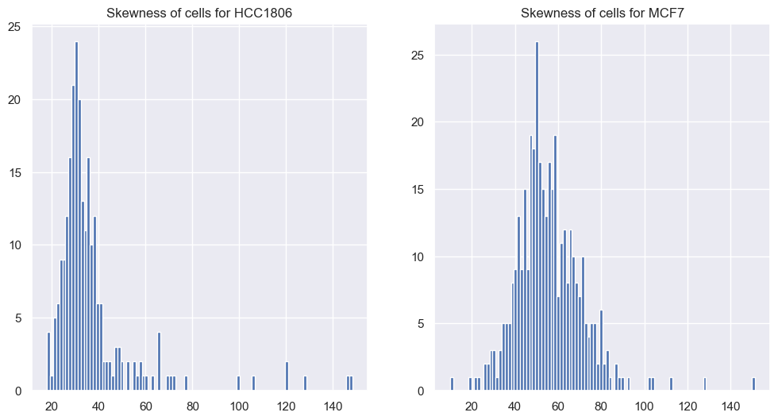
    


```python
#Skewness of genes
skewness(df_HCC_s_cl.T, df_MCF_s_cl.T, title1="HCC1806", title2="MCF7", genes_or_cells="genes")
```


    
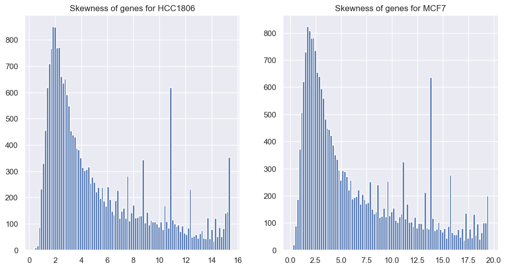
    


From the graphs above we see that the data has very large positive skew. 

This is exactly what we expect from our dataset: indeed we metioned before that we have a lot of entries which are zero in out datasets, and this will lead to the mode (of a single cell) to probably be 0. The mean, on the other hand, will be very affected by the large values present in our columns (which can reach the order of 1e5) and the median will be somewhere between the two. 

In fact, the Fisher-Pearson Coefficient (cancluated by `scripy.stats.skew`) when mode < median < mean will return a positive number. In our case the skewness is very drastic as our numbers can range in a very large interval.

Let us continue the analysis with the kurtosis:

We anticipate a distinctive pattern due to the sparsity of data at zero, and the rapid decrease in values beyond that point. This leads to a significantly larger kurtosis compared to a normal distribution. Additionally, the presence of high values caused by data sparsity contributes to the distribution's kurtosis.


```python
#Kurtosis
from scipy.stats import kurtosis

def kurt(df1, df2, title1 = '', title2 = '', genes_or_cells = ''):
  figure, ax = plt.subplots(1, 2, figsize=(12,6))
  cnames1 = list(df1.columns)
  cnames2 = list(df2.columns)
  colN1 = np.shape(df1)[1]
  colN2 = np.shape(df2)[1]
  df_kurt1 = []
  df_kurt2 = []

  for i in range(colN1) :     
      v_df1 = df1[cnames1[i]]
      df_kurt1 += [kurtosis(v_df1)]
   
  for i in range(colN2):
     v_df2 = df2[cnames2[i]]
     df_kurt2 += [kurtosis(v_df2)]

  #First graph 
  ax[0].hist(df_kurt1,bins=100)
  ax[0].set_title("Kurtosis of " + genes_or_cells + " for "  + title1)

  #Second graph 
  ax[1].hist(df_kurt2,bins=100)
  ax[1].set_title("Kurtosis of " + genes_or_cells + " for " + title2)

```


```python
#Kurtosis for cells
kurt(df_HCC_s_cl, df_MCF_s_cl, title1="HCC1806", title2="MCF7", genes_or_cells="cells")
```


    
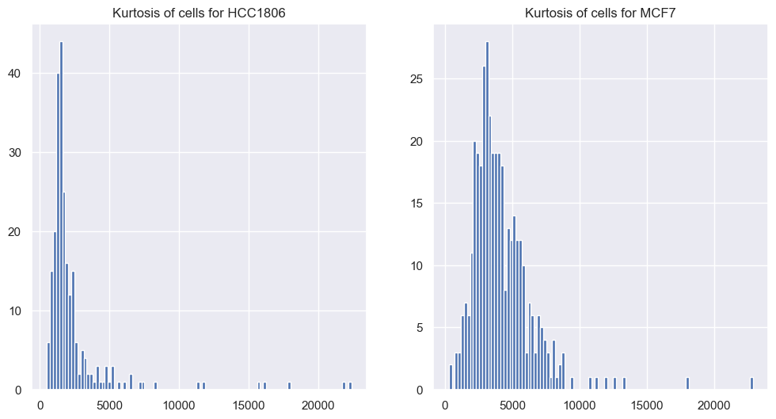
    


```python
#Kurtosis for genes
kurt(df_HCC_s_cl.T, df_MCF_s_cl.T, title1="HCC1806", title2="MCF7", genes_or_cells="genes")
```


    
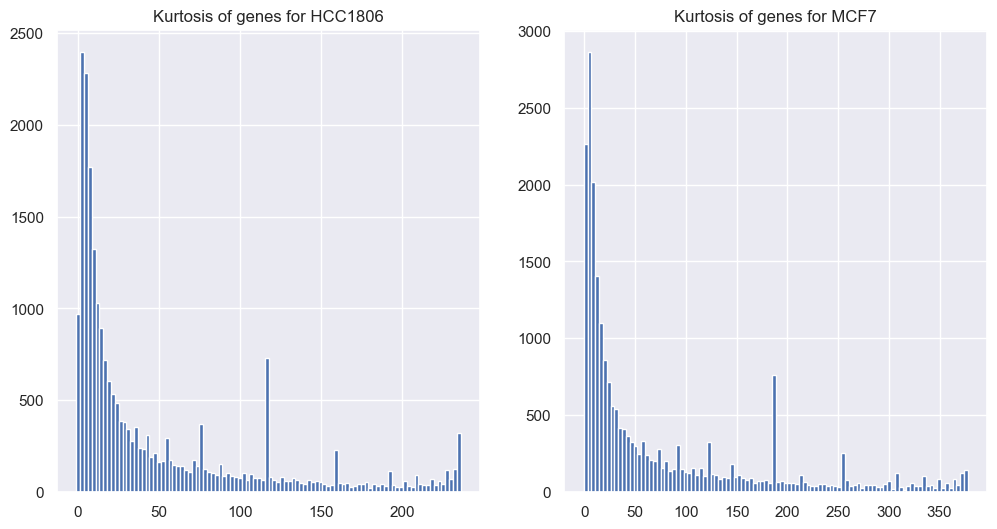
    


Unfortunately, the graphs are highly non-normal and are skewed toward 0. This may lead to biases and problems went running the models. 

To fix this as much as possible we will normalize the data. Some models also need normalized data to work well, this may have been a problem but in most cases, our models still performed very well (as we will see later on).

Regarding the Entropy Analysis:


```python
#Entropy
from scipy.stats import entropy

def entro(df1, df2, title1 = '', title2 = '', genes_or_cells=''):
  figure, ax = plt.subplots(1, 2, figsize=(12,6))
  cnames1 = list(df1.columns)
  cnames2 = list(df2.columns)
  colN1 = np.shape(df1)[1]
  colN2 = np.shape(df2)[1]
  df_kurt_cells1 = []
  df_kurt_cells2 = []

  for i in range(colN1) :     
      v_df1 = df1[cnames1[i]]
      df_kurt_cells1 += [entropy(v_df1)]
   
  for i in range(colN2):
     v_df2 = df2[cnames2[i]]
     df_kurt_cells2 += [entropy(v_df2)]

  #First graph 
  ax[0].hist(df_kurt_cells1,bins=100)
  ax[0].set_title("Entropy of " + genes_or_cells + " for "  + title1)

  #Second graph 
  ax[1].hist(df_kurt_cells2,bins=100)
  ax[1].set_title("Entropy of " + genes_or_cells + " for "  + title2)
  
entro(df_HCC_s_cl, df_MCF_s_cl, title1="HCC1806", title2="MCF7", genes_or_cells="cells")
entro(df_HCC_s_cl.T, df_MCF_s_cl.T, title1="HCC1806", title2="MCF7", genes_or_cells="genes")
```


    
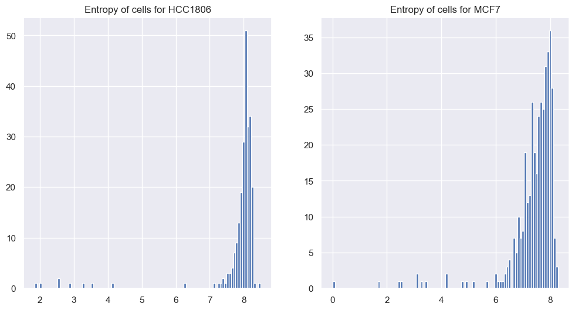
    


    
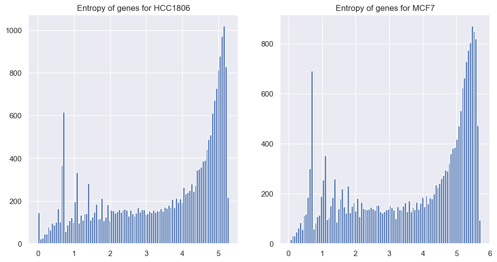
    


```python
#Calculating the maximum entropy value to compare with the graphs
print("Max entropy of the HCC cells: ", round(np.log2(df_HCC_s_cl.shape[0]), 2))
print("Max entropy of the MCF cells: ", round(np.log2(df_MCF_s_cl.shape[0]), 2), "\n")

print("Max entropy of the HCC genes: ", round(np.log2(df_HCC_s_cl.shape[1]), 2))
print("Max entropy of the MCF genes: ", round(np.log2(df_MCF_s_cl.shape[1]), 2))

```

    Max entropy of the HCC cells:  14.51
    Max entropy of the MCF cells:  14.48 
    
    Max entropy of the HCC genes:  7.91
    Max entropy of the MCF genes:  8.58
    

We see that overall a lot of the cells are close to half of the maximum value of entropy. This means that the cells don't seem to be completely random and the presence of a lot of zeros in the columns probably contributes to lowering the value of the cell’s entropy.

On the other hand, most genes tend to be much closer to the theoretical limit for entropy,  indicating that the genes seem more random and are harder to predict.

Overall, understanding the distribution characteristics, normality, and entropy patterns in our datasets helps inform subsequent data transformation steps and model selection.

---
### Plot distribution analysis

The plots below confirm our previous analytical analysis of the sparse dataset centered around zero. 

By implementing a boxplot and violin plot, we notice that even though the ranges differ, both datasets follow the same expected shape.


```python
#Log transformation
def transform_log2(df):
    cnames = list(df.columns)
    df_log2 = np.log2(df[cnames[1]]+1)
    return df_log2


sns.boxplot(x=transform_log2(df_MCF_s_uf))
sns.violinplot(x=transform_log2(df_MCF_s_uf))
plt.show()
```


    
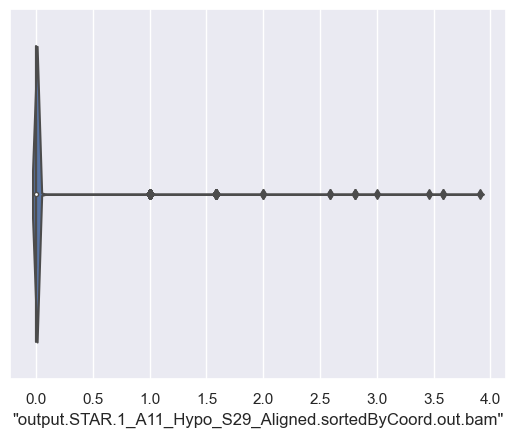
    


```python
sns.boxplot(x=transform_log2(df_HCC_s_uf))
sns.violinplot(x=transform_log2(df_HCC_s_uf))
plt.show()
```


    
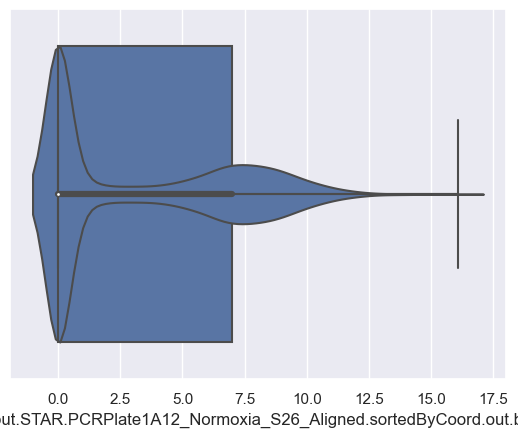
    


```python
plt.figure(figsize=(16,4))
plot=sns.violinplot(data=transform_log2(df_MCF_s_uf),palette="Set3",cut=0)
plt.setp(plot.get_xticklabels(), rotation=90)
```


    [None, None]


    
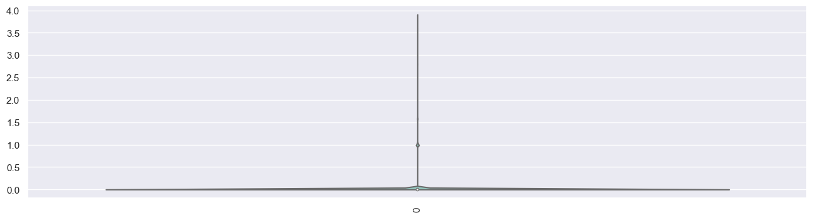
    


```python
plt.figure(figsize=(16,4))
plot=sns.violinplot(data=transform_log2(df_HCC_s_uf),palette="Set3",cut=0)
plt.setp(plot.get_xticklabels(), rotation=90)
```


    [None, None]


    

    


---
### Normalizing

In order to transform the data into a standardized range, we apply two common normalization techniques: min-max normalization and z-score normalization. In both cases, we have scaled the data in the range (-5, 10).

After implementing the normalization techniques, we plot the graphs to visualize the impact on the dataset. 


```python
def normed_data_graph(df):
    df_small = df.sample(frac=1, axis = 'columns').iloc[:, 10:30]  #just selecting part of the samples so run time not too long
    sns.displot(data=df_small,palette="Set3", kind="kde", bw_adjust=2)
    plt.xlim([-5,10])
    plt.show()

```

Min-max normalization rescales the data proportionally within the specified range. By transforming the dataset using this technique, we ensure that the values are spread out and uniformly distributed within the (-5, 10) range. This approach aids in mitigating biases caused by varying scales of different features.


```python
def min_max(df):
    df_norm = (df-df.min())/(df.max()-df.min())
    return df_norm

df_HCC_s_tr = min_max(df_HCC_s_cl)
df_MCF_s_tr = min_max(df_MCF_s_cl)
normed_data_graph(df_HCC_s_tr)
normed_data_graph(df_MCF_s_tr)
```


    
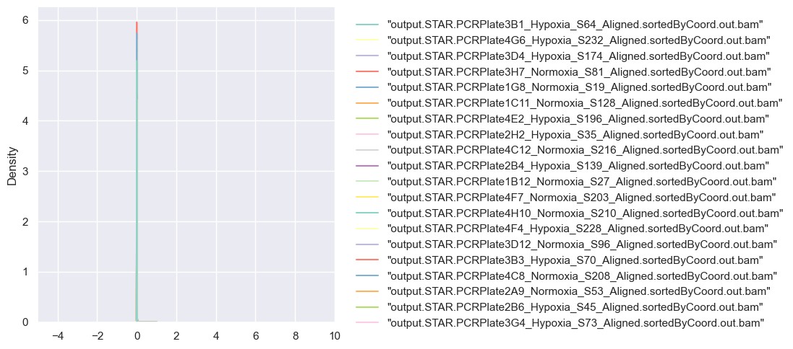
    


    
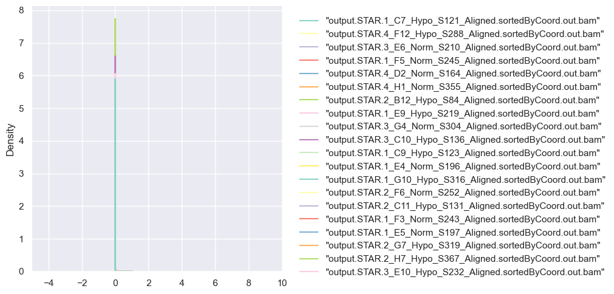
    


Z-score normalization, transforms the data by subtracting the mean and dividing by the standard deviation. This process ensures that the transformed values have a mean of zero and a standard deviation of one. 


```python
def z_score_scale(df):
    df_normed = normalized_df=(df-df.mean())/df.std()
    return df_normed

#We save the new data sets like df_XXX_s_tc (transfomred and cleared)
df_HCC_s_tc = z_score_scale(df_HCC_s_cl)
df_MCF_s_tc = z_score_scale(df_MCF_s_cl)
normed_data_graph(df_HCC_s_tc)
normed_data_graph(df_MCF_s_tc)
```


    
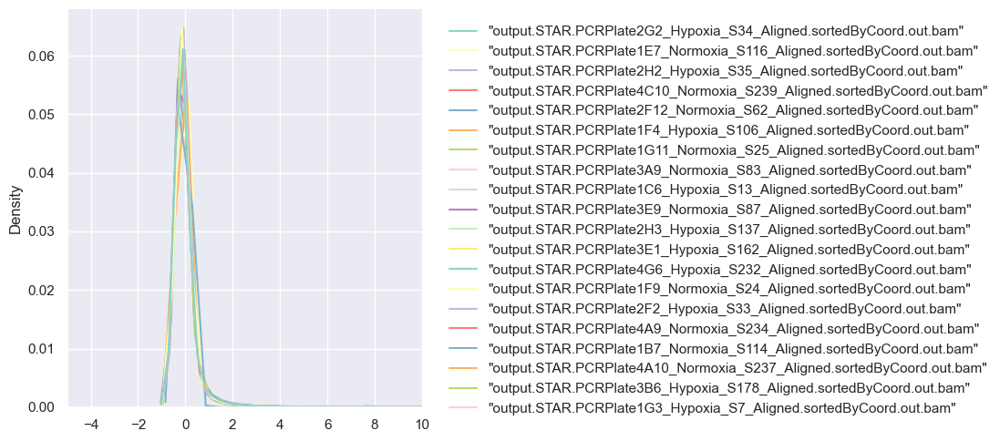
    


    
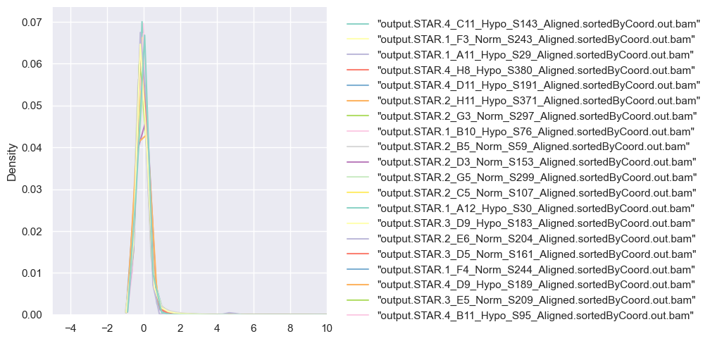
    


After examining the graphs, which helps us visualize the normalized dataset, we observe that z-score normalization provides a more pronounced visual effect of the normalized curve. 

However, both normalization methods result in distributions that align with our previous understanding of the dataset.

---
### Data Structure


```python
def heat_cor(df, title = ''):
    plt.figure(figsize=(10,5))
    c = df.corr()
    midpoint = (c.values.max() - c.values.min()) /2 + c.values.min()
    # sns.heatmap(c,cmap='coolwarm',annot=True, center=midpoint )
    # plt.show()
    sns.heatmap(c,cmap='coolwarm', center=0)
    plt.title("Heat hap of " + title, fontsize=20)
    plt.show()
    print("Number of cells included: ", np.shape(c))
    print("Average correlation of expression profiles between cells: ", midpoint)
    print("Min. correlation of expression profiles between cells: ", c.values.min())

heat_cor(df_MCF_s_tc, "MCF7")
```


    
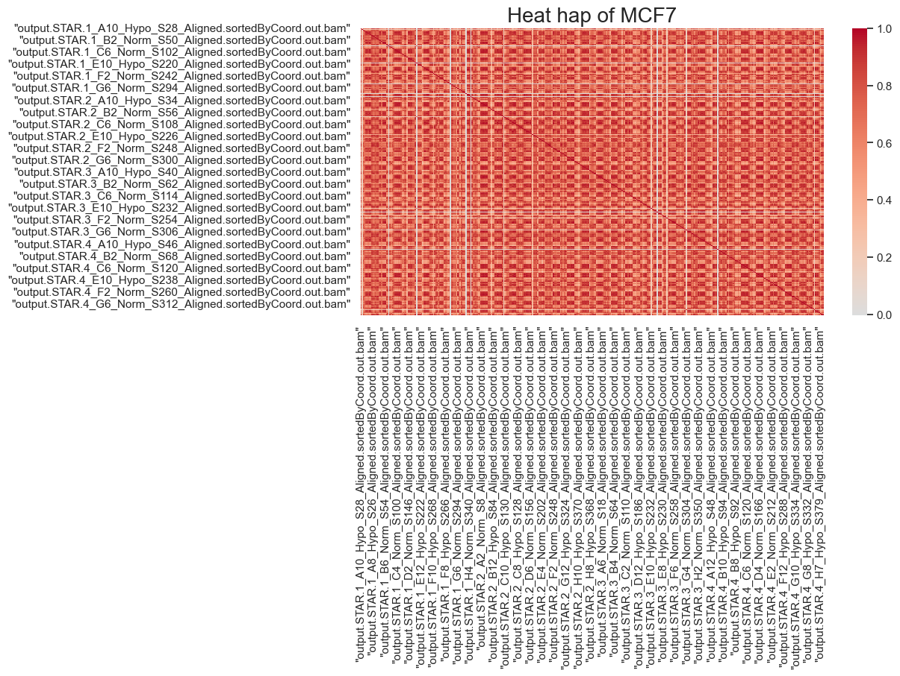
    


    Number of cells included:  (383, 383)
    Average correlation of expression profiles between cells:  0.49898217617448165
    Min. correlation of expression profiles between cells:  -0.0020356476510366233
    


```python
heat_cor(df_HCC_s_tc, title="HCC1806")
```


    
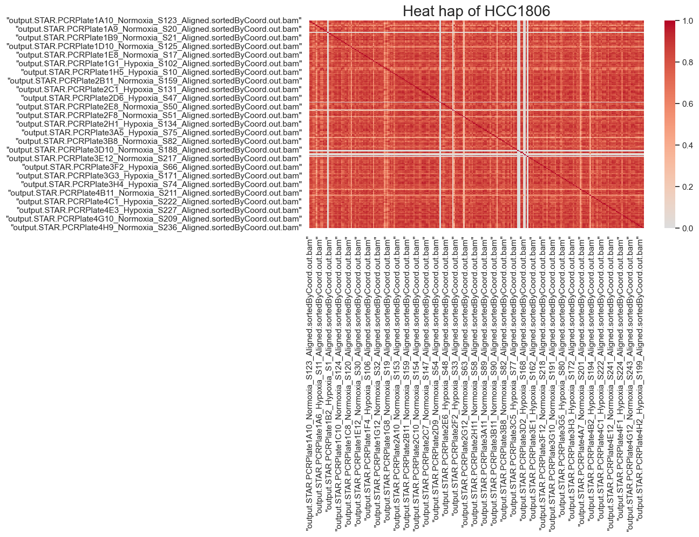
    


    Number of cells included:  (241, 241)
    Average correlation of expression profiles between cells:  0.4999332228622899
    Min. correlation of expression profiles between cells:  -0.00013355427542028706
    

We could look at the distribution of the correlation between gene expression profiles using a histogram


```python
def hist_cor(df, title="", k = 3, rand=True, cells=None):
    #We take a small sample of the cells
    if cells is None: 
        c_small = df.corr().sample(n=k,axis='columns')
    else:
        c_small = df.corr().loc[:,cells[:3]]
    sns.histplot(c_small,bins=100)
    plt.title(f"Corellation between {k} cells expression profiles")
    plt.ylabel('Frequency')
    plt.xlabel('Correlation')
hist_cor(df_HCC_s_tc)
```


    
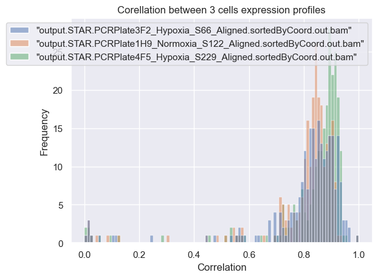
    


```python
hist_cor(df_MCF_s_tc)
```


    
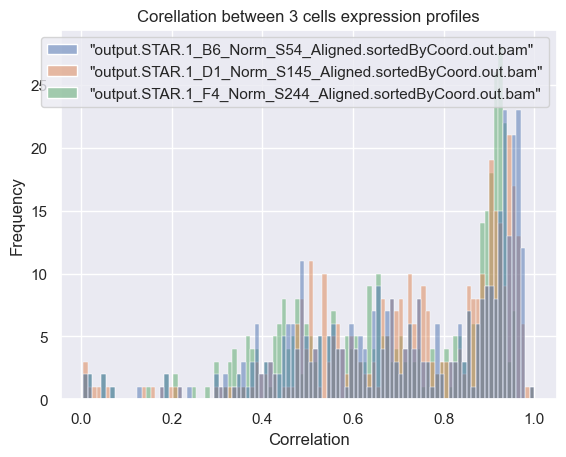
    


We expect that some genes are more frequent in hypoxia cells or in normoxia cells(in fact these are the cells that our classifiers will want to find!). Furthermore we expect that a large part of the genes have very high expression correlation amoung the other genes as these are what is called housekeeping genes and they do the basic functions for the cell to stay alive. By taking various samples we noticed that overall most of the correlations in the bar graph above are on the right side of 0.5. Let's now investigate the cells that do not follow this pattern.

We know that some genes will be characteristic of some cells. For example in our case we expect some genes to be expressed at high levels only in cells cultured in conditions of low oxygen (hypoxia), or viceversa. However, most of the low and/or high expressed genes will tend to be generally similar. Several genes will have a high expression across cells as they are house keeping genes needed for the basic functioning of the cell. Some genes will have low expression across cells as they are less or not essential for the normal functioning, so they will have low or no expression across cells and will only be expressed in specific circumstances.


```python
#Function that returns cells that have the lowest average correlation
def smallest_correlation(df, n=10):
    return list(df.corr().mean().nsmallest(n).index.values)

#Now lets plot the above histogram for three of these cells (for illustrative perposes we she the 4th, 5th and 6th smallest)
hist_cor(df_HCC_s_tc, cells=smallest_correlation(df_HCC_s_tc)[4:7])
```


    
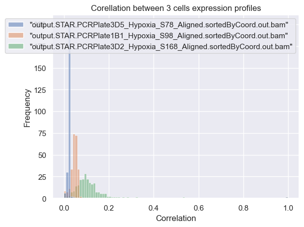
    


```python
#Now lets plot the above histogram for three of these cells (for illustrative perposes we she the 4th, 5th and 6th smallest)
hist_cor(df_MCF_s_tc, cells=smallest_correlation(df_MCF_s_tc)[4:7])
```


    
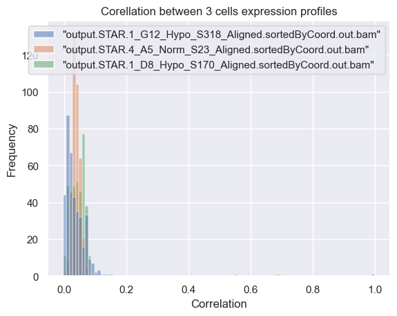
    


Noticing that these cells are so uncorrelated from the rest, lets see how many zeros their columns have:


```python
#Percentage of zeros in the very uncorrelated cells(we look at the original dataset as we already normalized this one)
print(f"Fraction of zeros in uncorellated cells: {round(frac_zeros(df_HCC_s_uf[smallest_correlation(df_HCC_s_tc)]),2)}%")
```

    Fraction of zeros in uncorellated cells: 95.11%
    


```python
#Percentage of zeros in the very uncorrelated cells(we look at the original dataset as we already normalized this one)
print(f"Fraction of zeros in uncorellated cells: {round(frac_zeros(df_MCF_s_uf[smallest_correlation(df_MCF_s_tc)]),2)}%")
```

    Fraction of zeros in uncorellated cells: 96.51%
    

A lot of zeros when uncorrelated!!

---
---
## Data transformation comparison and conclusion 

After completing the data cleaning and transformation process, we can compare the transformed datasets with the existing filtered dataset and draw conclusions from the results.

---
### Compare correlation matrices

To begin, we calculate correlation matrices for both the Transformed Data and the Filtered Data.

Visualizing these correlation matrices provides us with a clearer understanding of the degree of correlation between the data points.


```python
# Calculate correlation coefficients
transformed_corr = df_HCC_s_tc.corr()
filtered_corr = df_HCC_s_f.corr()
```


```python
fig, axes = plt.subplots(1, 2, figsize=(10, 4))
sns.heatmap(transformed_corr, ax=axes[0], cmap='coolwarm', annot=True, cbar=False, xticklabels=False, yticklabels=False)
sns.heatmap(filtered_corr, ax=axes[1], cmap='coolwarm', annot=True, cbar=False, xticklabels=False, yticklabels=False)
axes[0].set_title('Correlation Matrix for Filtered and Normalized Data')
axes[1].set_title('Correlation Matrix for Preprocessed Data')
plt.tight_layout()
plt.show()

```


    
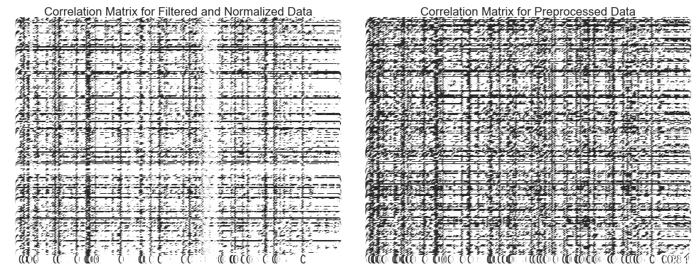
    


From the visualization, the filtered data is

---
### Compare on Random Forest Classifier

Next, we evaluate and compare the performance of the datasets using a Random Forest Classifier. 


```python
from sklearn.model_selection import train_test_split
from sklearn.ensemble import RandomForestClassifier
from sklearn import metrics
from sklearn.model_selection import cross_val_score
```

Create four dataframes containing only one column: the label hypoxia-normoxia is encoded as 0-1.


```python
def labels(df):
    target = []
    for c in df.columns:
        if "Hypoxia" in c.replace('\"', '').split("_") or "Hypo" in c.split("_"):
            target.append(0)
        elif "Normoxia" in c.replace('\"', '').split("_") or "Norm" in c.split("_"):
            target.append(1)
        else:
            raise ValueError("Cell cannot be categorized")
    return target
```

After adding the necessary libraries and label function for this section, we can move on to compare each of the datasets performance on the Random Forest Model.

We perform a simple train-test split for both transformed and filtered, and repeat it for HCC and MCF datasets. 

The next step is to train the Random Forest models on each of the datasets.


```python
# Splitting the HCC transformed dataset
X_HCC_transformed_train, X_HCC_transformed_test, y_HCC_transformed_train, y_HCC_transformed_test = train_test_split(df_HCC_s_tc.T, labels(df_HCC_s_tc), test_size=0.2, random_state=42)

# Splitting the MCF transformed dataset
X_MCF_transformed_train, X_MCF_transformed_test, y_MCF_transformed_train, y_MCF_transformed_test = train_test_split(df_MCF_s_tc.T, labels(df_MCF_s_tc), test_size=0.2, random_state=42)

# Splitting the HCC filtered dataset
X_HCC_filtered_train, X_HCC_filtered_test, y_HCC_filtered_train, y_HCC_filtered_test = train_test_split(df_HCC_s_f.T, labels(df_HCC_s_f), test_size=0.2, random_state=42)

# Splitting the MCF filtered dataset
X_MCF_filtered_train, X_MCF_filtered_test, y_MCF_filtered_train, y_MCF_filtered_test = train_test_split(df_MCF_s_f.T, labels(df_MCF_s_f), test_size=0.2, random_state=42)

```


```python
#For HCC
# Train Random Forest models on each dataset
rf_model_transformed = RandomForestClassifier(random_state=42)
rf_model_transformed.fit(X_HCC_transformed_train, y_HCC_transformed_train)

rf_model_filtered = RandomForestClassifier(random_state=42)
rf_model_filtered.fit(X_HCC_filtered_train, y_HCC_filtered_train)

# Evaluate the models
y_transformed_pred = rf_model_transformed.predict(X_HCC_transformed_test)
y_filtered_pred = rf_model_filtered.predict(X_HCC_filtered_test)


#For MCF
# Train Random Forest models on each dataset
rf_model_transformed = RandomForestClassifier(random_state=42)
rf_model_transformed.fit(X_MCF_transformed_train, y_MCF_transformed_train)

rf_model_filtered = RandomForestClassifier(random_state=42)
rf_model_filtered.fit(X_MCF_filtered_train, y_MCF_filtered_train)

# Evaluate the models
y_transformed_pred = rf_model_transformed.predict(X_MCF_transformed_test)
y_filtered_pred = rf_model_filtered.predict(X_MCF_filtered_test)


```


```python
#For HCC
# Train Random Forest models on each dataset
rf_model_HCC_transformed = RandomForestClassifier(random_state=42)
rf_model_HCC_transformed.fit(X_HCC_transformed_train, y_HCC_transformed_train)

rf_model_HCC_filtered = RandomForestClassifier(random_state=42)
rf_model_HCC_filtered.fit(X_HCC_filtered_train, y_HCC_filtered_train)

# Evaluate the models
y_HCC_transformed_pred = rf_model_HCC_transformed.predict(X_HCC_transformed_test)
y_HCC_filtered_pred = rf_model_HCC_filtered.predict(X_HCC_filtered_test)

#For MCF
# Train Random Forest models on each dataset
rf_model_MCF_transformed = RandomForestClassifier(random_state=42)
rf_model_MCF_transformed.fit(X_MCF_transformed_train, y_MCF_transformed_train)

rf_model_MCF_filtered = RandomForestClassifier(random_state=42)
rf_model_MCF_filtered.fit(X_MCF_filtered_train, y_MCF_filtered_train)

# Evaluate the models
y_MCF_transformed_pred = rf_model_MCF_transformed.predict(X_MCF_transformed_test)
y_MCF_filtered_pred = rf_model_MCF_filtered.predict(X_MCF_filtered_test)

```

As part of the evaluation process, we utilize several performance metrics, including accuracy, precision, recall, and F1-score, to gauge the effectiveness of the trained models.


```python
#For HCC
# Evaluate the models
y_HCC_transformed_pred = rf_model_HCC_transformed.predict(X_HCC_transformed_test)
y_HCC_filtered_pred = rf_model_HCC_filtered.predict(X_HCC_filtered_test)

accuracy_HCC_transformed = metrics.accuracy_score(y_HCC_transformed_test, y_HCC_transformed_pred)
accuracy_HCC_filtered = metrics.accuracy_score(y_HCC_filtered_test, y_HCC_filtered_pred)

precision_HCC_transformed = metrics.precision_score(y_HCC_transformed_test, y_HCC_transformed_pred)
precision_HCC_filtered = metrics.precision_score(y_HCC_filtered_test, y_HCC_filtered_pred)

recall_HCC_transformed = metrics.recall_score(y_HCC_transformed_test, y_HCC_transformed_pred)
recall_HCC_filtered = metrics.recall_score(y_HCC_filtered_test, y_HCC_filtered_pred)

f1_score_HCC_transformed = metrics.f1_score(y_HCC_transformed_test, y_HCC_transformed_pred)
f1_score_HCC_filtered = metrics.f1_score(y_HCC_filtered_test, y_HCC_filtered_pred)


#For MCF
# Evaluate the models
y_MCF_transformed_pred = rf_model_MCF_transformed.predict(X_MCF_transformed_test)
y_MCF_filtered_pred = rf_model_MCF_filtered.predict(X_MCF_filtered_test)

accuracy_MCF_transformed = metrics.accuracy_score(y_MCF_transformed_test, y_MCF_transformed_pred)
accuracy_MCF_filtered = metrics.accuracy_score(y_MCF_filtered_test, y_MCF_filtered_pred)

precision_MCF_transformed = metrics.precision_score(y_MCF_transformed_test, y_MCF_transformed_pred)
precision_MCF_filtered = metrics.precision_score(y_MCF_filtered_test, y_MCF_filtered_pred)

recall_MCF_transformed = metrics.recall_score(y_MCF_transformed_test, y_MCF_transformed_pred)
recall_MCF_filtered = metrics.recall_score(y_MCF_filtered_test, y_MCF_filtered_pred)

f1_score_MCF_transformed = metrics.f1_score(y_MCF_transformed_test, y_MCF_transformed_pred)
f1_score_MCF_filtered = metrics.f1_score(y_MCF_filtered_test, y_MCF_filtered_pred)
```


```python
#For HCC
# Print the evaluation metrics
print("HCC Transformed Data:")
print("Accuracy:", accuracy_HCC_transformed)
print("Precision:", precision_HCC_transformed)
print("Recall:", recall_HCC_transformed)
print("F1-Score:", f1_score_HCC_transformed)

print("\nHCC Filtered Data:")
print("Accuracy:", accuracy_HCC_filtered)
print("Precision:", precision_HCC_filtered)
print("Recall:", recall_HCC_filtered)
print("F1-Score:", f1_score_HCC_filtered)

```

    HCC Transformed Data:
    Accuracy: 0.8163265306122449
    Precision: 0.7894736842105263
    Recall: 0.75
    F1-Score: 0.7692307692307692
    
    HCC Filtered Data:
    Accuracy: 0.9347826086956522
    Precision: 0.9615384615384616
    Recall: 0.9259259259259259
    F1-Score: 0.9433962264150944
    


```python
#For MCF
# Print the evaluation metrics
print("MCF Transformed Data:")
print("Accuracy:", accuracy_MCF_transformed)
print("Precision:", precision_MCF_transformed)
print("Recall:", recall_MCF_transformed)
print("F1-Score:", f1_score_MCF_transformed)

print("\nMCF Filtered Data:")
print("Accuracy:", accuracy_MCF_filtered)
print("Precision:", precision_MCF_filtered)
print("Recall:", recall_MCF_filtered)
print("F1-Score:", f1_score_MCF_filtered)
```

    MCF Transformed Data:
    Accuracy: 0.987012987012987
    Precision: 0.9772727272727273
    Recall: 1.0
    F1-Score: 0.9885057471264368
    
    MCF Filtered Data:
    Accuracy: 1.0
    Precision: 1.0
    Recall: 1.0
    F1-Score: 1.0
    


```python
#For HCC
# Perform cross-validation and compute the scores
scores_HCC_transformed = cross_val_score(rf_model_HCC_transformed, df_HCC_s_tc.T, labels(df_HCC_s_tc), cv=5, scoring='accuracy')
scores_HCC_filtered = cross_val_score(rf_model_HCC_filtered, df_HCC_s_tc.T, labels(df_HCC_s_tc), cv=5, scoring='accuracy')

# Compute the mean and standard deviation of the scores
mean_score_HCC_transformed = scores_HCC_transformed.mean()
mean_score_HCC_filtered = scores_HCC_filtered.mean()

# Print the results
print("Cross-Validation Accuracy Scores:", scores_HCC_transformed)
print("Mean Accuracy Score:", mean_score_HCC_transformed)

print("Cross-Validation Accuracy Scores:", scores_HCC_filtered)
print("Mean Accuracy Score:", mean_score_HCC_filtered)
```

    Cross-Validation Accuracy Scores: [0.93877551 0.85714286 0.95918367 0.91666667 0.95833333]
    Mean Accuracy Score: 0.9260204081632653
    Cross-Validation Accuracy Scores: [0.93877551 0.85714286 0.95918367 0.91666667 0.95833333]
    Mean Accuracy Score: 0.9260204081632653
    


```python
#For MCF
# Perform cross-validation and compute the scores
scores_MCF_transformed = cross_val_score(rf_model_MCF_transformed, df_MCF_s_tc.T, labels(df_MCF_s_tc), cv=5, scoring='accuracy')
scores_MCF_filtered = cross_val_score(rf_model_MCF_filtered, df_MCF_s_tc.T, labels(df_MCF_s_tc), cv=5, scoring='accuracy')

# Compute the mean and standard deviation of the scores
mean_score_MCF_transformed = scores_MCF_transformed.mean()
mean_score_MCF_filtered = scores_MCF_filtered.mean()

# Print the results
print("Cross-Validation Accuracy Scores:", scores_MCF_transformed)
print("Mean Accuracy Score:", mean_score_MCF_transformed)

print("Cross-Validation Accuracy Scores:", scores_MCF_filtered)
print("Mean Accuracy Score:", mean_score_MCF_filtered)
```

    Cross-Validation Accuracy Scores: [0.94805195 0.96103896 1.         0.96052632 0.98684211]
    Mean Accuracy Score: 0.971291866028708
    Cross-Validation Accuracy Scores: [0.94805195 0.96103896 1.         0.96052632 0.98684211]
    Mean Accuracy Score: 0.971291866028708
    

Overall, while the filtered data outperformed the transformed data slightly, both datasets produced good results. The Random Forest models trained on both the transformed and filtered datasets demonstrated high accuracy, precision, recall, and F1-scores. 

These results indicate that both datasets are suitable for training effective models, noting a slight advantage for the filtered data.

In conclusion, the data transformation process prepared the datasets for analysis, and the subsequent evaluation using a Random Forest Classifier highlighted the overall effectiveness of both the transformed and filtered datasets. These findings provide valuable insights for further analysis and model selection in future stages of the project.

---

# Models


```python
#Train test split for both datasets
from sklearn.model_selection import train_test_split

#Train test split for SmartSeq
df_HCC_SS_tr, df_HCC_SS_ts, y_HCC_SS_tr, y_HCC_SS_ts = train_test_split(df_HCC_s_f_n_train.T, labels(df_HCC_s_f_n_train), test_size=0.2, random_state=42)
df_MCF_SS_tr, df_MCF_SS_ts, y_MCF_SS_tr, y_MCF_SS_ts = train_test_split(df_MCF_s_f_n_train.T, labels(df_MCF_s_f_n_train), test_size=0.2, random_state=42)

#Train test split for DropSeq
df_HCC_DS_tr, df_HCC_DS_ts, y_HCC_DS_tr, y_HCC_DS_ts = train_test_split(df_HCC_d_f_n_train.T, labels(df_HCC_d_f_n_train), test_size=0.2, random_state=42)
df_MCF_DS_tr, df_MCF_DS_ts, y_MCF_DS_tr, y_MCF_DS_ts = train_test_split(df_MCF_d_f_n_train.T, labels(df_MCF_d_f_n_train), test_size=0.2, random_state=42)

```


```python
#Extra imports
from sklearn.decomposition import PCA
from sklearn.pipeline import make_pipeline
from sklearn.model_selection import validation_curve

from sklearn.metrics import adjusted_mutual_info_score
from sklearn.manifold import TSNE
from umap import UMAP

from sklearn.cluster import KMeans
from sklearn.cluster import DBSCAN

from sklearn.metrics import r2_score
from sklearn.cross_decomposition import PLSRegression

import warnings
warnings.filterwarnings('ignore')
```

---
---

## Dimensionality Reduction

### Blackbox Functions

We wrote a set of functions whose purpose is not only to apply said dimensionality reduction, but also to give us the "best choice" of dimension of the target space, in order to preserve as much information as possible.   
Moreover, the code also plots the explained variance per number of dimensions, a plot useful for a better understanding of the various models.
In general, these functions take mainly 3 variables as input:
- X, that is our `Observations Dataset`, which in our case will be the dataframe containing the gene expression of each cell.
- Y, that is the `Labels List`, which we use to assign colors to the points in our visualization scatterplot.
- model, that is the type of `Dimensionality Reduction` we chose to apply to our set X in the visualization process.


```python
#Gives the 2-D Plot based on the model's Dimensionality Reduction
def Plot(X, Y, model):
    model.set_params(n_components=2)
    m = model.fit_transform(X)
    colors = ["red","blue"]
    condc = [colors[i] for i in Y]
    cluster_names = ["Hypoxia", "Normoxia"]
    visual = pd.DataFrame(m, columns=["PC1","PC2"])
    plt.scatter(visual["PC1"], visual["PC2"], c=condc, s=20)
    handles = [plt.Line2D([], [], marker='o',linestyle="", color=color, label=cluster_names[i]) for i, color in enumerate(colors)]
    legend = plt.legend(handles=handles, loc="best", title="Conditions")
    plt.show()
```


```python
def Var_Predicted(X, model,n):
    pred_var_expl = []
    model.set_params(n_components=n)
    matrix = model.fit_transform(X)
    for i in range(1,n+1):
        matrix_current = pd.DataFrame(matrix[:,:i])
        pls = PLSRegression(n_components=i)
        pls.fit(matrix_current, X)                                              
        y = pls.predict(matrix_current)
        pred_var_expl.append(r2_score(X,y,multioutput="variance_weighted"))     
    return pred_var_expl
```


```python
#Function for 95% explained variance definition
def numb_comp(X, model, eps = 0.95, n=100):
    vars = Var_Predicted(X,model,n)
    for i in range(len(vars)):
        if vars[i]>=0.95:
            return vars, i
    return vars, n
```


```python
#Plots the Explained Variance based on the Number of Components
def Var_Plot(X, model, eps=0.95, n=100):
    variances, C = numb_comp(X, model, eps)
    print("The Opitmal Number of Dimensions for PCA is", C)
    plt.plot(range(1,n+1), variances, '-', linewidth=2)
    plt.plot([C, C], [0, eps], "k:")
    plt.plot([0, C], [eps, eps], "k:")
    plt.xlabel('Dimensions')
    plt.ylabel('Cumulative Explained Variance')
    plt.grid(True)
    plt.show()

```


```python
def Blackbox(X,Y, model):
    Var_Plot(X, model)
    Plot(X,Y,model)
```

### PCA

The first instance of Dimensionality Reduction that we decided to apply is `PCA`. PCA, or Principal Component Analysis, is a type of linear dimensionality reduction that aims to transform the original data into a smaller set of coordinates, called Principal Components.   
Given a Standardized Dataset, PCA computes the eigenvalues and eigenvectors of the covariance matrix, and chooses the top k eigenvectors (where k is the dimension of the target space) based on the corresponding eigenvalues, and projects the data in the new space spanned by these vectors.


```python
Blackbox(df_HCC_SS_tr,y_HCC_SS_tr, PCA())
```

    The Opitmal Number of Dimensions for PCA is 31
    


    
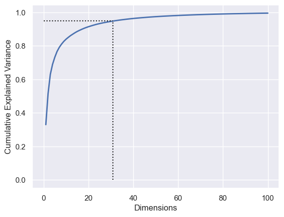
    


    
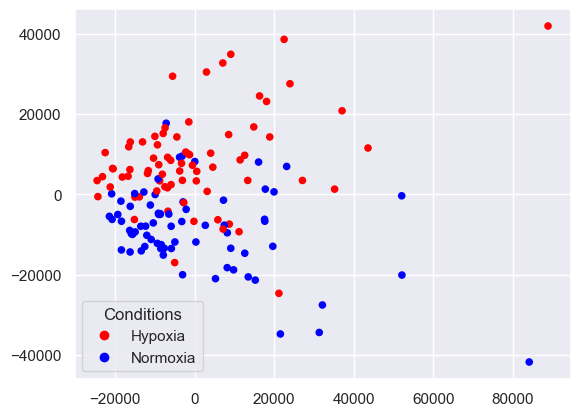
    


PCA on HCC Dataset

The Explained Variance - Dimensions Plot gives us that 24 dimensions are sufficient to explain 95% of the variance in our data, a much greater result compared to the 3000 dimensions we were starting with.   
On the other hand, the plot in 2 Dimensions gives us points that are extremely mixed up: it doesn't seem to have a clear correlation with the labels.


```python
Blackbox(df_MCF_SS_tr,y_MCF_SS_tr,PCA())
```

    The Opitmal Number of Dimensions for PCA is 18
    


    
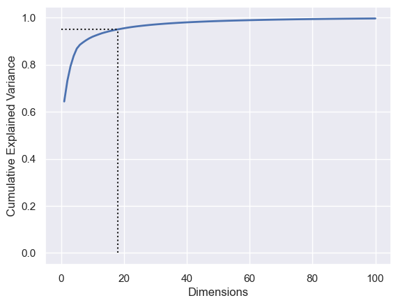
    


    
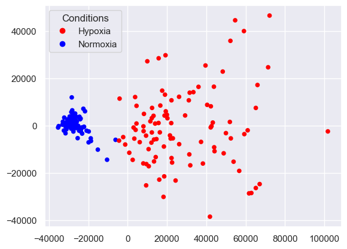
    


PCA on MCF Dataset

The Explained Variance - Dimensions Plot gives us an even better result: only 18 dimensions are necessary to explain 95% of the variance in our data!!!   
Moreover, compared to the previous dataset, the plot in 2 Dimensions gives us a great result: you can distinguish two main clusters of data, which would make clustering algorithm obtain good results on this result.

### t-SNE

`t-SNE`, which stands for t-Distributed Stochastic Neighbor Embedding,  is another method of Dimensionality Reduction, which is a nonlinear method based on the computation of a probability distribution which aims to keep similar points in the dataset close when getting in a lower dimensional space.   
It is mainly used for visualization of high dimensional data and cluster recognition.


```python
Plot(df_HCC_SS_tr,y_HCC_SS_tr,TSNE(random_state=69))
```


    
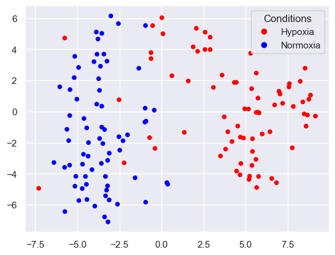
    


Due to the properties of the Dimensionality reduction method, it is impossible to plot a Variance-Dimensions plot, as the dimensionality reduction function TSNE( ) doesn't work after 4 dimensions.   
However, the visualization plot in 2 Dimensions already gives us a much better result compared to PCA on the HCC dataset: we can recognize in the plot two main pairs of clusters, but this is not necessarily good enough for a clustering algorithm to work well.


```python
Plot(df_MCF_SS_tr,y_MCF_SS_tr,TSNE(random_state=69))
```


    
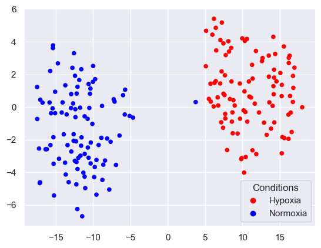
    


In the case of the MCF dataset, the result is much better! It clearly shows two main clusters, a blue one on the left of Normoxia cells and a red one on the right for Hypoxia cells. It looks like a clustering algorithm would work better on such a plot.

### UMAP

The last method of Dimensionality Reduction that we decided to apply is `UMAP`, or Uniform Manifold Approximation and Projection, which is based on the mathematical construct of manifolds: it finds first manifolds in the complex data and then represents them in the low-dimensional space.


```python
Blackbox(df_HCC_SS_tr, y_HCC_SS_tr, UMAP(random_state=69))
```

    The Opitmal Number of Dimensions for PCA is 100
    


    
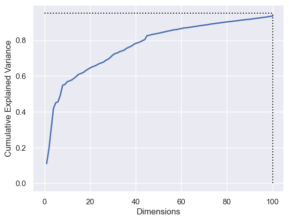
    


    
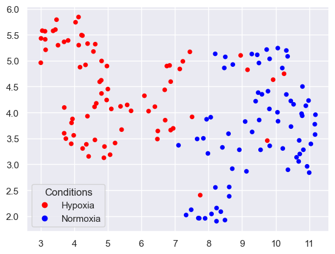
    


The Variance-Dimensions Plot for HCC gives us a much lower growth compared to the PCA case. This is to be expected, as the principle behind PCA is entirely that of maximizing the explained variance, while for UMAP we don't have a clear correlation between the two variables.   
On the other hand, the two dimensional scatterplot is very similar to that of TSNE, showing two main pairs of clusters.


```python
Blackbox(df_MCF_SS_tr,y_MCF_SS_tr,UMAP(random_state=69))
```

    The Opitmal Number of Dimensions for PCA is 100
    


    
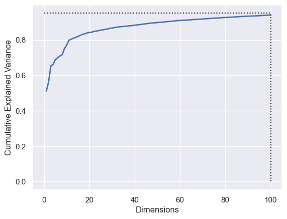
    


    

    


The result for the MCF dataset is similar to that of HCC, as the number of dimensions explaining 95% of the variance is still more than 100.   
What is extremely interesting about UMAP on MCF is the Two Dimensional Scatterplot: it shows two extremely clear clusters of Normoxia and Hypoxia cells.

Based on the previous results, the two methods that we consider to be the most relevant are PCA, which is the best in terms of explained variance per number of components, and UMAP, which is the one which looks like to be the most suited for clustering.

---
---

## Clustering

Clutering is a Machine Learning Technique that aims to identify patterns and relationships in dataframe, by grouping together "clusters" of data.

### Two Components Dimensionsionality Reduction

This brief code allows us to apply a generic Dimensionality Reduction Technique, contained in the variable `model`, to a generic dataframe, contained in `X`.


```python
def Two_Comp_DR(X,model):
    model.set_params(n_components=2)
    m = model.fit(X)
    mnew = m.fit_transform(X)
    x_fit = pd.DataFrame(mnew, columns=["PC1","PC2"])
    return x_fit, m
```

---

### HCC

First of all we decided to run clustering on the HCC dataframe, in order to check whether the algorithm gives us a good classification model for recognizing Normoxia vs Hypoxia Cells.

#### 2 Clusters HCC

Our first try was to apply a simple clustering to our dataframes in order to check whether the two clusters given by the clustering algorithm, in this case `KMeans`, would give us a result that resembles our Hypoxia/Normoxia classification.


```python
def KM_Plot(X,model):
    X_Reduced, m = Two_Comp_DR(X, model)
    km = KMeans(n_clusters=2, random_state=69)
    km.fit(X_Reduced)
    labels = km.fit_predict(X_Reduced)
    Plot(X, labels, model)
```


```python
KM_Plot(df_HCC_SS_tr, PCA())
```


    
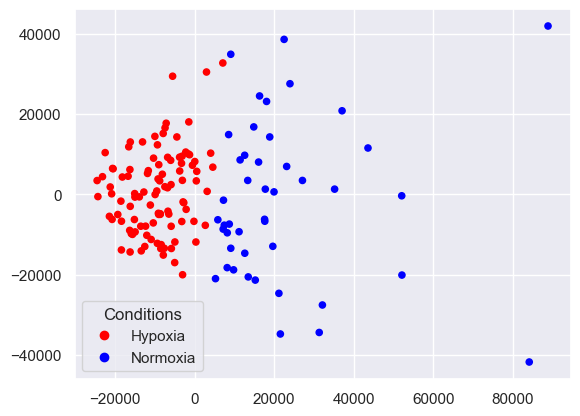
    


```python
KM_Plot(df_HCC_SS_tr, UMAP(random_state=69))
```


    
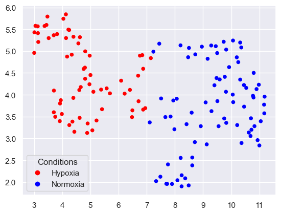
    


Clearly in none of the three cases of Dimensionality Reduction, the results are satisfactory. As we could have expected, the clustering algorithm fails to recognize the nonlinear distinction in clusters in the original dataset, therefore we need to try with a different approach.

#### KMeans on Full Dimensions

Our second idea was to apply the clustering algorithm to differentiate our dataset in a number of clusters larger than 2, and then post-process the labels of each cluster in order to assign to each cluster the label that is most frequent between the points of the cluster.

Once again the clustering algorithm that we decided to apply is `KMeans`, an algorithm which works as follows: it picks at random k centroids in the space of the data to which you apply the algorithm, and then assigns a label to each datapoint based on the closest centroid. It then shifts the centroid to the center of mass of the cluster, to then repeat the classification until convergence.


```python
def OptimalN(X, Y):
    df = pd.DataFrame(columns=['Clusters', 'AMI'])
    for n in range(11,21):
        method=KMeans(n_clusters=n, random_state=1)
        method.fit(X)
        labels = method.fit_predict(X)
        ami = adjusted_mutual_info_score(Y, labels)
        row = {'Clusters': n, 'AMI':ami}
        df = df.append(row, ignore_index=True)
    max_row = df.loc[df['AMI'].idxmax()]
    return int(max_row[0])
```


```python
def Labels_Post_Process(n, Labels,Y):
    d={}
    for x in range(n):
        indices = [i for i in range(len(Labels)) if Labels[i] == x]
        corresp_y = [Y[i] for i in indices]
        expected = np.argmax(np.bincount(corresp_y))
        d[x] = expected

    for i in range(len(Labels)):
        Labels[i] = d[Labels[i]]
    return d, Labels
```


```python
def KM_Clustering(X, Y, n):
        method=KMeans(n_clusters=n, random_state=1)
        method.fit(X)
        labels = method.fit_predict(X)
        d, l = Labels_Post_Process(n, labels, Y)
        return d, l
```


```python
def Ultra_KMeans(X,Y,model):
    Number = OptimalN(X,Y)
    print(Number)
    d, Labels = KM_Clustering(X, Y, Number)
    Plot(X,Labels,model)
    model1 = model.fit(X)
    km = KMeans(n_clusters=Number, random_state=1)
    model2 = km.fit(X)
    return model1, model2, d
```


```python
kmpca_hcc = Ultra_KMeans(df_HCC_SS_tr,y_HCC_SS_tr, PCA())
```

    14
    


    
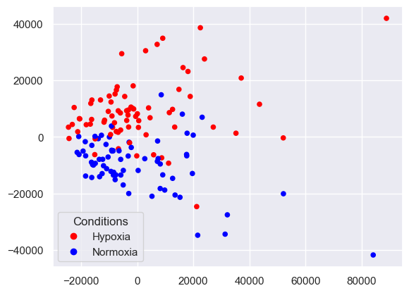
    


```python
kmumap_hcc = Ultra_KMeans(df_HCC_SS_tr,y_HCC_SS_tr,UMAP(random_state=69))
```

    14
    


    
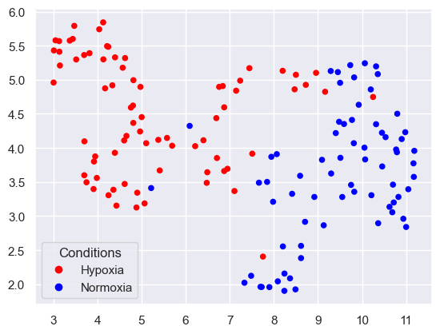
    


The results obtained in this method are already much better compared to the previous attempt, but our concern was that applying the clustering to the full dimensions dataset wouldn't fully use the advantages of our dimensionality reduction technique, as the dimensionality reduction in this case is only used to visualize the result.

---
##### Testing


```python
def Test_1(models, X_test, Y_test):
    dr = models[0]
    km = models[1]
    lpp = models[2]
    labels = km.predict(X_test)

    for i in range(len(labels)):
        labels[i] = lpp[labels[i]]
    ys = [int(i) for i in Y_test]
    count=0
    for i in range(len(ys)):
        if ys[i] != labels[i]:
            count += 1
    print(count/len(ys))
```


```python
Test_1(kmpca_hcc,df_HCC_SS_ts,y_HCC_SS_ts)
```

    0.13513513513513514
    

We decided to test the correctness of our classification to a test dataset, and our classifier got the correct result in 75% of the given inputs.

#### KMeans on Reduced Dimensions

Another method we decided to implement was to apply the same clustering as above, but on the Reduced Dimensions Dataset.


```python
def Plot_2(X,Y):
    colors = ["red","blue"]
    condc = [colors[i] for i in Y]
    cluster_names = ["Hypoxia", "Normoxia"]
    plt.scatter(X["PC1"], X["PC2"], c=[colors[i] for i in Y], s=20)
    handles = [plt.Line2D([], [], marker='o',linestyle="", color=color, label=cluster_names[i]) for i, color in enumerate(colors)]
    legend = plt.legend(handles=handles, loc="best", title="Assigned Labels")
    plt.show()
```


```python
def KMR_Clustering(X,Y,model):
    X_R, model1 = Two_Comp_DR(X,model)
    Number = OptimalN(X_R,Y)
    print(Number)
    d, Labels = KM_Clustering(X_R, Y, Number)
    Plot_2(X_R, Labels)
    km = KMeans(n_clusters=Number, random_state=1)
    model2 = km.fit(X_R)
    return model1, model2, d
```


```python
kmrpca = KMR_Clustering(df_HCC_SS_tr,y_HCC_SS_tr,PCA())
```

    19
    


    
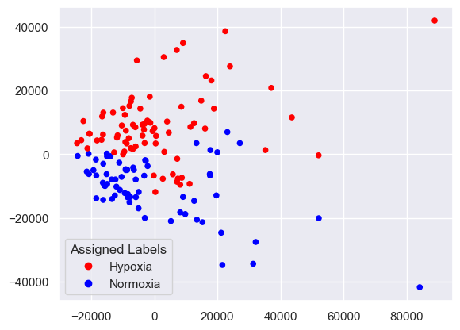
    


```python
kmrumap = KMR_Clustering(df_HCC_SS_tr,y_HCC_SS_tr,UMAP(random_state=69))
```

    11
    


    
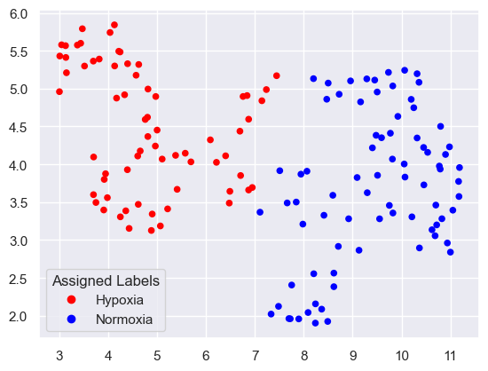
    


The results on PCA are not so good, but the results on UMAP look very accurate, and the performance of this method are better than the previous as our clustering algorithm is applied to a 2-dimensional dataset instead of a 3000-dimensional one.

---
##### Test


```python
def Test_2(models, X_test, Y_test):
    dr = models[0]
    km = models[1]
    lpp = models[2]
    try:
        X_ts = models[0].transform(X_test)
    except AttributeError:
        X_ts = models[0].fit_transform(X_test)
    labels = km.predict(X_ts)

    for i in range(len(labels)):
        labels[i] = lpp[labels[i]]
    ys = [int(i) for i in Y_test]
    count=0
    for i in range(len(ys)):
        if ys[i] != labels[i]:
            count += 1
    print(count/len(ys))
```


```python
Test_2(kmrpca, df_HCC_SS_ts, y_HCC_SS_ts)
#8      =>      0.36
#12     =>      0.4
#24     =>      0.53
#31     =>      0.47
```

    0.35135135135135137
    


```python
Test_2(kmrumap, df_HCC_SS_ts, y_HCC_SS_ts)
#9      =>      0.2
#11     =>      0.18
#24     =>      0.24
#31     =>      0.22
```

    0.05405405405405406
    

As before, we performed a couple of tests on the test dataset on different ranges of number of clusters, and it seems that the best result is obtained by applying KMeans on a dataset obtained with dimensionality reduction through UMAP with 11 post-processed clusters, which gives us the correct classifcation in 82% of instances of entries of the test set.

#### DBSCAN

Another method of clustering we decided to apply is `DBSCAN`, short for Density Based Spatial Clustering of Applications with Noise. It works by grouping together points by defining a neighborhood of each point of radius epsilon and defining a cluster if the number of datapoints is at least min_samples.


```python
def Optimal_Ms(X, Y):
    df = pd.DataFrame(columns=['MS', 'AMI'])
    for n in range(5,10):
        method=DBSCAN(min_samples=n, eps=30000)
        method.fit(X)
        labels = method.fit_predict(X)
        ami = adjusted_mutual_info_score(Y, labels)
        row = {'MS': n, 'AMI':ami}
        df = df.append(row, ignore_index=True)
    max_row = df.loc[df['AMI'].idxmax()]
    return int(max_row[0])
```


```python
def DBS_Clustering(X, Y, n):
        method=DBSCAN(min_samples=n, eps=30000)
        method.fit(X)
        labels = method.fit_predict(X)
        return labels
```


```python
def Ultra_DBSCAN(X,Y,model):
    Number = Optimal_Ms(X,Y)
    Labels = DBS_Clustering(X, Y, Number)
    Plot(X,Labels,model)
```


```python
Ultra_DBSCAN(df_HCC_SS_tr,y_HCC_SS_tr,PCA())
```


    
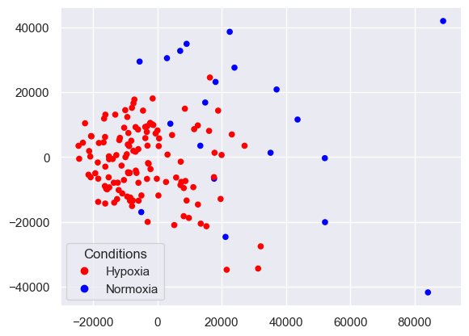
    


```python
Ultra_DBSCAN(df_HCC_SS_tr,y_HCC_SS_tr,UMAP(random_state=69))
```


    
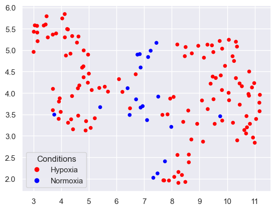
    


Unfortunately, the results obtained with DBSCAN is worse than those obtained with KMeans, and due to the way the algorithm works we have no hope of applying a post-processing procedure similar to that used with KMeans.

---

### MCF

#### KMeans on Full Dimensions


```python
kmpca_mcf = Ultra_KMeans(df_MCF_SS_tr,y_MCF_SS_tr,PCA())
```

    11
    


    
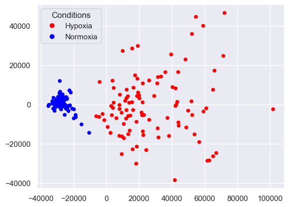
    


```python
kmumap_mcf = Ultra_KMeans(df_MCF_SS_tr, y_MCF_SS_tr, UMAP(random_state=69))
```

    11
    


    
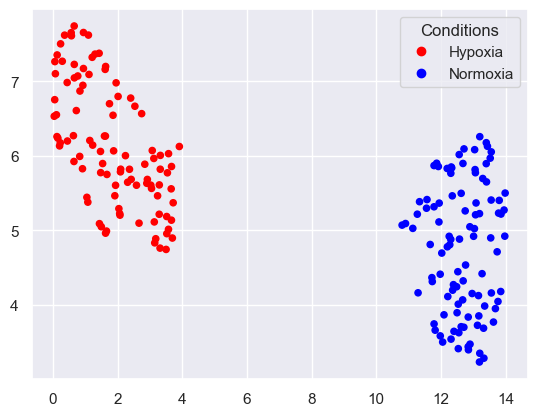
    


As we expected from the way the plots with correct labels looked, clustering obtains really good results in terms of similarity between empirical labels and the correct ones.


```python
Test_1(kmpca_mcf, df_MCF_SS_ts, y_MCF_SS_ts)
```

    0.02
    

Testing the classifier on the test set gives us correct predictions in 98.4% of the instances, an extremely good result.

#### KMeans on Reduced Dimensions


```python
kmrpca_mcf = KMR_Clustering(df_MCF_SS_tr,y_MCF_SS_tr,PCA())
```

    11
    


    

    


```python
kmrumap_mcf = KMR_Clustering(df_MCF_SS_tr,y_MCF_SS_tr,UMAP(random_state=69))
```

    11
    


    
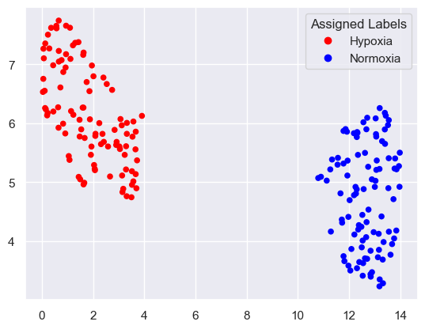
    


```python
Test_2(kmrpca_mcf,df_MCF_SS_ts,y_MCF_SS_ts)
```

    0.02
    


```python
Test_2(kmrumap_mcf, df_MCF_SS_ts, y_MCF_SS_ts)
```

    0.02
    

Again, KMeans obtains extremely good results also on the reduced datasets, with classifiers with precision of 100% in the case of the PCA-Reduced Dataset and the same 98.4% on the UMAP-Reduced Dataset.

#### DBSCAN


```python
Ultra_DBSCAN(df_MCF_SS_tr, y_MCF_SS_tr, PCA())
```


    
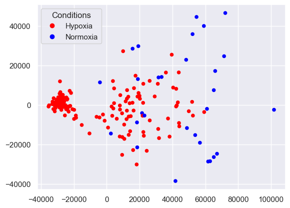
    


```python
Ultra_DBSCAN(df_MCF_SS_tr, y_MCF_SS_tr, UMAP(random_state=69))
```


    
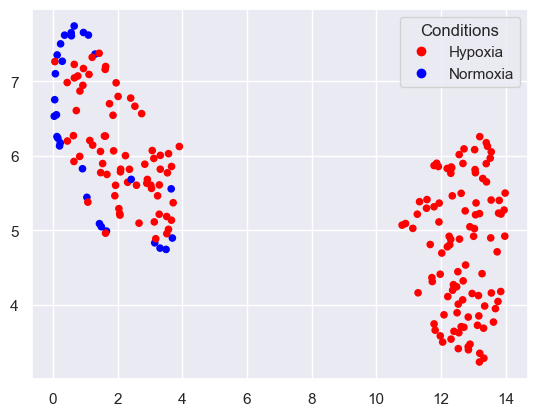
    


Applying DBSCAN on the MCF dataset gives us much worse results than what we expected, as even clusters which are clearly distinguished in the 2-Dimensional Plot get mixed up by the algorithm.

---
---

## Dimensionality Reduciton DropSeq

#### PCA


```python
Plot(df_HCC_DS_tr,y_HCC_DS_tr, PCA())
```


    
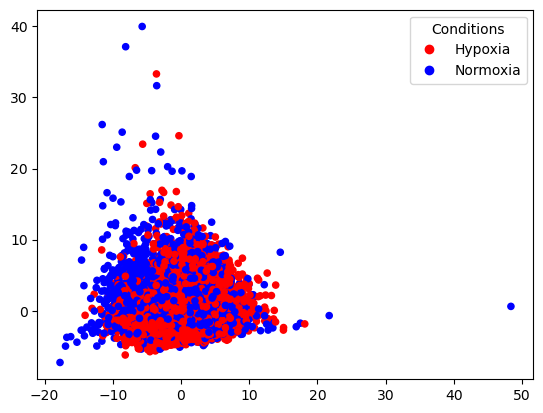
    


```python
Plot(df_MCF_DS_tr,y_MCF_DS_tr,PCA())
```


    
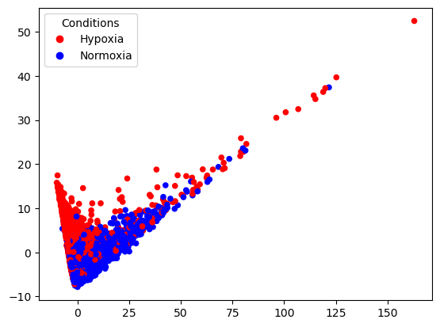
    


#### t-SNE


```python
Plot(df_HCC_DS_tr,y_HCC_DS_tr,TSNE(random_state=69))
```


    
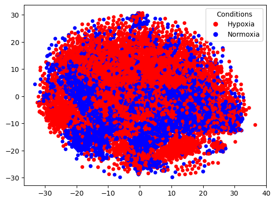
    


```python
Plot(df_MCF_DS_tr,y_MCF_DS_tr,TSNE(random_state=69))
```


    
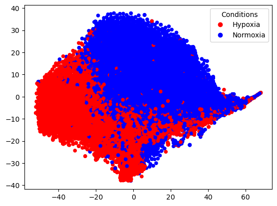
    


#### UMAP


```python
Plot(df_HCC_DS_tr, y_HCC_DS_tr, UMAP(random_state=69))
```


    
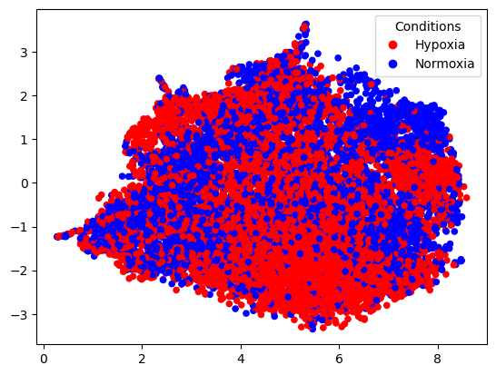
    


```python
Plot(df_MCF_DS_tr,y_MCF_DS_tr,UMAP(random_state=69))
```


    

    


Compared to the SmartS datasets, the Dropsec ones give much more confused clusters, with only a good division in the case of MCF for t-SNE and UMAP.

---
---

## Clustering DropSeq

### HCC

#### KMeans on Full Dimensions


```python
kmpca_hcc = Ultra_KMeans(df_HCC_DS_tr,y_HCC_DS_tr, PCA())
```

    12
    


    
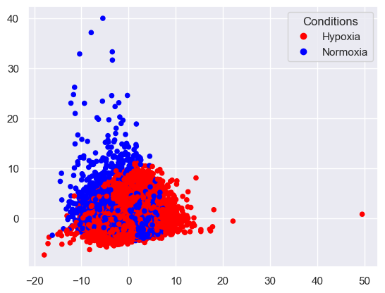
    


```python
kmumap_hcc = Ultra_KMeans(df_HCC_DS_tr,y_HCC_DS_tr,UMAP(random_state=69))
```

    12
    


    
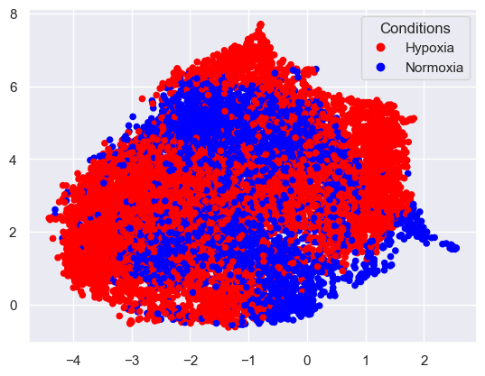
    


Similarly to the previous dataset, we tried applying the clustering to the full dataset, and the results obtained in this method are already much better compared to the previous attempt.

---
##### Testing


```python
Test_1(kmpca_hcc,df_HCC_DS_ts,y_HCC_DS_ts)
```

    0.24446714334354783
    

We decided to test the correctness of our classification to a test dataset, and our classifier got the correct result in around 75% of the given inputs.

#### KMeans on Reduced Dimensions


```python
kmrpca = KMR_Clustering(df_HCC_DS_tr,y_HCC_DS_tr,PCA())
```

    13
    


    
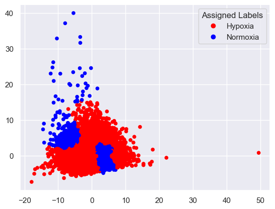
    


```python
kmrumap = KMR_Clustering(df_HCC_DS_tr,y_HCC_DS_tr,UMAP(random_state=69))
```

    17
    


    
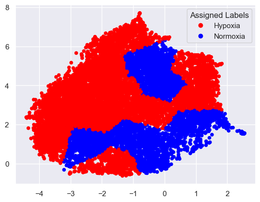
    


---
##### Test


```python
Test_2(kmrpca, df_HCC_DS_ts, y_HCC_DS_ts)
#13 => 0.63
```

    0.37453183520599254
    


```python
Test_2(kmrumap, df_HCC_DS_ts, y_HCC_DS_ts)
#15 => 0.65
```

    0.3251617296561117
    

The results seem much worse compared to the full dimensions clustering, which was confirmed by the tests, which gave accuracies of around 63-65%.

---

### MCF

#### KMeans on Full Dimensions


```python
kmpca_mcf = Ultra_KMeans(df_MCF_DS_tr,y_MCF_DS_tr,PCA())
```

    15
    


    
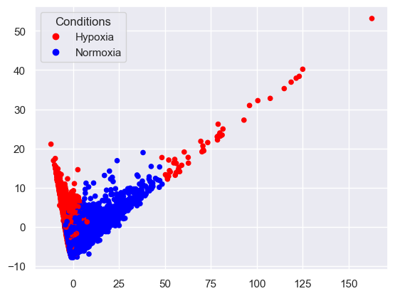
    


```python
kmumap_mcf = Ultra_KMeans(df_MCF_DS_tr, y_MCF_DS_tr, UMAP(random_state=69))
```

    15
    


    
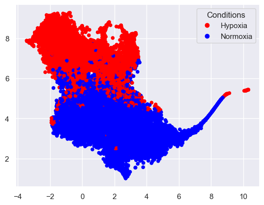
    


```python
Test_1(kmpca_mcf, df_MCF_DS_ts, y_MCF_DS_ts)
```

    0.0850670365233472
    

As in the case of SmartSec, testing the classifier on the test set gives us correct predictions in 98.2% of the instances, an extremely good result.

#### KMeans on Reduced Dimensions


```python
kmrpca_mcf = KMR_Clustering(df_MCF_DS_tr,y_MCF_DS_tr,PCA())
```

    11
    


    
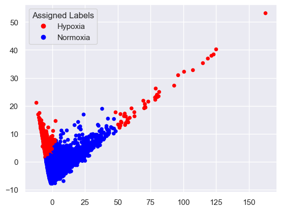
    


```python
kmrumap_mcf = KMR_Clustering(df_MCF_DS_tr,y_MCF_DS_tr,UMAP(random_state=69))
```

    11
    


    
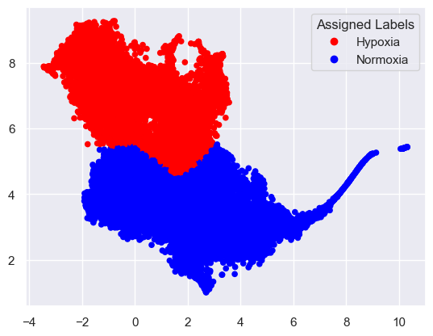
    


```python
Test_2(kmrpca_mcf,df_MCF_DS_ts,y_MCF_DS_ts)
```

    0.19325011558021266
    


```python
Test_2(kmrumap_mcf, df_MCF_DS_ts, y_MCF_DS_ts)
```

    0.12552011095700416
    

Again, KMeans obtains extremely good results also on the reduced datasets, with classifiers with precision of 80-88% in the two cases of dimensionality reduction applied.

To conclude, clustering gives us some interesting information on the datasets, but it might be more useful to use another model for predictions.

---
---
## Dimensionality Reduction and SVM

### Libraries


```python
#from importnb import imports
from sklearn.decomposition import KernelPCA
from sklearn.svm import SVC, LinearSVC
from sklearn.preprocessing import PowerTransformer, StandardScaler, MaxAbsScaler, QuantileTransformer

import time
import csv

# from ipywidgets import AppLayout, TwoByTwoLayout, IntSlider, FloatSlider
from sklearn.inspection import DecisionBoundaryDisplay
from sklearn.model_selection import GridSearchCV, cross_val_score
from sklearn.preprocessing import StandardScaler
# from sklearn.preprocessing import MinMaxScaler
# from IPython.display import clear_output
from sklearn.pipeline import Pipeline
# import ipywidgets as widgets
from sklearn.svm import SVC, LinearSVC
from sklearn.metrics import f1_score

from sklearn.utils._testing import ignore_warnings
from sklearn.exceptions import ConvergenceWarning
```

Random State and n_jobs:


```python
seed = 235
from joblib import parallel_backend
parallel_backend("threading", n_jobs=-1)
```


    <joblib.parallel.parallel_backend at 0x2c3feb23820>


---
### Functions

#### `process_raw()`

Creates both a test and a train dataset in `SmartS_data` or `DropSeq_data` respectively, with of shape: (*n_features*, *n_samples*)


```python
def process_raw(section="SmartS", test_size=0.20, seed=42):

    ignore=""
    name = "_SmartS"
    if section == "DropSeq":
        ignore = "_ignore"
        name = ""

    HCC = pd.read_csv(f"{section}_raw{ignore}/HCC1806{name}_Filtered_Normalised_3000_Data_train.txt", delimiter="\ ",engine='python',index_col=0)
    MCF = pd.read_csv(f"{section}_raw{ignore}/MCF7{name}_Filtered_Normalised_3000_Data_train.txt", delimiter="\ ",engine='python',index_col=0)

    HCC_train, HCC_test = train_test_split(HCC.T, test_size=test_size, random_state=seed)
    MCF_train, MCF_test = train_test_split(MCF.T, test_size=test_size, random_state=seed)

    HCC_train.T.to_csv(f"{section}_data/HCC1806_{section}_Filtered_Normalised_3000_Data_train.txt", sep=" ", quoting=csv.QUOTE_NONE)
    HCC_test.T.to_csv(f"{section}_data/HCC1806_{section}_Filtered_Normalised_3000_Data_test.txt", sep=" ", quoting=csv.QUOTE_NONE)
    MCF_train.T.to_csv(f"{section}_data/MCF7_{section}_Filtered_Normalised_3000_Data_train.txt", sep=" ", quoting=csv.QUOTE_NONE)
    MCF_test.T.to_csv(f"{section}_data/MCF7_{section}_Filtered_Normalised_3000_Data_test.txt", sep=" ", quoting=csv.QUOTE_NONE)
```

#### `data_split()`

Returns Train and Test `pandas.DataFrame` along with `max_dim` and their true labels


```python
def data_split(file='MCF7',section="SmartS"):
#>> Import, Rename, Cleaning Data (Missing XCells train data)
    def renamer(name, section=section):
        class_position = {"SmartS":-3, "DropSeq":-1}
        classification = name.split("_")[class_position[section]] #change -1 into -3
        cell = name.split("_")[-2]
        if len(classification) > 4:
            classification = classification[:4]
        return classification+"_"+cell

    # Train
    filepath_Train = f"{section}_data/{file}_{section}_Filtered_Normalised_3000_Data_train.txt" # remove "(DropSeq)"
    pd_Train = pd.read_csv(filepath_Train,delimiter=" ",index_col=0).astype('float32')
    pd_Train.rename(mapper=renamer, axis='columns', inplace=True)
    pd_Train.dropna(axis='rows', inplace = True)
    # print(df_Train.shape)
    pd_y_Train = [int(i.split("_")[0]=='Norm') for i in pd_Train.columns]

    # Test
    filepath_Test = f"{section}_data/{file}_{section}_Filtered_Normalised_3000_Data_test.txt" # remove "(DropSeq)"
    pd_Test = pd.read_csv(filepath_Test,delimiter=" ",index_col=0).astype('float32')
    pd_Test.rename(mapper=renamer, axis='columns', inplace=True)
    pd_Test.dropna(axis='rows', inplace = True)
    # print(df_Test.shape)
    pd_y_Test = [int(i.split("_")[0]=='Norm') for i in pd_Test.columns]

    max_dim = min(pd_Train.shape)

    data = {"train":pd_Train, "test":pd_Test, "max dim":max_dim, "y train":pd_y_Train, "y test":pd_y_Test}

    return data
```

#### ```make_pipe()```

Creates a 3 step Pipeline given a list containing:
-   `scaler`: Method for Preprocessing data or `None`
-   `dim_reduction`: Dimensionality Reduction Method or `None`
-   `clf`: Classifier
Returns the pipeline


```python
def make_pipe(steps, verbose=0):
    
    name = ["scaler", "dim_reduction", "clf"]
    if steps[-1]==None:
        raise ValueError("A model for SVC is needed")
    if len(steps)!=3:
        raise ValueError("number of steps must be 3")
    
    return Pipeline(steps=[(name[i], steps[i]) for i in range(3)], verbose=max(0,verbose-1))
```

#### ```clf()```

Runs a pipeline, on `data`, containing the 3 elements in the argument `steps`.\
Returns the fitted pipeline and prints the score on Test if `verbose`&ge;1.


```python
@ignore_warnings(category=RuntimeWarning)
def clf(data, steps=None, verbose=True, seed=42):
#>> Extracting data
    X_train = data["train"]
    X_test = data["test"]
    y_train = data["y train"]
    y_test = data["y test"]

#>> Pipeline
    pipeline = Pipeline(steps=[
                ("scaler", StandardScaler()), 
                ("dim_reduction", PCA(n_components=30, random_state=seed)),
                ("svc", LinearSVC(random_state=seed)),
                 ],
                 verbose=verbose)
    
    if steps != None:
        pipeline = make_pipe(steps, verbose=verbose)

    pipeline.fit(X_train.T, y_train)

    if verbose:
        print(f"{pipeline.score(X_test.T,y_test):.4f}")

    return pipeline
```

#### ```CVsearch()```

Performs Gridsearch and Cross validation to find the best parameters.\
Returns a DataFrame with informations of each iteration


```python
@ignore_warnings(category=(RuntimeWarning, ConvergenceWarning))
def CVsearch(data, steps, cv_inner, param_grid=None, verbose=1):
#>> Extracting data
    X_train = data["train"]
    X_test = data["test"]
    y_train = data["y train"]
    y_test = data["y test"]
    max_dim = data["max dim"]

#>> Pipeline
    pipe = make_pipe(steps)

#>> Search and CV
    dim=(max_dim//cv_inner)*(cv_inner-1)

    if param_grid==None:
        param_grid ={
                    "dim_reduction__n_components": [dim for dim in range(100, dim, 100)],
                    "clf__C": [0.001, 0.01, 0.1, 1],
                } 
    
    clf = GridSearchCV(pipe, param_grid, cv=cv_inner, verbose=verbose-2, refit=True)
    clf.fit(X_train.T, y_train)

#>> Output
    table = pd.DataFrame(clf.cv_results_)
    i = clf.best_index_
    best = table[i:i+1]
    cv_results = pd.concat((best.set_index('rank_test_score'),table.drop(index=i).set_index('rank_test_score').sort_index()))

    if verbose:
        print(f"best parameters: {clf.best_params_}")
        print(f"best score: {clf.best_score_:.3f}")
        print(f"prediction score: {clf.score(X_test.T, y_test):.3f}")
        print(f"F1 score: {f1_score(y_test, clf.predict(X_test.T)):.3f}")
        if verbose-1:
            display(cv_results.head(4))

    return clf, cv_results

```


```python
# with imports("ipynb"):
#     import data
#     import classifier
```

---
### Data Processing

Splitting Raw data into Labelled Test and Train dataset using `process_raw()`


```python
# data.process_raw(section="SmartS", seed=seed)
# data.process_raw(section="DropSeq", seed=seed)
```

Select which `file=["MCF7","HCC1806"]` and `section=["SmartS","DropSeq"]` we want to consider


```python
file = "MCF7"
section = "SmartS"
```

Saves the datasets into `pandas.DataFrame` along with their true labels


```python
dataset = data_split(file=file, section=section)
X_train = dataset["train"]
X_test = dataset["test"]
y_train = dataset["y train"]
y_test = dataset["y test"]
max_dim = dataset["max dim"]
```

---
### Classifier

We use `clf()` to performs a first Pipeline containing `scaler`, `reduction` and `svc` 
( accepts `scaler`=`None`, `reduction`=`None` )


```python
steps = [None, PCA(n_components=30, random_state=seed), LinearSVC(random_state=seed)]

clf(dataset, steps=steps, seed=seed)
```

    1.0000
    


<style>#sk-container-id-1 {color: black;background-color: white;}#sk-container-id-1 pre{padding: 0;}#sk-container-id-1 div.sk-toggleable {background-color: white;}#sk-container-id-1 label.sk-toggleable__label {cursor: pointer;display: block;width: 100%;margin-bottom: 0;padding: 0.3em;box-sizing: border-box;text-align: center;}#sk-container-id-1 label.sk-toggleable__label-arrow:before {content: "▸";float: left;margin-right: 0.25em;color: #696969;}#sk-container-id-1 label.sk-toggleable__label-arrow:hover:before {color: black;}#sk-container-id-1 div.sk-estimator:hover label.sk-toggleable__label-arrow:before {color: black;}#sk-container-id-1 div.sk-toggleable__content {max-height: 0;max-width: 0;overflow: hidden;text-align: left;background-color: #f0f8ff;}#sk-container-id-1 div.sk-toggleable__content pre {margin: 0.2em;color: black;border-radius: 0.25em;background-color: #f0f8ff;}#sk-container-id-1 input.sk-toggleable__control:checked~div.sk-toggleable__content {max-height: 200px;max-width: 100%;overflow: auto;}#sk-container-id-1 input.sk-toggleable__control:checked~label.sk-toggleable__label-arrow:before {content: "▾";}#sk-container-id-1 div.sk-estimator input.sk-toggleable__control:checked~label.sk-toggleable__label {background-color: #d4ebff;}#sk-container-id-1 div.sk-label input.sk-toggleable__control:checked~label.sk-toggleable__label {background-color: #d4ebff;}#sk-container-id-1 input.sk-hidden--visually {border: 0;clip: rect(1px 1px 1px 1px);clip: rect(1px, 1px, 1px, 1px);height: 1px;margin: -1px;overflow: hidden;padding: 0;position: absolute;width: 1px;}#sk-container-id-1 div.sk-estimator {font-family: monospace;background-color: #f0f8ff;border: 1px dotted black;border-radius: 0.25em;box-sizing: border-box;margin-bottom: 0.5em;}#sk-container-id-1 div.sk-estimator:hover {background-color: #d4ebff;}#sk-container-id-1 div.sk-parallel-item::after {content: "";width: 100%;border-bottom: 1px solid gray;flex-grow: 1;}#sk-container-id-1 div.sk-label:hover label.sk-toggleable__label {background-color: #d4ebff;}#sk-container-id-1 div.sk-serial::before {content: "";position: absolute;border-left: 1px solid gray;box-sizing: border-box;top: 0;bottom: 0;left: 50%;z-index: 0;}#sk-container-id-1 div.sk-serial {display: flex;flex-direction: column;align-items: center;background-color: white;padding-right: 0.2em;padding-left: 0.2em;position: relative;}#sk-container-id-1 div.sk-item {position: relative;z-index: 1;}#sk-container-id-1 div.sk-parallel {display: flex;align-items: stretch;justify-content: center;background-color: white;position: relative;}#sk-container-id-1 div.sk-item::before, #sk-container-id-1 div.sk-parallel-item::before {content: "";position: absolute;border-left: 1px solid gray;box-sizing: border-box;top: 0;bottom: 0;left: 50%;z-index: -1;}#sk-container-id-1 div.sk-parallel-item {display: flex;flex-direction: column;z-index: 1;position: relative;background-color: white;}#sk-container-id-1 div.sk-parallel-item:first-child::after {align-self: flex-end;width: 50%;}#sk-container-id-1 div.sk-parallel-item:last-child::after {align-self: flex-start;width: 50%;}#sk-container-id-1 div.sk-parallel-item:only-child::after {width: 0;}#sk-container-id-1 div.sk-dashed-wrapped {border: 1px dashed gray;margin: 0 0.4em 0.5em 0.4em;box-sizing: border-box;padding-bottom: 0.4em;background-color: white;}#sk-container-id-1 div.sk-label label {font-family: monospace;font-weight: bold;display: inline-block;line-height: 1.2em;}#sk-container-id-1 div.sk-label-container {text-align: center;}#sk-container-id-1 div.sk-container {/* jupyter's `normalize.less` sets `[hidden] { display: none; }` but bootstrap.min.css set `[hidden] { display: none !important; }` so we also need the `!important` here to be able to override the default hidden behavior on the sphinx rendered scikit-learn.org. See: https://github.com/scikit-learn/scikit-learn/issues/21755 */display: inline-block !important;position: relative;}#sk-container-id-1 div.sk-text-repr-fallback {display: none;}</style><div id="sk-container-id-1" class="sk-top-container"><div class="sk-text-repr-fallback"><pre>Pipeline(steps=[(&#x27;scaler&#x27;, None),
                (&#x27;dim_reduction&#x27;, PCA(n_components=30, random_state=235)),
                (&#x27;clf&#x27;, LinearSVC(random_state=235))],
         verbose=0)</pre><b>In a Jupyter environment, please rerun this cell to show the HTML representation or trust the notebook. <br />On GitHub, the HTML representation is unable to render, please try loading this page with nbviewer.org.</b></div><div class="sk-container" hidden><div class="sk-item sk-dashed-wrapped"><div class="sk-label-container"><div class="sk-label sk-toggleable"><input class="sk-toggleable__control sk-hidden--visually" id="sk-estimator-id-1" type="checkbox" ><label for="sk-estimator-id-1" class="sk-toggleable__label sk-toggleable__label-arrow">Pipeline</label><div class="sk-toggleable__content"><pre>Pipeline(steps=[(&#x27;scaler&#x27;, None),
                (&#x27;dim_reduction&#x27;, PCA(n_components=30, random_state=235)),
                (&#x27;clf&#x27;, LinearSVC(random_state=235))],
         verbose=0)</pre></div></div></div><div class="sk-serial"><div class="sk-item"><div class="sk-estimator sk-toggleable"><input class="sk-toggleable__control sk-hidden--visually" id="sk-estimator-id-2" type="checkbox" ><label for="sk-estimator-id-2" class="sk-toggleable__label sk-toggleable__label-arrow">None</label><div class="sk-toggleable__content"><pre>None</pre></div></div></div><div class="sk-item"><div class="sk-estimator sk-toggleable"><input class="sk-toggleable__control sk-hidden--visually" id="sk-estimator-id-3" type="checkbox" ><label for="sk-estimator-id-3" class="sk-toggleable__label sk-toggleable__label-arrow">PCA</label><div class="sk-toggleable__content"><pre>PCA(n_components=30, random_state=235)</pre></div></div></div><div class="sk-item"><div class="sk-estimator sk-toggleable"><input class="sk-toggleable__control sk-hidden--visually" id="sk-estimator-id-4" type="checkbox" ><label for="sk-estimator-id-4" class="sk-toggleable__label sk-toggleable__label-arrow">LinearSVC</label><div class="sk-toggleable__content"><pre>LinearSVC(random_state=235)</pre></div></div></div></div></div></div></div>


---
### Tuning

We tune the Hyperparameters in `param_grid` by running a Gridsearch with Cross Validation using `CVsearch()`.

#### SmartS

For MCF in SmartS it is easy to obtain perfect scores by simply taking a linear kernel, even if sigmoid works just as well.\
We keep C=1 since decreasing it too much would negatively affect the performance.


```python
dataset = data_split(file="MCF7", section="SmartS")
max_dim = dataset["max dim"]

steps=[StandardScaler(),PCA(random_state=seed),SVC(random_state=seed)]
fold = 10
dim=(max_dim//fold)*(fold-1)
param_grid ={
            "dim_reduction__n_components": [i for i in range(2,11)],
            "clf__C": [1,2,3],
            "clf__kernel": ["linear"]
        }
print("> MCF | SmartS:")
clf_A, table_A = CVsearch(dataset, steps, cv_inner=fold, param_grid=param_grid, verbose=2)
```

    > MCF | SmartS:
    best parameters: {'clf__C': 1, 'clf__kernel': 'linear', 'dim_reduction__n_components': 3}
    best score: 1.000
    prediction score: 1.000
    F1 score: 1.000
    


<div>
<style scoped>
    .dataframe tbody tr th:only-of-type {
        vertical-align: middle;
    }

    .dataframe tbody tr th {
        vertical-align: top;
    }

    .dataframe thead th {
        text-align: right;
    }
</style>
<table border="1" class="dataframe">
  <thead>
    <tr style="text-align: right;">
      <th></th>
      <th>mean_fit_time</th>
      <th>std_fit_time</th>
      <th>mean_score_time</th>
      <th>std_score_time</th>
      <th>param_clf__C</th>
      <th>param_clf__kernel</th>
      <th>param_dim_reduction__n_components</th>
      <th>params</th>
      <th>split0_test_score</th>
      <th>split1_test_score</th>
      <th>split2_test_score</th>
      <th>split3_test_score</th>
      <th>split4_test_score</th>
      <th>split5_test_score</th>
      <th>split6_test_score</th>
      <th>split7_test_score</th>
      <th>split8_test_score</th>
      <th>split9_test_score</th>
      <th>mean_test_score</th>
      <th>std_test_score</th>
    </tr>
    <tr>
      <th>rank_test_score</th>
      <th></th>
      <th></th>
      <th></th>
      <th></th>
      <th></th>
      <th></th>
      <th></th>
      <th></th>
      <th></th>
      <th></th>
      <th></th>
      <th></th>
      <th></th>
      <th></th>
      <th></th>
      <th></th>
      <th></th>
      <th></th>
      <th></th>
      <th></th>
    </tr>
  </thead>
  <tbody>
    <tr>
      <th>1</th>
      <td>1.120606</td>
      <td>0.212078</td>
      <td>0.240439</td>
      <td>0.109362</td>
      <td>1</td>
      <td>linear</td>
      <td>3</td>
      <td>{'clf__C': 1, 'clf__kernel': 'linear', 'dim_re...</td>
      <td>1.0</td>
      <td>1.0</td>
      <td>1.0</td>
      <td>1.0</td>
      <td>1.0</td>
      <td>1.0</td>
      <td>1.0</td>
      <td>1.0</td>
      <td>1.0</td>
      <td>1.0</td>
      <td>1.0</td>
      <td>0.0</td>
    </tr>
    <tr>
      <th>1</th>
      <td>1.386165</td>
      <td>0.074486</td>
      <td>0.178743</td>
      <td>0.033641</td>
      <td>2</td>
      <td>linear</td>
      <td>6</td>
      <td>{'clf__C': 2, 'clf__kernel': 'linear', 'dim_re...</td>
      <td>1.0</td>
      <td>1.0</td>
      <td>1.0</td>
      <td>1.0</td>
      <td>1.0</td>
      <td>1.0</td>
      <td>1.0</td>
      <td>1.0</td>
      <td>1.0</td>
      <td>1.0</td>
      <td>1.0</td>
      <td>0.0</td>
    </tr>
    <tr>
      <th>1</th>
      <td>1.354344</td>
      <td>0.129831</td>
      <td>0.249717</td>
      <td>0.035366</td>
      <td>3</td>
      <td>linear</td>
      <td>6</td>
      <td>{'clf__C': 3, 'clf__kernel': 'linear', 'dim_re...</td>
      <td>1.0</td>
      <td>1.0</td>
      <td>1.0</td>
      <td>1.0</td>
      <td>1.0</td>
      <td>1.0</td>
      <td>1.0</td>
      <td>1.0</td>
      <td>1.0</td>
      <td>1.0</td>
      <td>1.0</td>
      <td>0.0</td>
    </tr>
    <tr>
      <th>1</th>
      <td>1.432917</td>
      <td>0.093413</td>
      <td>0.184086</td>
      <td>0.069025</td>
      <td>3</td>
      <td>linear</td>
      <td>4</td>
      <td>{'clf__C': 3, 'clf__kernel': 'linear', 'dim_re...</td>
      <td>1.0</td>
      <td>1.0</td>
      <td>1.0</td>
      <td>1.0</td>
      <td>1.0</td>
      <td>1.0</td>
      <td>1.0</td>
      <td>1.0</td>
      <td>1.0</td>
      <td>1.0</td>
      <td>1.0</td>
      <td>0.0</td>
    </tr>
  </tbody>
</table>
</div>


For HCC, a more throughout search is needed:


```python
dataset = data_split(file="HCC1806", section="SmartS")
max_dim = dataset["max dim"]

steps=[MaxAbsScaler(),KernelPCA(random_state=seed),SVC(random_state=seed)]
fold = 10
dim=(max_dim//fold)*(fold-1)
param_grid ={
            "dim_reduction__n_components": [i for i in range(73,80)],
            "dim_reduction__kernel": ["sigmoid", "cosine", "rbf", "linear", "poly"],
            "dim_reduction__coef0": [1],
            "clf__coef0": [0.17, 0.18],
            "clf__C": [0.1,1,2,3],
            "clf__kernel": ["sigmoid", "rbf", "linear", "poly"]
        }
print("> HCC | SmartS:")
clf_B, table_B = CVsearch(dataset, steps, cv_inner=fold, param_grid=param_grid, verbose=2)
```

    > HCC | SmartS:
    best parameters: {'clf__C': 1, 'clf__coef0': 0.18, 'clf__kernel': 'sigmoid', 'dim_reduction__coef0': 1, 'dim_reduction__kernel': 'cosine', 'dim_reduction__n_components': 79}
    best score: 0.986
    prediction score: 0.973
    F1 score: 0.971
    


<div>
<style scoped>
    .dataframe tbody tr th:only-of-type {
        vertical-align: middle;
    }

    .dataframe tbody tr th {
        vertical-align: top;
    }

    .dataframe thead th {
        text-align: right;
    }
</style>
<table border="1" class="dataframe">
  <thead>
    <tr style="text-align: right;">
      <th></th>
      <th>mean_fit_time</th>
      <th>std_fit_time</th>
      <th>mean_score_time</th>
      <th>std_score_time</th>
      <th>param_clf__C</th>
      <th>param_clf__coef0</th>
      <th>param_clf__kernel</th>
      <th>param_dim_reduction__coef0</th>
      <th>param_dim_reduction__kernel</th>
      <th>param_dim_reduction__n_components</th>
      <th>...</th>
      <th>split2_test_score</th>
      <th>split3_test_score</th>
      <th>split4_test_score</th>
      <th>split5_test_score</th>
      <th>split6_test_score</th>
      <th>split7_test_score</th>
      <th>split8_test_score</th>
      <th>split9_test_score</th>
      <th>mean_test_score</th>
      <th>std_test_score</th>
    </tr>
    <tr>
      <th>rank_test_score</th>
      <th></th>
      <th></th>
      <th></th>
      <th></th>
      <th></th>
      <th></th>
      <th></th>
      <th></th>
      <th></th>
      <th></th>
      <th></th>
      <th></th>
      <th></th>
      <th></th>
      <th></th>
      <th></th>
      <th></th>
      <th></th>
      <th></th>
      <th></th>
      <th></th>
    </tr>
  </thead>
  <tbody>
    <tr>
      <th>1</th>
      <td>2.404250</td>
      <td>0.417612</td>
      <td>1.141176</td>
      <td>0.306751</td>
      <td>1</td>
      <td>0.18</td>
      <td>sigmoid</td>
      <td>1</td>
      <td>cosine</td>
      <td>79</td>
      <td>...</td>
      <td>1.0</td>
      <td>1.0</td>
      <td>1.0</td>
      <td>1.0</td>
      <td>0.928571</td>
      <td>1.0</td>
      <td>1.0</td>
      <td>1.0</td>
      <td>0.986190</td>
      <td>0.027640</td>
    </tr>
    <tr>
      <th>2</th>
      <td>2.314444</td>
      <td>0.375531</td>
      <td>1.206220</td>
      <td>0.283099</td>
      <td>1</td>
      <td>0.18</td>
      <td>sigmoid</td>
      <td>1</td>
      <td>cosine</td>
      <td>76</td>
      <td>...</td>
      <td>1.0</td>
      <td>1.0</td>
      <td>1.0</td>
      <td>1.0</td>
      <td>0.928571</td>
      <td>1.0</td>
      <td>1.0</td>
      <td>1.0</td>
      <td>0.979524</td>
      <td>0.031302</td>
    </tr>
    <tr>
      <th>2</th>
      <td>2.315923</td>
      <td>0.382806</td>
      <td>1.136377</td>
      <td>0.317503</td>
      <td>2</td>
      <td>0.18</td>
      <td>linear</td>
      <td>1</td>
      <td>linear</td>
      <td>76</td>
      <td>...</td>
      <td>1.0</td>
      <td>1.0</td>
      <td>1.0</td>
      <td>1.0</td>
      <td>0.928571</td>
      <td>1.0</td>
      <td>1.0</td>
      <td>1.0</td>
      <td>0.979524</td>
      <td>0.031302</td>
    </tr>
    <tr>
      <th>2</th>
      <td>2.375897</td>
      <td>0.304973</td>
      <td>1.209875</td>
      <td>0.239515</td>
      <td>2</td>
      <td>0.18</td>
      <td>linear</td>
      <td>1</td>
      <td>linear</td>
      <td>75</td>
      <td>...</td>
      <td>1.0</td>
      <td>1.0</td>
      <td>1.0</td>
      <td>1.0</td>
      <td>0.928571</td>
      <td>1.0</td>
      <td>1.0</td>
      <td>1.0</td>
      <td>0.979524</td>
      <td>0.031302</td>
    </tr>
  </tbody>
</table>
<p>4 rows × 23 columns</p>
</div>


```python
display(table_B.head(10))
```


<div>
<style scoped>
    .dataframe tbody tr th:only-of-type {
        vertical-align: middle;
    }

    .dataframe tbody tr th {
        vertical-align: top;
    }

    .dataframe thead th {
        text-align: right;
    }
</style>
<table border="1" class="dataframe">
  <thead>
    <tr style="text-align: right;">
      <th></th>
      <th>mean_fit_time</th>
      <th>std_fit_time</th>
      <th>mean_score_time</th>
      <th>std_score_time</th>
      <th>param_clf__C</th>
      <th>param_clf__coef0</th>
      <th>param_clf__kernel</th>
      <th>param_dim_reduction__coef0</th>
      <th>param_dim_reduction__kernel</th>
      <th>param_dim_reduction__n_components</th>
      <th>...</th>
      <th>split2_test_score</th>
      <th>split3_test_score</th>
      <th>split4_test_score</th>
      <th>split5_test_score</th>
      <th>split6_test_score</th>
      <th>split7_test_score</th>
      <th>split8_test_score</th>
      <th>split9_test_score</th>
      <th>mean_test_score</th>
      <th>std_test_score</th>
    </tr>
    <tr>
      <th>rank_test_score</th>
      <th></th>
      <th></th>
      <th></th>
      <th></th>
      <th></th>
      <th></th>
      <th></th>
      <th></th>
      <th></th>
      <th></th>
      <th></th>
      <th></th>
      <th></th>
      <th></th>
      <th></th>
      <th></th>
      <th></th>
      <th></th>
      <th></th>
      <th></th>
      <th></th>
    </tr>
  </thead>
  <tbody>
    <tr>
      <th>1</th>
      <td>2.404250</td>
      <td>0.417612</td>
      <td>1.141176</td>
      <td>0.306751</td>
      <td>1</td>
      <td>0.18</td>
      <td>sigmoid</td>
      <td>1</td>
      <td>cosine</td>
      <td>79</td>
      <td>...</td>
      <td>1.0</td>
      <td>1.0</td>
      <td>1.0</td>
      <td>1.0</td>
      <td>0.928571</td>
      <td>1.0</td>
      <td>1.0</td>
      <td>1.0</td>
      <td>0.986190</td>
      <td>0.027640</td>
    </tr>
    <tr>
      <th>2</th>
      <td>2.314444</td>
      <td>0.375531</td>
      <td>1.206220</td>
      <td>0.283099</td>
      <td>1</td>
      <td>0.18</td>
      <td>sigmoid</td>
      <td>1</td>
      <td>cosine</td>
      <td>76</td>
      <td>...</td>
      <td>1.0</td>
      <td>1.0</td>
      <td>1.0</td>
      <td>1.0</td>
      <td>0.928571</td>
      <td>1.0</td>
      <td>1.0</td>
      <td>1.0</td>
      <td>0.979524</td>
      <td>0.031302</td>
    </tr>
    <tr>
      <th>2</th>
      <td>2.315923</td>
      <td>0.382806</td>
      <td>1.136377</td>
      <td>0.317503</td>
      <td>2</td>
      <td>0.18</td>
      <td>linear</td>
      <td>1</td>
      <td>linear</td>
      <td>76</td>
      <td>...</td>
      <td>1.0</td>
      <td>1.0</td>
      <td>1.0</td>
      <td>1.0</td>
      <td>0.928571</td>
      <td>1.0</td>
      <td>1.0</td>
      <td>1.0</td>
      <td>0.979524</td>
      <td>0.031302</td>
    </tr>
    <tr>
      <th>2</th>
      <td>2.375897</td>
      <td>0.304973</td>
      <td>1.209875</td>
      <td>0.239515</td>
      <td>2</td>
      <td>0.18</td>
      <td>linear</td>
      <td>1</td>
      <td>linear</td>
      <td>75</td>
      <td>...</td>
      <td>1.0</td>
      <td>1.0</td>
      <td>1.0</td>
      <td>1.0</td>
      <td>0.928571</td>
      <td>1.0</td>
      <td>1.0</td>
      <td>1.0</td>
      <td>0.979524</td>
      <td>0.031302</td>
    </tr>
    <tr>
      <th>2</th>
      <td>2.485885</td>
      <td>0.285953</td>
      <td>1.084605</td>
      <td>0.289934</td>
      <td>2</td>
      <td>0.18</td>
      <td>linear</td>
      <td>1</td>
      <td>linear</td>
      <td>74</td>
      <td>...</td>
      <td>1.0</td>
      <td>1.0</td>
      <td>1.0</td>
      <td>1.0</td>
      <td>0.928571</td>
      <td>1.0</td>
      <td>1.0</td>
      <td>1.0</td>
      <td>0.979524</td>
      <td>0.031302</td>
    </tr>
    <tr>
      <th>2</th>
      <td>2.470130</td>
      <td>0.409435</td>
      <td>1.068174</td>
      <td>0.321673</td>
      <td>2</td>
      <td>0.18</td>
      <td>linear</td>
      <td>1</td>
      <td>cosine</td>
      <td>79</td>
      <td>...</td>
      <td>1.0</td>
      <td>1.0</td>
      <td>1.0</td>
      <td>1.0</td>
      <td>0.928571</td>
      <td>1.0</td>
      <td>1.0</td>
      <td>1.0</td>
      <td>0.979524</td>
      <td>0.031302</td>
    </tr>
    <tr>
      <th>2</th>
      <td>2.247811</td>
      <td>0.271345</td>
      <td>1.132223</td>
      <td>0.266879</td>
      <td>2</td>
      <td>0.18</td>
      <td>linear</td>
      <td>1</td>
      <td>cosine</td>
      <td>78</td>
      <td>...</td>
      <td>1.0</td>
      <td>1.0</td>
      <td>1.0</td>
      <td>1.0</td>
      <td>0.928571</td>
      <td>1.0</td>
      <td>1.0</td>
      <td>1.0</td>
      <td>0.979524</td>
      <td>0.031302</td>
    </tr>
    <tr>
      <th>2</th>
      <td>2.498100</td>
      <td>0.498300</td>
      <td>1.168026</td>
      <td>0.232881</td>
      <td>2</td>
      <td>0.17</td>
      <td>linear</td>
      <td>1</td>
      <td>linear</td>
      <td>76</td>
      <td>...</td>
      <td>1.0</td>
      <td>1.0</td>
      <td>1.0</td>
      <td>1.0</td>
      <td>0.928571</td>
      <td>1.0</td>
      <td>1.0</td>
      <td>1.0</td>
      <td>0.979524</td>
      <td>0.031302</td>
    </tr>
    <tr>
      <th>2</th>
      <td>2.257990</td>
      <td>0.305141</td>
      <td>1.001870</td>
      <td>0.233771</td>
      <td>2</td>
      <td>0.18</td>
      <td>linear</td>
      <td>1</td>
      <td>cosine</td>
      <td>77</td>
      <td>...</td>
      <td>1.0</td>
      <td>1.0</td>
      <td>1.0</td>
      <td>1.0</td>
      <td>0.928571</td>
      <td>1.0</td>
      <td>1.0</td>
      <td>1.0</td>
      <td>0.979524</td>
      <td>0.031302</td>
    </tr>
    <tr>
      <th>2</th>
      <td>2.401966</td>
      <td>0.329213</td>
      <td>1.194990</td>
      <td>0.197488</td>
      <td>2</td>
      <td>0.17</td>
      <td>linear</td>
      <td>1</td>
      <td>linear</td>
      <td>75</td>
      <td>...</td>
      <td>1.0</td>
      <td>1.0</td>
      <td>1.0</td>
      <td>1.0</td>
      <td>0.928571</td>
      <td>1.0</td>
      <td>1.0</td>
      <td>1.0</td>
      <td>0.979524</td>
      <td>0.031302</td>
    </tr>
  </tbody>
</table>
<p>10 rows × 23 columns</p>
</div>


```python
param_grid ={
            "dim_reduction__n_components": [i for i in range(5,dim, 10)],
            "dim_reduction__kernel": ["cosine"],
            # "dim_reduction__coef0": [0.5,1,2],
            "clf__coef0": [0.18,0.5,1],
            "clf__C": [0.1,1,2],
            "clf__kernel": ["sigmoid"]
        }
print("> HCC | SmartS:")
clf_X, table_X = CVsearch(dataset, steps, cv_inner=fold, param_grid=param_grid, verbose=2)
```

    > HCC | SmartS:
    best parameters: {'clf__C': 1, 'clf__coef0': 0.18, 'clf__kernel': 'sigmoid', 'dim_reduction__coef0': 0.5, 'dim_reduction__kernel': 'cosine', 'dim_reduction__n_components': 125}
    best score: 0.986
    prediction score: 1.000
    F1 score: 1.000
    


<div>
<style scoped>
    .dataframe tbody tr th:only-of-type {
        vertical-align: middle;
    }

    .dataframe tbody tr th {
        vertical-align: top;
    }

    .dataframe thead th {
        text-align: right;
    }
</style>
<table border="1" class="dataframe">
  <thead>
    <tr style="text-align: right;">
      <th></th>
      <th>mean_fit_time</th>
      <th>std_fit_time</th>
      <th>mean_score_time</th>
      <th>std_score_time</th>
      <th>param_clf__C</th>
      <th>param_clf__coef0</th>
      <th>param_clf__kernel</th>
      <th>param_dim_reduction__coef0</th>
      <th>param_dim_reduction__kernel</th>
      <th>param_dim_reduction__n_components</th>
      <th>...</th>
      <th>split2_test_score</th>
      <th>split3_test_score</th>
      <th>split4_test_score</th>
      <th>split5_test_score</th>
      <th>split6_test_score</th>
      <th>split7_test_score</th>
      <th>split8_test_score</th>
      <th>split9_test_score</th>
      <th>mean_test_score</th>
      <th>std_test_score</th>
    </tr>
    <tr>
      <th>rank_test_score</th>
      <th></th>
      <th></th>
      <th></th>
      <th></th>
      <th></th>
      <th></th>
      <th></th>
      <th></th>
      <th></th>
      <th></th>
      <th></th>
      <th></th>
      <th></th>
      <th></th>
      <th></th>
      <th></th>
      <th></th>
      <th></th>
      <th></th>
      <th></th>
      <th></th>
    </tr>
  </thead>
  <tbody>
    <tr>
      <th>1</th>
      <td>0.963536</td>
      <td>0.119878</td>
      <td>0.586501</td>
      <td>0.194160</td>
      <td>1</td>
      <td>0.18</td>
      <td>sigmoid</td>
      <td>0.5</td>
      <td>cosine</td>
      <td>125</td>
      <td>...</td>
      <td>1.0</td>
      <td>1.0</td>
      <td>1.0</td>
      <td>1.0</td>
      <td>0.928571</td>
      <td>1.0</td>
      <td>1.0</td>
      <td>1.0</td>
      <td>0.986190</td>
      <td>0.027640</td>
    </tr>
    <tr>
      <th>1</th>
      <td>1.006933</td>
      <td>0.120066</td>
      <td>0.605266</td>
      <td>0.098909</td>
      <td>1</td>
      <td>0.18</td>
      <td>sigmoid</td>
      <td>2</td>
      <td>cosine</td>
      <td>125</td>
      <td>...</td>
      <td>1.0</td>
      <td>1.0</td>
      <td>1.0</td>
      <td>1.0</td>
      <td>0.928571</td>
      <td>1.0</td>
      <td>1.0</td>
      <td>1.0</td>
      <td>0.986190</td>
      <td>0.027640</td>
    </tr>
    <tr>
      <th>1</th>
      <td>0.960026</td>
      <td>0.132393</td>
      <td>0.581392</td>
      <td>0.129409</td>
      <td>1</td>
      <td>0.18</td>
      <td>sigmoid</td>
      <td>1</td>
      <td>cosine</td>
      <td>125</td>
      <td>...</td>
      <td>1.0</td>
      <td>1.0</td>
      <td>1.0</td>
      <td>1.0</td>
      <td>0.928571</td>
      <td>1.0</td>
      <td>1.0</td>
      <td>1.0</td>
      <td>0.986190</td>
      <td>0.027640</td>
    </tr>
    <tr>
      <th>4</th>
      <td>1.015137</td>
      <td>0.133481</td>
      <td>0.512658</td>
      <td>0.096383</td>
      <td>2</td>
      <td>0.5</td>
      <td>sigmoid</td>
      <td>2</td>
      <td>cosine</td>
      <td>75</td>
      <td>...</td>
      <td>1.0</td>
      <td>1.0</td>
      <td>1.0</td>
      <td>1.0</td>
      <td>0.928571</td>
      <td>1.0</td>
      <td>1.0</td>
      <td>1.0</td>
      <td>0.979524</td>
      <td>0.031302</td>
    </tr>
  </tbody>
</table>
<p>4 rows × 23 columns</p>
</div>


```python
param_grid ={
            "dim_reduction__n_components": [i for i in range(120, dim+1)],
            "dim_reduction__kernel": ["cosine"],
            "dim_reduction__coef0": [1],
            "clf__coef0": [0.18],
            "clf__C": [0.5,1,2],
            "clf__kernel": ["sigmoid"]
        }
print("> HCC | SmartS:")
clf_X, table_X = CVsearch(dataset, steps, cv_inner=fold, param_grid=param_grid, verbose=2)
```

    > HCC | SmartS:
    best parameters: {'clf__C': 1, 'clf__coef0': 0.18, 'clf__kernel': 'sigmoid', 'dim_reduction__coef0': 1, 'dim_reduction__kernel': 'cosine', 'dim_reduction__n_components': 125}
    best score: 0.986
    prediction score: 1.000
    F1 score: 1.000
    


<div>
<style scoped>
    .dataframe tbody tr th:only-of-type {
        vertical-align: middle;
    }

    .dataframe tbody tr th {
        vertical-align: top;
    }

    .dataframe thead th {
        text-align: right;
    }
</style>
<table border="1" class="dataframe">
  <thead>
    <tr style="text-align: right;">
      <th></th>
      <th>mean_fit_time</th>
      <th>std_fit_time</th>
      <th>mean_score_time</th>
      <th>std_score_time</th>
      <th>param_clf__C</th>
      <th>param_clf__coef0</th>
      <th>param_clf__kernel</th>
      <th>param_dim_reduction__coef0</th>
      <th>param_dim_reduction__kernel</th>
      <th>param_dim_reduction__n_components</th>
      <th>...</th>
      <th>split2_test_score</th>
      <th>split3_test_score</th>
      <th>split4_test_score</th>
      <th>split5_test_score</th>
      <th>split6_test_score</th>
      <th>split7_test_score</th>
      <th>split8_test_score</th>
      <th>split9_test_score</th>
      <th>mean_test_score</th>
      <th>std_test_score</th>
    </tr>
    <tr>
      <th>rank_test_score</th>
      <th></th>
      <th></th>
      <th></th>
      <th></th>
      <th></th>
      <th></th>
      <th></th>
      <th></th>
      <th></th>
      <th></th>
      <th></th>
      <th></th>
      <th></th>
      <th></th>
      <th></th>
      <th></th>
      <th></th>
      <th></th>
      <th></th>
      <th></th>
      <th></th>
    </tr>
  </thead>
  <tbody>
    <tr>
      <th>1</th>
      <td>1.250011</td>
      <td>0.099463</td>
      <td>0.601241</td>
      <td>0.179735</td>
      <td>1</td>
      <td>0.18</td>
      <td>sigmoid</td>
      <td>1</td>
      <td>cosine</td>
      <td>125</td>
      <td>...</td>
      <td>1.0</td>
      <td>1.0</td>
      <td>1.0</td>
      <td>1.0</td>
      <td>0.928571</td>
      <td>1.0</td>
      <td>1.0</td>
      <td>1.000000</td>
      <td>0.986190</td>
      <td>0.027640</td>
    </tr>
    <tr>
      <th>1</th>
      <td>1.200794</td>
      <td>0.166884</td>
      <td>0.690499</td>
      <td>0.158181</td>
      <td>1</td>
      <td>0.18</td>
      <td>sigmoid</td>
      <td>1</td>
      <td>cosine</td>
      <td>126</td>
      <td>...</td>
      <td>1.0</td>
      <td>1.0</td>
      <td>1.0</td>
      <td>1.0</td>
      <td>0.928571</td>
      <td>1.0</td>
      <td>1.0</td>
      <td>1.000000</td>
      <td>0.986190</td>
      <td>0.027640</td>
    </tr>
    <tr>
      <th>3</th>
      <td>1.456683</td>
      <td>0.219284</td>
      <td>0.688588</td>
      <td>0.129679</td>
      <td>1</td>
      <td>0.18</td>
      <td>sigmoid</td>
      <td>1</td>
      <td>cosine</td>
      <td>122</td>
      <td>...</td>
      <td>1.0</td>
      <td>1.0</td>
      <td>1.0</td>
      <td>1.0</td>
      <td>0.928571</td>
      <td>1.0</td>
      <td>1.0</td>
      <td>0.928571</td>
      <td>0.979048</td>
      <td>0.032029</td>
    </tr>
    <tr>
      <th>3</th>
      <td>1.304959</td>
      <td>0.232150</td>
      <td>0.539916</td>
      <td>0.169218</td>
      <td>1</td>
      <td>0.18</td>
      <td>sigmoid</td>
      <td>1</td>
      <td>cosine</td>
      <td>120</td>
      <td>...</td>
      <td>1.0</td>
      <td>1.0</td>
      <td>1.0</td>
      <td>1.0</td>
      <td>0.928571</td>
      <td>1.0</td>
      <td>1.0</td>
      <td>0.928571</td>
      <td>0.979048</td>
      <td>0.032029</td>
    </tr>
  </tbody>
</table>
<p>4 rows × 23 columns</p>
</div>


Despite we cannot reach a score of 1 with the validation, the classifier generalise perfectly on unseen data.

#### DropSeq

Due to the size and time required to run the following Tuning, we don't show the full ranges of parameters that have been searched.\
However combinations of the following have been tested over mutliple days and with different trials:
-   "scaler" : [None, StandardScaler(), MaxAbsScaler()]
-   "dimensionality reduciton" : [PCA(), KernelPCA(), UMAP()]
-   "svc" : [SVC(), LinearSVC()]
-   "dim_reduction__n_components" : [100, 200, ..., 700, 800]
-   "dim_reduction__kernel" : ["cosine", "sigmoid", "linear", "rbf", "poly"]
-   "dim_reduction__degree" : [2, 3, 4]
-   "clf__C ": [0.1, 1, 2, 5]
-   "clf__kernel" : ["rbf", "sigmoid", "linear", "rbf", "poly"]
-   "clf__degree" : [2, 3, 4]

MCF just like in SmartS performs better and with many more combinations of hyperparameters.


```python
dataset = data_split(file="MCF7", section="DropSeq")
max_dim = dataset["max dim"]

steps=[MaxAbsScaler(),KernelPCA(random_state=seed),SVC(random_state=seed)]
fold = 10
dim=(max_dim//fold)*(fold-1)
param_grid ={
            "dim_reduction__n_components": [700],
            "dim_reduction__kernel": ["cosine"],
            "clf__C": [2],
            "clf__kernel": ["rbf"]
        }
print("> MCF | DropSeq:")
clf_C, table_C = CVsearch(dataset, steps, cv_inner=fold, param_grid=param_grid, verbose=2)
```

    > MCF | DropSeq:
    best parameters: {'clf__C': 2, 'clf__kernel': 'rbf', 'dim_reduction__kernel': 'cosine', 'dim_reduction__n_components': 700}
    best score: 0.979
    prediction score: 0.983
    F1 score: 0.986
    


<div>
<style scoped>
    .dataframe tbody tr th:only-of-type {
        vertical-align: middle;
    }

    .dataframe tbody tr th {
        vertical-align: top;
    }

    .dataframe thead th {
        text-align: right;
    }
</style>
<table border="1" class="dataframe">
  <thead>
    <tr style="text-align: right;">
      <th></th>
      <th>mean_fit_time</th>
      <th>std_fit_time</th>
      <th>mean_score_time</th>
      <th>std_score_time</th>
      <th>param_clf__C</th>
      <th>param_clf__kernel</th>
      <th>param_dim_reduction__kernel</th>
      <th>param_dim_reduction__n_components</th>
      <th>params</th>
      <th>split0_test_score</th>
      <th>...</th>
      <th>split2_test_score</th>
      <th>split3_test_score</th>
      <th>split4_test_score</th>
      <th>split5_test_score</th>
      <th>split6_test_score</th>
      <th>split7_test_score</th>
      <th>split8_test_score</th>
      <th>split9_test_score</th>
      <th>mean_test_score</th>
      <th>std_test_score</th>
    </tr>
    <tr>
      <th>rank_test_score</th>
      <th></th>
      <th></th>
      <th></th>
      <th></th>
      <th></th>
      <th></th>
      <th></th>
      <th></th>
      <th></th>
      <th></th>
      <th></th>
      <th></th>
      <th></th>
      <th></th>
      <th></th>
      <th></th>
      <th></th>
      <th></th>
      <th></th>
      <th></th>
      <th></th>
    </tr>
  </thead>
  <tbody>
    <tr>
      <th>1</th>
      <td>2194.926734</td>
      <td>8.222752</td>
      <td>20.195446</td>
      <td>3.984447</td>
      <td>2</td>
      <td>rbf</td>
      <td>cosine</td>
      <td>700</td>
      <td>{'clf__C': 2, 'clf__kernel': 'rbf', 'dim_reduc...</td>
      <td>0.972254</td>
      <td>...</td>
      <td>0.982081</td>
      <td>0.978035</td>
      <td>0.982081</td>
      <td>0.976879</td>
      <td>0.983237</td>
      <td>0.984393</td>
      <td>0.974566</td>
      <td>0.976301</td>
      <td>0.979191</td>
      <td>0.003912</td>
    </tr>
  </tbody>
</table>
<p>1 rows × 21 columns</p>
</div>


HCC on the other hand required a longer search as there is a restricted number of combination of hyperparameters giving high scores


```python
dataset = data_split(file="HCC1806", section="DropSeq")
max_dim = dataset["max dim"]

steps=[MaxAbsScaler(),KernelPCA(random_state=seed),SVC(random_state=seed)]
fold = 10
dim=(max_dim//fold)*(fold-1)
param_grid ={
            "dim_reduction__n_components": [510],
            "dim_reduction__kernel": ["sigmoid"],
            "clf__C": [2],
            "clf__kernel": ["rbf"]
        }
print("> HCC | DropSeq:")
clf_D, table_D = CVsearch(dataset, steps, cv_inner=fold, param_grid=param_grid, verbose=2)
```

    > HCC | DropSeq:
    best parameters: {'clf__C': 2, 'clf__kernel': 'rbf', 'dim_reduction__kernel': 'sigmoid', 'dim_reduction__n_components': 510}
    best score: 0.959
    prediction score: 0.966
    F1 score: 0.956
    


<div>
<style scoped>
    .dataframe tbody tr th:only-of-type {
        vertical-align: middle;
    }

    .dataframe tbody tr th {
        vertical-align: top;
    }

    .dataframe thead th {
        text-align: right;
    }
</style>
<table border="1" class="dataframe">
  <thead>
    <tr style="text-align: right;">
      <th></th>
      <th>mean_fit_time</th>
      <th>std_fit_time</th>
      <th>mean_score_time</th>
      <th>std_score_time</th>
      <th>param_clf__C</th>
      <th>param_clf__kernel</th>
      <th>param_dim_reduction__kernel</th>
      <th>param_dim_reduction__n_components</th>
      <th>params</th>
      <th>split0_test_score</th>
      <th>...</th>
      <th>split2_test_score</th>
      <th>split3_test_score</th>
      <th>split4_test_score</th>
      <th>split5_test_score</th>
      <th>split6_test_score</th>
      <th>split7_test_score</th>
      <th>split8_test_score</th>
      <th>split9_test_score</th>
      <th>mean_test_score</th>
      <th>std_test_score</th>
    </tr>
    <tr>
      <th>rank_test_score</th>
      <th></th>
      <th></th>
      <th></th>
      <th></th>
      <th></th>
      <th></th>
      <th></th>
      <th></th>
      <th></th>
      <th></th>
      <th></th>
      <th></th>
      <th></th>
      <th></th>
      <th></th>
      <th></th>
      <th></th>
      <th></th>
      <th></th>
      <th></th>
      <th></th>
    </tr>
  </thead>
  <tbody>
    <tr>
      <th>1</th>
      <td>609.191376</td>
      <td>2.760273</td>
      <td>13.729789</td>
      <td>5.683921</td>
      <td>2</td>
      <td>rbf</td>
      <td>sigmoid</td>
      <td>510</td>
      <td>{'clf__C': 2, 'clf__kernel': 'rbf', 'dim_reduc...</td>
      <td>0.954043</td>
      <td>...</td>
      <td>0.954894</td>
      <td>0.96</td>
      <td>0.95234</td>
      <td>0.965928</td>
      <td>0.963373</td>
      <td>0.967632</td>
      <td>0.949744</td>
      <td>0.954855</td>
      <td>0.958707</td>
      <td>0.005984</td>
    </tr>
  </tbody>
</table>
<p>1 rows × 21 columns</p>
</div>


The case above clearly performs better than the one below, hence we would chose the former as classifier.


```python
dataset = data_split(file="HCC1806", section="DropSeq")
max_dim = dataset["max dim"]

steps=[MaxAbsScaler(),KernelPCA(random_state=seed),SVC(random_state=seed)]
fold = 4
dim=(max_dim//fold)*(fold-1)
print(dim)
param_grid ={
            "dim_reduction__n_components": [100, dim, 100],
            "dim_reduction__kernel": ["cosine"],
            "clf__coef0": [0.18],
            "clf__C": [1],
            "clf__kernel": ["sigmoid"]
        }
print("> HCC | DropSeq:")
clf_C, table_C = CVsearch(dataset, steps, cv_inner=fold, param_grid=param_grid, verbose=2)
```

    2250
    > HCC | DropSeq:
    best parameters: {'clf__C': 1, 'clf__coef0': 0.18, 'clf__kernel': 'sigmoid', 'dim_reduction__kernel': 'cosine', 'dim_reduction__n_components': 2250}
    best score: 0.949
    prediction score: 0.951
    F1 score: 0.937
    


<div>
<style scoped>
    .dataframe tbody tr th:only-of-type {
        vertical-align: middle;
    }

    .dataframe tbody tr th {
        vertical-align: top;
    }

    .dataframe thead th {
        text-align: right;
    }
</style>
<table border="1" class="dataframe">
  <thead>
    <tr style="text-align: right;">
      <th></th>
      <th>mean_fit_time</th>
      <th>std_fit_time</th>
      <th>mean_score_time</th>
      <th>std_score_time</th>
      <th>param_clf__C</th>
      <th>param_clf__coef0</th>
      <th>param_clf__kernel</th>
      <th>param_dim_reduction__kernel</th>
      <th>param_dim_reduction__n_components</th>
      <th>params</th>
      <th>split0_test_score</th>
      <th>split1_test_score</th>
      <th>split2_test_score</th>
      <th>split3_test_score</th>
      <th>mean_test_score</th>
      <th>std_test_score</th>
    </tr>
    <tr>
      <th>rank_test_score</th>
      <th></th>
      <th></th>
      <th></th>
      <th></th>
      <th></th>
      <th></th>
      <th></th>
      <th></th>
      <th></th>
      <th></th>
      <th></th>
      <th></th>
      <th></th>
      <th></th>
      <th></th>
      <th></th>
    </tr>
  </thead>
  <tbody>
    <tr>
      <th>1</th>
      <td>555.058040</td>
      <td>45.048807</td>
      <td>169.563334</td>
      <td>78.304528</td>
      <td>1</td>
      <td>0.18</td>
      <td>sigmoid</td>
      <td>cosine</td>
      <td>2250</td>
      <td>{'clf__C': 1, 'clf__coef0': 0.18, 'clf__kernel...</td>
      <td>0.947225</td>
      <td>0.948229</td>
      <td>0.955381</td>
      <td>0.945845</td>
      <td>0.949170</td>
      <td>0.003685</td>
    </tr>
    <tr>
      <th>2</th>
      <td>423.513968</td>
      <td>108.693180</td>
      <td>264.244712</td>
      <td>12.449766</td>
      <td>1</td>
      <td>0.18</td>
      <td>sigmoid</td>
      <td>cosine</td>
      <td>100</td>
      <td>{'clf__C': 1, 'clf__coef0': 0.18, 'clf__kernel...</td>
      <td>0.873681</td>
      <td>0.883174</td>
      <td>0.892371</td>
      <td>0.882834</td>
      <td>0.883015</td>
      <td>0.006609</td>
    </tr>
    <tr>
      <th>2</th>
      <td>485.105706</td>
      <td>0.794678</td>
      <td>207.858453</td>
      <td>76.558243</td>
      <td>1</td>
      <td>0.18</td>
      <td>sigmoid</td>
      <td>cosine</td>
      <td>100</td>
      <td>{'clf__C': 1, 'clf__coef0': 0.18, 'clf__kernel...</td>
      <td>0.873681</td>
      <td>0.883174</td>
      <td>0.892371</td>
      <td>0.882834</td>
      <td>0.883015</td>
      <td>0.006609</td>
    </tr>
  </tbody>
</table>
</div>


---
---
## Neural Networks


```python
#More imports
from keras.models import Sequential
from keras.layers import Dense, BatchNormalization, Dropout
from keras.optimizers import Adam, SGD, RMSprop, Adadelta, Adagrad, Adamax, Nadam, Ftrl
from keras.callbacks import EarlyStopping, ModelCheckpoint
from keras.wrappers.scikit_learn import KerasClassifier

from math import floor
from sklearn.metrics import make_scorer, accuracy_score
from bayes_opt import BayesianOptimization
from sklearn.model_selection import StratifiedKFold
import pickle
from keras.layers import LeakyReLU
LeakyReLU = LeakyReLU(alpha=0.1)

pd.set_option("display.max_columns", None)
```

### Neural Network Hyperparameter tuning

In this section, we will implement neural networks and we try to find the optimal hyperparameters for our datasets. We will use the keras library to implement our neural networks and the bayesian optimisation library to optimise the hyperparameters and layers.

### DropSeq

#### HCC


```python
# Make scorer accuracy
score_acc = make_scorer(accuracy_score)
```

##### Tuning the Hyperparameters

The first hyperparameter to optimize is the number of neurons in each hidden layer. In this case, the number of neurons in each layer is set equal. The number of neurons should be adjusted according to the complexity of the solution. Tasks involving more complex prediction layers will require more neurons. 

The activation function is a parameter for each layer. Input data is fed to the input layer, then to the hidden layers, and finally to the output layer. The output layer contains the output values. An input value that changes from one level to another always changes according to the activation function. The activation function determines how the level's input values ​​are transformed into output values. Output values ​​of one level are passed as input values ​​to the next level. Then the values ​​are recomputed at the next level to produce another level of output values. Here, we have nine activation functions. Each activation function has its formula (and graph) for calculating input values. 

Neural network layers are compiled and assigned to the optimizer. The optimizer is responsible for changing the learning rate and weights of neurons in the neural network to achieve minimal loss performance. Optimizers are very important to achieve the highest possible accuracy or lowest possible loss. You can choose from seven optimizers. Everyone has different concepts. 

One of the optimizer hyperparameters is the learning rate. The learning rate controls the step size required before the model works with minimal loss. The higher the learning rate, the faster the model learns, but it may miss the minimum loss function and reach only its neighbors. The lower the learning rate, the more likely it is to find a function with minimal loss. On the other hand, a lower learning rate requires higher epochs or more resources of time and memory capacity. 

Batch size is the number of training data sub-samples for the input. The smaller batch size makes the learning process faster, but the variance of the validation dataset accuracy is higher. A bigger batch size has a slower learning process, but the validation dataset accuracy has a lower variance.

The number of times a whole dataset is passed through the neural network model is called an epoch. One epoch means that the training dataset is passed forward and backward through the neural network once. A too-small number of epochs results in underfitting because the neural network has not learned much enough. The training dataset needs to pass multiple times or multiple epochs are required. On the other hand, too many epochs will lead to overfitting where the model can predict the data very well, but cannot predict new unseen data well enough. The number of epoch must be tuned to gain the optimal result.

##### Tuning the Layers

Layers in Neural Networks also determine the result of the prediction model. A smaller number of layers is enough for a simpler problem, but a larger number of layers is needed to build a model for a more complicated problem.

Inserting regularization layers in a neural network can help prevent overfitting. This demonstration tries to tune whether to add regularization layers or not. There are two regularization layers to use here.

Batch normalization is placed after the first hidden layers. The batch normalization layer normalizes the values passed to it for every batch. This is similar to the standard scaler in conventional Machine Learning.

Another regularization layer is the Dropout layer. The dropout layer, as its name suggests, randomly drops a certain number of neurons in a layer. The dropped neurons are not used anymore. The rate of how much percentage of neurons drop is set in the dropout rate.

The following is the code to tune the hyperparameters and layers.


```python
# Create function
def nn_cl_bo2_HCC_drop(neurons, activation, optimizer, learning_rate, batch_size, epochs,
              layers1, layers2, normalization, dropout, dropout_rate):
    optimizerL = ['SGD', 'Adam', 'RMSprop', 'Adadelta', 'Adagrad', 'Adamax', 'Nadam', 'Ftrl','SGD']
    optimizerD= {'Adam':Adam(lr=learning_rate), 'SGD':SGD(lr=learning_rate),
                 'RMSprop':RMSprop(lr=learning_rate), 'Adadelta':Adadelta(lr=learning_rate),
                 'Adagrad':Adagrad(lr=learning_rate), 'Adamax':Adamax(lr=learning_rate),
                 'Nadam':Nadam(lr=learning_rate), 'Ftrl':Ftrl(lr=learning_rate)}
        
    activationL = ['relu', 'sigmoid', 'softplus', 'softsign', 'tanh', 'selu',
                   'elu', 'exponential', LeakyReLU,'relu']
        
    neurons = round(neurons)
    activation = activationL[round(activation)]
    optimizer = optimizerD[optimizerL[round(optimizer)]]
    batch_size = round(batch_size)
    epochs = round(epochs)
    layers1 = round(layers1)
    layers2 = round(layers2)
        
    def nn_cl_fun():
        nn = Sequential()
        nn.add(Dense(neurons, input_dim=3000, activation=activation))
        if normalization > 0.5:
            nn.add(BatchNormalization())
        for i in range(layers1):
            nn.add(Dense(neurons, activation=activation))
        if dropout > 0.5:
            nn.add(Dropout(dropout_rate, seed=123))
        for i in range(layers2):
            nn.add(Dense(neurons, activation=activation))
        nn.add(Dense(1, activation='sigmoid'))
        nn.compile(loss='binary_crossentropy', optimizer=optimizer, metrics=['accuracy'])
        return nn
        
    es = EarlyStopping(monitor='accuracy', mode='max', verbose=0, patience=20)
    nn = KerasClassifier(build_fn=nn_cl_fun, epochs=epochs, batch_size=batch_size, verbose=0)
    
    kfold = StratifiedKFold(n_splits=5, shuffle=True, random_state=123)
    score = cross_val_score(nn, df_HCC_DS_tr, y_HCC_DS_tr, scoring=score_acc, cv=kfold, fit_params={'callbacks':[es]}).mean()
    
    return score

```


```python
params_nn2 ={
    'neurons': (3000, 100),
    'activation':(0, 9),
    'optimizer':(0,7),
    'learning_rate':(0.01, 1),
    'batch_size':(200, 1000),
    'epochs':(20, 100),
    'layers1':(1,3),
    'layers2':(1,3),
    'normalization':(0,1),
    'dropout':(0,1),
    'dropout_rate':(0,0.3)
}

# Run Bayesian Optimization
try:
    nn_bo_HCC_drop_layers = BayesianOptimization(nn_cl_bo2_HCC_drop, params_nn2, random_state=111)
except ValueError:
    nn_bo_HCC_drop_layers = BayesianOptimization(nn_cl_bo2_HCC_drop, params_nn2, random_state=111)
    
nn_bo_HCC_drop_layers.maximize(init_points=25, n_iter=4)
```

    |   iter    |  target   | activa... | batch_... |  dropout  | dropou... |  epochs   |  layers1  |  layers2  | learni... |  neurons  | normal... | optimizer |
    -------------------------------------------------------------------------------------------------------------------------------------------------------------
    74/74 [==============================] - 2s 25ms/step
    74/74 [==============================] - 2s 23ms/step
    74/74 [==============================] - 2s 24ms/step
    74/74 [==============================] - 2s 26ms/step
    74/74 [==============================] - 2s 24ms/step
    | 1         | 0.6051    | 5.51      | 335.3     | 0.4361    | 0.2308    | 43.63     | 1.298     | 1.045     | 0.426     | 2.308e+03 | 0.3377    | 6.935     |
    74/74 [==============================] - 0s 4ms/step
    74/74 [==============================] - 0s 4ms/step
    74/74 [==============================] - 0s 4ms/step
    74/74 [==============================] - 0s 4ms/step
    74/74 [==============================] - 0s 4ms/step
    | 2         | 0.5826    | 2.14      | 265.0     | 0.6696    | 0.1864    | 41.94     | 1.932     | 1.237     | 0.08322   | 387.8     | 0.794     | 5.884     |
    74/74 [==============================] - 0s 5ms/step
    74/74 [==============================] - 0s 5ms/step
    74/74 [==============================] - 0s 5ms/step
    74/74 [==============================] - 0s 5ms/step
    74/74 [==============================] - 0s 5ms/step
    | 3         | 0.6051    | 7.337     | 992.8     | 0.5773    | 0.2441    | 53.71     | 1.055     | 1.908     | 0.1143    | 630.1     | 0.6977    | 3.957     |
    74/74 [==============================] - 2s 30ms/step
    74/74 [==============================] - 2s 27ms/step
    74/74 [==============================] - 2s 29ms/step
    74/74 [==============================] - 2s 28ms/step
    74/74 [==============================] - 2s 26ms/step
    | 4         | 0.6051    | 2.468     | 998.8     | 0.138     | 0.1846    | 58.8      | 1.81      | 2.456     | 0.3296    | 1.838e+03 | 0.319     | 6.631     |
    74/74 [==============================] - 2s 31ms/step
    74/74 [==============================] - 3s 33ms/step
    74/74 [==============================] - 2s 30ms/step
    74/74 [==============================] - 2s 29ms/step
    74/74 [==============================] - 2s 32ms/step
    | 5         | 0.6051    | 8.268     | 851.1     | 0.03408   | 0.283     | 96.04     | 2.613     | 1.963     | 0.9671    | 1.791e+03 | 0.3188    | 0.1151    |
    74/74 [==============================] - 3s 38ms/step
    74/74 [==============================] - 3s 36ms/step
    74/74 [==============================] - 3s 38ms/step
    74/74 [==============================] - 3s 36ms/step
    74/74 [==============================] - 3s 35ms/step
    | 6         | 0.9594    | 0.3436    | 242.5     | 0.128     | 0.01001   | 38.11     | 2.088     | 1.357     | 0.1876    | 2.566e+03 | 0.683     | 3.283     |
    74/74 [==============================] - 1s 18ms/step
    74/74 [==============================] - 1s 18ms/step
    74/74 [==============================] - 2s 21ms/step
    74/74 [==============================] - 1s 17ms/step
    74/74 [==============================] - 1s 16ms/step
    | 7         | 0.6051    | 6.914     | 735.1     | 0.4413    | 0.1786    | 56.93     | 2.927     | 1.296     | 0.9077    | 1.556e+03 | 0.5925    | 4.793     |
    74/74 [==============================] - 3s 42ms/step
    74/74 [==============================] - 3s 44ms/step
    74/74 [==============================] - 3s 43ms/step
    74/74 [==============================] - 3s 45ms/step
    74/74 [==============================] - 3s 42ms/step
    | 8         | 0.6056    | 1.597     | 891.7     | 0.4821    | 0.0208    | 49.18     | 1.723     | 1.944     | 0.1877    | 2.492e+03 | 0.9491    | 4.59      |
    74/74 [==============================] - 1s 9ms/step
    74/74 [==============================] - 1s 9ms/step
    74/74 [==============================] - 1s 8ms/step
    74/74 [==============================] - 1s 7ms/step
    74/74 [==============================] - 1s 10ms/step
    | 9         | 0.4369    | 1.215     | 942.2     | 0.8418    | 0.01583   | 36.29     | 2.745     | 2.348     | 0.3043    | 870.2     | 0.6183    | 1.473     |
    74/74 [==============================] - 0s 3ms/step
    74/74 [==============================] - 0s 3ms/step
    74/74 [==============================] - 0s 3ms/step
    74/74 [==============================] - 0s 3ms/step
    74/74 [==============================] - 0s 3ms/step
    | 10        | 0.6051    | 7.219     | 247.3     | 0.3082    | 0.06221   | 97.78     | 2.819     | 2.353     | 0.124     | 221.9     | 0.09171   | 4.409     |
    74/74 [==============================] - 5s 68ms/step
    74/74 [==============================] - 5s 60ms/step
    74/74 [==============================] - 5s 61ms/step
    74/74 [==============================] - 6s 77ms/step
    74/74 [==============================] - 5s 67ms/step
    | 11        | 0.6096    | 8.126     | 471.8     | 0.6528    | 0.2775    | 49.92     | 2.543     | 2.792     | 0.624     | 2.562e+03 | 0.3749    | 4.451     |
    74/74 [==============================] - 2s 30ms/step
    74/74 [==============================] - 2s 29ms/step
    74/74 [==============================] - 2s 32ms/step
    74/74 [==============================] - 2s 30ms/step
    74/74 [==============================] - 2s 30ms/step
    | 12        | 0.6051    | 4.132     | 625.8     | 0.3523    | 0.198     | 58.12     | 1.909     | 1.25      | 0.4183    | 2.208e+03 | 0.3467    | 6.821     |
    74/74 [==============================] - 1s 10ms/step
    74/74 [==============================] - 1s 9ms/step
    74/74 [==============================] - 1s 8ms/step
    74/74 [==============================] - 1s 9ms/step
    74/74 [==============================] - 1s 12ms/step
    | 13        | 0.9482    | 1.94      | 746.3     | 0.03181   | 0.2506    | 76.13     | 2.932     | 2.184     | 0.2252    | 914.2     | 0.03087   | 2.931     |
    74/74 [==============================] - 1s 12ms/step
    74/74 [==============================] - 1s 11ms/step
    74/74 [==============================] - 1s 12ms/step
    74/74 [==============================] - 1s 14ms/step
    74/74 [==============================] - 1s 10ms/step
    | 14        | 0.5788    | 2.531     | 285.0     | 0.4263    | 0.2522    | 28.83     | 2.973     | 1.467     | 0.7242    | 1.083e+03 | 0.07776   | 4.881     |
    74/74 [==============================] - 0s 4ms/step
    74/74 [==============================] - 0s 3ms/step
    74/74 [==============================] - 0s 4ms/step
    74/74 [==============================] - 0s 3ms/step
    74/74 [==============================] - 0s 4ms/step
    | 15        | 0.9545    | 2.388     | 921.5     | 0.8183    | 0.1198    | 85.62     | 1.396     | 2.045     | 0.4184    | 315.1     | 0.8254    | 3.507     |
    74/74 [==============================] - 1s 12ms/step
    74/74 [==============================] - 1s 11ms/step
    74/74 [==============================] - 1s 10ms/step
    74/74 [==============================] - 1s 10ms/step
    74/74 [==============================] - 1s 15ms/step
    | 16        | 0.9517    | 1.051     | 209.3     | 0.9132    | 0.1537    | 87.45     | 1.19      | 2.607     | 0.07161   | 1.157e+03 | 0.9688    | 2.782     |
    74/74 [==============================] - 3s 41ms/step
    74/74 [==============================] - 3s 35ms/step
    74/74 [==============================] - 3s 33ms/step
    74/74 [==============================] - 3s 39ms/step
    74/74 [==============================] - 3s 34ms/step
    | 17        | 0.4775    | 5.936     | 371.9     | 0.8899    | 0.296     | 79.09     | 2.283     | 1.504     | 0.4811    | 2.223e+03 | 0.8683    | 1.868     |
    74/74 [==============================] - 2s 31ms/step
    74/74 [==============================] - 2s 30ms/step
    74/74 [==============================] - 2s 32ms/step
    74/74 [==============================] - 2s 30ms/step
    74/74 [==============================] - 2s 29ms/step
    | 18        | 0.8048    | 8.757     | 370.8     | 0.2978    | 0.221     | 21.03     | 1.06      | 2.468     | 0.5033    | 2.368e+03 | 0.00893   | 5.955     |
    74/74 [==============================] - 1s 7ms/step
    74/74 [==============================] - 1s 6ms/step
    74/74 [==============================] - 1s 6ms/step
    74/74 [==============================] - 0s 5ms/step
    74/74 [==============================] - 0s 5ms/step
    | 19        | 0.9532    | 4.828     | 778.8     | 0.6616    | 0.2516    | 51.06     | 1.852     | 2.656     | 0.4743    | 621.9     | 0.01418   | 2.777     |
    74/74 [==============================] - 0s 5ms/step
    74/74 [==============================] - 1s 6ms/step
    74/74 [==============================] - 0s 5ms/step
    74/74 [==============================] - 0s 5ms/step
    74/74 [==============================] - 0s 5ms/step
    | 20        | 0.5629    | 1.155     | 294.5     | 0.206     | 0.2243    | 94.41     | 1.761     | 1.921     | 0.8746    | 637.9     | 0.02497   | 6.111     |
    74/74 [==============================] - 1s 11ms/step
    74/74 [==============================] - 1s 13ms/step
    74/74 [==============================] - 1s 12ms/step
    74/74 [==============================] - 1s 12ms/step
    74/74 [==============================] - 1s 12ms/step
    | 21        | 0.7522    | 5.441     | 613.2     | 0.5893    | 0.2399    | 33.86     | 1.374     | 1.516     | 0.06056   | 1.397e+03 | 0.3518    | 6.419     |
    74/74 [==============================] - 5s 59ms/step
    74/74 [==============================] - 5s 68ms/step
    74/74 [==============================] - 5s 65ms/step
    74/74 [==============================] - 5s 63ms/step
    74/74 [==============================] - 5s 62ms/step
    | 22        | 0.9477    | 4.289     | 283.6     | 0.1525    | 0.08206   | 82.52     | 1.786     | 2.598     | 0.4387    | 2.763e+03 | 0.01064   | 3.016     |
    74/74 [==============================] - 0s 3ms/step
    74/74 [==============================] - 0s 3ms/step
    74/74 [==============================] - 0s 3ms/step
    74/74 [==============================] - 0s 3ms/step
    74/74 [==============================] - 0s 3ms/step
    | 23        | 0.7956    | 5.966     | 612.2     | 0.5801    | 0.1479    | 79.24     | 2.579     | 2.562     | 0.1363    | 273.6     | 0.8777    | 4.897     |
    74/74 [==============================] - 1s 9ms/step
    74/74 [==============================] - 1s 9ms/step
    74/74 [==============================] - 1s 11ms/step
    74/74 [==============================] - 1s 10ms/step
    74/74 [==============================] - 1s 8ms/step
    | 24        | 0.9516    | 8.432     | 739.0     | 0.5944    | 0.1035    | 26.69     | 2.159     | 1.035     | 0.5569    | 1.165e+03 | 0.6784    | 1.194     |
    74/74 [==============================] - 2s 22ms/step
    74/74 [==============================] - 2s 20ms/step
    74/74 [==============================] - 2s 23ms/step
    74/74 [==============================] - 2s 21ms/step
    74/74 [==============================] - 2s 21ms/step
    | 25        | 0.6472    | 5.194     | 364.8     | 0.2515    | 0.2908    | 91.73     | 1.246     | 2.762     | 0.9485    | 1.666e+03 | 0.413     | 4.04      |
    


    ---------------------------------------------------------------------------
    

    
    

    StopIteration                             Traceback (most recent call last)
    

    
    

    File c:\Users\Keshav Ganesh\vscode python\.venv\lib\site-packages\bayes_opt\bayesian_optimization.py:305, in BayesianOptimization.maximize(self, init_points, n_iter, acquisition_function, acq, kappa, kappa_decay, kappa_decay_delay, xi, **gp_params)
    

    
    

        304 try:
    

    
    

    --> 305     x_probe = next(self._queue)
    

    
    

        306 except StopIteration:
    

    
    

    
    

    
    

    File c:\Users\Keshav Ganesh\vscode python\.venv\lib\site-packages\bayes_opt\bayesian_optimization.py:27, in Queue.__next__(self)
    

    
    

         26 if self.empty:
    

    
    

    ---> 27     raise StopIteration("Queue is empty, no more objects to retrieve.")
    

    
    

         28 obj = self._queue[0]
    

    
    

    
    

    
    

    StopIteration: Queue is empty, no more objects to retrieve.
    

    
    

    
    

    
    

    During handling of the above exception, another exception occurred:
    

    
    

    
    

    
    

    ValueError                                Traceback (most recent call last)
    

    
    

    Cell In[10], line 17
    

    
    

         15 # Run Bayesian Optimization
    

    
    

         16 nn_bo_HCC_drop_layers = BayesianOptimization(nn_cl_bo2_HCC_drop, params_nn2, random_state=111)
    

    
    

    ---> 17 nn_bo_HCC_drop_layers.maximize(init_points=25, n_iter=4)
    

    
    

    
    

    
    

    File c:\Users\Keshav Ganesh\vscode python\.venv\lib\site-packages\bayes_opt\bayesian_optimization.py:308, in BayesianOptimization.maximize(self, init_points, n_iter, acquisition_function, acq, kappa, kappa_decay, kappa_decay_delay, xi, **gp_params)
    

    
    

        306 except StopIteration:
    

    
    

        307     util.update_params()
    

    
    

    --> 308     x_probe = self.suggest(util)
    

    
    

        309     iteration += 1
    

    
    

        310 self.probe(x_probe, lazy=False)
    

    
    

    
    

    
    

    File c:\Users\Keshav Ganesh\vscode python\.venv\lib\site-packages\bayes_opt\bayesian_optimization.py:226, in BayesianOptimization.suggest(self, utility_function)
    

    
    

        222         self.constraint.fit(self._space.params,
    

    
    

        223                             self._space._constraint_values)
    

    
    

        225 # Finding argmax of the acquisition function.
    

    
    

    --> 226 suggestion = acq_max(ac=utility_function.utility,
    

    
    

        227                      gp=self._gp,
    

    
    

        228                      constraint=self.constraint,
    

    
    

        229                      y_max=self._space.target.max(),
    

    
    

        230                      bounds=self._space.bounds,
    

    
    

        231                      random_state=self._random_state)
    

    
    

        233 return self._space.array_to_params(suggestion)
    

    
    

    
    

    
    

    File c:\Users\Keshav Ganesh\vscode python\.venv\lib\site-packages\bayes_opt\util.py:78, in acq_max(ac, gp, y_max, bounds, random_state, constraint, n_warmup, n_iter)
    

    
    

         74     to_minimize = lambda x: -ac(x.reshape(1, -1), gp=gp, y_max=y_max)
    

    
    

         76 for x_try in x_seeds:
    

    
    

         77     # Find the minimum of minus the acquisition function
    

    
    

    ---> 78     res = minimize(lambda x: to_minimize(x),
    

    
    

         79                    x_try,
    

    
    

         80                    bounds=bounds,
    

    
    

         81                    method="L-BFGS-B")
    

    
    

         83     # See if success
    

    
    

         84     if not res.success:
    

    
    

    
    

    
    

    File c:\Users\Keshav Ganesh\vscode python\.venv\lib\site-packages\scipy\optimize\_minimize.py:696, in minimize(fun, x0, args, method, jac, hess, hessp, bounds, constraints, tol, callback, options)
    

    
    

        693     res = _minimize_newtoncg(fun, x0, args, jac, hess, hessp, callback,
    

    
    

        694                              **options)
    

    
    

        695 elif meth == 'l-bfgs-b':
    

    
    

    --> 696     res = _minimize_lbfgsb(fun, x0, args, jac, bounds,
    

    
    

        697                            callback=callback, **options)
    

    
    

        698 elif meth == 'tnc':
    

    
    

        699     res = _minimize_tnc(fun, x0, args, jac, bounds, callback=callback,
    

    
    

        700                         **options)
    

    
    

    
    

    
    

    File c:\Users\Keshav Ganesh\vscode python\.venv\lib\site-packages\scipy\optimize\_lbfgsb_py.py:293, in _minimize_lbfgsb(fun, x0, args, jac, bounds, disp, maxcor, ftol, gtol, eps, maxfun, maxiter, iprint, callback, maxls, finite_diff_rel_step, **unknown_options)
    

    
    

        291 # check bounds
    

    
    

        292 if (new_bounds[0] > new_bounds[1]).any():
    

    
    

    --> 293     raise ValueError("LBFGSB - one of the lower bounds is greater than an upper bound.")
    

    
    

        295 # initial vector must lie within the bounds. Otherwise ScalarFunction and
    

    
    

        296 # approx_derivative will cause problems
    

    
    

        297 x0 = np.clip(x0, new_bounds[0], new_bounds[1])
    

    
    

    
    

    
    

    ValueError: LBFGSB - one of the lower bounds is greater than an upper bound.


```python
#| 6         | 0.9594    | 0.3436    | 242.5     | 0.128     | 0.01001   | 38.11     | 2.088     | 1.357     | 0.1876    | 2.566e+03 | 0.683     | 3.283     |
#|   iter    |  target   | activa... | batch_... |  dropout  | dropou... |  epochs   |  layers1  |  layers2  | learni... |  neurons  | normal... | optimizer |

#params_nn_HCC_drop_layers = nn_bo_HCC_drop_layers.max['params']

params_nn_HCC_drop_layers = {
    'activation': 0.3436,
    'batch_size': 242,
    'dropout': 0.1279608146375314,
    'dropout_rate': 0.010014947837176436,
    'epochs': 38,
    'layers1': 2,
    'layers2': 1,
    'learning_rate': 0.18755133602737314,
    'neurons': 2566,
    'normalization': 0.6830131255680931,
    'optimizer': 3.283
}

learning_rate = params_nn_HCC_drop_layers['learning_rate']
activationL = ['relu', 'sigmoid', 'softplus', 'softsign', 'tanh', 'selu',
               'elu', 'exponential', LeakyReLU,'relu']
params_nn_HCC_drop_layers['activation'] = activationL[round(params_nn_HCC_drop_layers['activation'])]

params_nn_HCC_drop_layers['batch_size'] = round(params_nn_HCC_drop_layers['batch_size'])
params_nn_HCC_drop_layers['epochs'] = round(params_nn_HCC_drop_layers['epochs'])
params_nn_HCC_drop_layers['layers1'] = round(params_nn_HCC_drop_layers['layers1'])
params_nn_HCC_drop_layers['layers2'] = round(params_nn_HCC_drop_layers['layers2'])
params_nn_HCC_drop_layers['neurons'] = round(params_nn_HCC_drop_layers['neurons'])

optimizerL = ['Adam', 'SGD', 'RMSprop', 'Adadelta', 'Adagrad', 'Adamax', 'Nadam', 'Ftrl','Adam']
optimizerD= {'Adam':Adam(lr=learning_rate), 'SGD':SGD(lr=learning_rate),
             'RMSprop':RMSprop(lr=learning_rate), 'Adadelta':Adadelta(lr=learning_rate),
             'Adagrad':Adagrad(lr=learning_rate), 'Adamax':Adamax(lr=learning_rate),
             'Nadam':Nadam(lr=learning_rate), 'Ftrl':Ftrl(lr=learning_rate)}
params_nn_HCC_drop_layers['optimizer'] = optimizerD[optimizerL[round(params_nn_HCC_drop_layers['optimizer'])]]

params_nn_HCC_drop_layers
```


    {'activation': 'relu',
     'batch_size': 242,
     'dropout': 0.1279608146375314,
     'dropout_rate': 0.010014947837176436,
     'epochs': 38,
     'layers1': 2,
     'layers2': 1,
     'learning_rate': 0.18755133602737314,
     'neurons': 2566,
     'normalization': 0.6830131255680931,
     'optimizer': <keras.optimizers.legacy.adadelta.Adadelta at 0x1dca63feda0>}


We test our neural network on the validation set, now with our optimized hyperparameters and layers. We fit the model to the training set and then make our predictions on the test set.


```python
def nn_cl_fun_HCC_drop_layers():
    nn = Sequential()
    nn.add(Dense(params_nn_HCC_drop_layers['neurons'], input_dim=3000, activation=params_nn_HCC_drop_layers['activation']))
    if params_nn_HCC_drop_layers['normalization'] > 0.5:
        nn.add(BatchNormalization())
    for i in range(params_nn_HCC_drop_layers['layers1']):
        nn.add(Dense(params_nn_HCC_drop_layers['neurons'], activation=params_nn_HCC_drop_layers['activation']))
    if params_nn_HCC_drop_layers['dropout'] > 0.5:
        nn.add(Dropout(params_nn_HCC_drop_layers['dropout_rate'], seed=123))
    for i in range(params_nn_HCC_drop_layers['layers2']):
        nn.add(Dense(params_nn_HCC_drop_layers['neurons'], activation=params_nn_HCC_drop_layers['activation']))
    nn.add(Dense(1, activation='sigmoid'))
    nn.compile(loss='binary_crossentropy', optimizer=params_nn_HCC_drop_layers['optimizer'], metrics=['accuracy'])
    return nn

es = EarlyStopping(monitor='accuracy', mode='max', verbose=0, patience=20)
nn = KerasClassifier(build_fn=nn_cl_fun_HCC_drop_layers, epochs=params_nn_HCC_drop_layers['epochs'], batch_size=params_nn_HCC_drop_layers['batch_size'],
                         verbose=0)
 
nn.fit(df_HCC_DS_tr, y_HCC_DS_tr, verbose=1)
```

    Epoch 1/38
    49/49 [==============================] - 18s 343ms/step - loss: 0.3143 - accuracy: 0.8698
    Epoch 2/38
    49/49 [==============================] - 17s 343ms/step - loss: 0.0707 - accuracy: 0.9765
    Epoch 3/38
    49/49 [==============================] - 16s 330ms/step - loss: 0.0223 - accuracy: 0.9955
    Epoch 4/38
    49/49 [==============================] - 16s 326ms/step - loss: 0.0068 - accuracy: 0.9992
    Epoch 5/38
    49/49 [==============================] - 16s 329ms/step - loss: 0.0032 - accuracy: 0.9999
    Epoch 6/38
    49/49 [==============================] - 16s 327ms/step - loss: 0.0015 - accuracy: 1.0000
    Epoch 7/38
    49/49 [==============================] - 16s 332ms/step - loss: 8.1958e-04 - accuracy: 1.0000
    Epoch 8/38
    49/49 [==============================] - 16s 319ms/step - loss: 5.2013e-04 - accuracy: 1.0000
    Epoch 9/38
    49/49 [==============================] - 16s 327ms/step - loss: 4.7963e-04 - accuracy: 1.0000
    Epoch 10/38
    49/49 [==============================] - 16s 328ms/step - loss: 3.4121e-04 - accuracy: 1.0000
    Epoch 11/38
    49/49 [==============================] - 16s 321ms/step - loss: 2.7828e-04 - accuracy: 1.0000
    Epoch 12/38
    49/49 [==============================] - 16s 322ms/step - loss: 2.6756e-04 - accuracy: 1.0000
    Epoch 13/38
    49/49 [==============================] - 16s 332ms/step - loss: 3.2286e-04 - accuracy: 1.0000
    Epoch 14/38
    49/49 [==============================] - 16s 334ms/step - loss: 1.9856e-04 - accuracy: 1.0000
    Epoch 15/38
    49/49 [==============================] - 19s 394ms/step - loss: 1.3363e-04 - accuracy: 1.0000
    Epoch 16/38
    49/49 [==============================] - 17s 353ms/step - loss: 1.2891e-04 - accuracy: 1.0000
    Epoch 17/38
    49/49 [==============================] - 17s 345ms/step - loss: 1.3408e-04 - accuracy: 1.0000
    Epoch 18/38
    49/49 [==============================] - 16s 333ms/step - loss: 8.6079e-05 - accuracy: 1.0000
    Epoch 19/38
    49/49 [==============================] - 16s 317ms/step - loss: 8.3944e-05 - accuracy: 1.0000
    Epoch 20/38
    49/49 [==============================] - 15s 315ms/step - loss: 7.4318e-05 - accuracy: 1.0000
    Epoch 21/38
    49/49 [==============================] - 16s 317ms/step - loss: 8.0019e-05 - accuracy: 1.0000
    Epoch 22/38
    49/49 [==============================] - 16s 318ms/step - loss: 8.2480e-05 - accuracy: 1.0000
    Epoch 23/38
    49/49 [==============================] - 16s 316ms/step - loss: 7.6239e-05 - accuracy: 1.0000
    Epoch 24/38
    49/49 [==============================] - 15s 315ms/step - loss: 7.0469e-05 - accuracy: 1.0000
    Epoch 25/38
    49/49 [==============================] - 15s 315ms/step - loss: 6.9701e-05 - accuracy: 1.0000
    Epoch 26/38
    49/49 [==============================] - 16s 322ms/step - loss: 6.6464e-05 - accuracy: 1.0000
    Epoch 27/38
    49/49 [==============================] - 16s 331ms/step - loss: 6.2185e-05 - accuracy: 1.0000
    Epoch 28/38
    49/49 [==============================] - 16s 317ms/step - loss: 5.5629e-05 - accuracy: 1.0000
    Epoch 29/38
    49/49 [==============================] - 16s 318ms/step - loss: 6.0620e-05 - accuracy: 1.0000
    Epoch 30/38
    49/49 [==============================] - 16s 317ms/step - loss: 4.9753e-05 - accuracy: 1.0000
    Epoch 31/38
    49/49 [==============================] - 15s 315ms/step - loss: 4.6897e-05 - accuracy: 1.0000
    Epoch 32/38
    49/49 [==============================] - 16s 317ms/step - loss: 6.8238e-05 - accuracy: 1.0000
    Epoch 33/38
    49/49 [==============================] - 15s 315ms/step - loss: 3.7513e-05 - accuracy: 1.0000
    Epoch 34/38
    49/49 [==============================] - 15s 315ms/step - loss: 3.9310e-05 - accuracy: 1.0000
    Epoch 35/38
    49/49 [==============================] - 16s 320ms/step - loss: 4.2453e-05 - accuracy: 1.0000
    Epoch 36/38
    49/49 [==============================] - 16s 318ms/step - loss: 3.7910e-05 - accuracy: 1.0000
    Epoch 37/38
    49/49 [==============================] - 16s 321ms/step - loss: 4.6666e-05 - accuracy: 1.0000
    Epoch 38/38
    49/49 [==============================] - 16s 318ms/step - loss: 3.4626e-05 - accuracy: 1.0000
    


    <keras.callbacks.History at 0x1dcbb67e7d0>


```python
accuracy = accuracy_score(y_HCC_DS_ts, nn.predict(df_HCC_DS_ts))

print(accuracy)
```

    92/92 [==============================] - 4s 39ms/step
    0.9560626702997275
    

The neural network gives us an average of 95.61% accuracy on the test set. This concludes our neural network optimization part on DropSeq HCC. We shall now move on to DropSeq MCF. We shall implement the same procedure on all the other datasets.

---

#### MCF


```python
# Make scorer accuracy
score_acc = make_scorer(accuracy_score)
```


```python
# Create function
def nn_cl_bo2_MCF_drop(neurons, activation, optimizer, learning_rate, batch_size, epochs,
              layers1, layers2, normalization, dropout, dropout_rate):
    optimizerL = ['SGD', 'Adam', 'RMSprop', 'Adadelta', 'Adagrad', 'Adamax', 'Nadam', 'Ftrl','SGD']
    optimizerD= {'Adam':Adam(lr=learning_rate), 'SGD':SGD(lr=learning_rate),
                 'RMSprop':RMSprop(lr=learning_rate), 'Adadelta':Adadelta(lr=learning_rate),
                 'Adagrad':Adagrad(lr=learning_rate), 'Adamax':Adamax(lr=learning_rate),
                 'Nadam':Nadam(lr=learning_rate), 'Ftrl':Ftrl(lr=learning_rate)}
        
    activationL = ['relu', 'sigmoid', 'softplus', 'softsign', 'tanh', 'selu',
                   'elu', 'exponential', LeakyReLU,'relu']
        
    neurons = round(neurons)
    activation = activationL[round(activation)]
    optimizer = optimizerD[optimizerL[round(optimizer)]]
    batch_size = round(batch_size)
    epochs = round(epochs)
    layers1 = round(layers1)
    layers2 = round(layers2)
        
    def nn_cl_fun():
        nn = Sequential()
        nn.add(Dense(neurons, input_dim=3000, activation=activation))
        if normalization > 0.5:
            nn.add(BatchNormalization())
        for i in range(layers1):
            nn.add(Dense(neurons, activation=activation))
        if dropout > 0.5:
            nn.add(Dropout(dropout_rate, seed=123))
        for i in range(layers2):
            nn.add(Dense(neurons, activation=activation))
        nn.add(Dense(1, activation='sigmoid'))
        nn.compile(loss='binary_crossentropy', optimizer=optimizer, metrics=['accuracy'])
        return nn
        
    es = EarlyStopping(monitor='accuracy', mode='max', verbose=0, patience=20)
    nn = KerasClassifier(build_fn=nn_cl_fun, epochs=epochs, batch_size=batch_size, verbose=0)
    
    kfold = StratifiedKFold(n_splits=5, shuffle=True, random_state=123)
    score = cross_val_score(nn, df_MCF_DS_tr, y_MCF_DS_tr, scoring=score_acc, cv=kfold, fit_params={'callbacks':[es]}).mean()
    
    return score

```


```python
params_nn2 ={
    'neurons': (3000, 100),
    'activation':(0, 9),
    'optimizer':(0,7),
    'learning_rate':(0.01, 1),
    'batch_size':(200, 1000),
    'epochs':(20, 100),
    'layers1':(1,3),
    'layers2':(1,3),
    'normalization':(0,1),
    'dropout':(0,1),
    'dropout_rate':(0,0.3)
}

# Run Bayesian Optimization
try:
    nn_bo_MCF_drop_layers = BayesianOptimization(nn_cl_bo2_MCF_drop, params_nn2, random_state=111)
except ValueError:
    nn_bo_MCF_drop_layers = BayesianOptimization(nn_cl_bo2_MCF_drop, params_nn2, random_state=111)
nn_bo_MCF_drop_layers.maximize(init_points=25, n_iter=4)
```

    |   iter    |  target   | activa... | batch_... |  dropout  | dropou... |  epochs   |  layers1  |  layers2  | learni... |  neurons  | normal... | optimizer |
    -------------------------------------------------------------------------------------------------------------------------------------------------------------
    109/109 [==============================] - 8s 64ms/step
    109/109 [==============================] - 6s 52ms/step
    109/109 [==============================] - 6s 51ms/step
    109/109 [==============================] - 7s 58ms/step
    109/109 [==============================] - 6s 54ms/step
    | 1         | 0.5841    | 5.51      | 335.3     | 0.4361    | 0.2308    | 43.63     | 1.298     | 1.045     | 0.426     | 2.308e+03 | 0.3377    | 6.935     |
    109/109 [==============================] - 2s 16ms/step
    109/109 [==============================] - 1s 10ms/step
    109/109 [==============================] - 2s 19ms/step
    109/109 [==============================] - 3s 22ms/step
    109/109 [==============================] - 2s 17ms/step
    | 2         | 0.5921    | 2.14      | 265.0     | 0.6696    | 0.1864    | 41.94     | 1.932     | 1.237     | 0.08322   | 387.8     | 0.794     | 5.884     |
    109/109 [==============================] - 3s 20ms/step
    109/109 [==============================] - 3s 24ms/step
    109/109 [==============================] - 3s 22ms/step
    109/109 [==============================] - 2s 19ms/step
    109/109 [==============================] - 3s 22ms/step
    | 3         | 0.4159    | 7.337     | 992.8     | 0.5773    | 0.2441    | 53.71     | 1.055     | 1.908     | 0.1143    | 630.1     | 0.6977    | 3.957     |
    109/109 [==============================] - 3s 25ms/step
    109/109 [==============================] - 3s 27ms/step
    109/109 [==============================] - 3s 28ms/step
    109/109 [==============================] - 3s 25ms/step
    | 4         | nan       | 2.468     | 998.8     | 0.138     | 0.1846    | 58.8      | 1.81      | 2.456     | 0.3296    | 1.838e+03 | 0.319     | 6.631     |
    109/109 [==============================] - 3s 26ms/step
    109/109 [==============================] - 3s 27ms/step
    109/109 [==============================] - 3s 28ms/step
    109/109 [==============================] - 3s 28ms/step
    109/109 [==============================] - 3s 26ms/step
    | 5         | 0.4159    | 8.268     | 851.1     | 0.03408   | 0.283     | 96.04     | 2.613     | 1.963     | 0.9671    | 1.791e+03 | 0.3188    | 0.1151    |
    109/109 [==============================] - 4s 36ms/step
    109/109 [==============================] - 4s 36ms/step
    109/109 [==============================] - 4s 34ms/step
    109/109 [==============================] - 4s 35ms/step
    109/109 [==============================] - 4s 35ms/step
    | 6         | 0.9821    | 0.3436    | 242.5     | 0.128     | 0.01001   | 38.11     | 2.088     | 1.357     | 0.1876    | 2.566e+03 | 0.683     | 3.283     |
    109/109 [==============================] - 2s 17ms/step
    109/109 [==============================] - 1s 12ms/step
    109/109 [==============================] - 2s 17ms/step
    109/109 [==============================] - 2s 17ms/step
    109/109 [==============================] - 2s 17ms/step
    | 7         | 0.4159    | 6.914     | 735.1     | 0.4413    | 0.1786    | 56.93     | 2.927     | 1.296     | 0.9077    | 1.556e+03 | 0.5925    | 4.793     |
    109/109 [==============================] - 5s 45ms/step
    109/109 [==============================] - 4s 40ms/step
    109/109 [==============================] - 5s 41ms/step
    109/109 [==============================] - 5s 43ms/step
    109/109 [==============================] - 5s 41ms/step
    | 8         | 0.6514    | 1.597     | 891.7     | 0.4821    | 0.0208    | 49.18     | 1.723     | 1.944     | 0.1877    | 2.492e+03 | 0.9491    | 4.59      |
    109/109 [==============================] - 1s 7ms/step
    109/109 [==============================] - 1s 7ms/step
    109/109 [==============================] - 1s 8ms/step
    109/109 [==============================] - 1s 7ms/step
    109/109 [==============================] - 1s 9ms/step
    | 9         | 0.5168    | 1.215     | 942.2     | 0.8418    | 0.01583   | 36.29     | 2.745     | 2.348     | 0.3043    | 870.2     | 0.6183    | 1.473     |
    109/109 [==============================] - 0s 2ms/step
    109/109 [==============================] - 0s 2ms/step
    109/109 [==============================] - 0s 2ms/step
    109/109 [==============================] - 0s 3ms/step
    109/109 [==============================] - 0s 3ms/step
    | 10        | 0.4159    | 7.219     | 247.3     | 0.3082    | 0.06221   | 97.78     | 2.819     | 2.353     | 0.124     | 221.9     | 0.09171   | 4.409     |
    109/109 [==============================] - 6s 58ms/step
    109/109 [==============================] - 6s 58ms/step
    109/109 [==============================] - 6s 57ms/step
    109/109 [==============================] - 6s 57ms/step
    109/109 [==============================] - 7s 66ms/step
    | 11        | 0.8504    | 8.126     | 471.8     | 0.6528    | 0.2775    | 49.92     | 2.543     | 2.792     | 0.624     | 2.562e+03 | 0.3749    | 4.451     |
    109/109 [==============================] - 3s 28ms/step
    109/109 [==============================] - 3s 27ms/step
    109/109 [==============================] - 3s 27ms/step
    109/109 [==============================] - 3s 26ms/step
    109/109 [==============================] - 3s 26ms/step
    | 12        | 0.5841    | 4.132     | 625.8     | 0.3523    | 0.198     | 58.12     | 1.909     | 1.25      | 0.4183    | 2.208e+03 | 0.3467    | 6.821     |
    109/109 [==============================] - 1s 8ms/step
    109/109 [==============================] - 2s 11ms/step
    109/109 [==============================] - 1s 8ms/step
    109/109 [==============================] - 1s 9ms/step
    109/109 [==============================] - 1s 8ms/step
    | 13        | 0.9784    | 1.94      | 746.3     | 0.03181   | 0.2506    | 76.13     | 2.932     | 2.184     | 0.2252    | 914.2     | 0.03087   | 2.931     |
    109/109 [==============================] - 1s 8ms/step
    109/109 [==============================] - 1s 8ms/step
    109/109 [==============================] - 1s 8ms/step
    109/109 [==============================] - 1s 10ms/step
    109/109 [==============================] - 1s 8ms/step
    | 14        | 0.8948    | 2.531     | 285.0     | 0.4263    | 0.2522    | 28.83     | 2.973     | 1.467     | 0.7242    | 1.083e+03 | 0.07776   | 4.881     |
    109/109 [==============================] - 0s 3ms/step
    109/109 [==============================] - 0s 3ms/step
    109/109 [==============================] - 0s 3ms/step
    109/109 [==============================] - 0s 3ms/step
    109/109 [==============================] - 0s 3ms/step
    | 15        | 0.9788    | 2.388     | 921.5     | 0.8183    | 0.1198    | 85.62     | 1.396     | 2.045     | 0.4184    | 315.1     | 0.8254    | 3.507     |
    109/109 [==============================] - 1s 10ms/step
    109/109 [==============================] - 1s 11ms/step
    109/109 [==============================] - 1s 10ms/step
    109/109 [==============================] - 1s 9ms/step
    109/109 [==============================] - 1s 9ms/step
    | 16        | 0.9769    | 1.051     | 209.3     | 0.9132    | 0.1537    | 87.45     | 1.19      | 2.607     | 0.07161   | 1.157e+03 | 0.9688    | 2.782     |
    109/109 [==============================] - 4s 36ms/step
    109/109 [==============================] - 4s 36ms/step
    109/109 [==============================] - 4s 35ms/step
    109/109 [==============================] - 4s 33ms/step
    109/109 [==============================] - 4s 34ms/step
    | 17        | 0.4832    | 5.936     | 371.9     | 0.8899    | 0.296     | 79.09     | 2.283     | 1.504     | 0.4811    | 2.223e+03 | 0.8683    | 1.868     |
    109/109 [==============================] - 3s 31ms/step
    109/109 [==============================] - 3s 29ms/step
    109/109 [==============================] - 3s 30ms/step
    109/109 [==============================] - 3s 30ms/step
    109/109 [==============================] - 4s 31ms/step
    | 18        | 0.9035    | 8.757     | 370.8     | 0.2978    | 0.221     | 21.03     | 1.06      | 2.468     | 0.5033    | 2.368e+03 | 0.00893   | 5.955     |
    109/109 [==============================] - 1s 5ms/step
    109/109 [==============================] - 1s 5ms/step
    109/109 [==============================] - 1s 5ms/step
    109/109 [==============================] - 1s 6ms/step
    109/109 [==============================] - 1s 6ms/step
    | 19        | 0.9778    | 4.828     | 778.8     | 0.6616    | 0.2516    | 51.06     | 1.852     | 2.656     | 0.4743    | 621.9     | 0.01418   | 2.777     |
    109/109 [==============================] - 1s 5ms/step
    109/109 [==============================] - 1s 5ms/step
    109/109 [==============================] - 1s 5ms/step
    109/109 [==============================] - 1s 6ms/step
    109/109 [==============================] - 1s 5ms/step
    | 20        | 0.5505    | 1.155     | 294.5     | 0.206     | 0.2243    | 94.41     | 1.761     | 1.921     | 0.8746    | 637.9     | 0.02497   | 6.111     |
    109/109 [==============================] - 1s 11ms/step
    109/109 [==============================] - 1s 11ms/step
    109/109 [==============================] - 1s 12ms/step
    109/109 [==============================] - 1s 11ms/step
    109/109 [==============================] - 1s 11ms/step
    | 21        | 0.8445    | 5.441     | 613.2     | 0.5893    | 0.2399    | 33.86     | 1.374     | 1.516     | 0.06056   | 1.397e+03 | 0.3518    | 6.419     |
    109/109 [==============================] - 6s 58ms/step
    109/109 [==============================] - 7s 60ms/step
    109/109 [==============================] - 7s 60ms/step
    109/109 [==============================] - 7s 59ms/step
    109/109 [==============================] - 7s 59ms/step
    | 22        | 0.9773    | 4.289     | 283.6     | 0.1525    | 0.08206   | 82.52     | 1.786     | 2.598     | 0.4387    | 2.763e+03 | 0.01064   | 3.016     |
    109/109 [==============================] - 0s 3ms/step
    109/109 [==============================] - 0s 3ms/step
    109/109 [==============================] - 0s 3ms/step
    109/109 [==============================] - 0s 3ms/step
    109/109 [==============================] - 1s 4ms/step
    | 23        | 0.9508    | 5.966     | 612.2     | 0.5801    | 0.1479    | 79.24     | 2.579     | 2.562     | 0.1363    | 273.6     | 0.8777    | 4.897     |
    109/109 [==============================] - 1s 9ms/step
    109/109 [==============================] - 1s 8ms/step
    109/109 [==============================] - 1s 9ms/step
    109/109 [==============================] - 1s 8ms/step
    109/109 [==============================] - 1s 8ms/step
    | 24        | 0.9777    | 8.432     | 739.0     | 0.5944    | 0.1035    | 26.69     | 2.159     | 1.035     | 0.5569    | 1.165e+03 | 0.6784    | 1.194     |
    109/109 [==============================] - 2s 19ms/step
    109/109 [==============================] - 2s 18ms/step
    109/109 [==============================] - 2s 21ms/step
    109/109 [==============================] - 2s 19ms/step
    109/109 [==============================] - 2s 18ms/step
    | 25        | 0.9173    | 5.194     | 364.8     | 0.2515    | 0.2908    | 91.73     | 1.246     | 2.762     | 0.9485    | 1.666e+03 | 0.413     | 4.04      |
    


    ---------------------------------------------------------------------------
    

    
    

    StopIteration                             Traceback (most recent call last)
    

    
    

    File c:\Users\Keshav Ganesh\vscode python\.venv\lib\site-packages\bayes_opt\bayesian_optimization.py:305, in BayesianOptimization.maximize(self, init_points, n_iter, acquisition_function, acq, kappa, kappa_decay, kappa_decay_delay, xi, **gp_params)
    

    
    

        304 try:
    

    
    

    --> 305     x_probe = next(self._queue)
    

    
    

        306 except StopIteration:
    

    
    

    
    

    
    

    File c:\Users\Keshav Ganesh\vscode python\.venv\lib\site-packages\bayes_opt\bayesian_optimization.py:27, in Queue.__next__(self)
    

    
    

         26 if self.empty:
    

    
    

    ---> 27     raise StopIteration("Queue is empty, no more objects to retrieve.")
    

    
    

         28 obj = self._queue[0]
    

    
    

    
    

    
    

    StopIteration: Queue is empty, no more objects to retrieve.
    

    
    

    
    

    
    

    During handling of the above exception, another exception occurred:
    

    
    

    
    

    
    

    ValueError                                Traceback (most recent call last)
    

    
    

    Cell In[8], line 17
    

    
    

         15 # Run Bayesian Optimization
    

    
    

         16 nn_bo_MCF_drop_layers = BayesianOptimization(nn_cl_bo2_MCF_drop, params_nn2, random_state=111)
    

    
    

    ---> 17 nn_bo_MCF_drop_layers.maximize(init_points=25, n_iter=4)
    

    
    

    
    

    
    

    File c:\Users\Keshav Ganesh\vscode python\.venv\lib\site-packages\bayes_opt\bayesian_optimization.py:308, in BayesianOptimization.maximize(self, init_points, n_iter, acquisition_function, acq, kappa, kappa_decay, kappa_decay_delay, xi, **gp_params)
    

    
    

        306 except StopIteration:
    

    
    

        307     util.update_params()
    

    
    

    --> 308     x_probe = self.suggest(util)
    

    
    

        309     iteration += 1
    

    
    

        310 self.probe(x_probe, lazy=False)
    

    
    

    
    

    
    

    File c:\Users\Keshav Ganesh\vscode python\.venv\lib\site-packages\bayes_opt\bayesian_optimization.py:220, in BayesianOptimization.suggest(self, utility_function)
    

    
    

        218 with warnings.catch_warnings():
    

    
    

        219     warnings.simplefilter("ignore")
    

    
    

    --> 220     self._gp.fit(self._space.params, self._space.target)
    

    
    

        221     if self.is_constrained:
    

    
    

        222         self.constraint.fit(self._space.params,
    

    
    

        223                             self._space._constraint_values)
    

    
    

    
    

    
    

    File c:\Users\Keshav Ganesh\vscode python\.venv\lib\site-packages\sklearn\gaussian_process\_gpr.py:237, in GaussianProcessRegressor.fit(self, X, y)
    

    
    

        235 else:
    

    
    

        236     dtype, ensure_2d = None, False
    

    
    

    --> 237 X, y = self._validate_data(
    

    
    

        238     X,
    

    
    

        239     y,
    

    
    

        240     multi_output=True,
    

    
    

        241     y_numeric=True,
    

    
    

        242     ensure_2d=ensure_2d,
    

    
    

        243     dtype=dtype,
    

    
    

        244 )
    

    
    

        246 # Normalize target value
    

    
    

        247 if self.normalize_y:
    

    
    

    
    

    
    

    File c:\Users\Keshav Ganesh\vscode python\.venv\lib\site-packages\sklearn\base.py:584, in BaseEstimator._validate_data(self, X, y, reset, validate_separately, **check_params)
    

    
    

        582         y = check_array(y, input_name="y", **check_y_params)
    

    
    

        583     else:
    

    
    

    --> 584         X, y = check_X_y(X, y, **check_params)
    

    
    

        585     out = X, y
    

    
    

        587 if not no_val_X and check_params.get("ensure_2d", True):
    

    
    

    
    

    
    

    File c:\Users\Keshav Ganesh\vscode python\.venv\lib\site-packages\sklearn\utils\validation.py:1122, in check_X_y(X, y, accept_sparse, accept_large_sparse, dtype, order, copy, force_all_finite, ensure_2d, allow_nd, multi_output, ensure_min_samples, ensure_min_features, y_numeric, estimator)
    

    
    

       1102     raise ValueError(
    

    
    

       1103         f"{estimator_name} requires y to be passed, but the target y is None"
    

    
    

       1104     )
    

    
    

       1106 X = check_array(
    

    
    

       1107     X,
    

    
    

       1108     accept_sparse=accept_sparse,
    

    
    

       (...)
    

    
    

       1119     input_name="X",
    

    
    

       1120 )
    

    
    

    -> 1122 y = _check_y(y, multi_output=multi_output, y_numeric=y_numeric, estimator=estimator)
    

    
    

       1124 check_consistent_length(X, y)
    

    
    

       1126 return X, y
    

    
    

    
    

    
    

    File c:\Users\Keshav Ganesh\vscode python\.venv\lib\site-packages\sklearn\utils\validation.py:1132, in _check_y(y, multi_output, y_numeric, estimator)
    

    
    

       1130 """Isolated part of check_X_y dedicated to y validation"""
    

    
    

       1131 if multi_output:
    

    
    

    -> 1132     y = check_array(
    

    
    

       1133         y,
    

    
    

       1134         accept_sparse="csr",
    

    
    

       1135         force_all_finite=True,
    

    
    

       1136         ensure_2d=False,
    

    
    

       1137         dtype=None,
    

    
    

       1138         input_name="y",
    

    
    

       1139         estimator=estimator,
    

    
    

       1140     )
    

    
    

       1141 else:
    

    
    

       1142     estimator_name = _check_estimator_name(estimator)
    

    
    

    
    

    
    

    File c:\Users\Keshav Ganesh\vscode python\.venv\lib\site-packages\sklearn\utils\validation.py:921, in check_array(array, accept_sparse, accept_large_sparse, dtype, order, copy, force_all_finite, ensure_2d, allow_nd, ensure_min_samples, ensure_min_features, estimator, input_name)
    

    
    

        915         raise ValueError(
    

    
    

        916             "Found array with dim %d. %s expected <= 2."
    

    
    

        917             % (array.ndim, estimator_name)
    

    
    

        918         )
    

    
    

        920     if force_all_finite:
    

    
    

    --> 921         _assert_all_finite(
    

    
    

        922             array,
    

    
    

        923             input_name=input_name,
    

    
    

        924             estimator_name=estimator_name,
    

    
    

        925             allow_nan=force_all_finite == "allow-nan",
    

    
    

        926         )
    

    
    

        928 if ensure_min_samples > 0:
    

    
    

        929     n_samples = _num_samples(array)
    

    
    

    
    

    
    

    File c:\Users\Keshav Ganesh\vscode python\.venv\lib\site-packages\sklearn\utils\validation.py:161, in _assert_all_finite(X, allow_nan, msg_dtype, estimator_name, input_name)
    

    
    

        144 if estimator_name and input_name == "X" and has_nan_error:
    

    
    

        145     # Improve the error message on how to handle missing values in
    

    
    

        146     # scikit-learn.
    

    
    

        147     msg_err += (
    

    
    

        148         f"\n{estimator_name} does not accept missing values"
    

    
    

        149         " encoded as NaN natively. For supervised learning, you might want"
    

    
    

       (...)
    

    
    

        159         "#estimators-that-handle-nan-values"
    

    
    

        160     )
    

    
    

    --> 161 raise ValueError(msg_err)
    

    
    

    
    

    
    

    ValueError: Input y contains NaN.


```python
#params_nn_MCF_drop_layers = nn_bo_MCF_drop_layers.max['params']

#some error happened while running (it's not choosing iteration with max score), on inspection 6th iteration gave maximum score

#| 6         | 0.9821    | 0.3436    | 242.5     | 0.128     | 0.01001   | 38.11     | 2.088     | 1.357     | 0.1876    | 2.566e+03 | 0.683     | 3.283     |
#|   iter    |  target   | activa... | batch_... |  dropout  | dropou... |  epochs   |  layers1  |  layers2  | learni... |  neurons  | normal... | optimizer |

params_nn_MCF_drop_layers = {
    'activation': 0.3436, 
    'batch_size':242.5, 
    'dropout': 0.128, 
    'dropout_rate': 0.01001, 
    'epochs': 38.11, 
    'layers1':2.088, 
    'layers2':1.357, 
    'learning_rate':0.1876, 
    'neurons':2566, 
    'normalization': 0.683, 
    'optimizer':3.283
}
  
learning_rate = params_nn_MCF_drop_layers['learning_rate']
activationL = ['relu', 'sigmoid', 'softplus', 'softsign', 'tanh', 'selu',
               'elu', 'exponential', LeakyReLU,'relu']
params_nn_MCF_drop_layers['activation'] = activationL[round(params_nn_MCF_drop_layers['activation'])]

params_nn_MCF_drop_layers['batch_size'] = round(params_nn_MCF_drop_layers['batch_size'])
params_nn_MCF_drop_layers['epochs'] = round(params_nn_MCF_drop_layers['epochs'])
params_nn_MCF_drop_layers['layers1'] = round(params_nn_MCF_drop_layers['layers1'])
params_nn_MCF_drop_layers['layers2'] = round(params_nn_MCF_drop_layers['layers2'])
params_nn_MCF_drop_layers['neurons'] = round(params_nn_MCF_drop_layers['neurons'])

optimizerL = ['Adam', 'SGD', 'RMSprop', 'Adadelta', 'Adagrad', 'Adamax', 'Nadam', 'Ftrl','Adam']
optimizerD= {'Adam':Adam(lr=learning_rate), 'SGD':SGD(lr=learning_rate),
             'RMSprop':RMSprop(lr=learning_rate), 'Adadelta':Adadelta(lr=learning_rate),
             'Adagrad':Adagrad(lr=learning_rate), 'Adamax':Adamax(lr=learning_rate),
             'Nadam':Nadam(lr=learning_rate), 'Ftrl':Ftrl(lr=learning_rate)}
params_nn_MCF_drop_layers['optimizer'] = optimizerD[optimizerL[round(params_nn_MCF_drop_layers['optimizer'])]]

params_nn_MCF_drop_layers
```


    {'activation': 'relu',
     'batch_size': 242,
     'dropout': 0.128,
     'dropout_rate': 0.01001,
     'epochs': 38,
     'layers1': 2,
     'layers2': 1,
     'learning_rate': 0.1876,
     'neurons': 2566,
     'normalization': 0.683,
     'optimizer': <keras.optimizers.legacy.adadelta.Adadelta at 0x1dcbb8e9240>}


As we did for HCC, we fit the model to the training set and then make our predictions on the test set.


```python
def nn_cl_fun_MCF_drop_layers():
    nn = Sequential()
    nn.add(Dense(params_nn_MCF_drop_layers['neurons'], input_dim=3000, activation=params_nn_MCF_drop_layers['activation']))
    if params_nn_MCF_drop_layers['normalization'] > 0.5:
        nn.add(BatchNormalization())
    for i in range(params_nn_MCF_drop_layers['layers1']):
        nn.add(Dense(params_nn_MCF_drop_layers['neurons'], activation=params_nn_MCF_drop_layers['activation']))
    if params_nn_MCF_drop_layers['dropout'] > 0.5:
        nn.add(Dropout(params_nn_MCF_drop_layers['dropout_rate'], seed=123))
    for i in range(params_nn_MCF_drop_layers['layers2']):
        nn.add(Dense(params_nn_MCF_drop_layers['neurons'], activation=params_nn_MCF_drop_layers['activation']))
    nn.add(Dense(1, activation='sigmoid'))
    nn.compile(loss='binary_crossentropy', optimizer=params_nn_MCF_drop_layers['optimizer'], metrics=['accuracy'])
    return nn

es = EarlyStopping(monitor='accuracy', mode='max', verbose=0, patience=20)
nn = KerasClassifier(build_fn=nn_cl_fun_MCF_drop_layers, epochs=params_nn_MCF_drop_layers['epochs'], batch_size=params_nn_MCF_drop_layers['batch_size'],
                         verbose=0)
 
nn.fit(df_MCF_DS_tr,y_MCF_DS_tr, verbose=1)
```

    Epoch 1/38
    72/72 [==============================] - 26s 333ms/step - loss: 0.1482 - accuracy: 0.9442
    Epoch 2/38
    72/72 [==============================] - 27s 374ms/step - loss: 0.0382 - accuracy: 0.9882
    Epoch 3/38
    72/72 [==============================] - 32s 441ms/step - loss: 0.0168 - accuracy: 0.9956
    Epoch 4/38
    72/72 [==============================] - 25s 354ms/step - loss: 0.0073 - accuracy: 0.9984
    Epoch 5/38
    72/72 [==============================] - 25s 344ms/step - loss: 0.0040 - accuracy: 0.9992
    Epoch 6/38
    72/72 [==============================] - 24s 327ms/step - loss: 0.0034 - accuracy: 0.9992
    Epoch 7/38
    72/72 [==============================] - 24s 329ms/step - loss: 0.0020 - accuracy: 0.9997
    Epoch 8/38
    72/72 [==============================] - 23s 323ms/step - loss: 0.0018 - accuracy: 0.9997
    Epoch 9/38
    72/72 [==============================] - 23s 317ms/step - loss: 5.1349e-04 - accuracy: 1.0000
    Epoch 10/38
    72/72 [==============================] - 23s 320ms/step - loss: 0.0014 - accuracy: 0.9999
    Epoch 11/38
    72/72 [==============================] - 24s 336ms/step - loss: 9.9014e-04 - accuracy: 0.9997
    Epoch 12/38
    72/72 [==============================] - 24s 327ms/step - loss: 1.8205e-04 - accuracy: 1.0000
    Epoch 13/38
    72/72 [==============================] - 29s 403ms/step - loss: 9.3145e-04 - accuracy: 0.9999
    Epoch 14/38
    72/72 [==============================] - 24s 331ms/step - loss: 1.7531e-04 - accuracy: 1.0000
    Epoch 15/38
    72/72 [==============================] - 22s 311ms/step - loss: 2.6533e-04 - accuracy: 1.0000
    Epoch 16/38
    72/72 [==============================] - 21s 295ms/step - loss: 2.0364e-04 - accuracy: 1.0000
    Epoch 17/38
    72/72 [==============================] - 22s 308ms/step - loss: 1.8328e-04 - accuracy: 1.0000
    Epoch 18/38
    72/72 [==============================] - 25s 347ms/step - loss: 1.6005e-04 - accuracy: 1.0000
    Epoch 19/38
    72/72 [==============================] - 26s 360ms/step - loss: 2.9998e-04 - accuracy: 0.9999
    Epoch 20/38
    72/72 [==============================] - 26s 360ms/step - loss: 5.3964e-04 - accuracy: 0.9998
    Epoch 21/38
    72/72 [==============================] - 26s 356ms/step - loss: 6.9335e-05 - accuracy: 1.0000
    Epoch 22/38
    72/72 [==============================] - 27s 368ms/step - loss: 7.7132e-05 - accuracy: 1.0000
    Epoch 23/38
    72/72 [==============================] - 26s 364ms/step - loss: 6.6648e-05 - accuracy: 1.0000
    Epoch 24/38
    72/72 [==============================] - 24s 339ms/step - loss: 6.9869e-05 - accuracy: 1.0000
    Epoch 25/38
    72/72 [==============================] - 24s 333ms/step - loss: 5.4359e-05 - accuracy: 1.0000
    Epoch 26/38
    72/72 [==============================] - 24s 333ms/step - loss: 3.5972e-05 - accuracy: 1.0000
    Epoch 27/38
    72/72 [==============================] - 24s 338ms/step - loss: 5.2830e-05 - accuracy: 1.0000
    Epoch 28/38
    72/72 [==============================] - 24s 330ms/step - loss: 5.6654e-05 - accuracy: 1.0000
    Epoch 29/38
    72/72 [==============================] - 24s 338ms/step - loss: 4.2097e-05 - accuracy: 1.0000
    Epoch 30/38
    72/72 [==============================] - 25s 343ms/step - loss: 1.1433e-04 - accuracy: 1.0000
    Epoch 31/38
    72/72 [==============================] - 24s 331ms/step - loss: 4.4546e-05 - accuracy: 1.0000
    Epoch 32/38
    72/72 [==============================] - 24s 335ms/step - loss: 3.2406e-05 - accuracy: 1.0000
    Epoch 33/38
    72/72 [==============================] - 24s 331ms/step - loss: 3.3372e-05 - accuracy: 1.0000
    Epoch 34/38
    72/72 [==============================] - 24s 337ms/step - loss: 3.4155e-05 - accuracy: 1.0000
    Epoch 35/38
    72/72 [==============================] - 25s 341ms/step - loss: 2.7133e-05 - accuracy: 1.0000
    Epoch 36/38
    72/72 [==============================] - 24s 339ms/step - loss: 1.8812e-05 - accuracy: 1.0000
    Epoch 37/38
    72/72 [==============================] - 24s 335ms/step - loss: 2.8691e-05 - accuracy: 1.0000
    Epoch 38/38
    72/72 [==============================] - 24s 335ms/step - loss: 3.4175e-05 - accuracy: 1.0000
    


    <keras.callbacks.History at 0x1dcbb8aa6e0>


```python
accuracy = accuracy_score(y_MCF_DS_ts, nn.predict(df_MCF_DS_ts))

print(accuracy)
```

    136/136 [==============================] - 5s 39ms/step
    0.9838150289017341
    

The Neural Network gets an accuracy of 98.4% on the test set.

---
#### Summary of the models

Listed below are the optimal Neural Network models for both HCC1806 and MCF7:

HCC1806

{'activation': 'relu',  
'batch_size': 242,  
'dropout': 0.1279608146375314,  
'dropout_rate': 0.010014947837176436,  
'epochs': 38,  
'layers1': 2,  
'layers2': 1,  
'learning_rate': 0.18755133602737314,  
'neurons': 2566,  
'normalization': 0.6830131255680931,  
'optimizer': <keras.optimizers.legacy.adadelta.Adadelta at 0x1c292a579d0>}  

Test set accuracy: 95.61%

MCF7

{'activation': 'relu',  
'batch_size': 242,  
'dropout': 0.128,  
'dropout_rate': 0.01001,  
'epochs': 38,  
'layers1': 2,  
'layers2': 1,  
'learning_rate': 0.1876,  
'neurons': 2566,  
'normalization': 0.683,  
'optimizer': <keras.optimizers.legacy.adadelta.Adadelta at 0x17e0fde3040>}  
 
Test set Accuracy: 98.4%

Surpisingly, we get the same hyperparameters for both datasets. Now, we shall move on to SmartSeq

---

### SmartS

We will also repeat the Neural Network Optimization procedure with SmartSeq. Runtime is much lower because the size of the training set is much smaller as opposed to DropSeq.

#### HCC


```python
# Make scorer accuracy
score_acc = make_scorer(accuracy_score)
```


```python
# Create function
def nn_cl_bo2_HCC_smart(neurons, activation, optimizer, learning_rate, batch_size, epochs,
              layers1, layers2, normalization, dropout, dropout_rate):
    optimizerL = ['SGD', 'Adam', 'RMSprop', 'Adadelta', 'Adagrad', 'Adamax', 'Nadam', 'Ftrl','SGD']
    optimizerD= {'Adam':Adam(lr=learning_rate), 'SGD':SGD(lr=learning_rate),
                 'RMSprop':RMSprop(lr=learning_rate), 'Adadelta':Adadelta(lr=learning_rate),
                 'Adagrad':Adagrad(lr=learning_rate), 'Adamax':Adamax(lr=learning_rate),
                 'Nadam':Nadam(lr=learning_rate), 'Ftrl':Ftrl(lr=learning_rate)}
        
    activationL = ['relu', 'sigmoid', 'softplus', 'softsign', 'tanh', 'selu',
                   'elu', 'exponential', LeakyReLU,'relu']
        
    neurons = round(neurons)
    activation = activationL[round(activation)]
    optimizer = optimizerD[optimizerL[round(optimizer)]]
    batch_size = round(batch_size)
    epochs = round(epochs)
    layers1 = round(layers1)
    layers2 = round(layers2)
        
    def nn_cl_fun():
        nn = Sequential()
        nn.add(Dense(neurons, input_dim=3000, activation=activation))
        if normalization > 0.5:
            nn.add(BatchNormalization())
        for i in range(layers1):
            nn.add(Dense(neurons, activation=activation))
        if dropout > 0.5:
            nn.add(Dropout(dropout_rate, seed=123))
        for i in range(layers2):
            nn.add(Dense(neurons, activation=activation))
        nn.add(Dense(1, activation='sigmoid'))
        nn.compile(loss='binary_crossentropy', optimizer=optimizer, metrics=['accuracy'])
        return nn
        
    es = EarlyStopping(monitor='accuracy', mode='max', verbose=0, patience=20)
    nn = KerasClassifier(build_fn=nn_cl_fun, epochs=epochs, batch_size=batch_size, verbose=0)
    
    kfold = StratifiedKFold(n_splits=5, shuffle=True, random_state=123)
    score = cross_val_score(nn, df_HCC_SS_tr, y_HCC_SS_tr, scoring=score_acc, cv=kfold, fit_params={'callbacks':[es]}).mean()
    
    return score
```


```python
params_nn2 ={
    'neurons': (3000, 100),
    'activation':(0, 9),
    'optimizer':(0,7),
    'learning_rate':(0.01, 1),
    'batch_size':(200, 1000),
    'epochs':(20, 100),
    'layers1':(1,3),
    'layers2':(1,3),
    'normalization':(0,1),
    'dropout':(0,1),
    'dropout_rate':(0,0.3)
}

#Run Bayesian Optimization
try:
    nn_bo_HCC_smart = BayesianOptimization(nn_cl_bo2_HCC_smart, params_nn2, random_state=111)
except ValueError:
    nn_bo_HCC_smart = BayesianOptimization(nn_cl_bo2_HCC_smart, params_nn2, random_state=111)
nn_bo_HCC_smart.maximize(init_points=25, n_iter=4)
```

    |   iter    |  target   | activa... | batch_... |  dropout  | dropou... |  epochs   |  layers1  |  layers2  | learni... |  neurons  | normal... | optimizer |
    -------------------------------------------------------------------------------------------------------------------------------------------------------------
    1/1 [==============================] - 0s 100ms/step
    1/1 [==============================] - 0s 116ms/step
    1/1 [==============================] - 0s 121ms/step
    1/1 [==============================] - 0s 114ms/step
    1/1 [==============================] - 0s 101ms/step
    | 1         | 0.966     | 5.51      | 335.3     | 0.4361    | 0.2308    | 43.63     | 1.298     | 1.045     | 0.426     | 2.308e+03 | 0.3377    | 6.935     |
    1/1 [==============================] - 0s 108ms/step
    1/1 [==============================] - 0s 80ms/step
    1/1 [==============================] - 0s 80ms/step
    1/1 [==============================] - 0s 105ms/step
    1/1 [==============================] - 0s 82ms/step
    | 2         | 0.6492    | 2.14      | 265.0     | 0.6696    | 0.1864    | 41.94     | 1.932     | 1.237     | 0.08322   | 387.8     | 0.794     | 5.884     |
    1/1 [==============================] - 0s 81ms/step
    1/1 [==============================] - 0s 87ms/step
    1/1 [==============================] - 0s 75ms/step
    1/1 [==============================] - 0s 89ms/step
    1/1 [==============================] - 0s 85ms/step
    | 3         | 0.5069    | 7.337     | 992.8     | 0.5773    | 0.2441    | 53.71     | 1.055     | 1.908     | 0.1143    | 630.1     | 0.6977    | 3.957     |
    1/1 [==============================] - 0s 87ms/step
    1/1 [==============================] - 0s 106ms/step
    1/1 [==============================] - 0s 102ms/step
    1/1 [==============================] - 0s 98ms/step
    1/1 [==============================] - 0s 139ms/step
    | 4         | 0.9591    | 2.468     | 998.8     | 0.138     | 0.1846    | 58.8      | 1.81      | 2.456     | 0.3296    | 1.838e+03 | 0.319     | 6.631     |
    1/1 [==============================] - 0s 105ms/step
    1/1 [==============================] - 0s 117ms/step
    1/1 [==============================] - 0s 105ms/step
    1/1 [==============================] - 0s 114ms/step
    1/1 [==============================] - 0s 131ms/step
    | 5         | 0.5069    | 8.268     | 851.1     | 0.03408   | 0.283     | 96.04     | 2.613     | 1.963     | 0.9671    | 1.791e+03 | 0.3188    | 0.1151    |
    1/1 [==============================] - 0s 198ms/step
    1/1 [==============================] - 0s 177ms/step
    1/1 [==============================] - 0s 148ms/step
    1/1 [==============================] - 0s 123ms/step
    1/1 [==============================] - 0s 134ms/step
    | 6         | 0.5343    | 0.3436    | 242.5     | 0.128     | 0.01001   | 38.11     | 2.088     | 1.357     | 0.1876    | 2.566e+03 | 0.683     | 3.283     |
    1/1 [==============================] - 0s 152ms/step
    1/1 [==============================] - 0s 148ms/step
    1/1 [==============================] - 0s 103ms/step
    1/1 [==============================] - 0s 105ms/step
    1/1 [==============================] - 0s 118ms/step
    | 7         | 0.5069    | 6.914     | 735.1     | 0.4413    | 0.1786    | 56.93     | 2.927     | 1.296     | 0.9077    | 1.556e+03 | 0.5925    | 4.793     |
    1/1 [==============================] - 0s 180ms/step
    1/1 [==============================] - 0s 143ms/step
    1/1 [==============================] - 0s 152ms/step
    1/1 [==============================] - 0s 149ms/step
    1/1 [==============================] - 0s 148ms/step
    | 8         | 0.5621    | 1.597     | 891.7     | 0.4821    | 0.0208    | 49.18     | 1.723     | 1.944     | 0.1877    | 2.492e+03 | 0.9491    | 4.59      |
    1/1 [==============================] - 0s 108ms/step
    1/1 [==============================] - 0s 104ms/step
    1/1 [==============================] - 0s 115ms/step
    1/1 [==============================] - 0s 106ms/step
    1/1 [==============================] - 0s 101ms/step
    | 9         | 0.5       | 1.215     | 942.2     | 0.8418    | 0.01583   | 36.29     | 2.745     | 2.348     | 0.3043    | 870.2     | 0.6183    | 1.473     |
    1/1 [==============================] - 0s 80ms/step
    1/1 [==============================] - 0s 88ms/step
    1/1 [==============================] - 0s 82ms/step
    1/1 [==============================] - 0s 81ms/step
    1/1 [==============================] - 0s 80ms/step
    | 10        | 0.5069    | 7.219     | 247.3     | 0.3082    | 0.06221   | 97.78     | 2.819     | 2.353     | 0.124     | 221.9     | 0.09171   | 4.409     |
    1/1 [==============================] - 0s 157ms/step
    1/1 [==============================] - 0s 172ms/step
    1/1 [==============================] - 0s 145ms/step
    1/1 [==============================] - 0s 169ms/step
    1/1 [==============================] - 0s 245ms/step
    | 11        | 0.6044    | 8.126     | 471.8     | 0.6528    | 0.2775    | 49.92     | 2.543     | 2.792     | 0.624     | 2.562e+03 | 0.3749    | 4.451     |
    1/1 [==============================] - 0s 110ms/step
    1/1 [==============================] - 0s 127ms/step
    1/1 [==============================] - 0s 113ms/step
    1/1 [==============================] - 0s 102ms/step
    1/1 [==============================] - 0s 188ms/step
    | 12        | 0.5       | 4.132     | 625.8     | 0.3523    | 0.198     | 58.12     | 1.909     | 1.25      | 0.4183    | 2.208e+03 | 0.3467    | 6.821     |
    1/1 [==============================] - 0s 120ms/step
    1/1 [==============================] - 0s 129ms/step
    1/1 [==============================] - 0s 107ms/step
    1/1 [==============================] - 0s 89ms/step
    1/1 [==============================] - 0s 116ms/step
    | 13        | 0.9589    | 1.94      | 746.3     | 0.03181   | 0.2506    | 76.13     | 2.932     | 2.184     | 0.2252    | 914.2     | 0.03087   | 2.931     |
    1/1 [==============================] - 0s 125ms/step
    1/1 [==============================] - 0s 85ms/step
    1/1 [==============================] - 0s 88ms/step
    1/1 [==============================] - 0s 81ms/step
    1/1 [==============================] - 0s 86ms/step
    | 14        | 0.5069    | 2.531     | 285.0     | 0.4263    | 0.2522    | 28.83     | 2.973     | 1.467     | 0.7242    | 1.083e+03 | 0.07776   | 4.881     |
    1/1 [==============================] - 0s 96ms/step
    1/1 [==============================] - 0s 84ms/step
    1/1 [==============================] - 0s 84ms/step
    1/1 [==============================] - 0s 92ms/step
    1/1 [==============================] - 0s 84ms/step
    | 15        | 0.8074    | 2.388     | 921.5     | 0.8183    | 0.1198    | 85.62     | 1.396     | 2.045     | 0.4184    | 315.1     | 0.8254    | 3.507     |
    1/1 [==============================] - 0s 103ms/step
    1/1 [==============================] - 0s 97ms/step
    1/1 [==============================] - 0s 107ms/step
    1/1 [==============================] - 0s 101ms/step
    1/1 [==============================] - 0s 109ms/step
    | 16        | 0.5069    | 1.051     | 209.3     | 0.9132    | 0.1537    | 87.45     | 1.19      | 2.607     | 0.07161   | 1.157e+03 | 0.9688    | 2.782     |
    1/1 [==============================] - 0s 136ms/step
    1/1 [==============================] - 0s 160ms/step
    1/1 [==============================] - 0s 130ms/step
    1/1 [==============================] - 0s 130ms/step
    1/1 [==============================] - 0s 173ms/step
    | 17        | 0.6434    | 5.936     | 371.9     | 0.8899    | 0.296     | 79.09     | 2.283     | 1.504     | 0.4811    | 2.223e+03 | 0.8683    | 1.868     |
    1/1 [==============================] - 0s 231ms/step
    1/1 [==============================] - 0s 131ms/step
    1/1 [==============================] - 0s 119ms/step
    1/1 [==============================] - 0s 104ms/step
    1/1 [==============================] - 0s 108ms/step
    | 18        | 0.4862    | 8.757     | 370.8     | 0.2978    | 0.221     | 21.03     | 1.06      | 2.468     | 0.5033    | 2.368e+03 | 0.00893   | 5.955     |
    1/1 [==============================] - 0s 89ms/step
    1/1 [==============================] - 0s 85ms/step
    1/1 [==============================] - 0s 99ms/step
    1/1 [==============================] - 0s 110ms/step
    1/1 [==============================] - 0s 88ms/step
    | 19        | 0.9795    | 4.828     | 778.8     | 0.6616    | 0.2516    | 51.06     | 1.852     | 2.656     | 0.4743    | 621.9     | 0.01418   | 2.777     |
    1/1 [==============================] - 0s 93ms/step
    1/1 [==============================] - 0s 97ms/step
    1/1 [==============================] - 0s 99ms/step
    1/1 [==============================] - 0s 88ms/step
    1/1 [==============================] - 0s 93ms/step
    | 20        | 0.4862    | 1.155     | 294.5     | 0.206     | 0.2243    | 94.41     | 1.761     | 1.921     | 0.8746    | 637.9     | 0.02497   | 6.111     |
    1/1 [==============================] - 0s 101ms/step
    1/1 [==============================] - 0s 138ms/step
    1/1 [==============================] - 0s 125ms/step
    1/1 [==============================] - 0s 93ms/step
    1/1 [==============================] - 0s 96ms/step
    | 21        | 0.686     | 5.441     | 613.2     | 0.5893    | 0.2399    | 33.86     | 1.374     | 1.516     | 0.06056   | 1.397e+03 | 0.3518    | 6.419     |
    1/1 [==============================] - 0s 147ms/step
    1/1 [==============================] - 0s 153ms/step
    1/1 [==============================] - 0s 136ms/step
    1/1 [==============================] - 0s 360ms/step
    1/1 [==============================] - 0s 162ms/step
    | 22        | 0.5       | 4.289     | 283.6     | 0.1525    | 0.08206   | 82.52     | 1.786     | 2.598     | 0.4387    | 2.763e+03 | 0.01064   | 3.016     |
    1/1 [==============================] - 0s 119ms/step
    1/1 [==============================] - 0s 98ms/step
    1/1 [==============================] - 0s 101ms/step
    1/1 [==============================] - 0s 100ms/step
    1/1 [==============================] - 0s 137ms/step
    | 23        | 0.5963    | 5.966     | 612.2     | 0.5801    | 0.1479    | 79.24     | 2.579     | 2.562     | 0.1363    | 273.6     | 0.8777    | 4.897     |
    1/1 [==============================] - 0s 97ms/step
    1/1 [==============================] - 0s 89ms/step
    1/1 [==============================] - 0s 85ms/step
    1/1 [==============================] - 0s 100ms/step
    1/1 [==============================] - 0s 86ms/step
    | 24        | 0.7593    | 8.432     | 739.0     | 0.5944    | 0.1035    | 26.69     | 2.159     | 1.035     | 0.5569    | 1.165e+03 | 0.6784    | 1.194     |
    1/1 [==============================] - 0s 97ms/step
    1/1 [==============================] - 0s 107ms/step
    1/1 [==============================] - 0s 104ms/step
    1/1 [==============================] - 0s 163ms/step
    1/1 [==============================] - 0s 116ms/step
    | 25        | 0.5138    | 5.194     | 364.8     | 0.2515    | 0.2908    | 91.73     | 1.246     | 2.762     | 0.9485    | 1.666e+03 | 0.413     | 4.04      |
    


    ---------------------------------------------------------------------------
    

    StopIteration                             Traceback (most recent call last)
    

    File c:\Users\Keshav Ganesh\vscode python\.venv\lib\site-packages\bayes_opt\bayesian_optimization.py:305, in BayesianOptimization.maximize(self, init_points, n_iter, acquisition_function, acq, kappa, kappa_decay, kappa_decay_delay, xi, **gp_params)
    

        304 try:
    

    --> 305     x_probe = next(self._queue)
    

        306 except StopIteration:
    

    
    

    File c:\Users\Keshav Ganesh\vscode python\.venv\lib\site-packages\bayes_opt\bayesian_optimization.py:27, in Queue.__next__(self)
    

         26 if self.empty:
    

    ---> 27     raise StopIteration("Queue is empty, no more objects to retrieve.")
    

         28 obj = self._queue[0]
    

    
    

    StopIteration: Queue is empty, no more objects to retrieve.
    

    
    

    During handling of the above exception, another exception occurred:
    

    
    

    ValueError                                Traceback (most recent call last)
    

    Cell In[22], line 17
    

         15 #Run Bayesian Optimization
    

         16 nn_bo_HCC_smart = BayesianOptimization(nn_cl_bo2_HCC_smart, params_nn2, random_state=111)
    

    ---> 17 nn_bo_HCC_smart.maximize(init_points=25, n_iter=4)
    

    
    

    File c:\Users\Keshav Ganesh\vscode python\.venv\lib\site-packages\bayes_opt\bayesian_optimization.py:308, in BayesianOptimization.maximize(self, init_points, n_iter, acquisition_function, acq, kappa, kappa_decay, kappa_decay_delay, xi, **gp_params)
    

        306 except StopIteration:
    

        307     util.update_params()
    

    --> 308     x_probe = self.suggest(util)
    

        309     iteration += 1
    

        310 self.probe(x_probe, lazy=False)
    

    
    

    File c:\Users\Keshav Ganesh\vscode python\.venv\lib\site-packages\bayes_opt\bayesian_optimization.py:226, in BayesianOptimization.suggest(self, utility_function)
    

        222         self.constraint.fit(self._space.params,
    

        223                             self._space._constraint_values)
    

        225 # Finding argmax of the acquisition function.
    

    --> 226 suggestion = acq_max(ac=utility_function.utility,
    

        227                      gp=self._gp,
    

        228                      constraint=self.constraint,
    

        229                      y_max=self._space.target.max(),
    

        230                      bounds=self._space.bounds,
    

        231                      random_state=self._random_state)
    

        233 return self._space.array_to_params(suggestion)
    

    
    

    File c:\Users\Keshav Ganesh\vscode python\.venv\lib\site-packages\bayes_opt\util.py:78, in acq_max(ac, gp, y_max, bounds, random_state, constraint, n_warmup, n_iter)
    

         74     to_minimize = lambda x: -ac(x.reshape(1, -1), gp=gp, y_max=y_max)
    

         76 for x_try in x_seeds:
    

         77     # Find the minimum of minus the acquisition function
    

    ---> 78     res = minimize(lambda x: to_minimize(x),
    

         79                    x_try,
    

         80                    bounds=bounds,
    

         81                    method="L-BFGS-B")
    

         83     # See if success
    

         84     if not res.success:
    

    
    

    File c:\Users\Keshav Ganesh\vscode python\.venv\lib\site-packages\scipy\optimize\_minimize.py:696, in minimize(fun, x0, args, method, jac, hess, hessp, bounds, constraints, tol, callback, options)
    

        693     res = _minimize_newtoncg(fun, x0, args, jac, hess, hessp, callback,
    

        694                              **options)
    

        695 elif meth == 'l-bfgs-b':
    

    --> 696     res = _minimize_lbfgsb(fun, x0, args, jac, bounds,
    

        697                            callback=callback, **options)
    

        698 elif meth == 'tnc':
    

        699     res = _minimize_tnc(fun, x0, args, jac, bounds, callback=callback,
    

        700                         **options)
    

    
    

    File c:\Users\Keshav Ganesh\vscode python\.venv\lib\site-packages\scipy\optimize\_lbfgsb_py.py:293, in _minimize_lbfgsb(fun, x0, args, jac, bounds, disp, maxcor, ftol, gtol, eps, maxfun, maxiter, iprint, callback, maxls, finite_diff_rel_step, **unknown_options)
    

        291 # check bounds
    

        292 if (new_bounds[0] > new_bounds[1]).any():
    

    --> 293     raise ValueError("LBFGSB - one of the lower bounds is greater than an upper bound.")
    

        295 # initial vector must lie within the bounds. Otherwise ScalarFunction and
    

        296 # approx_derivative will cause problems
    

        297 x0 = np.clip(x0, new_bounds[0], new_bounds[1])
    

    
    

    ValueError: LBFGSB - one of the lower bounds is greater than an upper bound.


```python
#| 19        | 0.9795    | 4.828     | 778.8     | 0.6616    | 0.2516    | 51.06     | 1.852     | 2.656     | 0.4743    | 621.9     | 0.01418   | 2.777     |
#|   iter    |  target   | activa... | batch_... |  dropout  | dropou... |  epochs   |  layers1  |  layers2  | learni... |  neurons  | normal... | optimizer |
#params_nn_HCC_smart = nn_bo_HCC_smart.max['params']

params_nn_HCC_smart = {
 'activation': 4.828,
 'batch_size': 779,
 'dropout': 0.6615501030781817,
 'dropout_rate': 0.25163424049648575,
 'epochs': 51,
 'layers1': 2,
 'layers2': 3,
 'learning_rate': 0.4743187489952743,
 'neurons': 622,
 'normalization': 0.014176936309998611,
 'optimizer': 2.777}

learning_rate = params_nn_HCC_smart['learning_rate']
activationL = ['relu', 'sigmoid', 'softplus', 'softsign', 'tanh', 'selu',
               'elu', 'exponential', LeakyReLU,'relu']
params_nn_HCC_smart['activation'] = activationL[round(params_nn_HCC_smart['activation'])]

params_nn_HCC_smart['batch_size'] = round(params_nn_HCC_smart['batch_size'])
params_nn_HCC_smart['epochs'] = round(params_nn_HCC_smart['epochs'])
params_nn_HCC_smart['layers1'] = round(params_nn_HCC_smart['layers1'])
params_nn_HCC_smart['layers2'] = round(params_nn_HCC_smart['layers2'])
params_nn_HCC_smart['neurons'] = round(params_nn_HCC_smart['neurons'])

optimizerL = ['Adam', 'SGD', 'RMSprop', 'Adadelta', 'Adagrad', 'Adamax', 'Nadam', 'Ftrl','Adam']
optimizerD= {'Adam':Adam(lr=learning_rate), 'SGD':SGD(lr=learning_rate),
             'RMSprop':RMSprop(lr=learning_rate), 'Adadelta':Adadelta(lr=learning_rate),
             'Adagrad':Adagrad(lr=learning_rate), 'Adamax':Adamax(lr=learning_rate),
             'Nadam':Nadam(lr=learning_rate), 'Ftrl':Ftrl(lr=learning_rate)}
params_nn_HCC_smart['optimizer'] = optimizerD[optimizerL[round(params_nn_HCC_smart['optimizer'])]]

params_nn_HCC_smart
```


    {'activation': 'selu',
     'batch_size': 779,
     'dropout': 0.6615501030781817,
     'dropout_rate': 0.25163424049648575,
     'epochs': 51,
     'layers1': 2,
     'layers2': 3,
     'learning_rate': 0.4743187489952743,
     'neurons': 622,
     'normalization': 0.014176936309998611,
     'optimizer': <keras.optimizers.legacy.adadelta.Adadelta at 0x1dcc10a25f0>}


```python
def nn_cl_fun_HCC_smart():
    nn = Sequential()
    nn.add(Dense(params_nn_HCC_smart['neurons'], input_dim=3000, activation=params_nn_HCC_smart['activation']))
    if params_nn_HCC_smart['normalization'] > 0.5:
        nn.add(BatchNormalization())
    for i in range(params_nn_HCC_smart['layers1']):
        nn.add(Dense(params_nn_HCC_smart['neurons'], activation=params_nn_HCC_smart['activation']))
    if params_nn_HCC_smart['dropout'] > 0.5:
        nn.add(Dropout(params_nn_HCC_smart['dropout_rate'], seed=123))
    for i in range(params_nn_HCC_smart['layers2']):
        nn.add(Dense(params_nn_HCC_smart['neurons'], activation=params_nn_HCC_smart['activation']))
    nn.add(Dense(1, activation='sigmoid'))
    nn.compile(loss='binary_crossentropy', optimizer=params_nn_HCC_smart['optimizer'], metrics=['accuracy'])
    return nn

es = EarlyStopping(monitor='accuracy', mode='max', verbose=0, patience=20)
nn = KerasClassifier(build_fn=nn_cl_fun_HCC_smart, epochs=params_nn_HCC_smart['epochs'], batch_size=params_nn_HCC_smart['batch_size'],
                         verbose=0)
 
nn.fit(df_HCC_SS_tr, y_HCC_SS_tr, verbose=1)
```

    Epoch 1/51
    1/1 [==============================] - 2s 2s/step - loss: 240.2816 - accuracy: 0.4863
    Epoch 2/51
    1/1 [==============================] - 0s 39ms/step - loss: 1456.4105 - accuracy: 0.5137
    Epoch 3/51
    1/1 [==============================] - 0s 42ms/step - loss: 33.6049 - accuracy: 0.5479
    Epoch 4/51
    1/1 [==============================] - 0s 43ms/step - loss: 484.3991 - accuracy: 0.4863
    Epoch 5/51
    1/1 [==============================] - 0s 40ms/step - loss: 136.9702 - accuracy: 0.5137
    Epoch 6/51
    1/1 [==============================] - 0s 46ms/step - loss: 63.1885 - accuracy: 0.5137
    Epoch 7/51
    1/1 [==============================] - 0s 46ms/step - loss: 109.6094 - accuracy: 0.5137
    Epoch 8/51
    1/1 [==============================] - 0s 42ms/step - loss: 7.8097 - accuracy: 0.8288
    Epoch 9/51
    1/1 [==============================] - 0s 41ms/step - loss: 7.7621 - accuracy: 0.7260
    Epoch 10/51
    1/1 [==============================] - 0s 49ms/step - loss: 2.7201 - accuracy: 0.8767
    Epoch 11/51
    1/1 [==============================] - 0s 44ms/step - loss: 0.4670 - accuracy: 0.9863
    Epoch 12/51
    1/1 [==============================] - 0s 45ms/step - loss: 0.2242 - accuracy: 0.9863
    Epoch 13/51
    1/1 [==============================] - 0s 53ms/step - loss: 0.0274 - accuracy: 0.9932
    Epoch 14/51
    1/1 [==============================] - 0s 44ms/step - loss: 0.0629 - accuracy: 0.9863
    Epoch 15/51
    1/1 [==============================] - 0s 43ms/step - loss: 5.1555e-17 - accuracy: 1.0000
    Epoch 16/51
    1/1 [==============================] - 0s 48ms/step - loss: 2.2828e-11 - accuracy: 1.0000
    Epoch 17/51
    1/1 [==============================] - 0s 43ms/step - loss: 0.0473 - accuracy: 0.9932
    Epoch 18/51
    1/1 [==============================] - 0s 43ms/step - loss: 4.4952e-12 - accuracy: 1.0000
    Epoch 19/51
    1/1 [==============================] - 0s 42ms/step - loss: 8.6720e-04 - accuracy: 1.0000
    Epoch 20/51
    1/1 [==============================] - 0s 43ms/step - loss: 0.0192 - accuracy: 0.9932
    Epoch 21/51
    1/1 [==============================] - 0s 43ms/step - loss: 4.6365e-15 - accuracy: 1.0000
    Epoch 22/51
    1/1 [==============================] - 0s 44ms/step - loss: 4.9021e-07 - accuracy: 1.0000
    Epoch 23/51
    1/1 [==============================] - 0s 45ms/step - loss: 1.9626e-06 - accuracy: 1.0000
    Epoch 24/51
    1/1 [==============================] - 0s 48ms/step - loss: 1.0372e-13 - accuracy: 1.0000
    Epoch 25/51
    1/1 [==============================] - 0s 50ms/step - loss: 4.5790e-04 - accuracy: 1.0000
    Epoch 26/51
    1/1 [==============================] - 0s 45ms/step - loss: 5.4584e-04 - accuracy: 1.0000
    Epoch 27/51
    1/1 [==============================] - 0s 47ms/step - loss: 0.0152 - accuracy: 0.9932
    Epoch 28/51
    1/1 [==============================] - 0s 43ms/step - loss: 1.1298e-08 - accuracy: 1.0000
    Epoch 29/51
    1/1 [==============================] - 0s 45ms/step - loss: 7.6493e-07 - accuracy: 1.0000
    Epoch 30/51
    1/1 [==============================] - 0s 46ms/step - loss: 0.0227 - accuracy: 0.9932
    Epoch 31/51
    1/1 [==============================] - 0s 42ms/step - loss: 0.0036 - accuracy: 1.0000
    Epoch 32/51
    1/1 [==============================] - 0s 46ms/step - loss: 4.9688e-10 - accuracy: 1.0000
    Epoch 33/51
    1/1 [==============================] - 0s 52ms/step - loss: 1.4059e-12 - accuracy: 1.0000
    Epoch 34/51
    1/1 [==============================] - 0s 54ms/step - loss: 1.4288e-08 - accuracy: 1.0000
    Epoch 35/51
    1/1 [==============================] - 0s 55ms/step - loss: 2.6855e-12 - accuracy: 1.0000
    Epoch 36/51
    1/1 [==============================] - 0s 52ms/step - loss: 9.1828e-06 - accuracy: 1.0000
    Epoch 37/51
    1/1 [==============================] - 0s 77ms/step - loss: 0.0154 - accuracy: 0.9932
    Epoch 38/51
    1/1 [==============================] - 0s 53ms/step - loss: 1.9648e-04 - accuracy: 1.0000
    Epoch 39/51
    1/1 [==============================] - 0s 43ms/step - loss: 2.4307e-11 - accuracy: 1.0000
    Epoch 40/51
    1/1 [==============================] - 0s 40ms/step - loss: 0.0023 - accuracy: 1.0000
    Epoch 41/51
    1/1 [==============================] - 0s 75ms/step - loss: 0.1404 - accuracy: 0.9932
    Epoch 42/51
    1/1 [==============================] - 0s 41ms/step - loss: 3.8823e-05 - accuracy: 1.0000
    Epoch 43/51
    1/1 [==============================] - 0s 41ms/step - loss: 0.0206 - accuracy: 0.9863
    Epoch 44/51
    1/1 [==============================] - 0s 60ms/step - loss: 2.3213e-04 - accuracy: 1.0000
    Epoch 45/51
    1/1 [==============================] - 0s 51ms/step - loss: 2.2230e-11 - accuracy: 1.0000
    Epoch 46/51
    1/1 [==============================] - 0s 51ms/step - loss: 2.4364e-07 - accuracy: 1.0000
    Epoch 47/51
    1/1 [==============================] - 0s 54ms/step - loss: 0.0749 - accuracy: 0.9932
    Epoch 48/51
    1/1 [==============================] - 0s 59ms/step - loss: 5.3752e-06 - accuracy: 1.0000
    Epoch 49/51
    1/1 [==============================] - 0s 51ms/step - loss: 5.3950e-11 - accuracy: 1.0000
    Epoch 50/51
    1/1 [==============================] - 0s 47ms/step - loss: 6.3206e-17 - accuracy: 1.0000
    Epoch 51/51
    1/1 [==============================] - 0s 45ms/step - loss: 1.3393e-12 - accuracy: 1.0000
    


    <keras.callbacks.History at 0x1dcc13ef2b0>


```python
accuracy = accuracy_score(y_HCC_SS_ts, nn.predict(df_HCC_SS_ts))

print(accuracy)
```

    2/2 [==============================] - 0s 4ms/step
    0.9722222222222222
    

The neural network gets an accuracy of 97.22% on HCC1806 SmartSeq. Noticeably, the accuracy is better than HCC DropSeq because the dataset is much smaller.

---
#### MCF


```python
# Make scorer accuracy
score_acc = make_scorer(accuracy_score)

# Load dataset
trainSet_MCF_smart = df_MCF_SS
```


```python
df_MCF_SS_tr, df_MCF_SS_ts, y_MCF_SS_tr, y_MCF_SS_ts = train_test_split(trainSet_MCF_smart, labels(trainSet_MCF_smart), test_size=0.2, random_state=111)
```


```python
# Create function
def nn_cl_bo2_MCF_smart(neurons, activation, optimizer, learning_rate, batch_size, epochs,
              layers1, layers2, normalization, dropout, dropout_rate):
    optimizerL = ['SGD', 'Adam', 'RMSprop', 'Adadelta', 'Adagrad', 'Adamax', 'Nadam', 'Ftrl','SGD']
    optimizerD= {'Adam':Adam(lr=learning_rate), 'SGD':SGD(lr=learning_rate),
                 'RMSprop':RMSprop(lr=learning_rate), 'Adadelta':Adadelta(lr=learning_rate),
                 'Adagrad':Adagrad(lr=learning_rate), 'Adamax':Adamax(lr=learning_rate),
                 'Nadam':Nadam(lr=learning_rate), 'Ftrl':Ftrl(lr=learning_rate)}
        
    activationL = ['relu', 'sigmoid', 'softplus', 'softsign', 'tanh', 'selu',
                   'elu', 'exponential', LeakyReLU,'relu']
        
    neurons = round(neurons)
    activation = activationL[round(activation)]
    optimizer = optimizerD[optimizerL[round(optimizer)]]
    batch_size = round(batch_size)
    epochs = round(epochs)
    layers1 = round(layers1)
    layers2 = round(layers2)
        
    def nn_cl_fun():
        nn = Sequential()
        nn.add(Dense(neurons, input_dim=3000, activation=activation))
        if normalization > 0.5:
            nn.add(BatchNormalization())
        for i in range(layers1):
            nn.add(Dense(neurons, activation=activation))
        if dropout > 0.5:
            nn.add(Dropout(dropout_rate, seed=123))
        for i in range(layers2):
            nn.add(Dense(neurons, activation=activation))
        nn.add(Dense(1, activation='sigmoid'))
        nn.compile(loss='binary_crossentropy', optimizer=optimizer, metrics=['accuracy'])
        return nn
        
    es = EarlyStopping(monitor='accuracy', mode='max', verbose=0, patience=20)
    nn = KerasClassifier(build_fn=nn_cl_fun, epochs=epochs, batch_size=batch_size, verbose=0)
    
    kfold = StratifiedKFold(n_splits=5, shuffle=True, random_state=123)
    score = cross_val_score(nn, df_MCF_SS_tr, y_MCF_SS_tr, scoring=score_acc, cv=kfold, fit_params={'callbacks':[es]}).mean()
    
    return score
```


```python
params_nn2 ={
    'neurons': (3000, 100),
    'activation':(0, 9),
    'optimizer':(0,7),
    'learning_rate':(0.01, 1),
    'batch_size':(200, 1000),
    'epochs':(20, 100),
    'layers1':(1,3),
    'layers2':(1,3),
    'normalization':(0,1),
    'dropout':(0,1),
    'dropout_rate':(0,0.3)
}

#Run Bayesian Optimization
try:
    nn_bo_MCF_smart = BayesianOptimization(nn_cl_bo2_MCF_smart, params_nn2, random_state=111)
except ValueError:
    nn_bo_MCF_smart = BayesianOptimization(nn_cl_bo2_MCF_smart, params_nn2, random_state=111)
nn_bo_MCF_smart.maximize(init_points=25, n_iter=4)
```

    |   iter    |  target   | activa... | batch_... |  dropout  | dropou... |  epochs   |  layers1  |  layers2  | learni... |  neurons  | normal... | optimizer |
    -------------------------------------------------------------------------------------------------------------------------------------------------------------
    2/2 [==============================] - 0s 13ms/step
    2/2 [==============================] - 0s 13ms/step
    2/2 [==============================] - 0s 12ms/step
    2/2 [==============================] - 0s 10ms/step
    2/2 [==============================] - 0s 18ms/step
    | 1         | 1.0       | 5.51      | 335.3     | 0.4361    | 0.2308    | 43.63     | 1.298     | 1.045     | 0.426     | 2.308e+03 | 0.3377    | 6.935     |
    2/2 [==============================] - 0s 5ms/step
    2/2 [==============================] - 0s 5ms/step
    2/2 [==============================] - 0s 3ms/step
    2/2 [==============================] - 0s 4ms/step
    2/2 [==============================] - 0s 5ms/step
    | 2         | 1.0       | 2.14      | 265.0     | 0.6696    | 0.1864    | 41.94     | 1.932     | 1.237     | 0.08322   | 387.8     | 0.794     | 5.884     |
    2/2 [==============================] - 0s 4ms/step
    2/2 [==============================] - 0s 4ms/step
    2/2 [==============================] - 0s 4ms/step
    2/2 [==============================] - 0s 5ms/step
    2/2 [==============================] - 0s 7ms/step
    | 3         | 1.0       | 7.337     | 992.8     | 0.5773    | 0.2441    | 53.71     | 1.055     | 1.908     | 0.1143    | 630.1     | 0.6977    | 3.957     |
    2/2 [==============================] - 0s 11ms/step
    2/2 [==============================] - 0s 13ms/step
    2/2 [==============================] - 0s 12ms/step
    2/2 [==============================] - 0s 13ms/step
    2/2 [==============================] - 0s 12ms/step
    | 4         | 1.0       | 2.468     | 998.8     | 0.138     | 0.1846    | 58.8      | 1.81      | 2.456     | 0.3296    | 1.838e+03 | 0.319     | 6.631     |
    2/2 [==============================] - 0s 14ms/step
    2/2 [==============================] - 0s 13ms/step
    2/2 [==============================] - 0s 14ms/step
    2/2 [==============================] - 0s 15ms/step
    2/2 [==============================] - 0s 16ms/step
    | 5         | 1.0       | 8.268     | 851.1     | 0.03408   | 0.283     | 96.04     | 2.613     | 1.963     | 0.9671    | 1.791e+03 | 0.3188    | 0.1151    |
    2/2 [==============================] - 0s 18ms/step
    2/2 [==============================] - 0s 16ms/step
    2/2 [==============================] - 0s 15ms/step
    2/2 [==============================] - 0s 15ms/step
    2/2 [==============================] - 0s 18ms/step
    | 6         | 1.0       | 0.3436    | 242.5     | 0.128     | 0.01001   | 38.11     | 2.088     | 1.357     | 0.1876    | 2.566e+03 | 0.683     | 3.283     |
    2/2 [==============================] - 0s 12ms/step
    2/2 [==============================] - 0s 11ms/step
    2/2 [==============================] - 0s 9ms/step
    2/2 [==============================] - 0s 11ms/step
    2/2 [==============================] - 0s 13ms/step
    | 7         | 1.0       | 6.914     | 735.1     | 0.4413    | 0.1786    | 56.93     | 2.927     | 1.296     | 0.9077    | 1.556e+03 | 0.5925    | 4.793     |
    2/2 [==============================] - 0s 20ms/step
    2/2 [==============================] - 0s 19ms/step
    2/2 [==============================] - 0s 19ms/step
    2/2 [==============================] - 0s 21ms/step
    2/2 [==============================] - 0s 18ms/step
    | 8         | 1.0       | 1.597     | 891.7     | 0.4821    | 0.0208    | 49.18     | 1.723     | 1.944     | 0.1877    | 2.492e+03 | 0.9491    | 4.59      |
    2/2 [==============================] - 0s 8ms/step
    2/2 [==============================] - 0s 7ms/step
    2/2 [==============================] - 0s 6ms/step
    2/2 [==============================] - 0s 7ms/step
    2/2 [==============================] - 0s 10ms/step
    | 9         | 1.0       | 1.215     | 942.2     | 0.8418    | 0.01583   | 36.29     | 2.745     | 2.348     | 0.3043    | 870.2     | 0.6183    | 1.473     |
    2/2 [==============================] - 0s 3ms/step
    2/2 [==============================] - 0s 4ms/step
    2/2 [==============================] - 0s 3ms/step
    2/2 [==============================] - 0s 4ms/step
    2/2 [==============================] - 0s 6ms/step
    | 10        | 1.0       | 7.219     | 247.3     | 0.3082    | 0.06221   | 97.78     | 2.819     | 2.353     | 0.124     | 221.9     | 0.09171   | 4.409     |
    2/2 [==============================] - 0s 31ms/step
    2/2 [==============================] - 0s 27ms/step
    2/2 [==============================] - 0s 29ms/step
    2/2 [==============================] - 0s 24ms/step
    2/2 [==============================] - 0s 25ms/step
    | 11        | 1.0       | 8.126     | 471.8     | 0.6528    | 0.2775    | 49.92     | 2.543     | 2.792     | 0.624     | 2.562e+03 | 0.3749    | 4.451     |
    2/2 [==============================] - 0s 24ms/step
    2/2 [==============================] - 0s 31ms/step
    2/2 [==============================] - 0s 15ms/step
    2/2 [==============================] - 0s 16ms/step
    2/2 [==============================] - 0s 14ms/step
    | 12        | 1.0       | 4.132     | 625.8     | 0.3523    | 0.198     | 58.12     | 1.909     | 1.25      | 0.4183    | 2.208e+03 | 0.3467    | 6.821     |
    2/2 [==============================] - 0s 9ms/step
    2/2 [==============================] - 0s 8ms/step
    2/2 [==============================] - 0s 8ms/step
    2/2 [==============================] - 0s 10ms/step
    2/2 [==============================] - 0s 9ms/step
    | 13        | 1.0       | 1.94      | 746.3     | 0.03181   | 0.2506    | 76.13     | 2.932     | 2.184     | 0.2252    | 914.2     | 0.03087   | 2.931     |
    2/2 [==============================] - 0s 9ms/step
    2/2 [==============================] - 0s 7ms/step
    2/2 [==============================] - 0s 7ms/step
    2/2 [==============================] - 0s 12ms/step
    2/2 [==============================] - 0s 7ms/step
    | 14        | 1.0       | 2.531     | 285.0     | 0.4263    | 0.2522    | 28.83     | 2.973     | 1.467     | 0.7242    | 1.083e+03 | 0.07776   | 4.881     |
    2/2 [==============================] - 0s 3ms/step
    2/2 [==============================] - 0s 4ms/step
    2/2 [==============================] - 0s 3ms/step
    2/2 [==============================] - 0s 3ms/step
    2/2 [==============================] - 0s 3ms/step
    | 15        | 1.0       | 2.388     | 921.5     | 0.8183    | 0.1198    | 85.62     | 1.396     | 2.045     | 0.4184    | 315.1     | 0.8254    | 3.507     |
    2/2 [==============================] - 0s 11ms/step
    2/2 [==============================] - 0s 11ms/step
    2/2 [==============================] - 0s 8ms/step
    2/2 [==============================] - 0s 8ms/step
    2/2 [==============================] - 0s 9ms/step
    | 16        | 1.0       | 1.051     | 209.3     | 0.9132    | 0.1537    | 87.45     | 1.19      | 2.607     | 0.07161   | 1.157e+03 | 0.9688    | 2.782     |
    2/2 [==============================] - 0s 17ms/step
    2/2 [==============================] - 0s 17ms/step
    2/2 [==============================] - 0s 20ms/step
    2/2 [==============================] - 0s 27ms/step
    2/2 [==============================] - 0s 17ms/step
    | 17        | 1.0       | 5.936     | 371.9     | 0.8899    | 0.296     | 79.09     | 2.283     | 1.504     | 0.4811    | 2.223e+03 | 0.8683    | 1.868     |
    2/2 [==============================] - 0s 33ms/step
    2/2 [==============================] - 0s 24ms/step
    2/2 [==============================] - 0s 16ms/step
    2/2 [==============================] - 0s 15ms/step
    2/2 [==============================] - 0s 16ms/step
    | 18        | nan       | 8.757     | 370.8     | 0.2978    | 0.221     | 21.03     | 1.06      | 2.468     | 0.5033    | 2.368e+03 | 0.00893   | 5.955     |
    2/2 [==============================] - 0s 5ms/step
    2/2 [==============================] - 0s 6ms/step
    2/2 [==============================] - 0s 5ms/step
    2/2 [==============================] - 0s 6ms/step
    2/2 [==============================] - 0s 6ms/step
    | 19        | 1.0       | 4.828     | 778.8     | 0.6616    | 0.2516    | 51.06     | 1.852     | 2.656     | 0.4743    | 621.9     | 0.01418   | 2.777     |
    2/2 [==============================] - 0s 5ms/step
    2/2 [==============================] - 0s 4ms/step
    2/2 [==============================] - 0s 4ms/step
    2/2 [==============================] - 0s 6ms/step
    2/2 [==============================] - 0s 5ms/step
    | 20        | 1.0       | 1.155     | 294.5     | 0.206     | 0.2243    | 94.41     | 1.761     | 1.921     | 0.8746    | 637.9     | 0.02497   | 6.111     |
    2/2 [==============================] - 0s 8ms/step
    2/2 [==============================] - 0s 9ms/step
    2/2 [==============================] - 0s 10ms/step
    2/2 [==============================] - 0s 10ms/step
    2/2 [==============================] - 0s 10ms/step
    | 21        | 1.0       | 5.441     | 613.2     | 0.5893    | 0.2399    | 33.86     | 1.374     | 1.516     | 0.06056   | 1.397e+03 | 0.3518    | 6.419     |
    2/2 [==============================] - 0s 29ms/step
    2/2 [==============================] - 0s 51ms/step
    2/2 [==============================] - 0s 31ms/step
    2/2 [==============================] - 0s 31ms/step
    2/2 [==============================] - 0s 52ms/step
    | 22        | 1.0       | 4.289     | 283.6     | 0.1525    | 0.08206   | 82.52     | 1.786     | 2.598     | 0.4387    | 2.763e+03 | 0.01064   | 3.016     |
    2/2 [==============================] - 0s 4ms/step
    2/2 [==============================] - 0s 4ms/step
    2/2 [==============================] - 0s 3ms/step
    2/2 [==============================] - 0s 3ms/step
    2/2 [==============================] - 0s 3ms/step
    | 23        | 1.0       | 5.966     | 612.2     | 0.5801    | 0.1479    | 79.24     | 2.579     | 2.562     | 0.1363    | 273.6     | 0.8777    | 4.897     |
    2/2 [==============================] - 0s 9ms/step
    2/2 [==============================] - 0s 8ms/step
    2/2 [==============================] - 0s 8ms/step
    2/2 [==============================] - 0s 7ms/step
    2/2 [==============================] - 0s 7ms/step
    | 24        | 1.0       | 8.432     | 739.0     | 0.5944    | 0.1035    | 26.69     | 2.159     | 1.035     | 0.5569    | 1.165e+03 | 0.6784    | 1.194     |
    2/2 [==============================] - 0s 11ms/step
    2/2 [==============================] - 0s 11ms/step
    2/2 [==============================] - 0s 13ms/step
    2/2 [==============================] - 0s 11ms/step
    2/2 [==============================] - 0s 11ms/step
    | 25        | 1.0       | 5.194     | 364.8     | 0.2515    | 0.2908    | 91.73     | 1.246     | 2.762     | 0.9485    | 1.666e+03 | 0.413     | 4.04      |
    


    ---------------------------------------------------------------------------
    

    StopIteration                             Traceback (most recent call last)
    

    File c:\Users\Keshav Ganesh\vscode python\.venv\lib\site-packages\bayes_opt\bayesian_optimization.py:305, in BayesianOptimization.maximize(self, init_points, n_iter, acquisition_function, acq, kappa, kappa_decay, kappa_decay_delay, xi, **gp_params)
    

        304 try:
    

    --> 305     x_probe = next(self._queue)
    

        306 except StopIteration:
    

    
    

    File c:\Users\Keshav Ganesh\vscode python\.venv\lib\site-packages\bayes_opt\bayesian_optimization.py:27, in Queue.__next__(self)
    

         26 if self.empty:
    

    ---> 27     raise StopIteration("Queue is empty, no more objects to retrieve.")
    

         28 obj = self._queue[0]
    

    
    

    StopIteration: Queue is empty, no more objects to retrieve.
    

    
    

    During handling of the above exception, another exception occurred:
    

    
    

    ValueError                                Traceback (most recent call last)
    

    Cell In[30], line 17
    

         15 #Run Bayesian Optimization
    

         16 nn_bo_MCF_smart = BayesianOptimization(nn_cl_bo2_MCF_smart, params_nn2, random_state=111)
    

    ---> 17 nn_bo_MCF_smart.maximize(init_points=25, n_iter=4)
    

    
    

    File c:\Users\Keshav Ganesh\vscode python\.venv\lib\site-packages\bayes_opt\bayesian_optimization.py:308, in BayesianOptimization.maximize(self, init_points, n_iter, acquisition_function, acq, kappa, kappa_decay, kappa_decay_delay, xi, **gp_params)
    

        306 except StopIteration:
    

        307     util.update_params()
    

    --> 308     x_probe = self.suggest(util)
    

        309     iteration += 1
    

        310 self.probe(x_probe, lazy=False)
    

    
    

    File c:\Users\Keshav Ganesh\vscode python\.venv\lib\site-packages\bayes_opt\bayesian_optimization.py:220, in BayesianOptimization.suggest(self, utility_function)
    

        218 with warnings.catch_warnings():
    

        219     warnings.simplefilter("ignore")
    

    --> 220     self._gp.fit(self._space.params, self._space.target)
    

        221     if self.is_constrained:
    

        222         self.constraint.fit(self._space.params,
    

        223                             self._space._constraint_values)
    

    
    

    File c:\Users\Keshav Ganesh\vscode python\.venv\lib\site-packages\sklearn\gaussian_process\_gpr.py:237, in GaussianProcessRegressor.fit(self, X, y)
    

        235 else:
    

        236     dtype, ensure_2d = None, False
    

    --> 237 X, y = self._validate_data(
    

        238     X,
    

        239     y,
    

        240     multi_output=True,
    

        241     y_numeric=True,
    

        242     ensure_2d=ensure_2d,
    

        243     dtype=dtype,
    

        244 )
    

        246 # Normalize target value
    

        247 if self.normalize_y:
    

    
    

    File c:\Users\Keshav Ganesh\vscode python\.venv\lib\site-packages\sklearn\base.py:584, in BaseEstimator._validate_data(self, X, y, reset, validate_separately, **check_params)
    

        582         y = check_array(y, input_name="y", **check_y_params)
    

        583     else:
    

    --> 584         X, y = check_X_y(X, y, **check_params)
    

        585     out = X, y
    

        587 if not no_val_X and check_params.get("ensure_2d", True):
    

    
    

    File c:\Users\Keshav Ganesh\vscode python\.venv\lib\site-packages\sklearn\utils\validation.py:1122, in check_X_y(X, y, accept_sparse, accept_large_sparse, dtype, order, copy, force_all_finite, ensure_2d, allow_nd, multi_output, ensure_min_samples, ensure_min_features, y_numeric, estimator)
    

       1102     raise ValueError(
    

       1103         f"{estimator_name} requires y to be passed, but the target y is None"
    

       1104     )
    

       1106 X = check_array(
    

       1107     X,
    

       1108     accept_sparse=accept_sparse,
    

       (...)
    

       1119     input_name="X",
    

       1120 )
    

    -> 1122 y = _check_y(y, multi_output=multi_output, y_numeric=y_numeric, estimator=estimator)
    

       1124 check_consistent_length(X, y)
    

       1126 return X, y
    

    
    

    File c:\Users\Keshav Ganesh\vscode python\.venv\lib\site-packages\sklearn\utils\validation.py:1132, in _check_y(y, multi_output, y_numeric, estimator)
    

       1130 """Isolated part of check_X_y dedicated to y validation"""
    

       1131 if multi_output:
    

    -> 1132     y = check_array(
    

       1133         y,
    

       1134         accept_sparse="csr",
    

       1135         force_all_finite=True,
    

       1136         ensure_2d=False,
    

       1137         dtype=None,
    

       1138         input_name="y",
    

       1139         estimator=estimator,
    

       1140     )
    

       1141 else:
    

       1142     estimator_name = _check_estimator_name(estimator)
    

    
    

    File c:\Users\Keshav Ganesh\vscode python\.venv\lib\site-packages\sklearn\utils\validation.py:921, in check_array(array, accept_sparse, accept_large_sparse, dtype, order, copy, force_all_finite, ensure_2d, allow_nd, ensure_min_samples, ensure_min_features, estimator, input_name)
    

        915         raise ValueError(
    

        916             "Found array with dim %d. %s expected <= 2."
    

        917             % (array.ndim, estimator_name)
    

        918         )
    

        920     if force_all_finite:
    

    --> 921         _assert_all_finite(
    

        922             array,
    

        923             input_name=input_name,
    

        924             estimator_name=estimator_name,
    

        925             allow_nan=force_all_finite == "allow-nan",
    

        926         )
    

        928 if ensure_min_samples > 0:
    

        929     n_samples = _num_samples(array)
    

    
    

    File c:\Users\Keshav Ganesh\vscode python\.venv\lib\site-packages\sklearn\utils\validation.py:161, in _assert_all_finite(X, allow_nan, msg_dtype, estimator_name, input_name)
    

        144 if estimator_name and input_name == "X" and has_nan_error:
    

        145     # Improve the error message on how to handle missing values in
    

        146     # scikit-learn.
    

        147     msg_err += (
    

        148         f"\n{estimator_name} does not accept missing values"
    

        149         " encoded as NaN natively. For supervised learning, you might want"
    

       (...)
    

        159         "#estimators-that-handle-nan-values"
    

        160     )
    

    --> 161 raise ValueError(msg_err)
    

    
    

    ValueError: Input y contains NaN.


```python
# params_nn_MCF_smart = nn_bo_MCF_smart.max['params']
#|   iter    |  target   | activa... | batch_... |  dropout  | dropou... |  epochs   |  layers1  |  layers2  | learni... |  neurons  | normal... | optimizer |
#| 1         | 1.0       | 5.51      | 335.3     | 0.4361    | 0.2308    | 43.63     | 1.298     | 1.045     | 0.426     | 2.308e+03 | 0.3377    | 6.935     |

params_nn_MCF_smart = {
 'activation': 5.51,
 'batch_size': 371,
 'dropout': 0.29777470266523465,
 'dropout_rate': 0.2210307667883602,
 'epochs': 21,
 'layers1': 1,
 'layers2': 2,
 'learning_rate': 0.5032743170461116,
 'neurons': 2368,
 'normalization': 0.008929963256854245,
 'optimizer': 6.935}

learning_rate = params_nn_MCF_smart['learning_rate']
activationL = ['relu', 'sigmoid', 'softplus', 'softsign', 'tanh', 'selu',
               'elu', 'exponential', LeakyReLU,'relu']
params_nn_MCF_smart['activation'] = activationL[round(params_nn_MCF_smart['activation'])]

params_nn_MCF_smart['batch_size'] = round(params_nn_MCF_smart['batch_size'])
params_nn_MCF_smart['epochs'] = round(params_nn_MCF_smart['epochs'])
params_nn_MCF_smart['layers1'] = round(params_nn_MCF_smart['layers1'])
params_nn_MCF_smart['layers2'] = round(params_nn_MCF_smart['layers2'])
params_nn_MCF_smart['neurons'] = round(params_nn_MCF_smart['neurons'])

optimizerL = ['Adam', 'SGD', 'RMSprop', 'Adadelta', 'Adagrad', 'Adamax', 'Nadam', 'Ftrl','Adam']
optimizerD= {'Adam':Adam(lr=learning_rate), 'SGD':SGD(lr=learning_rate),
             'RMSprop':RMSprop(lr=learning_rate), 'Adadelta':Adadelta(lr=learning_rate),
             'Adagrad':Adagrad(lr=learning_rate), 'Adamax':Adamax(lr=learning_rate),
             'Nadam':Nadam(lr=learning_rate), 'Ftrl':Ftrl(lr=learning_rate)}
params_nn_MCF_smart['optimizer'] = optimizerD[optimizerL[round(params_nn_MCF_smart['optimizer'])]]

params_nn_MCF_smart
```


    {'activation': 'elu',
     'batch_size': 371,
     'dropout': 0.29777470266523465,
     'dropout_rate': 0.2210307667883602,
     'epochs': 21,
     'layers1': 1,
     'layers2': 2,
     'learning_rate': 0.5032743170461116,
     'neurons': 2368,
     'normalization': 0.008929963256854245,
     'optimizer': <keras.optimizers.legacy.ftrl.Ftrl at 0x1dca63fe980>}


```python
def nn_cl_fun_MCF_smart():
    nn = Sequential()
    nn.add(Dense(params_nn_MCF_smart['neurons'], input_dim=3000, activation=params_nn_MCF_smart['activation']))
    if params_nn_MCF_smart['normalization'] > 0.5:
        nn.add(BatchNormalization())
    for i in range(params_nn_MCF_smart['layers1']):
        nn.add(Dense(params_nn_MCF_smart['neurons'], activation=params_nn_MCF_smart['activation']))
    if params_nn_MCF_smart['dropout'] > 0.5:
        nn.add(Dropout(params_nn_MCF_smart['dropout_rate'], seed=123))
    for i in range(params_nn_MCF_smart['layers2']):
        nn.add(Dense(params_nn_MCF_smart['neurons'], activation=params_nn_MCF_smart['activation']))
    nn.add(Dense(1, activation='sigmoid'))
    nn.compile(loss='binary_crossentropy', optimizer=params_nn_MCF_smart['optimizer'], metrics=['accuracy'])
    return nn

es = EarlyStopping(monitor='accuracy', mode='max', verbose=0, patience=20)
nn = KerasClassifier(build_fn=nn_cl_fun_MCF_smart, epochs=params_nn_MCF_smart['epochs'], batch_size=params_nn_MCF_smart['batch_size'],
                         verbose=0)
 
nn.fit(df_MCF_SS_tr, y_MCF_SS_tr, verbose=1)
```

    Epoch 1/21
    1/1 [==============================] - 1s 1s/step - loss: 251.9572 - accuracy: 0.0100
    Epoch 2/21
    1/1 [==============================] - 0s 394ms/step - loss: 0.0000e+00 - accuracy: 1.0000
    Epoch 3/21
    1/1 [==============================] - 0s 356ms/step - loss: 0.0000e+00 - accuracy: 1.0000
    Epoch 4/21
    1/1 [==============================] - 0s 317ms/step - loss: 0.0000e+00 - accuracy: 1.0000
    Epoch 5/21
    1/1 [==============================] - 0s 295ms/step - loss: 0.0000e+00 - accuracy: 1.0000
    Epoch 6/21
    1/1 [==============================] - 0s 273ms/step - loss: 0.0000e+00 - accuracy: 1.0000
    Epoch 7/21
    1/1 [==============================] - 0s 283ms/step - loss: 0.0000e+00 - accuracy: 1.0000
    Epoch 8/21
    1/1 [==============================] - 0s 280ms/step - loss: 0.0000e+00 - accuracy: 1.0000
    Epoch 9/21
    1/1 [==============================] - 0s 261ms/step - loss: 0.0000e+00 - accuracy: 1.0000
    Epoch 10/21
    1/1 [==============================] - 0s 276ms/step - loss: 0.0000e+00 - accuracy: 1.0000
    Epoch 11/21
    1/1 [==============================] - 0s 282ms/step - loss: 0.0000e+00 - accuracy: 1.0000
    Epoch 12/21
    1/1 [==============================] - 0s 298ms/step - loss: 0.0000e+00 - accuracy: 1.0000
    Epoch 13/21
    1/1 [==============================] - 0s 287ms/step - loss: 0.0000e+00 - accuracy: 1.0000
    Epoch 14/21
    1/1 [==============================] - 0s 278ms/step - loss: 0.0000e+00 - accuracy: 1.0000
    Epoch 15/21
    1/1 [==============================] - 0s 277ms/step - loss: 0.0000e+00 - accuracy: 1.0000
    Epoch 16/21
    1/1 [==============================] - 0s 287ms/step - loss: 0.0000e+00 - accuracy: 1.0000
    Epoch 17/21
    1/1 [==============================] - 0s 287ms/step - loss: 0.0000e+00 - accuracy: 1.0000
    Epoch 18/21
    1/1 [==============================] - 0s 289ms/step - loss: 0.0000e+00 - accuracy: 1.0000
    Epoch 19/21
    1/1 [==============================] - 0s 283ms/step - loss: 0.0000e+00 - accuracy: 1.0000
    Epoch 20/21
    1/1 [==============================] - 0s 297ms/step - loss: 0.0000e+00 - accuracy: 1.0000
    Epoch 21/21
    1/1 [==============================] - 0s 277ms/step - loss: 0.0000e+00 - accuracy: 1.0000
    


    <keras.callbacks.History at 0x1dcc1314f70>


```python
accuracy = accuracy_score(y_MCF_SS_ts, nn.predict(df_MCF_SS_ts))

print(accuracy)
```

    2/2 [==============================] - 0s 15ms/step
    1.0
    

The neural network gets an accuracy of 100%. 

---
#### Summary of the Models

HCC1806

{'activation': 'selu',  
'batch_size': 779,  
'dropout': 0.6615501030781817,  
'dropout_rate': 0.25163424049648575,  
'epochs': 51,  
'layers1': 2,  
'layers2': 3,  
'learning_rate': 0.4743187489952743,  
'neurons': 622,  
'normalization': 0.014176936309998611,  
'optimizer': <keras.optimizers.legacy.adadelta.Adadelta at 0x26707a0a4a0>}

Test set Accuracy - 97.22%

MCF7

{'activation': 'elu',   
'batch_size': 371,  
'dropout': 0.29777470266523465,     
'dropout_rate': 0.2210307667883602,     
'epochs': 21,   
'layers1': 1,   
'layers2': 2,   
'learning_rate': 0.5032743170461116,    
'neurons': 2368,    
'normalization': 0.008929963256854245,  
'optimizer': <keras.optimizers.legacy.ftrl.Ftrl at 0x28d204eda50>}  

Test set Accuracy - 100%


---

This concludes the section on Multilayer Perceptron and Neural Networks. Here is a final summary of our accuracy obtained using the neural networks and their optimal hyperparameters.

| Cell type| Dataset | Accuracy on test set |
| --- | --- | --- |
| HCC | SmartSeq | 97.22% |
| HCC | DropSeq | 95.61% |
| MCF | SmartSeq | 100% |
| MCF | DropSeq | 98.4% |

---
---

---
---
## Logistic Regression

Logistic Regression is a very simple model to implement and in fact it works already quite well. We will not dive deeper into improving this model as we have better models but it is useful as a baseline for our models.

Logistic Regression works surprisingly well. Since the implementation of the model is very simple we can quickly compare our filtered and transformed dataset to the filtered and normalized dataset that we were given. We see that there is a slight decrease in performance when the model is trained and tested on our dataset however the scores are still remarkably high. Bare in mind however that our test dataset is not very big so there is no real guarantee that this model generalizes well. This is the reason why we do not use this model to compute the prediction on the anonymous dataset despite its high-performance measures.


```python
from sklearn.linear_model import LogisticRegression
from sklearn.pipeline import make_pipeline

def logi_model(df, y):
    pipe = make_pipeline(LogisticRegression())
    model = pipe.fit(df.T, y)
    return model

#-----SmartSeq-----#
HCC_s_logi_model = logi_model(df_HCC_SS_tr.T, y_HCC_SS_tr)
MCF_s_logi_model = logi_model(df_MCF_SS_tr.T, y_MCF_SS_tr)

#-----DropSeq-----#
HCC_d_logi_model = logi_model(df_HCC_DS_tr.T, y_HCC_DS_tr)
MCF_d_logi_model = logi_model(df_MCF_DS_tr.T, y_MCF_DS_tr)

```

### Performance Measures


```python
from sklearn.model_selection import cross_val_score
from sklearn.model_selection import KFold

def cv_score(df, model):
    c = cross_val_score(model, df.T, labels(df), cv=KFold(shuffle=True, n_splits=5), scoring="accuracy")
    print("Mean cross validation score: ", round(c.mean(),2))
    return c

#-----SmartSeq-----#
print("Cross validation score: ", cv_score(df_HCC_s_f_n_train, HCC_s_logi_model), "\n")
print("Cross validation score: ", cv_score(df_MCF_s_f_n_train, MCF_s_logi_model), "\n")

#-----DropSeq-----#
print("Cross validation score: ", cv_score(df_HCC_d_f_n_train, HCC_d_logi_model), "\n")
print("Cross validation score: ", cv_score(df_MCF_d_f_n_train, MCF_d_logi_model))
```

    Mean cross validation score:  0.99
    Cross validation score:  [1.         0.97297297 1.         1.         1.        ] 
    
    Mean cross validation score:  1.0
    Cross validation score:  [1. 1. 1. 1. 1.] 
    
    Mean cross validation score:  0.95
    Cross validation score:  [0.95539666 0.9526728  0.95061308 0.95299728 0.94822888] 
    
    Mean cross validation score:  0.98
    Cross validation score:  [0.97642164 0.97849711 0.97618497 0.97456647 0.97895954]
    


```python
from sklearn.metrics import confusion_matrix
from sklearn.metrics import recall_score
from sklearn.metrics import precision_score
from sklearn.metrics import f1_score

def pred_accuracy(df, model, y_test, title=""):
    print(title)
    X_test = df.T
    #y_test = labels(df)
    print("Score: ", round(model.score(X_test, y=y_test),2))
    print("Accuracy: ", round(model.score(X_test, y_test) * 100,2))
    print("Precision. ", round(precision_score(y_test, model.predict(X_test), average='macro') * 100,2))
    print("Recall. ", round(recall_score(y_test, model.predict(X_test), average='macro') * 100,2))
    print("F1 score: ", round(f1_score(y_test, model.predict(X_test), average='macro') * 100,2))
    print("Confusion matrix: \n", confusion_matrix(model.predict(df.T), labels(df)), "\n")

#-----SmartSeq-----#
pred_accuracy(df_HCC_SS_ts.T, HCC_s_logi_model,labels(df_HCC_SS_ts.T), "SmartSeq HCC:")
pred_accuracy(df_MCF_SS_ts.T, MCF_s_logi_model,labels(df_MCF_SS_ts.T), "SmartSeq MCF:")

#-----DropSeq-----#
pred_accuracy(df_HCC_DS_ts.T, HCC_d_logi_model,labels(df_HCC_DS_ts.T), "DropSeq HCC:")
pred_accuracy(df_MCF_DS_ts.T, MCF_d_logi_model,labels(df_MCF_DS_ts.T), "DropSeq MCF:")

```

    SmartSeq HCC:
    Score:  1.0
    Accuracy:  100.0
    Precision.  100.0
    Recall.  100.0
    F1 score:  100.0
    Confusion matrix: 
     [[23  0]
     [ 0 14]] 
    
    SmartSeq MCF:
    Score:  1.0
    Accuracy:  100.0
    Precision.  100.0
    Recall.  100.0
    F1 score:  100.0
    Confusion matrix: 
     [[25  0]
     [ 0 25]] 
    
    DropSeq HCC:
    Score:  0.95
    Accuracy:  95.1
    Precision.  94.7
    Recall.  95.16
    F1 score:  94.91
    Confusion matrix: 
     [[1675   53]
     [  91 1118]] 
    
    DropSeq MCF:
    Score:  0.98
    Accuracy:  97.64
    Precision.  97.57
    Recall.  97.55
    F1 score:  97.56
    Confusion matrix: 
     [[1709   50]
     [  52 2515]] 
    
    


```python
#Logistic model on our cleaned and transformed dataset
HCC_our_logi_model = logi_model(X_HCC_transformed_train.T, y_HCC_transformed_train)
MCF_our_logi_model = logi_model(X_MCF_transformed_train.T, y_MCF_transformed_train)

print("Cross validation score: ", cv_score(df_HCC_s_tc, HCC_our_logi_model))
print("Cross validation score: ", cv_score(df_MCF_s_tc, MCF_our_logi_model), "\n")

pred_accuracy(X_HCC_transformed_test.T, HCC_our_logi_model,y_HCC_transformed_test,  "Our datset:")
pred_accuracy(X_MCF_transformed_test.T, MCF_our_logi_model,y_MCF_transformed_test, "Our datset:")

```

    Mean cross validation score:  0.97
    Cross validation score:  [1.         0.95833333 0.9375     0.9375     1.        ]
    Mean cross validation score:  0.98
    Cross validation score:  [0.94805195 0.98701299 0.97402597 0.98684211 1.        ] 
    
    Our datset:
    Score:  0.98
    Accuracy:  97.96
    Precision.  98.28
    Recall.  97.62
    F1 score:  97.9
    Confusion matrix: 
     [[28  1]
     [ 0 20]] 
    
    Our datset:
    Score:  0.99
    Accuracy:  98.7
    Precision.  98.57
    Recall.  98.84
    F1 score:  98.69
    Confusion matrix: 
     [[34  1]
     [ 0 42]] 
    
    

---
# Predictions

### SmartS


```python
# MCF7

print("MCF7")
dataset = data_split(file="MCF7", section="SmartS")
steps=[StandardScaler(),PCA(n_components=3, random_state=seed),SVC(kernel="linear", C=1, random_state=seed)]
pipe_MCF = make_pipe(steps=steps)
pipe_MCF.fit(dataset["train"].T, dataset["y train"])
MCF_test = pd.read_csv("SmartS_raw\MCF7_SmartS_Filtered_Normalised_3000_Data_test_anonim.txt",delimiter=" ")
y_pred = np.array(pipe_MCF.predict(MCF_test.T))

print(f"lenght of y_pred is correct: {len(y_pred)==63}")
print(y_pred)
np.savetxt("MCF7_predictions.txt", y_pred, fmt=['%d'])

#HCC1806

print("HCC1806")
dataset = data_split(file="HCC1806", section="SmartS")
steps=[MaxAbsScaler(),KernelPCA(n_components=125, kernel='cosine', random_state=seed),SVC(coef0= 0.18, kernel='sigmoid', random_state=seed)]
pipe_MCF = make_pipe(steps=steps)
pipe_MCF.fit(dataset["train"].T, dataset["y train"])
MCF_test = pd.read_csv("SmartS_raw\HCC1806_SmartS_Filtered_Normalised_3000_Data_test_anonim.txt",delimiter=" ")
y_pred = np.array(pipe_MCF.predict(MCF_test.T))

print(f"lenght of y_pred is correct: {len(y_pred)==45}")
print(y_pred)
np.savetxt("HCC1806_predictions.txt", y_pred, fmt=['%d'])
```

    MCF7
    lenght of y_pred is correct: True
    [0 0 1 1 1 1 1 0 0 1 1 1 0 0 0 0 0 1 1 1 1 1 0 1 1 0 0 0 0 1 1 0 0 1 1 1 1
     0 0 1 0 0 0 0 1 1 0 0 0 0 1 1 1 1 1 1 0 0 0 0 0 1 1]
    HCC1806
    lenght of y_pred is correct: True
    [1 1 0 0 0 0 0 1 1 1 1 1 0 0 0 0 1 1 1 1 1 0 0 0 1 1 1 0 1 0 0 1 1 0 0 0 1
     1 1 0 0 1 1 1 1]
    

### DropSeq


```python
# MCF7

print("MCF7")
dataset = data_split(file="MCF7", section="DropSeq")
steps=[MaxAbsScaler(),KernelPCA(n_components=700, kernel='cosine', random_state=seed),SVC(kernel="rbf", C=2, random_state=seed)]
pipe_MCF = make_pipe(steps=steps)
pipe_MCF.fit(dataset["train"].T, dataset["y train"])
MCF_test = pd.read_csv("DropSeq_raw_ignore\MCF7_Filtered_Normalised_3000_Data_test_anonim.txt",delimiter=" ")
y_pred = np.array(pipe_MCF.predict(MCF_test.T))

print(f"lenght of y_pred is: {len(y_pred)}")
print(y_pred)
np.savetxt("MCF7_DropSeq_predictions.txt", y_pred, fmt=['%d'])

#HCC1806

print("HCC1806")
dataset = data_split(file="HCC1806", section="DropSeq")
steps=[MaxAbsScaler(),KernelPCA(n_components=510, kernel='sigmoid', random_state=seed),SVC(C=2, kernel='rbf', random_state=seed)]
pipe_MCF = make_pipe(steps=steps)
pipe_MCF.fit(dataset["train"].T, dataset["y train"])
MCF_test = pd.read_csv("DropSeq_raw_ignore\HCC1806_Filtered_Normalised_3000_Data_test_anonim.txt",delimiter=" ")
y_pred = np.array(pipe_MCF.predict(MCF_test.T))

print(f"lenght of y_pred is: {len(y_pred)}")
print(y_pred)
np.savetxt("HCC1806_DropSeq_predictions.txt", y_pred, fmt=['%d'])
```

    MCF7
    lenght of y_pred is: 5406
    [0 1 1 ... 0 1 0]
    HCC1806
    lenght of y_pred is: 3671
    [1 1 1 ... 0 0 1]
    

## Analysis of Prediction Results

We will read the confusion matrics in the .csv files and store them in a pandas dataframe. Then, we will define a function to obtain the metrics such as accuracy, precision, recall etc for all the 4 datasets.


```python
import numpy as np 
import pandas as pd
```


```python
#Dropseq
HCC_drop_pr_df = pd.read_csv("HCC1806_drop_table_pr.csv")
MCF_drop_pr_df = pd.read_csv("MCF7_drop_table_pr.csv")

#Smartseq

HCC_smart_pr_df = pd.read_csv("HCC1806_smart_table_pr.csv")
MCF_smart_pr_df = pd.read_csv("MCF7_smart_table_pr.csv")

HCC_drop_pr_df.head()
```


<div>
<style scoped>
    .dataframe tbody tr th:only-of-type {
        vertical-align: middle;
    }

    .dataframe tbody tr th {
        vertical-align: top;
    }

    .dataframe thead th {
        text-align: right;
    }
</style>
<table border="1" class="dataframe">
  <thead>
    <tr style="text-align: right;">
      <th></th>
      <th>0</th>
      <th>1</th>
    </tr>
  </thead>
  <tbody>
    <tr>
      <th>0</th>
      <td>1405</td>
      <td>119</td>
    </tr>
    <tr>
      <th>1</th>
      <td>49</td>
      <td>2098</td>
    </tr>
  </tbody>
</table>
</div>


```python
MCF_drop_pr_df.head()
```


<div>
<style scoped>
    .dataframe tbody tr th:only-of-type {
        vertical-align: middle;
    }

    .dataframe tbody tr th {
        vertical-align: top;
    }

    .dataframe thead th {
        text-align: right;
    }
</style>
<table border="1" class="dataframe">
  <thead>
    <tr style="text-align: right;">
      <th></th>
      <th>0</th>
      <th>1</th>
    </tr>
  </thead>
  <tbody>
    <tr>
      <th>0</th>
      <td>3170</td>
      <td>69</td>
    </tr>
    <tr>
      <th>1</th>
      <td>45</td>
      <td>2122</td>
    </tr>
  </tbody>
</table>
</div>


```python
HCC_smart_pr_df.head()
```


<div>
<style scoped>
    .dataframe tbody tr th:only-of-type {
        vertical-align: middle;
    }

    .dataframe tbody tr th {
        vertical-align: top;
    }

    .dataframe thead th {
        text-align: right;
    }
</style>
<table border="1" class="dataframe">
  <thead>
    <tr style="text-align: right;">
      <th></th>
      <th>0</th>
      <th>1</th>
    </tr>
  </thead>
  <tbody>
    <tr>
      <th>0</th>
      <td>25</td>
      <td>0</td>
    </tr>
    <tr>
      <th>1</th>
      <td>1</td>
      <td>19</td>
    </tr>
  </tbody>
</table>
</div>


```python
MCF_smart_pr_df.head()
```


<div>
<style scoped>
    .dataframe tbody tr th:only-of-type {
        vertical-align: middle;
    }

    .dataframe tbody tr th {
        vertical-align: top;
    }

    .dataframe thead th {
        text-align: right;
    }
</style>
<table border="1" class="dataframe">
  <thead>
    <tr style="text-align: right;">
      <th></th>
      <th>0</th>
      <th>1</th>
    </tr>
  </thead>
  <tbody>
    <tr>
      <th>0</th>
      <td>32</td>
      <td>0</td>
    </tr>
    <tr>
      <th>1</th>
      <td>0</td>
      <td>31</td>
    </tr>
  </tbody>
</table>
</div>


### A few remarks on the Metrics

Precision: Precision measures the proportion of correctly predicted positive instances (true positives) out of all instances predicted as positive (true positives + false positives). It indicates how reliable the positive predictions are. 

Recall (Sensitivity or True Positive Rate): Recall measures the proportion of correctly predicted positive instances (true positives) out of all actual positive instances (true positives + false negatives). It indicates how effectively the model can identify positive instances.

F1-score: The F1-score is the harmonic mean of precision and recall. It provides a balanced measure between precision and recall. F1-score is useful when there is an imbalance between the positive and negative classes.

Support: Support represents the number of instances in each class. It indicates the number of actual occurrences of the class in the dataset.

Accuracy: Accuracy measures the proportion of correctly predicted instances (true positives + true negatives) out of all instances. It provides an overall performance measure of the model.

False Positive Rate (FPR): FPR calculates the proportion of incorrectly predicted negative instances (false positives) out of all actual negative instances (true negatives + false positives). It indicates the rate of falsely identifying negative instances as positive. This can be calculated using the formula 1 - Recall of Class 0.

False Negative Rate (FNR): FNR calculates the proportion of incorrectly predicted positive instances (false negatives) out of all actual positive instances (true positives + false negatives). It indicates the rate of falsely identifying positive instances as negative. This can be calculated using the formula 1 - Recall of Class 1.


```python
def calculate_classification_metrics(confusion_matrix_df):
    # Convert pandas DataFrame to numpy array
    confusion_matrix = confusion_matrix_df.to_numpy()

    # Check if the confusion matrix has the correct shape
    if confusion_matrix.shape != (2, 2):
        raise ValueError("Confusion matrix must be a 2x2 matrix.")
    
    TN = confusion_matrix[0, 0]
    FP = confusion_matrix[0, 1]
    FN = confusion_matrix[1, 0]
    TP = confusion_matrix[1, 1]

    # Calculate metrics for negative class (class 0)
    precision_0 = TN / (TN + FN)
    recall_0 = TN / (TN + FP)
    f1_score_0 = 2 * (precision_0 * recall_0) / (precision_0 + recall_0)
    support_0 = TN + FP

    # Calculate metrics for positive class (class 1)
    precision_1 = TP / (TP + FP)
    recall_1 = TP / (TP + FN)
    f1_score_1 = 2 * (precision_1 * recall_1) / (precision_1 + recall_1)
    support_1 = TP + FN

    # Calculate overall accuracy
    accuracy = (TP + TN) / (TP + TN + FP + FN)

    # Calculate false positive rate (FPR)
    FPR = 1 - recall_0

    # Calculate false negative rate (FNR)
    FNR = 1 - recall_1

    # Create a dictionary to store the metrics
    metrics = {
        'precision': [precision_0, precision_1],
        'recall': [recall_0, recall_1],
        'f1-score': [f1_score_0, f1_score_1],
        'support': [support_0, support_1]
    }

    # Create a DataFrame for the metrics
    metrics_df = pd.DataFrame(metrics, index=['Negative (class 0)', 'Positive (class 1)'])

    return metrics_df, accuracy, FPR, FNR


```

### Dropseq

#### HCC


```python
confusion_matrix_df = HCC_drop_pr_df
metrics_df, accuracy, FPR, FNR = calculate_classification_metrics(confusion_matrix_df)

# Print the classification report-style output
print(metrics_df.to_string(float_format='%.4f'))

# Print overall accuracy
accuracy_percentage = accuracy * 100
print("Accuracy: {:.2f}%".format(accuracy_percentage))

# Print false positive rate and false negative rate
FPR_percentage = FPR * 100
FNR_percentage = FNR * 100
print("False Positive Rate (FPR): {:.2f}%".format(FPR_percentage))
print("False Negative Rate (FNR): {:.2f}%".format(FNR_percentage))
```

                        precision  recall  f1-score  support
    Negative (class 0)     0.9663  0.9219    0.9436     1524
    Positive (class 1)     0.9463  0.9772    0.9615     2147
    Accuracy: 95.42%
    False Positive Rate (FPR): 7.81%
    False Negative Rate (FNR): 2.28%
    

#### MCF


```python
confusion_matrix_df = MCF_drop_pr_df
metrics_df, accuracy, FPR, FNR = calculate_classification_metrics(confusion_matrix_df)

# Print the classification report-style output
print(metrics_df.to_string(float_format='%.4f'))

# Print overall accuracy
accuracy_percentage = accuracy * 100
print("Accuracy: {:.2f}%".format(accuracy_percentage))

# Print false positive rate and false negative rate
FPR_percentage = FPR * 100
FNR_percentage = FNR * 100
print("False Positive Rate (FPR): {:.2f}%".format(FPR_percentage))
print("False Negative Rate (FNR): {:.2f}%".format(FNR_percentage))
```

                        precision  recall  f1-score  support
    Negative (class 0)     0.9860  0.9787    0.9823     3239
    Positive (class 1)     0.9685  0.9792    0.9738     2167
    Accuracy: 97.89%
    False Positive Rate (FPR): 2.13%
    False Negative Rate (FNR): 2.08%
    

### SmartSeq

#### HCC


```python
confusion_matrix_df = HCC_smart_pr_df
metrics_df, accuracy, FPR, FNR = calculate_classification_metrics(confusion_matrix_df)

# Print the classification report-style output
print(metrics_df.to_string(float_format='%.4f'))

# Print overall accuracy
accuracy_percentage = accuracy * 100
print("Accuracy: {:.2f}%".format(accuracy_percentage))

# Print false positive rate and false negative rate
FPR_percentage = FPR * 100
FNR_percentage = FNR * 100
print("False Positive Rate (FPR): {:.2f}%".format(FPR_percentage))
print("False Negative Rate (FNR): {:.2f}%".format(FNR_percentage))
```

                        precision  recall  f1-score  support
    Negative (class 0)     0.9615  1.0000    0.9804       25
    Positive (class 1)     1.0000  0.9500    0.9744       20
    Accuracy: 97.78%
    False Positive Rate (FPR): 0.00%
    False Negative Rate (FNR): 5.00%
    

#### MCF


```python
confusion_matrix_df = MCF_smart_pr_df
metrics_df, accuracy, FPR, FNR = calculate_classification_metrics(confusion_matrix_df)

# Print the classification report-style output
print(metrics_df.to_string(float_format='%.4f'))

# Print overall accuracy
accuracy_percentage = accuracy * 100
print("Accuracy: {:.2f}%".format(accuracy_percentage))

# Print false positive rate and false negative rate
FPR_percentage = FPR * 100
FNR_percentage = FNR * 100
print("False Positive Rate (FPR): {:.2f}%".format(FPR_percentage))
print("False Negative Rate (FNR): {:.2f}%".format(FNR_percentage))
```

                        precision  recall  f1-score  support
    Negative (class 0)     1.0000  1.0000    1.0000       32
    Positive (class 1)     1.0000  1.0000    1.0000       31
    Accuracy: 100.00%
    False Positive Rate (FPR): 0.00%
    False Negative Rate (FNR): 0.00%
    

In conclusion, the precision analysis of the report reveals that the test accuracy achieved across all datasets falls within the range of standard deviation observed in the cross-validation scores for those datasets. The consistency in performance indicates that the model's predictions align closely with the expected outcomes. 

However, it is worth noting a notable anomaly in the HCC Dropseq dataset, specifically related to a high false positive rate (7.81%), compared to the other three (2.13%-0.00%-0.00%). In this case, instances that should have been classified as 0 were incorrectly identified as 1. 

This unexpected finding contrasts with the high F1 score achieved during the training phase when using the SVM algorithm. It suggests the presence of a specific challenge or complexity in the HCC Dropseq dataset that impacts the model's precision.
